# 外卖平台课程综合实践项目 PRD（课程基线 v1.3）

> **文档效力说明**：本文是项目唯一有效的 PRD，负责产品目标、范围、优先级、业务流程、页面和产品验收口径。SRS 交付版（`docs/SRS.md`）面向评阅者做纯需求描述；SRS 工程版（`docs/SRS-工程版.md`）、RESTful 接口契约、架构设计和测试记录分别负责系统行为细化与工程实现证据；它们与本文冲突时，先由小组共同修订，不得默认用代码反推需求。没有真实接口、数据库或测试证据的模块不得表述为已经完成。

# 1. 文档更新信息

| 版本  | 日期       | 更新人     | 更新内容                                                                                                                                                                                                                                                                                                                                                                                                                  | 状态         |
| ----- | ---------- | ---------- | ------------------------------------------------------------------------------------------------------------------------------------------------------------------------------------------------------------------------------------------------------------------------------------------------------------------------------------------------------------------------------------------------------------------------- | ------------ |
| v1.0 | 2026-09-02 | 需求负责人 | 仓库首版需求基线：整合规划期（8/25–9/2）多轮需求确认与设计定稿——六类基础 P0 与已选 P1 扩展、商家端桌面 Web 载体、7.16 界面说明红框逐区标注（用户端 72 区 + 商家端 85 区）、订单打包费与商品删除等业务口径、§9 逐日排期；此前内部迭代版本号（v4.2~v4.15）弃用，过程留痕见 docs/record/ 每日记录 | 当前课程基线 |
| v1.1 | 2026-09-09 | 需求负责人 | **第二阶段范围决议（负责人拍板）**：除平台管理员外，全部 P1 与 P2 纳入本期开发——P1 全部（模拟支付与库存一致性、商家订单推进与跨端同步、优惠与后端统一计价、评价与商家回复、用户与商家消息、搜索排序与分页、商家收藏、会员权益、红包、商品规格扩展、待支付倒计时、再来一单、评价订单、分类绑定商品）；P2 保留简化取消订单、简化配送管理、图片上传与设置/FAQ，**平台管理员砍掉**；商家端原"二期不做"的 7 页（运营概览、优惠配置、评价管理、评价回复、消息列表、聊天详情、数据统计）与规格维护、联系顾客随 P1 纳入本期 | 当前课程基线 |
| v1.2 | 2026-09-10 | 需求负责人 | **CHG-001「爆红包 / 开红包」需求变更**（本组自拟变更，非老师下发）：红包页新增「买红包」入口与「待开红包」区、开箱动效浮窗（8 档池纯随机、替换式、开出的券不可再开、开箱后重新计时 7 天）、首页红包入口改为真实入口；**购买不落支付记录**、**商家端零新增**（仅订单详情显示本单红包抵扣）；**平台级「点餐分类 10 类」与宫格分类过滤本期不做**（登记为后续变更候选）；同步补充 7.10 开箱链路、7.17 占位口径；文档同步清单见 `docs/project/需求变更台账.md` CHG-001 附 C | 当前课程基线 |
| v1.3 | 2026-09-10 | 需求负责人 | **CHG-001 第二次修订（按已产出的设计稿对齐）**：① 交互由「开红包」改称**「爆红包」**，UI 文案以设计稿为准（天天必爆 / 免费爆1次 / 爆）；② 入口改为红包页**「加量红包通栏 → 买红包浮窗」+「天天必爆活动卡 → 免费爆1次」**，原「待开红包区」口径作废；③ 新增**每日 1 次免费爆**（不消耗已购券；用完后消耗一张已购券；都没有则提示购买）；④ 档位池 8 档 → **10 档**（新增满30减18.8、满40减18.8）并重排权重；⑤ 有效期拆分：**爆出来的红包当天 23:59 到期**、**购买未爆的红包 7 天**；⑥ 套餐改为 **¥4.9/4 张** 与 **¥9.9/8 张**；⑦ 品类券与「限非外卖配送」券为**纯展示占位券**（不落库、不可用）；⑧ 红包模块**保留红金渐变**作为活动场景视觉例外；⑨ 删除套餐权益中的「一键退款」条款。设计真源：`docs/design/exports/用户端/11-天天必爆/**` | 当前课程基线 |

## 范围与工程基线

本版本以课程要求文档和老师课堂口径为主要依据。

以下内容分为三种口径：

- **课程基础范围**：三周课程实践、Git 过程留痕、TDD、前后端分离、RESTful 接口、基础功能、需求变更后的新增测试与回归、架构重构和组间交叉验收。
- **本组执行基线**：阶段 1 六类能力定义为课程基础 P0；用户端移动 H5、商家端桌面 Web 后台与后端在同一个 Git 仓库内按目录各自独立工程开发（frontend/user-h5/、frontend/merchant-admin/、backend/），商家端技术栈为 React 18 + Vite + Ant Design 5（桌面优先 ≥1280px，不做移动端）；登录状态暂采用服务端 Session + Cookie；新接口统一使用 `/api/v1` 资源模型；模拟支付、库存一致性、配送中状态和跨端订单处理作为基础 P0 完成后的团队扩展。
- **待确认项**（2026-09-10 复核，两条结案、一条改待定）：Spring Boot/MyBatis 精确版本**已结案**——Spring Boot 3.5.5 + MyBatis Spring Boot Starter 3.0.4（Java 17，以 `backend/pom.xml` 为准）；数据库选型**已结案**——MySQL 8（测试库 `elm_practice_test`，见 `docs/project/运行说明.md` §4.5）；**阶段 2 实际变更内容改为按「待定」跟踪**——负责人 2026-09-10 判断老师大概率不发布，不作为开发前置阻塞，变更到达时仍按“先补失败测试再改代码”响应；最终材料的精确时间仍待课程通知。本组第二阶段范围决议已于 2026-09-09 落定（除平台管理员外全部 P1/P2 纳入本期，见 §6.1.2 与版本记录 v1.1）；平台管理员为**已砍项**，不制作页面、接口、数据和测试。SRS 正式模板和提交格式已于 2026-09-06 按老师课堂口径确认（只描述需求、不涉及技术实现、非专业人士可读），交付版见 `docs/SRS.md`，工程口径见 `docs/SRS-工程版.md`。

阶段 1 的课程基础 P0 只覆盖：用户注册/登录/个人信息、商家注册与开店/关店、店铺列表/详情/状态、商品管理/分类/列表/详情/价格/库存、购物车增删改查、基础订单创建/状态查询/订单列表。支付、复杂优惠、库存扣减事务、商家接单推进、评价、消息、经营统计和骑手配送不纳入基础 P0，统一作为团队扩展；**阶段 2（2026-09-09 起）除平台管理员外，全部 P1/P2 扩展已纳入本期开发，详见 §6.1.2**。

## 文档使用规则

- **唯一需求来源**：产品范围、优先级、页面说明和验收标准以本文为准。
- **辅助文档职责**：`docs/design/**`（设计系统-用户端/商家端）负责视觉规范，`docs/backend/**` 负责接口、数据库与联调细节，`docs/project/**` 负责运行和协作；辅助文档与本文冲突时先修正文档，不得同时保留两套说法。
- **事实表达边界**：页面数量按实际页面清单统计，完成状态来自构建、运行、演示或联调记录；没有真实数据时明确写“演示数据”或“待验证”。
- **待补资料入口**：需要补充或确认的技术路线、成员分工、原型图和交付证据，统一记录在 `docs/project/用户待补充资料与原型清单.md`；未确认项按本文默认方案规划，但不得写成已完成事实。

# 2. 产品背景

## 行业与课题背景

本项目以"用户端移动 H5 + 商家端桌面 Web 后台"的外卖平台为统一业务对象，做成一个能独立运行、能演示、能验收的课程作品。重点是把需求写清楚，方便前后端开发、数据库落地和测试验收。

外卖场景具有角色清晰、数据关系完整、订单状态变化明显的特点，既能展示前端页面、状态和接口调用，也能展示后端分层、数据库、事务、权限、联调和部署。项目保留用户端与商家端，并以“用户下单、订单保存、商家处理、用户查看状态”为核心业务链路。

本文重点是把课程项目写清楚，方便开发和验收。所有完成结论都必须能在源码、接口响应、数据库记录、测试结果或课程材料中找到证据。

## 需要先说清楚的地方

在整理课程要求、课堂口径和设计稿后，需要先统一下面几件事：

- 课程基础范围只到六类能力，字段、交互、状态和异常要补齐，不能只靠页面数量判断完成。
- 基础闭环先做，支付、评价、消息、统计和配送都放在基础功能后面。
- 订单金额、库存和状态要有统一规则，不能前端、后端各算各的。
- 后端、数据库、测试和部署要单独写清楚，避免只写页面不写系统。
- PRD、SRS、接口契约和架构设计要分工明确，别混成一份大文档。

这里只写本项目需要实现和检查的内容；没有实现的内容标为待完成或可选。

## 为什么现在做

课程结项不仅检查页面是否能打开，还要说明需求、系统设计、编码实现、数据库、测试、部署和小组分工。尽早形成可验收的需求标准，可以：

1. 让产品、前端、后端、数据库、测试和联调人员按同一个基础范围与数据标准工作；
2. 先完成六类基础能力和 TDD 证据，再承接需求变更或本组扩展，避免页面很多但核心功能无法验收；
3. 让 PRD、SRS、接口契约、架构设计、建表脚本、测试记录、报告和演示互相印证；
4. 让 RESTful 接口、分层架构和统一校验成为可检查的工程边界，降低需求变更时的返工成本。

### 问题及分析

按"问题—证据—影响—对策"逐项列出，证据均为可核查的工程事实（页面数、规则数、状态取值、模块数）。

#### 2.4.1 问题 1：基础范围还不够细

- **现状**：课程基础范围给出的是模块和操作级需求，页面字段、状态取值、交互规则和异常处理还需要补齐。
- **影响**：如果不把细节写清楚，大家会按自己的理解实现，最后页面、接口和测试都对不齐。
- **对策**：本文用页面矩阵、功能说明、状态规则和原型说明四层内容，把需求写到可以直接开发、直接验收的程度。

#### 2.4.2 问题 2：双端状态要先定好

- **现状**：基础范围要求订单创建、列表和状态查询；商家推进订单及跨端同步属于团队扩展，已于 2026-09-09 决议纳入本期实施。
- **影响**：如果不区分基础状态查询和扩展状态推进，前后端会对状态责任理解不一致。
- **对策**：基础 P0 先保证订单创建、列表和状态查询；阶段 2 按 §7.6 统一状态流转规则（含取消状态）。

#### 2.4.3 问题 3：金额和库存规则要统一

- **现状**：基础订单需要明确商品单价、数量、地址和订单状态；优惠、库存和支付状态要单独定规则。
- **影响**：如果基础阶段把所有复杂规则都塞进去，容易把扩展内容误当成必做内容。
- **对策**：基础 P0 先按商品单价 × 数量和必要配送信息处理；复杂优惠和支付规则作为团队扩展单独说明。

#### 2.4.4 问题 4：文档要分工，不要混写

- **现状**：产品、前端、后端、数据库、测试和联调都要并行，但每一条线关心的内容不一样。
- **影响**：如果一份文档又写产品、又写接口、又写代码，最后很容易互相打架。
- **对策**：本文只写产品范围和用户可见行为；SRS 写系统要实现的行为和验收条件；接口契约写 RESTful 请求/响应；架构设计写模块和数据流。四份材料互相引用，但不重复复制整张接口表。

#### 2.4.5 问题 5：验收要看完整结果

- **现状**：验收会同时看需求、系统设计、编码、测试和部署。
- **影响**：只交代码不够，文档和演示也要能对上。
- **对策**：P0 先保证完整流程可以演示，扩展功能放在后面；目标只按实际做出来的功能检查。

#### 2.4.6 问题 6：页面完成不等于系统完成

- **现状**：一个页面能打开，只说明前端有展示，不说明后端、数据库和测试已经完成。
- **影响**：只看页面容易把演示当完成，答辩时也解释不清数据来源、库存、权限和订单状态。
- **对策**：完成度拆成前端、后端、数据库、联调、测试、部署和课程材料七个维度，每一项都单独留证据。

#### 2.4.7 问题 7：新增模块可能扩大页面范围，却没有形成新的技术证明

- **现状**：消息、评价、优惠、统计、取消订单、配送和图片上传都可能成为扩展内容（平台管理员已于 2026-09-09 决议砍掉）。
- **影响**：如果只增加页面，不补数据、接口、业务规则和验收用例，扩展内容会挤占 P0 时间，也无法证明系统能力。
- **对策**：扩展模块按“课程价值、实现难度、前后端工作量和展示效果”排序；P0 完成后按 2026-09-09 决议实施除平台管理员外的全部 P1/P2，每个模块都必须同时具备接口、数据、测试和页面证据。

### 解决思路

#### 2.5.1 方向一：先打通 P0 主流程，再扩展宽度

用户端以"注册/登录→浏览店铺与商品→查看商品详情→加购→创建订单→查看订单"为基础主线，基础 P0 先整条可验收；商家端以"注册→开店/关店→维护商品与店铺"为基础管理主线。基础功能稳定后，按 2026-09-09 决议承接除平台管理员外的全部本组扩展（模拟支付、订单推进、跨端同步、优惠、评价、消息、统计、取消、配送、图片上传与设置/FAQ 等）。

#### 2.5.2 方向二：两边共建一套状态规则，同步靠数据自动完成

基础订单状态、商品上下架和营业状态统一走数据与接口约定，页面只做呈现与操作入口。若实施订单推进扩展，用户端与商家端再基于同一订单记录完成状态同步，不为演示写死跳转。

#### 2.5.3 方向三：真实工程版为主

真实工程版承载页面、状态和接口联调，是本次课程的正式实现；不制作静态页面，课程展示与截图一律以真实工程为准。

#### 2.5.4 方向四：接口约定先行，前端演示数据可切换

后端项目独立于前端工程开发；前端先按接口约定写好转换代码，用演示数据完整演示，真实接口不可用时自动切回演示数据；正式联调时再关闭自动切换，让接口问题尽早暴露。此举把"联调风险"提前到日常开发阶段发现。

#### 2.5.5 本项目差异化亮点

- **基础闭环可验收**：六类基础能力均有明确的页面行为、接口行为、数据结果和测试场景。
- **接口约定先行**：新接口统一采用资源导向 URI、HTTP 方法、标准状态码和统一响应；详细字段由接口契约维护，前端通过适配层调用。
- **架构适配变化**：业务规则集中在后端 Service，前端不承担最终校验；需求变更优先新增测试和局部修改，减少对已有功能的影响。
- **真实工程统一展示**：真实工程版承载真实状态与接口联调；展示与截图一律使用真实工程页面，不制作静态页面。
- **课程过程证据链**：需求、测试、实现、接口、数据库、联调和答辩材料保持可追溯，完成状态以实际证据为准。
- **扩展模块不只做页面**：选定的扩展必须同时具备业务规则、接口、数据、测试和可解释的演示结果。

#### 2.5.6 方向五：前后端独立工程，统一总说明与接口契约

前端与后端以独立工程协作（同一仓库分目录管理、独立进程部署）；后端按 Java 体系选择可执行的 Web 框架和数据库，具体版本由后端同学确认。新接口统一以 `/api/v1` 为版本前缀，按资源设计路径，并在接口契约中维护请求、响应、状态码和错误结构。PRD 只保留产品边界，内部类结构和完整接口表分别由架构设计、接口契约维护。

#### 2.5.7 方向六：真实闭环优先于功能数量

基础 P0 先完成用户、商家、店铺、商品、购物车和基础订单六类能力。阶段 1 结束后，2026-09-09 决议将除平台管理员外的全部 P1/P2 扩展纳入本期：模拟支付与库存一致性、商家订单推进与跨端同步、优惠与统一计价、评价与商家回复、消息、搜索排序分页、收藏、会员、红包、规格、取消、配送、图片上传与设置/FAQ；商家端桌面 Web 后台为 P0 载体，不属于扩展。Mock 只能证明前端演示，不能作为真实接口验收结果。

# 3. 目标

## 总目标

完成一套前端、后端、数据库、联调测试、部署说明和课程材料相互对应的外卖平台课程作品，其中用户端为移动 H5、商家端为桌面 Web 后台。六类基础能力应在真实接口和数据库支持下可运行、可测试、可解释；本组扩展（除平台管理员外）已于 2026-09-09 决议全部纳入本期实施。PRD、SRS、源码、接口响应、数据库记录、测试结果、报告和答辩内容保持一致。

## 分目标与计算逻辑

| 编号 | 目标                      | 计算逻辑                                                                             | 基准                               | 测量计划/当前状态     |
| ---- | ------------------------- | ------------------------------------------------------------------------------------ | ---------------------------------- | --------------------- |
| G1   | 六类基础能力交付率 100%   | 已通过的基础功能条目 ÷ 用户、商家、店铺、商品、购物车、基础订单六类功能条目         | SRS、真实接口和数据库记录          | 当前待实现            |
| G2   | 基础闭环可运行率 100%     | 注册/登录、店铺商品浏览、购物车操作、创建订单、订单列表/详情等已验收步骤 ÷ 计划步骤 | 真实模式页面、接口响应和数据库查询 | 当前待实现            |
| G3   | TDD 过程完整率 100%       | 留有需求分析、测试先行、首次失败、实现通过和回归记录的核心任务数 ÷ 核心任务总数     | 测试类、测试日志和 Git 提交历史    | 当前待建立            |
| G4   | 需求变更适配率 100%       | 变更需求对应的新增测试、原有回归测试和实现结果均通过的任务数 ÷ 变更任务总数         | 变更记录、测试结果和代码差异       | 阶段 2 变更内容待老师发布；本组范围决议 2026-09-09 已落定（除平台管理员外全部 P1/P2 纳入本期） |
| G5   | 工程规范检查通过率 100%   | 通过 RESTful、分层、统一错误响应、权限校验和代码审查的检查项 ÷ 检查项总数           | 接口契约、架构设计、审查记录和测试 | 当前待实现            |
| G6   | 运行与交付材料覆盖率 100% | 已完成并能对应冻结版本的代码、文档、测试、部署、演示和分工材料项 ÷ 材料项总数       | 课程交付清单                       | 当前待整理            |

> 说明：本项目只看课程作品能直接证明的结果。Mock、真实接口、数据库、自动测试和报告材料分别记录，不能互相替代。

# 4. 解决方案说明

## 角色与入口

| 角色       | 入口                                                 | 说明                                                                                                                      |
| ---------- | ---------------------------------------------------- | ------------------------------------------------------------------------------------------------------------------------- |
| 用户       | 登录/注册页默认用户模式                              | 演示账号 User A（userA）、User B（userB），密码 123456                                                                    |
| 商家       | 桌面 Web 后台登录/注册页（frontend/merchant-admin/） | 支持商家注册、注册即自动建店（初始状态 CLOSED）、店铺开店/关店/临时闭店；固定 m002 可作为种子演示账号，但不能替代注册能力 |
| 平台管理员 | 不实施（2026-09-09 决议砍掉）                        | 平台管理员已砍掉，不制作页面、接口、数据和测试，不作为交付内容                                                             |

用户端与商家端分别实现登录界面（移动 H5 与桌面 Web 后台），主题色一致，角色由入口和后端身份共同决定。当前团队方案采用服务端 Session + Cookie 保存登录状态；这是实现选择，不作为外部硬性指定。用户只能访问自己的购物车和订单等资源，商家只能管理绑定店铺的数据。平台客服不在正式范围内，“联系商家”仅表示用户与订单商家的会话。

## 系统架构与项目边界

全流程项目采用前后端独立工程（同一仓库分目录管理、独立进程部署）+ 统一总说明：

| 层级           | 默认技术与职责                                                                                                                                    | 当前状态               |
| -------------- | ------------------------------------------------------------------------------------------------------------------------------------------------- | ---------------------- |
| 用户端前端     | Vue 3、Vite、Pinia、Vue Router、Axios；负责界面、输入检查、状态展示和接口调用                                                                     | 需要新建前端实现       |
| 商家端前端     | React 18、Vite、Ant Design 5；桌面 Web 后台（frontend/merchant-admin/），桌面优先 ≥1280px，不做移动端；复用同一套`/api/v1` 商家接口            | 需要新建前端实现       |
| 前端接口适配层 | 用户端：接口端点集中表、字段归一化与模式切换（工程内 services 层）；商家端：merchant-admin 工程内独立接口适配层；负责端点集中、字段转换和接口切换 | 需要新写               |
| Java 后端      | 由后端团队确定可执行的 Java Web 框架；Controller 接收请求，Service 承担业务规则与事务，Repository/DAO 负责数据访问                                | 待创建（`backend/`） |
| 数据库         | 由后端团队在课程环境中确定 MySQL 或 PostgreSQL；保存六类基础能力所需数据及已选扩展数据                                                            | 待设计和实现           |
| 测试与联调     | 后端单元/集成测试、接口自测、前端真实模式、数据库结果核对                                                                                         | 待建立                 |
| 部署与交付     | 前后端启动、数据库初始化、环境变量、演示重置、报告/PPT/截图                                                                                       | 待补全流程说明         |

默认数据流：

`用户/商家操作 → 用户端 Vue 页面与 Store、商家端 React 页面与状态 → Axios 接口适配 → Controller → Service 规则与事务 → DAO/Repository → 数据库 → 统一响应 → 页面更新`

后端和商家端桌面后台代码不得写进用户端前端工程目录（frontend/user-h5/）；各工程在仓库根目录按 frontend/user-h5/、frontend/merchant-admin/、backend/ 和 docs/ 分目录管理。最终课程包采用用户端前端、商家端桌面后台、后端、数据库和文档等交付单元；具体框架版本和启动方式由小组在架构设计与运行说明中确认。

## 从零开发的仓库结构

本项目采用单仓库多目录管理：全组只用一个 Git 仓库（本仓库），同时承载课程文档、用户端 Vue 工程、商家端 React 工程和 Java 后端；各工程独立开发、独立进程部署，通过 RESTful 接口通信，前后端分离口径不变。数据库脚本跟随后端目录维护，课程文档和联调记录放在本仓库的 `docs/` 中；各工程的分支策略和联调版本写入运行说明。

```text
elm_practice/                        # 本 Git 仓库：单仓库多目录
├─ frontend/user-h5/                 # 用户端移动 H5：Vue 3 + Vite + Pinia + Vue Router + Axios
│  ├─ src/
│  │  ├─ views/user/                 # 用户端移动网页页面
│  │  ├─ components/                 # 公共组件和业务组件
│  │  ├─ layouts/                    # 用户端页面壳
│  │  ├─ router/                     # 路由和登录拦截
│  │  ├─ stores/                     # 用户、购物车、订单状态
│  │  ├─ services/api/               # 按领域划分的接口调用
│  │  ├─ services/http/              # 请求、错误和登录失效处理
│  │  ├─ mocks/                      # 开发阶段演示数据，与真实接口分开
│  │  ├─ styles/                     # 全局样式和设计变量
│  │  └─ assets/                     # 前端图片和图标
│  ├─ public/
│  └─ tests/                         # 前端组件、接口适配和流程测试
├─ frontend/merchant-admin/          # 商家端桌面 Web 后台：React 18 + Vite + Ant Design 5
│  ├─ src/
│  │  ├─ pages/                      # 商家登录注册、店铺设置、商品、分类、订单页面
│  │  ├─ layouts/                    # 桌面后台壳：左侧边栏 + 顶栏 + 内容区
│  │  ├─ components/                 # Ant Design 5 封装和业务组件
│  │  ├─ stores/                     # 商家会话、店铺和商品状态
│  │  └─ services/api/               # 复用 /api/v1 商家接口的调用层
│  ├─ tests/                         # 商家端组件、接口适配和流程测试
│  └─ README.md                      # 商家端启动、联调和演示说明
├─ backend/                          # Java 后端 + 数据库脚本
│  ├─ src/main/java/.../controller/
│  ├─ src/main/java/.../service/
│  ├─ src/main/java/.../repository/
│  ├─ src/main/java/.../entity/
│  ├─ src/main/java/.../dto/
│  ├─ src/main/java/.../config/
│  ├─ src/main/java/.../exception/
│  ├─ src/main/resources/
│  ├─ src/test/                      # 后端单元测试和接口测试
│  ├─ database/schema/               # 建表脚本
│  ├─ database/seed/                 # 演示种子数据
│  ├─ database/migration/            # 结构变更脚本
│  └─ README.md                      # 后端启动、建库和重置说明
└─ docs/                             # PRD、SRS、接口、架构、测试和展示材料
```

目录职责：前端页面不直接拼接接口路径，统一通过 `services/api` 调用；后端按 Controller、Service、Repository 分层；数据库脚本可以重复执行并能重置演示数据；跨前后端的联调步骤和验收结果记录在当前仓库的 `docs/backend/`。

## 数据模型边界

| 领域     | P0 实体/数据                                     | 核心关系与规则                                                                       |
| -------- | ------------------------------------------------ | ------------------------------------------------------------------------------------ |
| 身份     | user、merchant_account、store                    | 用户和商家账号分角色；商家注册后建立或绑定店铺                                       |
| 商品     | category、product、product_spec                  | 商家拥有分类和商品；商品包含库存、上下架、基础价和规格价差                           |
| 交易     | cart_item、delivery_address、orders、order_item  | 购物车按用户/店铺/商品（规格扩展后加规格）分行；订单一对多订单明细；明细保存下单快照 |
| 状态     | business.status、food.status、orders.status、delivery.status      | 基础 P0 保存店铺、商品和订单所需状态；支付、商家推进、取消与配送状态本期实现（2026-09-09 决议） |
| 加分模块 | promotion、coupon、review、conversation、message、favorite、member、notification、delivery、cancellation | 除平台管理员外全部 P1/P2 扩展本期落库（2026-09-09 决议）；未实现前保留 Mock，不得写成已完成                                        |

P0 不要求微服务、分布式缓存、消息队列或真实支付。ER 图、表字段、索引、外键和初始化脚本将在后端设计阶段补齐；未确认的图和字段不得凭空作为已完成内容写入报告。

## 用户端主流程

1. 用户注册或登录后进入首页；个人信息可以查询和修改。
2. 首页按定位展示店铺，分类入口进入店铺列表，点击店铺进入详情。
3. 店铺详情展示店铺状态、商品分类、商品列表、商品详情、价格和库存。
4. 用户选择商品加入购物车，在购物车中查询、增加、减少或删除商品。
5. 用户在确认页填写订单所需信息并创建订单，系统返回订单结果。
6. 用户在订单列表和订单详情中查询订单状态。

以上是课程基础 P0 主线。模拟支付、商家状态推进、跨端同步、评价、消息、优惠、搜索、收藏、会员、红包、规格、取消与配送等扩展按 2026-09-09 决议在基础主线之后全部实施（平台管理员砍掉）。

## 商家端桌面后台

商家端载体为桌面 Web 后台：技术栈 React 18 + Vite + Ant Design 5，位于 frontend/merchant-admin/，桌面优先 ≥1280px，不做移动端；复用后端同一套 `/api/v1` 商家接口，后端零改动。

1. 商家注册后自动建立并绑定店铺（初始营业状态 CLOSED），登录后维护开店、关店和临时闭店状态。
2. 商家维护商品、商品分类、价格、库存和上下架信息。
3. 用户端可以读取店铺、商品和营业状态的最新结果。

商家端一期（P0 载体）页面为：商家登录/注册、店铺设置（开店/关店/临时闭店）、商品列表与商品新增/编辑表单、分类管理、订单列表与订单详情；商家订单状态推进为已选 P1 扩展（演示高光），在订单页面内完成。按 2026-09-09 决议，原“二期不做”的运营概览、优惠配置、评价管理与回复、消息列表与聊天详情、数据统计、规格维护和联系顾客**一并纳入本期**，与用户端 P1 形成双端闭环。固定 m002 仅作为种子演示店铺。

## 跨端同步机制

| 触发方        | 动作               | 同步结果                                                   |
| ------------- | ------------------ | ---------------------------------------------------------- |
| 用户端        | 创建订单           | 订单列表和订单详情可以查询新订单结果（基础 P0）            |
| 商家端        | 修改商品或店铺状态 | 用户端重新读取后展示最新商品和店铺状态（本组扩展联动）     |
| 商家端        | 更新订单状态       | 用户端重新读取后展示制作中、配送中或已完成（本组扩展联动） |
| 用户端        | 提交评价           | 商家端评价列表出现新评价（本期实现）                       |
| 商家端        | 回复评价           | 用户端评价处回显回复内容（本期实现）                       |
| 用户端/商家端 | 发送消息           | 对方会话出现消息（本期实现）                               |

## 数据与接口策略

- 开发早期和前端独立演示可使用本地演示数据（`src/mocks/**`）；全流程验收必须启用真实接口模式并关闭自动回退，避免接口失败被 Mock 掩盖。
- 接口路径集中在 `src/services/api/endpoints.ts`，页面层不直接拼路径；后端返回字段经 `src/services/normalizers.ts` 做格式转换。
- 新接口统一采用 RESTful 资源导向 URI、正确的 HTTP 方法、标准状态码、统一 JSON 响应和 `/api/v1` 版本前缀；完整请求字段、响应字段和错误码由接口契约维护，PRD 不复制接口表。
- 前后端分离：前端负责交互、展示和即时检查，后端负责最终业务校验、身份权限、数据归属和状态规则；页面层不直接拼接接口路径。
- 基础订单由后端校验商品、数量、订单信息和资源归属；库存事务、并发保护、模拟支付和状态推进属于本期实施方案（2026-09-09 决议），细节由 SRS 工程版、接口契约和测试固定。
- 当前团队认证方案为服务端 Session + Cookie，属于技术选择，不作为外部硬性要求；若后端方案调整，只维护一套最终契约。
- 演示固定数据：5 家商家（老王小店 m001、肯德基宅急送 m002、麦当劳 m003、老胖烧烤 m004、元盛居火锅 m005），主演示商家 m002；点餐分类 10 类。固定数据用于演示，不能替代商家注册验收。

## 视觉标准摘要

- 主色亮橙 `#ff5a1f`，语义红仅用于错误、危险、未读、售罄；页面浅灰底、白色内容面，克制阴影。
- 用户端移动优先，最小宽度 320px，主要设计宽度约 390px；底导航固定"首页/消息/订单/我的"。
- 商家端桌面 Web 后台优先 ≥1280px，不做移动端；左侧边栏固定导航为订单/商品/分类/店铺设置/运营概览/优惠配置/评价管理/消息/统计（2026-09-09 决议后全部为一期导航，无置灰项）；顶栏展示店铺名、营业状态和账号；主题色 `#ff5a1f` 经 Ant Design 5 `ConfigProvider` 的 `token.colorPrimary` 配置。
- 详细规则见 `docs/design/设计系统-用户端.md` 与 `docs/design/设计系统-商家端.md`，本文不重复展开。

## 当前完成状态

| 交付项                            | 当前状态 | 课程汇报时的准确说法                                            |
| --------------------------------- | -------- | --------------------------------------------------------------- |
| 六类基础 P0                       | 待实现   | 需要以新实现、真实接口、数据库和测试共同验收                    |
| 前端接口适配                      | 待实现   | 需要按本次接口契约重新写                                        |
| Java 后端与数据库                 | 待实现   | 由后端团队在本仓库`backend/` 建立，表结构和种子数据另定       |
| TDD 与需求变更证据                | 待建立   | 需要按测试先行、失败、实现、通过、回归的顺序形成测试和 Git 记录 |
| 真实联调与部署                    | 待完成   | 基础 P0 需关闭 Mock 回退，并形成接口、数据库、测试和运行证据    |
| 课程报告、PPT、演示视频和最终截图 | 待整理   | 以最终冻结版本为准统一生成                                      |

# 5. 产品结构图

全流程产品结构分为六层：用户端、商家端、前端公共能力、后端服务、数据库与工程交付。

| 层级                    | 模块                                                                                                                                                   |
| ----------------------- | ------------------------------------------------------------------------------------------------------------------------------------------------------ |
| 用户端                  | 账号、浏览搜索、商家商品、购物车、地址、确认订单、模拟支付、订单、评价、消息、资产                                                                     |
| 商家端（桌面 Web 后台） | 商家账号、店铺设置、订单列表与详情、商品/分类；经营概览、优惠、评价、消息、统计、规格本期实现                                                          |
| 前端公共能力            | 用户端：路由、Pinia 状态、Axios 接口适配、响应归一化、Mock/real 模式、移动端视觉规范；商家端：路由与会话状态、接口适配层、桌面视觉规范（Ant Design 5） |
| 后端服务                | 认证与角色、商家/商品、购物车、地址、订单事务、库存、状态同步、P1 扩展模块                                                                             |
| 数据库                  | 用户、商家、商品、规格、购物车、地址、订单、明细及所选加分模块表                                                                                       |
| 工程交付                | 环境配置、数据库初始化、接口测试、联调记录、部署说明、报告、PPT、演示脚本                                                                              |

当前图片只表达页面和模块的视觉参考，不能证明本次从零开发已经完成：

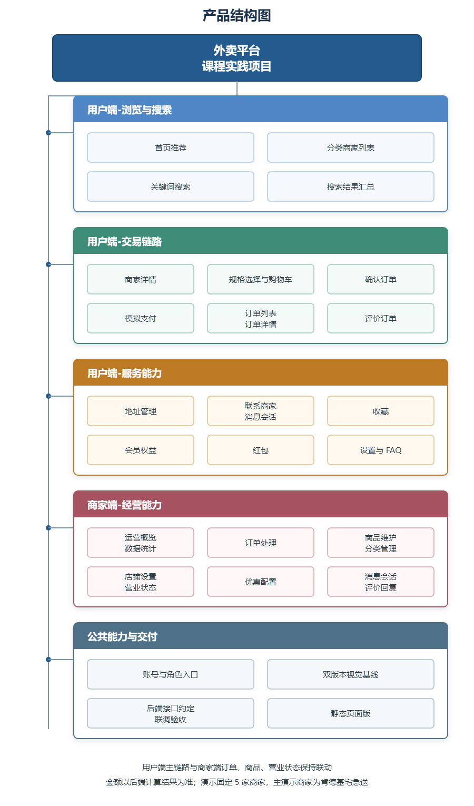

产品结构图后续需要按上表重画并替换现有图片，具体任务记录在 `docs/project/用户待补充资料与原型清单.md`。在新图交付前，本文表格是结构的正式文字标准，旧图不得用于证明后端和数据库已经完成。

模块关系遵循四条约束：用户端主流程与商家端订单、商品、库存和营业状态保持同步；金额和库存以后端结果为准；演示固定 5 家商家、主演示商家为肯德基宅急送；Mock 与真实接口两种结果必须分开记录。

# 6. 产品功能list

## 范围与总表（6.1）

### 6.1 交付范围总表

| 端                      | 模块           | 页面清单                                                                                                           | 页面数 | 优先级         |
| ----------------------- | -------------- | ------------------------------------------------------------------------------------------------------------------ | ------ | -------------- |
| 用户端                  | 账号与角色     | 登录、注册                                                                                                         | 2      | P0             |
| 用户端                  | 浏览与搜索     | 首页、商家列表、搜索、搜索结果                                                                                     | 4      | P0/P1          |
| 用户端                  | 交易链路       | 商家详情、确认订单、订单列表、订单详情                                                                             | 4      | P0             |
| 用户端                  | 扩展服务       | 支付、支付成功、支付失败、评价、消息、地址、我的、收藏、会员权益、红包、设置、FAQ（消息按消息列表+聊天详情两页计） | 13     | P1/P2          |
| 商家端（桌面 Web 后台） | 基础管理       | 商家登录/注册、店铺设置、商品列表、商品新增/编辑表单、分类管理、订单列表、订单详情（规格配置本期实现）             | 7      | P0             |
| 商家端（桌面 Web 后台） | 扩展经营与消息 | 运营概览、优惠配置、评价管理（含回复抽屉）、消息列表、聊天详情、数据统计（原"我的"页由顶栏账号区替代）             | 6      | P1（本期）     |

商家端订单状态推进（待接单→制作中→配送中→已完成）为已选 P1 扩展（演示高光），在商家桌面后台订单列表与订单详情内实现，不新增页面。**按 2026-09-09 决议，除平台管理员外的全部 P1/P2 均在本期实施**：用户端扩展服务 13 页、商家端扩展经营与消息 6 页（基础管理 7 页 + 扩展 6 页 = 13 页；评价管理与评价回复合并为一页，不单独占页）与 P0 页面同为交付范围；另新增订单跟踪页、商家评价页与取消订单确认页（**用户端不单设配送页**：配送进度由订单状态在订单详情/订单列表表达），页面数统计以 7.16.1/7.16.2 逐区表为准。平台管理员不制作页面。原型图片只能作为交互参考，不作为本次课程基础范围的完成数量指标；真实工程中的页面、组件和接口适配均按本次需求重新实现。**2026-09-10 CHG-001 补充**：「爆红包（原开红包）」为红包页内的活动卡、全屏动效与浮窗，**不新增页面与路由**，故上表页面数不变；首页「天天爆红包」由占位装饰改为红包页的真实入口（同样不新增页面）。

页面数量只表示前端覆盖，不作为全栈完成度。全流程优先级定义如下：P0 为真实接口与数据库必须完成的最小闭环；P1 为本组扩展（**本期全部实施**）；P2 为可选展示与高级能力（**本期除平台管理员外全部实施**）。

#### 6.1.1 全流程系统交付范围

| 系统模块               | 优先级 | 前端要求                                                                                                          | 后端/数据库要求                                                                  | 验收证据                                |
| ---------------------- | ------ | ----------------------------------------------------------------------------------------------------------------- | -------------------------------------------------------------------------------- | --------------------------------------- |
| 用户能力               | P0     | 用户注册、登录、个人信息查询/修改                                                                                 | 用户账号、身份会话与资源归属                                                     | 注册/登录响应、信息查询与修改、权限用例 |
| 商家能力               | P0     | 商家注册/登录、开店/关店/临时闭店                                                                                 | 商家账号、店铺状态和归属                                                         | 商家注册、状态修改、权限用例            |
| 店铺能力               | P0     | 店铺列表、详情、营业状态展示                                                                                      | 店铺查询和状态返回                                                               | 页面数据、接口响应和数据库记录          |
| 商品能力               | P0     | 商品管理、分类、列表、详情、价格和库存展示                                                                        | 商品、分类、价格和库存数据                                                       | 页面数据、接口响应和数据库记录          |
| 基础购物车             | P0     | 加入、查询、增加、减少、删除                                                                                      | 按用户、店铺和商品购买行隔离                                                     | 前端操作、接口和表记录                  |
| 基础订单               | P0     | 创建订单、订单状态查询、订单列表/详情                                                                             | 保存订单及明细与地址快照，校验身份、商品、库存和订单信息，创建订单事务内扣减库存 | 创建响应、订单查询和数据库结果          |
| 工程运行与测试         | P0     | 前端 build、真实模式和 Mock 模式                                                                                  | 后端 build、数据库初始化、自动测试和统一错误响应                                 | 命令、日志、测试报告、运行说明          |
| 模拟支付与库存一致性   | P1     | 支付反馈、售罄和库存提示                                                                                          | 模拟支付状态、事务、并发保护和回滚                                               | 规则用例、数据库前后对比                |
| 商家订单推进与跨端同步 | P1     | 订单状态按钮和用户端状态回显                                                                                      | 商家归属、合法状态顺序、防重复更新                                               | 双端页面、接口和订单状态记录            |
| 优惠与后端统一计价     | P1     | 优惠配置和确认订单金额展示                                                                                        | 优惠落库、后端计价和金额边界                                                     | 金额对比和规则用例                      |
| 评价、消息与真实统计   | P1     | 评价回复、双端消息、经营图表                                                                                      | 评价/消息/订单聚合数据                                                           | 双端回显、查询结果和数据库记录          |
| 商家端桌面 Web 后台    | P0     | React 18 + Vite + Ant Design 5 桌面 Web 后台（frontend/merchant-admin/），桌面优先 ≥1280px，不做移动端，本期开发 | 复用同一套`/api/v1` 商家接口，后端零改动                                       | 商家端页面、接口响应和数据库记录        |
| 简化取消订单           | P2（本期） | 新增取消确认和取消状态                                                                                            | 仅未支付或未接单可取消，记录原因，不接真实退款                                   | 状态规则和边界用例                      |
| 简化配送管理           | P2（本期） | 新增配送信息/状态页面                                                                                             | 配送单和配送状态，不做地图定位                                                   | 三方状态演示                            |
| 平台管理员             | 不实施 | 已砍掉（2026-09-09 决议），不制作页面                                                                                                  | 不实现（已砍掉）                                                                 | 权限与管理操作记录                      |
| 图片上传               | P2（本期） | 已选定，制作页面并补数据和接口                                                                                              | 本期补数据和接口                                                                 | 本期为交付内容                          |

#### 6.1.2 加分模块推荐顺序

| 顺序 | 模块                    | 推荐级别         | 原因                                                                                                 | 原型资料关系                                     |
| ---- | ----------------------- | ---------------- | ---------------------------------------------------------------------------------------------------- | ------------------------------------------------ |
| 1    | 模拟支付与库存一致性    | 已选定（本期）   | 能形成可解释的订单事务和边界测试；不接第三方支付                                                     | 原型有相关页面，但必须按新契约重新实现           |
| 2    | 商家订单推进与跨端同步  | 已选定（本期）   | 能把基础订单扩展为可演示的业务闭环；配送中仅为展示状态                                               | 原型有相关页面，但不能替代接口和状态设计         |
| 3    | 优惠与后端统一计价      | 已选定（本期）   | 能展示规则抽取和前后端金额一致性                                                                     | 原型有相关区域，选定后再按规则实现               |
| 4    | 评价与商家回复          | 已选定（本期）   | 双角色闭环清晰，开发量适中                                                                           | 需要按新需求补页面、接口、数据和测试             |
| 5    | 用户与商家消息          | 已选定（本期）   | 业务真实且跨端明显，但未读与刷新规则较多                                                             | 需要按新需求补页面、接口、数据和测试             |
| 6    | 搜索、排序与分页        | 已选定（本期）   | 能补充查询能力，但不阻塞基础闭环                                                                     | 需要按最终接口设计重新实现                       |
| 7    | 商家端桌面 Web 后台载体 | 已升级为 P0 载体 | 原 P2"桌面适配"口径已于 2026-09-01 反转：商家端载体即为桌面 Web 后台，本期开发，不再作为可选加分模块 | 商家端界面说明以 7.16.2 红框逐区标注表为唯一口径 |
| 8    | 简化取消订单与简化配送管理 | 已选定（本期）   | 取消仅未支付或未接单可取消、不接真实退款；配送只做配送单与状态，不建骑手端、不做地图定位             | 需补取消确认与配送状态页面；配送不引入骑手角色   |
| 9    | 平台管理员              | 不实施           | 2026-09-09 决议砍掉：会扩大角色、权限和状态范围                                                       | 不制作页面、接口、数据和测试                     |

**2026-09-09 决议（负责人拍板）**：上表 1–6 与 8 全部纳入本期实施（P1 全项 + 简化取消订单、简化配送管理、图片上传与设置/FAQ 等 P2 项）；**序号 9 平台管理员砍掉**，不制作页面、接口、数据和测试。商家端桌面 Web 后台是本期 P0 载体，不再是可选适配项；商家端原“二期不做”的 7 页与规格维护随 P1 一并纳入本期，否则优惠、评价与回复、消息和统计无法形成双端闭环。额外功能不以数量竞赛，未实施项不得写为已完成。

## 用户端功能（6.2–6.11 · 移动 H5）

### 6.2 账号与角色（P0）

| 功能          | 优先级 | 说明                                                       |
| ------------- | ------ | ---------------------------------------------------------- |
| 用户登录      | P0     | 手机号/账号 + 密码；演示账号一键登录                       |
| 用户注册      | P0     | 账号、密码、昵称、性别；成功后返回登录                     |
| 用户个人信息  | P0     | 查询和修改昵称、性别等个人信息；成功后回显最新结果         |
| 商家注册/登录 | P0     | 商家账号注册、登录和基础身份校验；固定 m002 仅作为演示种子 |
| 店铺状态      | P0     | 商家可开店、关店或临时闭店，用户端展示对应状态             |

### 6.3 首页与搜索（P0/P1）

| 功能             | 优先级 | 说明                                           |
| ---------------- | ------ | ---------------------------------------------- |
| 首页布局         | P0     | 定位栏、搜索框、分类宫格、活动区、推荐商家卡片 |
| 分类商家列表     | P0     | 按点餐分类（10 类）展示商家，基础列表可查询    |
| 关键词搜索       | P1     | 搜索商家名与商品名，汇总结果分商家/商品        |
| 搜索历史与热门词 | P1     | 本地记录搜索历史，展示热门词                   |

### 6.4 商家与商品（P0）

| 功能             | 优先级 | 说明                                                       |
| ---------------- | ------ | ---------------------------------------------------------- |
| 商家详情         | P0     | 店铺信息、店铺状态、商品分类和商品列表                     |
| 商品详情         | P0     | 商品名称、说明、分类、价格和库存展示；规格本期实现         |
| 商品管理         | P0     | 商家新增、查询、修改商品基础信息及分类、价格、库存、上下架 |
| 商品售罄与休息态 | P0     | 库存为 0 或店铺闭店时，用户端展示不可购买状态              |
| 商家收藏         | P1     | 收藏/取消收藏，收藏页列表                                  |

### 6.5 购物车（P0）

| 功能       | 优先级 | 说明                                                                            |
| ---------- | ------ | ------------------------------------------------------------------------------- |
| 加入购物车 | P0     | 按商品行合并数量，重复加购同一商品数量累加；规格行（cartLineId）属于规格扩展 P1 |
| 购物车弹层 | P0     | 展示该商家购物车行，数量加减按钮改数量，移除行                                  |
| 跨商家隔离 | P0     | 购物车按商家隔离，进入其他商家结算时提示                                        |

### 6.6 确认订单与支付（P0/P1）

| 功能           | 优先级 | 说明                                                         |
| -------------- | ------ | ------------------------------------------------------------ |
| 确认订单页     | P0     | 展示待提交商品、数量和订单所需信息，提交前允许修正           |
| 地址选择与新增 | P0     | 作为订单所需收货信息的支持能力；选择已有地址或填写收货信息   |
| 提交订单       | P0     | 校验登录状态、商品和订单信息，成功后返回订单结果             |
| 模拟支付       | P1     | 点击后记录模拟成功/失败反馈，不接第三方支付                  |
| 优惠计算       | P1     | 满减、新客立减、配送费优惠、会员折扣、红包按团队选定规则实现 |

### 6.7 订单（P0/P1）

| 功能         | 优先级 | 说明                                                 |
| ------------ | ------ | ---------------------------------------------------- |
| 订单列表     | P0     | 查询当前用户订单列表，并按基础状态查看               |
| 订单详情     | P0     | 查询订单状态、商品明细、金额、收货信息、订单号和时间 |
| 待支付倒计时 | P1     | 模拟支付扩展中的待支付提示和超时展示                 |
| 再来一单     | P1     | 按历史订单重建购物车                                 |
| 评价订单     | P1     | 星级、标签、文字、图片，提交后订单从待评价变为已完成 |

### 6.8 评价流程（P1）

| 功能           | 优先级         | 说明                             |
| -------------- | -------------- | -------------------------------- |
| 用户提交评价   | P1             | 同一订单只允许评价一次           |
| 商家端评价列表 | P1（本期）     | 筛选、评分分布、未回复优先       |
| 商家回复评价   | P1（本期）     | 回复后用户端回显 reply/repliedAt |

### 6.9 地址管理（P0，订单支持能力）

| 功能          | 优先级 | 说明                                       |
| ------------- | ------ | ------------------------------------------ |
| 地址列表      | P0     | 默认地址标识，可设默认                     |
| 新增/编辑地址 | P0     | 联系人、性别、电话、地址、门牌号；必填检查 |
| 删除地址      | P0     | 默认地址删除后需重选默认                   |

### 6.10 消息与联系商家（P1）

| 功能     | 优先级 | 说明                                              |
| -------- | ------ | ------------------------------------------------- |
| 通知列表 | P1     | 订单、红包、会员三类通知                          |
| 聊天列表 | P1     | 按订单维度聊天，双向未读（unread/merchantUnread） |
| 聊天详情 | P1     | 用户/商家消息时间线，发送消息                     |
| 快捷引导 | P1     | 订单详情"联系商家"进入聊天                        |

**2026-09-09 决议：消息扩展本期入选**——商家端消息列表与聊天详情随用户端消息一并实现，两端未读分别记录；平台客服仍不提供，“联系商家”只表示订单用户与该订单商家的会话。

### 6.11 用户资产（P1/P2）

| 功能           | 优先级 | 说明                              |
| -------------- | ------ | --------------------------------- |
| 收藏页         | P1     | 收藏商家列表，可取消              |
| 会员权益       | P1     | 会员标识、会员价、会员折扣说明    |
| 红包（优惠券） | P1     | 可用/已过期红包列表，确认订单可选 |
| 设置与 FAQ     | P2（本期） | 个人资料、退出登录、课程问答页    |

## 商家端功能（6.12–6.17 · 桌面 Web 后台）

### 6.12 商家端-经营概览（营业开关并入店铺设置，本期全部实现）

| 功能         | 优先级         | 说明                                                           |
| ------------ | -------------- | -------------------------------------------------------------- |
| 营业开关     | P0             | 位于店铺设置页，一键切换开店/关店/临时闭店，用户端展示最新状态 |
| 今日经营数据 | P1（本期） | 营业额、有效订单、预计收入属于真实统计，随统计模块实现         |
| 待处理事项   | P1（本期） | 待接单、待回复评价、未读消息入口，随订单推进、评价与消息模块实现 |

### 6.13 商家端-订单处理（列表/详情为 P0 载体页面，状态推进为已选 P1 扩展）

| 功能     | 优先级                   | 说明                                                                 |
| -------- | ------------------------ | -------------------------------------------------------------------- |
| 订单列表 | P0                       | 桌面后台内容区表格展示本店订单；状态筛选随订单推进扩展生效（见 7.6） |
| 订单详情 | P0                       | 顾客信息、地址、商品明细、备注、金额；优惠明细随优惠扩展评审         |
| 状态更新 | P1（已选扩展，演示高光） | 待接单→制作中→配送中→已完成；配送中仅为演示状态，不建设骑手系统   |
| 联系顾客 | P1（本期）               | 随消息模块实现，进入该订单的用户—商家会话                             |

### 6.14 商家端-商品与分类（P0）

| 功能          | 优先级         | 说明                                                                               |
| ------------- | -------------- | ---------------------------------------------------------------------------------- |
| 商品列表      | P0             | 分类筛选、上下架、库存与价格展示                                                   |
| 商品新增/编辑 | P0             | 名称、说明、分类、价格、库存、上下架；会员价、标签和图片本期实现                   |
| 分类管理      | P0             | 商品分类的查询、新增、修改和删除                                                   |
| 规格维护      | P1（本期）     | 规格选项与价差（specOptions.priceDelta）；与用户端规格扩展同批实现     |
| 分类绑定商品  | P1             | 批量绑定商品到分类                                                                 |

### 6.15 商家端-店铺设置（P0）

| 功能     | 优先级 | 说明                                     |
| -------- | ------ | ---------------------------------------- |
| 店铺资料 | P0     | 店铺名称、基础说明和必要联系方式         |
| 营业状态 | P0     | 开店、关店、临时闭店；用户端展示最新状态 |

### 6.16 商家端-优惠配置（本期实现）

| 功能       | 优先级         | 说明                                  |
| ---------- | -------------- | ------------------------------------- |
| 满减配置   | P1（本期）     | 阶梯规则（门槛+减额），启停           |
| 新客立减   | P1（本期）     | 金额 + 启停                           |
| 配送费优惠 | P1（本期）     | 免配送费门槛                          |
| 会员折扣   | P1（本期）     | 折扣率 + 启停；配置影响用户端确认订单 |

### 6.17 商家端-消息/评价/数据（本期实现）

| 功能     | 优先级         | 说明                                             |
| -------- | -------------- | ------------------------------------------------ |
| 消息聊天 | P1（本期）     | 用户聊天列表、详情、回复                         |
| 评价管理 | P1（本期）     | 筛选、评分分布、未回复标记；**与评价回复合并为一页（列表 + 回复抽屉），不单独占页** |
| 评价回复 | P1（本期）     | 回复/更新回复，用户端回显；合并进评价管理页的回复抽屉，不单独占页 |
| 数据统计 | P1（本期）     | 营业额、订单数、趋势、渠道、客单价；只展示不反写 |

## 跨端交付与后端边界（6.18）

### 6.18 后端与数据库边界（P0 联调）

| 功能                 | 优先级         | 说明                                                                                   |
| -------------------- | -------------- | -------------------------------------------------------------------------------------- |
| 用户能力             | P0             | 注册、登录、个人信息查询/修改和身份校验                                                |
| 商家与店铺           | P0             | 商家注册、登录、店铺查询及开店/关店/临时闭店                                           |
| 商品能力             | P0             | 商品、分类、价格和库存的查询与管理                                                     |
| 购物车能力           | P0             | 当前用户购物车查询、加入、更新和移除                                                   |
| 基础订单             | P0             | 订单创建、订单详情、订单列表和状态查询                                                 |
| 工程基础             | P0             | 前后端分离、RESTful 接口、统一错误响应、TDD 测试和可重复运行说明                       |
| 模拟支付与库存一致性 | P1             | 模拟支付、库存检查/扣减、事务和并发保护，按扩展方案实施                                |
| 商家订单推进         | P1（已选扩展） | 订单状态按钮和跨端状态回显；商家订单列表/详情页面为 P0 载体                            |
| 其他扩展接口         | P1/P2（本期）  | 优惠、评价、消息、统计、收藏、会员、红包、规格、取消、配送和图片上传，全部按本期范围实施（平台管理员除外） |
| P1 接口              | P1（本期）     | 优惠与统一计价、评价与回复、消息、搜索分页、收藏、会员、红包、规格和真实统计，按契约新增章节实施 |
| P2 接口              | P2（本期）     | 取消订单、配送单和图片上传本期实现；平台管理员不实现                                   |

# 7. 具体功能说明

## 7.1 账号与角色

- 登录页默认用户模式，输入账号+密码检查后进入首页；演示账号仅用于稳定演示。
- 用户注册页字段：账号、密码、昵称、性别；注册成功返回登录页并可立即登录。
- 商家注册页字段由接口契约确定最小集合；注册成功即自动创建并绑定店铺，店铺初始营业状态统一为关闭（CLOSED），商家开店后用户端才可下单。
- 固定 m002 肯德基宅急送账号可以作为种子演示数据，但不能替代商家注册、开店和关店能力。
- 用户与商家的登录状态和权限互相独立：用户身份不能进入商家管理接口，商家身份不能访问其他用户的地址和订单。

## 7.2 首页与搜索

- 首页自上而下：定位与搜索区、点餐分类宫格（10 类）、活动/权益区、推荐商家卡片（评分、月售、起送、配送费、距离、促销标签）。
- 商家列表支持排序：销量、距离、评分，排序切换后列表刷新。
- 搜索：输入关键词返回商家汇总（店名匹配）与商品汇总（商品名匹配）；支持搜索历史与热门词，清空历史可删除。关键词搜索、搜索历史与热门词为 P1 本期实现项：后端支持商家名、商品名和分类条件查询，排序取值综合/销量/距离（2026-09-09 决议：距离取种子数据固定 `distanceKm`，不引入地图与定位；综合排序按"销量优先、评分次之"，不做加权公式），分页参数 `page`/`size` 由接口契约统一（默认 `page=1&size=10`），页面不自行过滤真实数据。
- 无数据提示：无搜索结果时展示"没有找到相关商家/商品"提示与返回首页入口。

## 7.3 商家详情与购物车

- 商家详情顶部为商家信息（名称、评分、月售、地址、公告、促销标签），下方为评价入口与点餐区。
- 点餐区：左侧分类栏（热销/套餐/汉堡炸鸡等），右侧对应商品列表；点击分类栏切换右侧列表。
- 商品项展示：名称、说明、价格、库存和上下架状态；会员价、促销标签和规格为本期实现项。
- 商品详情可展示规格选项（如"中杯/大杯"）和数量；规格价差、加料和多规格购物车行随规格扩展本期实现，具体字段由接口契约确定。
- 购物车栏固定在底部：展示购物车内商品数、合计金额、结算按钮；点击展开购物车弹层，可步进调整数量（减到 0 移除该行）。
- 购物车按商家隔离；基础 P0 按商品行合并数量，同一商品不同规格分行（cartLineId）随规格扩展本期实现。
- 店铺休息或未营业时，结算/加购入口禁用并提示。

## 7.4 确认订单与优惠计算

确认订单页自上而下：订单所需收货信息、商品清单（含数量，可步进）、备注输入、金额明细、提交按钮。红包选择与优惠明细为本期实现范围。

基础 P0 金额规则：后端根据当前有效商品单价和购买数量计算商品小计，并返回订单金额；前端只做展示与输入检查，不得把前端计算结果作为最终金额。订单金额构成（2026-09-01 评审决议，2026-09-07 修订展示口径）：实付金额 = 商品小计 + 打包费（每单固定 ¥2.00，演示口径，由后端计价并随订单快照保存），基础 P0 不计配送费；优惠计价启用后按本节扩展顺序把固定配送费与配送费优惠计入最终金额（配送费默认 ¥3.00，演示口径，可由店铺配置，未配置按 0）；用户端确认订单页金额明细展示**商品小计、打包费、配送费与实付金额四行**（配送费为 0 时仍显示该行，金额为 ¥0.00；商家端订单详情金额汇总同口径）（2026-09-09 决议：配送费默认 ¥3.00 计入实付并写入金额快照字段 `deliveryFee`；修订原因：原"不单独列出打包费行"致金额构成不可见，被负责人误判为漏计配送费）。

优惠计价规则（2026-09-09 决议纳入本期，计算顺序固定，金额以后端结果为准）：

1. 商品小计 = Σ(商品单价 × 数量)，单价含规格价差；会员购买时，配置了会员价的商品按会员价计价，未配置会员价的商品沿用基础价；
2. 店铺满减：满足门槛时取最大满足的阶梯规则（如满 20 减 2、满 40 减 5）；
3. 新客立减：仅对店铺新用户首单生效；
4. 配送费：固定配送费，配送费优惠（免配送费券/免配送门槛）只作用于配送费；
5. 会员折扣：按折扣率作用于商品小计，**与会员价不叠加**（已按会员价计价的商品不再重复打折，仅未配置会员价的商品适用会员折扣）；
6. 用户红包：满足门槛（threshold）且在适用范围（全场/指定商家）内可用，一单一红包；
7. 最终金额 = 商品小计 − 满减 − 新客立减 − 红包 − 会员折扣 + 配送费 − 配送费优惠 + 打包费（¥2.00），且不小于 0。金额构成与快照字段以接口契约为准。

演示数值口径（2026-09-09 决议默认，写入种子数据与测试基线）：满 20 减 2、满 40 减 5；新客立减 3 元；免配送费门槛 30 元；会员折扣 95 折；红包门槛与适用范围由种子数据定义，一单一红包。数值调整须同步契约、种子数据与测试用例。

检查：订单所需信息缺失时提交按钮禁用并提示补充；商品已下架、库存不足或店铺不可用时提示修正；金额与后端结果不符时以后端为准。

## 7.5 支付与支付反馈（本组扩展）

- 基础 P0 创建订单后可以直接进入订单结果页；支付扩展已纳入本期，创建订单成功后进入支付页展示订单号、金额和模拟支付方式。
- 支付页为前端模拟：点击"确认支付"模拟成功进入支付成功页（展示订单号、预计送达、查看订单/返回首页），模拟失败进入支付失败页（提供重试支付与返回订单列表）。
- 支付成功后更新订单支付状态；订单进入商家处理流程属于本期扩展范围（2026-09-09 决议），不作为基础 P0 的完成条件。
- 不接第三方支付；后端负责接收模拟支付成功后的状态更新并防重复提交。支付反馈不重复扣库存，库存只在订单创建事务中处理一次。

## 7.6 订单状态规则与跨端同步（本组扩展）

基础 P0 创建订单成功后订单状态即为进行中（PROCESSING），订单可查询但不流转；待支付（PENDING_PAYMENT）、商家推进状态与取消状态属于本组扩展，2026-09-09 决议全部纳入本期。商家订单推进为演示高光；订单状态统一存储在单一状态字段（merchantStatus 已废弃），取值与 `docs/backend/后端接口契约.md` 对齐：

| 订单状态（扩展期） | 用户端展示                                     | 商家端展示 | 触发           |
| ------------------ | ---------------------------------------------- | ---------- | -------------- |
| PENDING_PAYMENT    | 待支付（15 分钟倒计时）                        | —         | 提交订单未支付 |
| PENDING            | 待接单                                         | 待接单     | 支付成功       |
| COOKING            | 制作中                                         | 制作中     | 商家接单       |
| DELIVERING         | 配送中                                         | 配送中     | 商家出餐配送   |
| COMPLETED          | 已完成；未评价时用户端按评价情况展示为"待评价" | 已完成     | 商家完成订单   |
| CANCELLED          | 已取消                                         | 已取消     | 用户取消（未支付或未接单） |

**用户端订单进度时间线：文案 ↔ 状态值映射（2026-09-11 定稿，CHG-003）**

| 时间线文案（用户端） | 订单状态值 | 触发 |
| --- | --- | --- |
| 已下单 | `PENDING_PAYMENT` | 提交订单未支付 |
| 已支付 | `PENDING` | 支付成功（待商家接单） |
| 商家接单 | `COOKING` | 商家接单/制作中 |
| 配送中 | `DELIVERING` | 商家出餐配送 |
| 已完成 | `COMPLETED` | 商家完成订单 |

- **时间线所在页面**：订单详情页（订单跟踪页已于 2026-09-11 并入订单详情，见 CHG-003）；**配送进度不再单设页面**，由本页时间线与配送信息卡表达（CHG-002）。
- **取消订单**：`CANCELLED` **不进入时间线**——订单详情显示「已取消」与取消原因，时间线整体置灰。

> **配送状态的展示口径（2026-09-11 负责人拍板，CHG-002）**：用户端**不设独立配送页，也不单列配送单状态**——配送进度直接由订单状态表达（`DELIVERING` → 配送中、`COMPLETED` → 已完成），订单详情与订单列表**现有的状态区与收货信息即可覆盖**，**无需新增字段、接口或页面**；商家端「出餐/完成」按钮推进订单状态即可。

扩展规则：

- 用户端列表筛选取值：全部/待支付/进行中/已完成/待评价/已取消（`orderStatuses`）。
- 状态只能按顺序更新；后端检查跳过状态的操作（如从待接单直接跳已完成）应拒绝。
- P0 阶段订单固定为 `PROCESSING`（进行中）；支付与推进扩展启用后，**支付成功必须进入 `PENDING`（待接单）**，`PROCESSING` 不再作为支付后的状态。当前后端实现为先置 `PROCESSING`、商家接单后才置 `PENDING`，与本节不一致，需按本节修正（契约待确认清单已登记）。
- 商家端拒单当前只做展示，不作为 P0 真实流程。
- 支付成功、接单、状态更新都不能重复生效，重复请求不能把状态更新两次。
- 订单使用单一状态字段；用户端展示状态由该字段与评价情况计算，“待评价”不是独立存储状态。库存统一在创建订单事务内校验并扣减；支付超时不自动回补库存，属于课程简化规则。状态字段、流转条件和展示映射由接口契约固定。

取消与配送规则（2026-09-09 决议纳入本期）：

- 用户取消：仅 `PENDING_PAYMENT`（未支付）与 `PENDING`（已支付未接单）允许取消，必须记录取消原因，订单进入 `CANCELLED` 并保留订单与明细快照；取消在同一事务内回补库存。`COOKING` 及之后不允许取消。
- 取消不接真实退款与资金处理；用户端取消前二次确认，商家端订单列表与详情出现"已取消"状态与原因。
- **取消入口（2026-09-11 负责人拍板）**：用户端取消入口统一位于**支付页内**——**不与「立即支付」并排**，放在页面内容区，**具体位置以最终设计稿为准**；**订单列表页与订单详情页不提供取消按钮**；取消前弹出「取消订单确认弹层」做二次确认（原因必填）。
- 配送：配送单状态取 `PENDING_DELIVERY`/`DELIVERING`/`DELIVERED`（待配送/配送中/已送达），由商家端在订单详情推进；用户端订单跟踪页只读展示配送信息与状态；不建骑手端，不做地图与实时定位。

> 基础下单流程和扩展跨端同步流程见“产品流程”章节；完整泳道图应在扩展方案确定后补齐。

## 7.7 评价流程（本期实现）

- 用户端：订单详情/订单列表进入评价订单页，字段为星级（1-5）、标签（如"味道好""出餐快""包装严实"，多选）、文字内容、图片（可选）。
- 提交规则：同一订单只允许评价一次；提交后订单变为已完成，评价进入商家端列表。
- 商家端：评价管理页支持筛选（全部/未回复/已回复）与评分分布；回复评价保存后用户端商家详情与评价处可见回复内容与时间。
- 无数据提示：商家端无评价时展示无数据提示引导；用户端无历史评价时展示无数据提示。
- 商家端评价管理与回复随 2026-09-09 决议纳入本期（见 6.17），与用户侧评价提交同期实现；评价图片为可选字段，走图片上传能力（见 7.12 与接口契约图片接口）。

## 7.8 消息与联系商家（本期实现）

- 通知列表：订单状态更新、红包到账、会员权益提醒三类，按时间倒序。
- 聊天列表：以订单维度组织（conversationId 关联 orderId），展示商家名、最后一条消息、时间、未读角标（用户端 unread / 商家端 merchantUnread 分离）。
- 聊天详情：消息时间线（用户/商家气泡），底部输入框发送；发送后本端置底刷新。
- 入口：订单详情"联系商家"直接进入对应订单聊天；平台客服不提供。
- 无数据提示：无聊天/无通知时显示对应的无数据提示。
- 商家端消息页面随 2026-09-09 决议纳入本期（见 6.17）；消息扩展双端同期实现，用户端与商家端未读分别记录。

## 7.9 地址管理（订单支持能力）

- 字段：联系人、性别（男/女）、电话、地址、门牌号、默认标识。
- 列表：默认地址置顶并带标识；点击选择地址（确认订单场景）或进入编辑。
- 表单检查：联系人必填、电话格式检查（11 位）、地址必填；提交中按钮文案为"保存中"。
- 删除：删除默认地址后，由后端自动把剩余地址中最近更新的一条设为默认；没有剩余地址时默认地址为空。
- 无数据提示：无地址时展示无数据提示与"新增地址"按钮。

## 7.10 用户资产（本期实现）

- 收藏：商家详情收藏/取消（icon 状态切换），收藏页列表展示收藏商家，可取消收藏。
- 会员：会员标识（memberOpened）、会员价展示（价格行高亮）、会员权益说明页。
- 红包：红包列表展示金额、门槛、适用范围、有效期；状态取值 available/expired，过期红包灰化；确认订单页可选可用红包。
- **爆红包（CHG-001，2026-09-10 需求变更；原称「开红包 / 开箱」，UI 文案以设计稿为准）**：红包页（设计稿标题为**「天天红包」**）在既有券列表之上新增两块：
  - **加量红包通栏**：「加量红包省更多」+「去购买」按钮 → 打开**买红包浮窗**；
  - **天天必爆活动卡**：卡内展示奖池预览与**「免费爆1次」**主按钮 → 进入**爆红包全过程**。
  - **爆的规则**：① **每个用户每天 1 次免费爆**（每天 0 点重置），**不消耗已购买的红包**；② 免费次数用完后，爆一次**消耗一张已购买的红包**；③ 既没有免费次数、也没有可爆的付费红包时，**提示去购买**；④ **档位池 10 档 + 权重**（满30减5 26% / 满30减8 18% / 满25减8 14% / 满40减10 11% / 满25减15 9% / 满40减20 6% / 满50减25 3% / 无门槛减5 3% / 满30减18.8 5% / 满40减18.8 5%），**纯随机命中**，门槛与减免**同时可能变化**；⑤ **替换式**：消耗券爆出的新券**替换**被消耗的那张，**爆出来的券不能再爆**；免费爆产生的券为新增；⑥ **有效期**：**爆出来的红包当天 23:59 到期、不可跨天**，**购买所得但未爆的红包有效期 7 天**；
  - **交互与视觉**：爆的过程为**全屏覆盖动效**（「天天必爆·正在爆出专属红包」+ 红包卡与「爆」按钮 + 欧气进度），结果卡展示新档位金额与「去使用，立即抵扣」；失败保留并原地重试；未登录 `401`；爆出来的券可在确认订单页选用，**保持「一单一红包」**（7.4 第 ⑥ 步不变）。
  - **可购买的红包套餐（两档）**：**¥4.9 = 4 张**（3×满30减5 + 1×无门槛减5，面额合计 ¥20）；**¥9.9 = 8 张**（6×满30减5 + 1×满40减10 + 1×无门槛减5，面额合计 ¥45）；**前端模拟付费、不落支付记录、不限购买次数**；套餐权益为课程说明文案，**不含退款条款**。
  - **占位券口径**：券列表中「品类（限奶茶、甜品品类可用）」与「限非外卖配送订单使用」两类为**纯展示占位券**，**不落库、不可选用**（点击提示暂不可用）；`scope` 仍仅支持全场（`ALL`）与指定商家（`STORE`）。
  - **视觉例外**：红包与爆红包模块按设计稿保留**红金渐变**配色，属**活动场景视觉例外**（其余页面仍遵守单一亮橙 `#ff5a1f` 体系）。
- 设置：个人资料展示与编辑、退出登录；FAQ 为课程问答展示页。

## 7.11 商家端-订单处理（列表/详情为 P0 载体页面，状态推进为已选 P1 扩展）

订单列表与订单详情属于商家桌面后台一期 P0 页面；订单状态推进为已选 P1 扩展（演示高光），在订单详情页内完成。

- 订单列表：状态筛选（全部/待接单/制作中/配送中/已完成/已取消），订单卡片展示顾客名、下单时间、商品摘要、金额。
- 订单详情：顾客信息（姓名、电话、地址）、商品明细（名称、规格、数量、单价）、备注、优惠明细、金额。
- 状态更新按钮随状态变化：待接单→"接单"，制作中→"出餐"，配送中→"完成"；更新后按钮进入下一状态，已完成无更新按钮。
- 联系顾客：进入该订单的用户—商家会话（消息模块本期实现）；拒单仅给出课程演示提示，打印小票仅模拟反馈；取消订单按 7.6 规则处理；本期不提供骑手端与地图配送。

## 7.12 商家端-商品与分类

- 商品列表：按分类筛选，展示商品名、价格、库存、上下架状态；行内可直接切换上下架；下架状态商品可删除（二次确认后调用删除商品接口，历史订单因保存快照不受影响，2026-09-01 评审决议纳入）。
- 商品表单：名称、说明、分类、价格、库存、上架状态，以及会员价、标签、图片与规格字段（2026-09-09 决议纳入本期，表单全部出现）；保存检查必填、价格合法（≥0）与库存非负整数；图片支持上传、预览、失败重试与删除替换（2026-09-09 决议：商品图 1 张、评价图最多 3 张，单张 ≤2MB，类型 jpg/jpeg/png/webp，存后端本地目录 `backend/uploads/` 并经 `/uploads/**` 静态映射访问，不接对象存储，上传目录不入 Git）。
- 商品规格：商家端规格配置与用户端规格扩展（specOptions/priceDelta）本期实现；购物车与订单按"商品 + 规格组合"区分（cartLineId）。
- 售罄逻辑：库存为 0 自动进入售罄态（如早餐帕尼尼 stock=0 且下架），用户端灰化不可购。
- 分类管理：分类查询、新增、修改与删除；同一店铺分类名唯一；有商品的分类不能删除（前端禁用删除并提示先处理商品归属，后端返回 409 兜底）；分类绑定商品（批量绑定）本期实现。

## 7.13 商家端-店铺设置与优惠配置

- 店铺设置：基础 P0 维护店铺名称、说明、必要联系方式和营业状态；Logo、营业时间、起送价、配送费、配送范围等字段按接口契约确认后实现。
- 营业状态：支持开店、关店和临时闭店；用户端读取到关闭状态时展示不可购买提示。
- 优惠配置：满减阶梯、新客立减、配送费优惠和会员折扣本期实现；配置保存后影响用户端确认订单计价（见 7.4）。

## 7.14 商家端-评价回复与数据统计（本期实现）

商家端评价回复与数据统计本期实现，规则如下。

- 评价列表：筛选（全部/未回复/已回复），评分分布条，评价内容与图片、用户脱敏名（如"张**"）。
- 回复：未回复评价展示回复入口；已回复评价展示回复内容与时间，可更新回复。
- 数据统计：今日营业额、有效订单、预计收入、客单价与趋势（2026-09-10 负责人拍板删去「访客」：PRD §8 明确不接入埋点、不采集真实用户行为，无数据源）；**只统计数据库中的有效订单并注明查询范围**，无真实数据时显示 0 或空值，不得用固定演示数值冒充经营结果（与 7.17 一致）。

## 7.15 认证、角色与资源归属

- 用户登录：账号和密码由后端检查；登录成功建立服务端会话，返回必要用户信息但不返回密码。
- 商家登录：商家账号必须绑定店铺；进入商家端后所有店铺、商品和订单接口都以后端会话中的商家身份为准。
- 前端路由：未登录用户可以浏览首页、商家列表和详情；购物车写入、地址、下单、订单、消息和评价需要用户身份；商家页面需要商家身份。
- 资源归属：用户只能访问自己的地址、购物车、订单、评价和会话；商家只能修改本店商品、设置、优惠并处理本店订单。
- 登录失效：接口返回统一未登录状态，前端保留当前页面地址并跳转登录；登录成功后返回原流程。
- 当前团队方案使用 Session + Cookie；该方案是技术选择。若后端团队基于课程环境选择其他会话方式，只保留一套最终认证契约，并同步修改接口和测试。

## 7.16 订单事务、库存与金额安全（本组扩展）

基础 P0 在创建订单时校验身份、商品、库存并保存订单：下述步骤 1-4 与 7 保持一致，库存扣减在同一事务内完成，但不要求并发条件更新和 409 保护。若实施库存一致性扩展，创建订单的后端步骤固定为：

1. 检查用户身份、地址归属、商家营业状态和购物车归属；
2. 重新查询商品、规格、价格、库存和上下架状态，不直接信任前端金额；
3. 按统一顺序计算商品小计、店铺优惠、会员/红包和配送费；
4. 检查库存，任一商品不足则返回具体商品和可用数量，不创建半成品订单；
5. 在一个事务中保存订单头、订单明细快照、扣减库存并清空当前用户在该商家的购物车；
6. 返回订单对象或订单号，前端进入模拟支付页；
7. 事务任一步失败全部回滚，库存、订单和购物车保持原状。

支付成功、接单、状态推进和取消必须支持重复请求：同一目标状态重复提交返回当前订单，不得再次扣库存、回补库存或跨越下一状态。用户取消订单在事务内回补库存；支付超时未支付仍不自动回补（课程简化口径），两种规则不得混用。前端 `expectedTotal` 只用于提示，最终金额以后端计算为准。本项目不引入生产者/消费者、消息队列或异步库存服务；并发保护以数据库事务和条件更新等课程规模内方案为限。

## 7.17 搜索、统计与加分模块实施边界

- 搜索：本期实现，后端支持商家名、商品名和分类条件查询；分页和排序参数由接口契约统一，不在页面层自行过滤真实数据。
- 真实统计：本期实现，只统计数据库中的有效订单；营业额、订单数、客单价、状态分布和时间趋势必须注明查询范围，不再使用固定演示数值作为完成证据。
- 优惠：由后端保存配置并计算订单金额；超额优惠、负数、非法折扣和过期优惠必须被拒绝或限制到合法范围。
- 评价：完成订单才能评价，一单一评；商家只能回复本店评价，重复回复更新原记录。
- 消息：会话与订单、用户和商家关联；空消息拒绝，未读分别记录用户端和商家端。
- 取消、配送和图片上传：2026-09-09 决议纳入本期（范围确认与工作量评估已完成）；配送只做配送单与状态，不建骑手端、不做地图与实时定位。
- 平台管理员：2026-09-09 决议砍掉，不制作页面、接口、数据和测试，不因设计稿或参考原型存在而纳入。
- **占位口径（2026-09-10 负责人拍板，CHG-001）**：**有真实数据统计的位置一律显示真实值**（来自接口与数据库）；**没有真实统计的位置显示占位内容**，占位与真实内容同款式、点击提示「暂未开放」，且**不得用于经营数据位**——商家端统计、订单金额与优惠明细、红包金额与门槛、评分与评价数等经营位必须来自真实数据，无数据时显示 0 或留空，不使用固定演示数值（与 §8 一致）。

## 7.18 测试、部署与交付要求

- 用户端前端：`npm run build` 通过，Mock/real 两种模式可明确切换，移动规定视口无横向溢出和操作遮挡。
- 商家端前端：`npm run build` 通过，桌面 ≥1280px 无横向溢出和操作遮挡，侧边栏可达全部一期页面。
- 后端：构建通过，核心 Service/Controller 有自动测试，错误统一返回 JSON，不返回服务器 HTML 错误页。
- 数据库：建表和种子脚本可重复执行，提供重置演示数据步骤；数据库密码不写入提交代码。
- 联调：关闭 Mock 回退执行 P0，用接口响应、页面结果和数据库变化三类证据共同验收。
- 交付：用户端前端、商家端桌面后台、后端、database 脚本和 docs 分开组织；报告、PPT、截图和演示脚本引用同一冻结版本。

### 产品流程

泳道图

现有泳道图是前端/接口规划基线，包含用户、用户端系统、后端服务、商家端系统和商家，但没有展开数据库、库存事务和服务端认证：

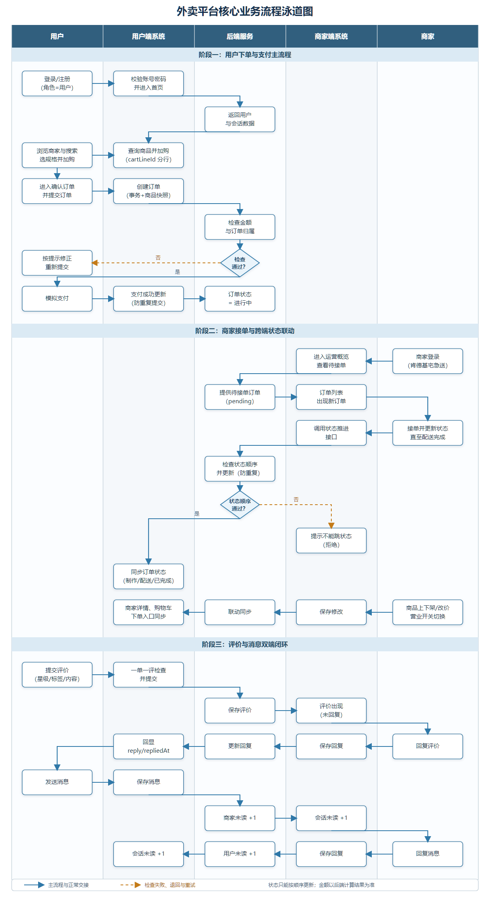

完整泳道图后续可增加数据库/数据持久层泳道，并明确认证、事务提交/回滚和数据库状态变化；新图交付前，以下文字流程是正式标准。

基础 P0 下单主流程：

1. 用户提交账号密码，后端检查用户并建立登录会话；用户可以查询和修改个人信息。
2. 前端从真实接口读取店铺和商品，用户查看商品详情并加入购物车，购物车按用户和店铺隔离。
3. 用户查询、增加、减少或删除购物车商品，确认订单信息后提交创建订单。
4. 后端校验身份、商品、数量和订单信息，保存订单及明细并返回订单结果。
5. 用户在订单列表和订单详情中查询订单状态；失败时前端展示可修正原因。

本组扩展流程：模拟支付、库存事务、商家订单推进、配送中展示和跨端同步在基础流程通过后增加；配送中只作为商家按钮推进的演示状态，不建设骑手系统。

商家处理与跨端同步扩展流程：

1. 商家用已注册或种子账号登录，后端建立商家会话。
2. 商家端查询数据库中属于本店的待接单订单。
3. 商家按制作中→配送中→已完成更新，后端检查商家归属、目标状态和重复请求。
4. 每次合法更新写入数据库；用户端重新查询后显示制作中、配送中或待评价。
5. 商家修改商品上下架、库存、价格或营业状态后，用户端真实接口读取到最新结果；旧购物车在结算时必须重新检查。

评价与消息流程：

1. 用户对属于自己且已完成的订单提交评价，一单一评检查通过后保存数据库。
2. 商家端读取本店评价并回复，用户端重新查询后回显回复内容。
3. 消息模块入选 P1 后，用户发送消息写入会话和消息表，商家端未读 +1；商家回复后用户端未读 +1。

### 原型说明

当前原型覆盖用户端页面区域和商家端桌面设计稿，但不覆盖系统架构、数据库、认证、事务、库存以及本期新增模块的新状态。原型覆盖状态如下：

| 原型类别         | 当前状态                                                                                        | PRD 使用方式                                                                                     | 后续动作                                                         |
| ---------------- | ----------------------------------------------------------------------------------------------- | ------------------------------------------------------------------------------------------------ | ---------------------------------------------------------------- |
| 用户端页面原型   | 已有页面草图、红框图和页面区域说明                                                              | 只作为页面结构和交互参考；用户端仍遵守 exact 复刻，实现真源为`docs/design/exports/**` 代码导出 | 按新 PRD 重新实现，并补真实接口、登录失效、库存不足等状态        |
| 商家端桌面设计稿 | 商家端 Stitch 设计稿与红框逐区标注图位于`docs/prd-assets/merchant-stitch/`，逐区说明见 7.16.2 | 只示意布局与信息结构，不承担 1:1 复刻义务                                                        | 实现以 PRD 字段列、规则列和`docs/backend/后端接口契约.md` 为准 |
| 全流程产品结构图 | 当前图片只含页面与“接口预留”                                                                  | 不能证明完整系统结构                                                                             | 按六层结构重画并替换                                             |
| 系统架构图       | 缺失                                                                                            | 当前用文字架构说明                                                                               | 补前端、后端、数据库、测试和部署关系图                           |
| ER 图            | 缺失                                                                                            | 当前只有实体边界表                                                                               | 后端表结构确认后补正式 ER 图                                     |
| 全流程泳道图     | 缺失                                                                                            | 现有图仅作基线                                                                                   | 增加基础 P0 主线和扩展路径                                       |
| P0 异常状态      | 部分缺失                                                                                        | 暂用文字规则                                                                                     | 补登录失效、接口失败、库存不足、金额变化、事务失败状态           |
| P1/P2 新页面     | 2026-09-09 决议后全部选定，取消确认页、配送信息页与商家端 7 页待制作                             | 不计入 P0 页面数                                                                                 | 按本决议制作，不再标注“未选定”；平台管理员不制作                  |

需要补齐或确认的原型图、页面状态和源文件，统一见 `docs/project/用户待补充资料与原型清单.md`。在原型未交付前，本文文字规则优先；不得用截图中的客服、积分、退款、骑手追踪等内容扩大当前范围。

以下图片用于说明现有页面区域和交互。表格中的一行对应截图中的一个区域，红色矩形框圈出该区域。用户端截图与红框标注文件位于 `docs/prd-assets/user/prototype-redbox-v1/`；商家端红框标注图与整屏设计稿位于 `docs/prd-assets/merchant-stitch/`（`merchant-desktop-redbox/` 与 `merchant-desktop-stitch/`），逐区域说明见 7.16.2。

原型表是本次从零开发的页面行为清单。图片只帮助确认区域位置，不能自动增加功能。每一行都要同时回答“页面显示什么、数据从哪里来、用户怎么操作、操作后哪里变化、异常时显示什么”。

#### 原型说明统一规则

1. **数据来源和默认值**：后端返回的数据必须标出接口来源和字段含义；页面参数必须标出来源；用户填写的内容标为用户输入；只为保证页面第一次打开而使用的数据标为课程演示默认值。金额使用元并保留两位小数，时间统一使用 `yyyy-MM-dd HH:mm:ss`（东八区），数量使用非负整数，空文本不显示为 `undefined` 或 `null`。
2. **加载状态**：首次进入页面显示区域级骨架或加载提示；刷新某个列表时保留已显示内容并在列表区域显示加载状态；提交、删除、切换营业状态和推进订单时，操作按钮显示处理中并暂时禁止重复点击。请求结束后恢复按钮，不能永久停留在加载状态。
3. **空态**：列表没有数据时说明“没有什么数据”和下一步操作，例如“暂无订单，去首页看看”或“暂无商品，新增商品”；空态不是接口错误，也不能用演示数据静默替代真实空结果。
4. **错误状态**：网络失败、超时、服务端错误、未登录、无权限、参数错误、资源不存在和状态已变化要分别处理。能重试的区域提供重试；未登录跳转登录并保留原地址；无权限不显示修改入口；资源不存在返回上一级；提交失败保留用户输入。
5. **校验边界**：前端在提交前做必填、格式、长度和数值范围检查；后端再次检查身份、归属、状态、金额、库存和唯一性。前端按钮是否置灰不能代替后端校验；后端拒绝后页面必须显示可理解的原因。
6. **成功后的同步**：新增、修改、删除、加购、创建订单和状态推进成功后，当前区域立即回显后端返回结果，并刷新受影响的列表、计数、金额或状态；返回其他页面再进入时重新读取，不依赖旧页面缓存。操作失败不得提前修改为成功状态。
7. **并发和重复操作**：同一按钮的重复点击只产生一次请求；商品被下架、库存变化、订单状态被另一端修改时，页面提示“数据已变化，请刷新后重试”，然后重新读取相关数据。用户不能通过修改页面参数访问其他用户或其他商家的数据。
8. **图片和演示数据**：图片加载失败显示统一占位图并保留文字信息；演示数据必须注明为默认展示数据。真实接口模式下接口返回空数组就是空态，不能因为接口失败自动伪装成成功。

P0 页面至少要覆盖以下检查场景：首次加载、空列表、网络失败后重试、未登录、登录失效、无权限、字段缺失、重复提交、资源被删除、店铺关闭、商品下架、库存不足、金额变化、订单状态变化和返回后重新加载。P1/P2 页面沿用同一规则；2026-09-09 决议后全部 P1/P2 页面（平台管理员除外）都要求真实接口、数据与测试证据。

#### 7.16.1 用户端原型说明

| 页面与区域                     | 原型图 | 字段、数据来源与默认值                                                                                                                                                                                                                           | 点击与状态变化                                                                                                                                                                                                               | 空态、加载、错误与检查                                                                                                                                                                                                                                                |
| ------------------------------ | ------ | ------------------------------------------------------------------------------------------------------------------------------------------------------------------------------------------------------------------------------------------------ | ---------------------------------------------------------------------------------------------------------------------------------------------------------------------------------------------------------------------------- | --------------------------------------------------------------------------------------------------------------------------------------------------------------------------------------------------------------------------------------------------------------------- |
| 首页-定位与频道栏              | 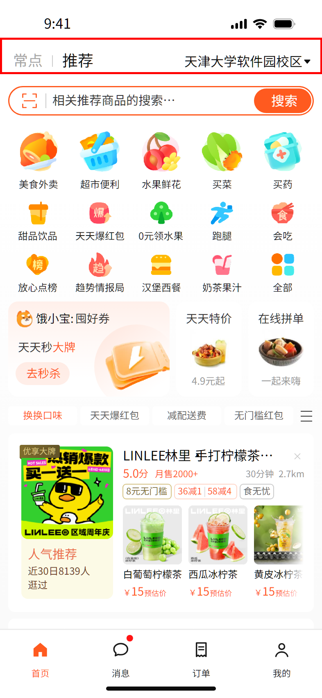 | 左侧"常点/推荐"为频道区，"推荐"为默认生效频道，"常点"为不可交互占位；右侧定位文字来自当前用户默认地址，无地址时使用课程演示地址"天津大学北洋园校区"，地址字段不允许由前端随意拼接。                                                              | 点击定位文字进入地址列表，返回首页后重新读取默认地址；点击"常点"显示"暂未开放"，不切换数据。                                                                                                                                 | 未登录可以浏览；读取地址失败保留默认演示地址并标记为演示数据；地址为空进入地址管理时要求登录。                                                                                                                                                                        |
| 首页-搜索框                    | 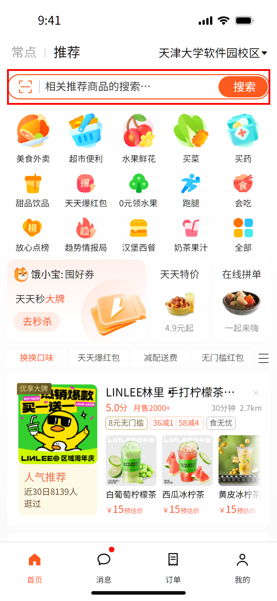 | 搜索框为用户输入，占位文案为固定文案；搜索按钮为固定控件。关键词搜索属 P1（6.3），本期实现，搜索框进入搜索结果页。                                                                                                                                      | 点击搜索框进入搜索页（关键词搜索、搜索历史与热门词本期实现）。                                                                                                                                     | 空关键词不发起请求；进入搜索页保留原页面状态；不得把演示搜索结果当作接口结果。                                                                                                                                                                                        |
| 首页-分类宫格                  | 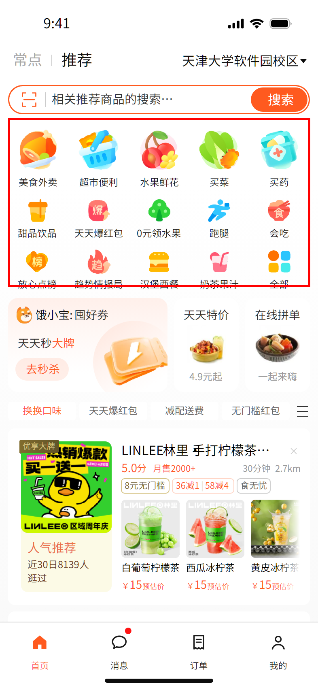 | 分类项由课程 10 类点餐分类数据渲染（课程固定分类数据或分类接口返回）；设计稿中的超范围栏目（超市便利、水果鲜花、买菜、买药、跑腿等）为不可交互占位，不进入课程范围。                                                                             | 点击分类携带分类编号进入分类商家列表（6.3）；占位栏目点击提示"暂未开放"。                                                                                                                                                    | 分类数据为空显示占位并记录检查问题；请求失败提供重试；不得用演示数据冒充接口结果。                                                                                                                                                                                    |
| 首页-活动区                    | 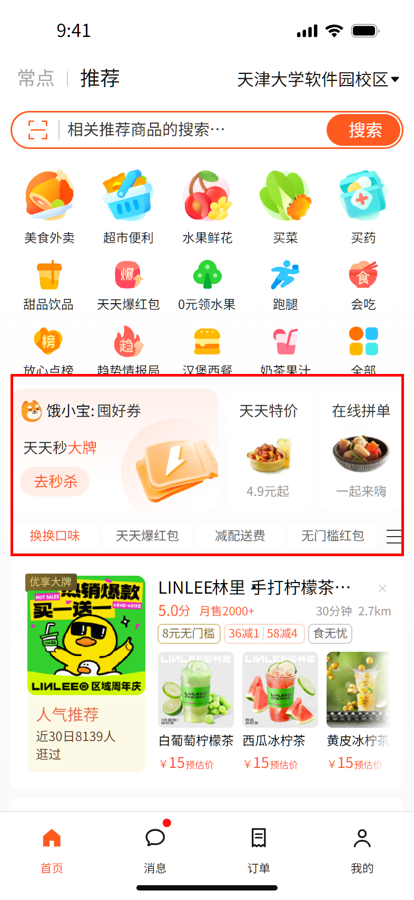 | 运营卡片（饿小宝·囤好券、天天特价、在线拼单）与筛选标签（换换口味、天天爆红包、减配送费、无门槛红包）均为演示占位内容，不接入真实优惠、计价或补贴。                                                                                             | 占位内容点击一律提示"暂未开放"，不产生跳转、订单或金额变化。                                                                                                                                                                 | 活动区无数据时整区隐藏；不得把占位内容当作真实优惠能力展示。                                                                                                                                                                                                          |
| 首页-商家卡-商家信息与优惠标签 | 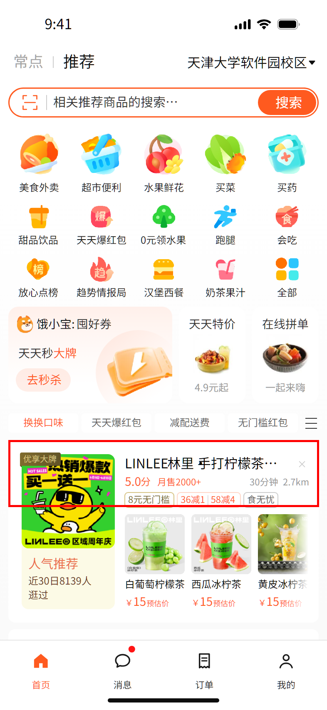 | 商家名、评分、月售、配送时长、距离来自店铺列表接口；优惠标签只有接口明确返回时展示；"优享大牌""人气推荐"等为占位标签，不绑定真实数据。金额统一显示两位小数。                                                                                     | 点击商家卡携带`storeId` 进入商家详情；商家关闭或下架时卡片显示最新状态。                                                                                                                                                   | 首次加载显示卡片占位；空数组显示"暂无商家"和回首页入口；字段缺失隐藏对应字段而不显示`undefined`；图片失败显示占位图。                                                                                                                                               |
| 首页-商家卡-商品预览与人气信息 | 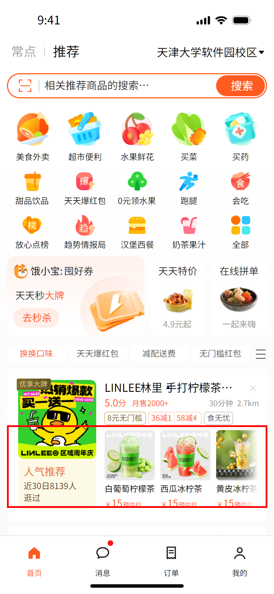 | 商品预览（名称、价格）来自商家商品接口，按下单快照口径展示；"预估价""近30日逛过人数"为占位文案，不参与任何计价，价格不由前端计算。                                                                                                               | 点击预览商品进入对应商家详情（可选实现，定位到该商品）；预览不直接加购、不直接创建订单。                                                                                                                                     | 商品图为空显示占位图；价格字段缺失显示"暂无"；不得把预览价格当作后端试算结果。                                                                                                                                                                                        |
| 首页-底部导航                  | 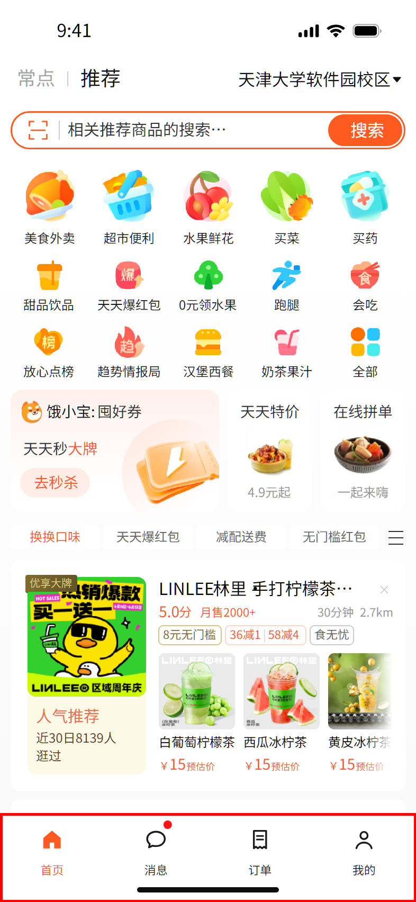 | 导航固定为首页/消息/订单/我的，当前项由路由决定；消息未读角标为语义红，未读数来自消息接口（消息扩展本期实现）。                                                                                                                                              | 点击导航切换路由并保留登录状态；点击订单、消息或我的时先检查权限，未登录跳转登录并记录目标地址；切换回来重新读取页面数据。                                                                                                   | 导航加载不单独请求接口；路由不存在回到首页；登录失效时清除当前会话并回登录页；当前项必须始终有高亮。                                                                                                                                                                  |
| 搜索结果页-搜索头部            | 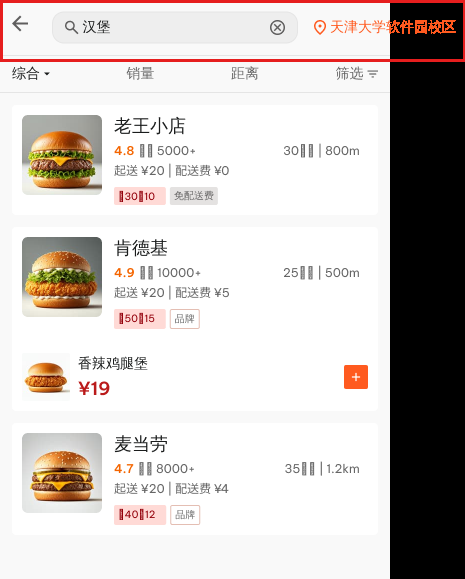 | 关键词来自搜索页输入或页面参数，进入结果页后保留；定位来自当前默认地址，默认同首页。                                                                                                                                                             | 修改关键词后点击搜索或按回车发起新请求；返回保留上一次页面；请求完成后更新商家结果和商品结果，不以前端旧列表冒充新结果。                                                                                                     | 空关键词不请求并提示输入关键词；请求中保留输入且禁止重复提交；超时/网络失败保留关键词并提供重试；返回结果字段缺失时只隐藏缺失字段。                                                                                                                                   |
| 搜索结果页-排序筛选栏          | 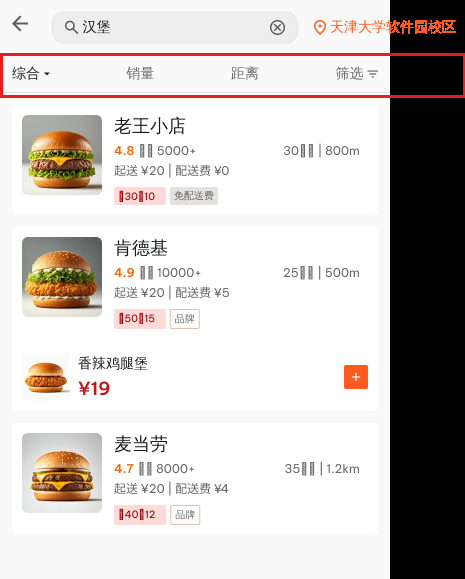 | 排序值默认为综合，可选综合/销量/距离；筛选条件为页面临时状态，最终参数由接口契约定义。                                                                                                                                                           | 点击排序项更新当前选项并重新请求；筛选按钮打开弹层，确认后带条件请求，取消不改变条件；请求完成前禁止连续切换导致的旧结果覆盖新结果。                                                                                         | 无结果时筛选栏保留；排序请求失败恢复上一次成功结果并提示重试；不支持的筛选值被前端拦截且后端再次校验。                                                                                                                                                                |
| 搜索结果页-商家结果列表        | 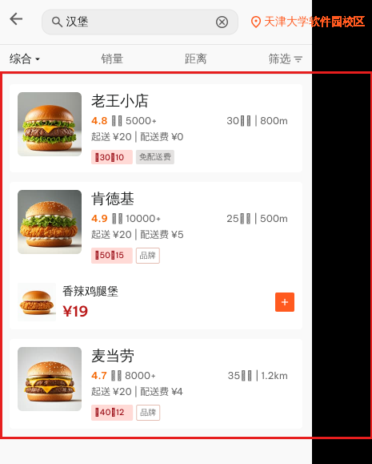 | 商家名、评分、月售、配送时长、距离、起送价和配送费来自店铺查询接口；促销标签只有接口明确返回时展示。金额统一显示两位小数。                                                                                                                       | 点击商家卡携带`storeId` 进入详情；列表支持重新加载，返回列表时按当前关键词和排序重新读取；商家关闭或下架时卡片显示最新状态。                                                                                               | 首次加载显示卡片占位；空数组显示无结果和回首页入口；接口失败显示重试；商家字段不完整时保留可识别信息并记录检查问题；图片失败使用占位图。                                                                                                                              |
| 登录页-品牌区                  | 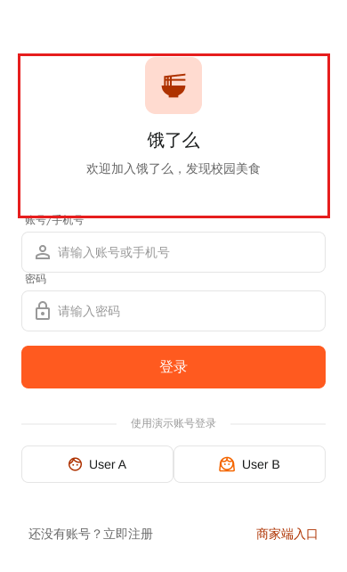 | 产品名称和欢迎语为前端固定文案，图标来自前端资源；不向后端请求，也不把品牌区当作登录成功状态。                                                                                                                                                   | 纯展示区域不触发业务请求；应用启动后由路由决定停留在登录页还是目标页。                                                                                                                                                       | 资源加载失败保留文字并显示默认图标；文案不得与用户端/商家端模式冲突。                                                                                                                                                                                                 |
| 登录页-登录表单                | 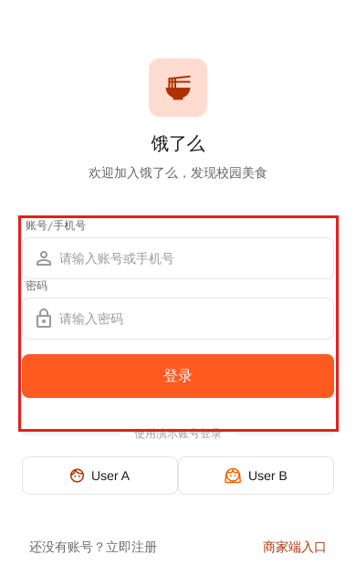 | 账号和密码为用户输入；默认不预填真实密码，可提供课程演示账号按钮；提交调用用户或商家登录接口，模式由入口决定。                                                                                                                                   | 点击登录先做必填检查，再只发送一次请求；请求中按钮禁用；成功保存会话并按目标地址跳转，失败保留账号并清空或保留密码按安全约定处理；不能用前端写死成功替代接口结果。                                                           | 账号或密码为空提示具体字段；格式不合格不请求；账号不存在/密码错误显示服务端错误；网络失败可重试；登录成功但会话未建立时不得进入受保护页面；重复点击只产生一次请求。                                                                                                   |
| 登录页-演示账号区              |  | 演示账号和密码来自演示配置或种子数据，页面只显示账号，不显示真实密码；用户端和商家端账号分开。                                                                                                                                                   | 点击演示账号填充账号并按演示流程提交登录；成功后建立真实会话，失败按普通登录处理；切换模式时清空不适用账号。                                                                                                                 | 演示账号不存在或后端未种子化时提示“演示账号不可用”；请求中按钮禁用；演示数据只用于测试，不得作为注册能力证明。                                                                                                                                                      |
| 登录页-底部链接                | 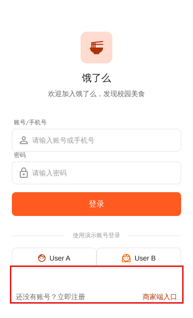 | 注册和商家入口为固定路由；当前模式由页面状态决定。                                                                                                                                                                                               | 点击注册进入用户注册页；点击商家入口进入商家登录/注册页；跳转前不丢失已填写内容，返回时按产品决定保留或清空。                                                                                                                | 路由加载失败回登录页；未实现的入口显示明确提示，不跳入空白页；已登录用户访问登录页时按目标地址处理。                                                                                                                                                                  |
| 注册页-顶部栏                  | 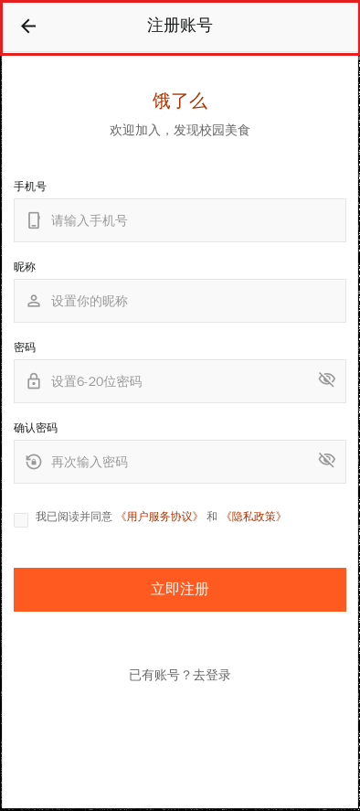 | 标题和返回按钮是固定页面元素，返回目标为登录页。                                                                                                                                                                                                 | 点击返回：表单无内容时直接返回；表单有内容时先确认是否放弃，确认后返回，取消则保留输入。                                                                                                                                     | 路由返回失败回登录页；不能把返回误当成提交；返回后再次进入注册页使用新的空表单。                                                                                                                                                                                      |
| 注册页-注册表单                | 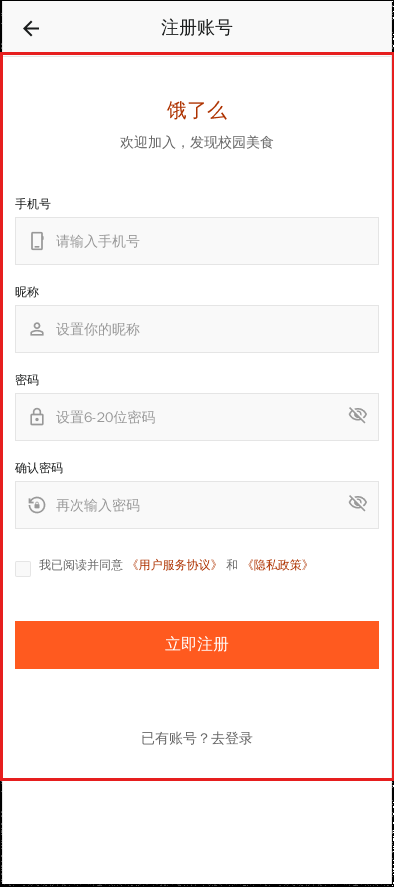 | 手机号/账号、昵称、密码、确认密码和协议均为用户输入；默认昵称为空，协议默认未勾选；字段规则由接口契约统一。                                                                                                                               | 点击注册先做前端检查，再请求注册接口；请求中防重复提交；成功清空密码并返回登录页；账号已存在时保留账号和昵称供修改；不能因前端校验通过就直接视为注册成功。                                                                   | 必填、账号格式、密码 6-20 位、两次密码一致、协议勾选逐项提示；服务端重复账号、参数错误、网络失败分别提示；失败保留已填内容；成功后重新登录验证会话。                                                                                                                  |
| 搜索页-搜索栏                  | 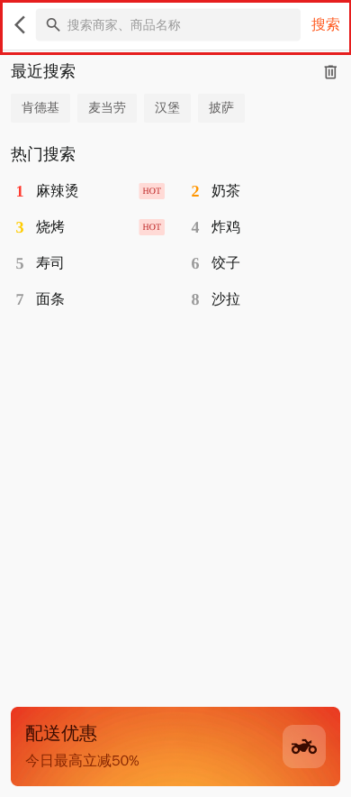 | 输入框为用户临时输入；默认空值；历史词来自本地受控存储，热门词来自课程固定数据或接口。                                                                                                                                                           | 输入关键词后点击搜索或回车进入结果页，并把去除首尾空格后的关键词作为参数；清空后回到初始搜索页，不发起空查询。                                                                                                               | 空关键词、超长关键词和不支持字符在前端提示；请求中显示加载；搜索失败保留关键词并可重试；不得把搜索失败误显示为空结果。                                                                                                                                                |
| 搜索页-搜索历史与热门          | 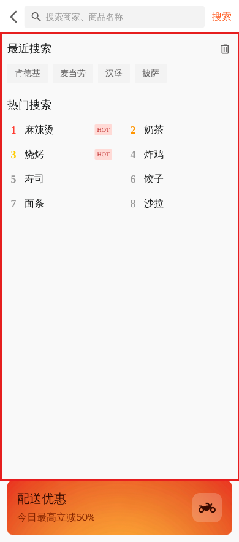 | 最近搜索来自当前设备本地存储，默认为空；热门词为课程演示数据或公开查询结果，必须区分来源。                                                                                                                                                       | 点击词直接带入搜索并进入结果页；删除单条只删除该条，清空全部需要确认；历史最多保留约定条数，新增后按最近使用排序。                                                                                                           | 没有历史时隐藏历史区；本地数据损坏时清空并按空态显示；热门词请求失败保留缓存，缓存也没有时隐藏热门区；不把旧用户的历史带入其他账号。                                                                                                                                  |
| 搜索页-底部活动条              | 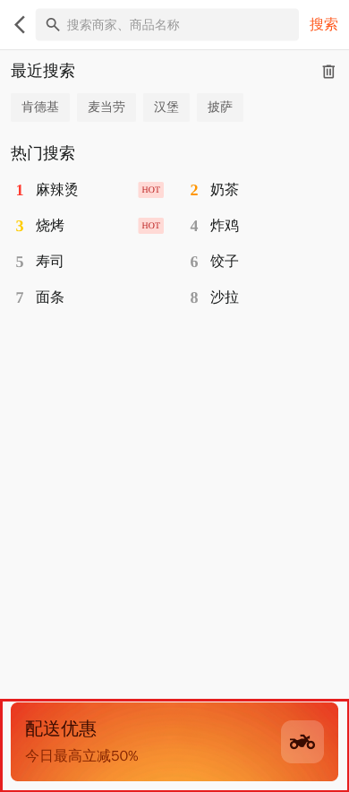 | 仅展示固定课程文案或明确返回的活动摘要，不承担优惠计算。                                                                                                                                                                                         | 点击只在有对应页面和接口时跳转；否则显示说明，不产生订单或优惠状态变化。                                                                                                                                                     | 没有活动数据时隐藏；数据加载失败不影响搜索；不得展示过期或来源不明的优惠金额。                                                                                                                                                                                        |
| 商家详情页-顶部栏              | 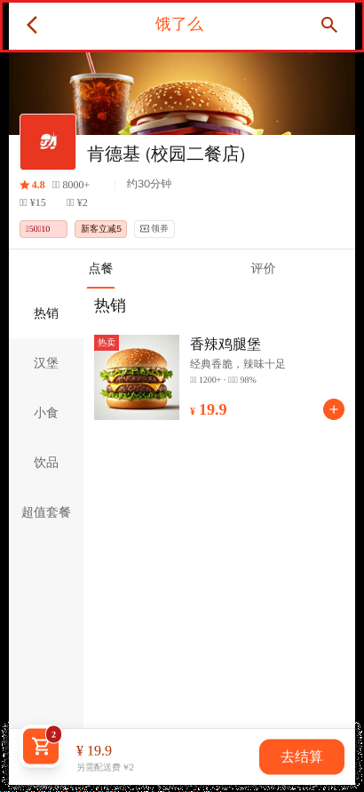 | 商家编号来自页面参数；商家名来自商家详情接口；返回、分享/更多为页面控件。                                                                                                                                                                        | 页面进入先校验`storeId` 再请求详情；点击返回回上一页；分享/更多未入选时只显示“暂未开放”，不生成分享记录；详情请求成功后标题更新。                                                                                        | 缺少或无效编号直接返回商家列表；首次请求显示顶部占位；网络失败提供重试；商家不存在显示“商家不存在”并返回列表；字段缺失不显示空白占位词。                                                                                                                            |
| 商家详情页-商家信息横幅        |  | 商家名、评分、月售、配送时长、起送价、配送费、营业状态和促销标签来自详情接口；点餐/评价为页面临时选项，默认点餐；优惠本期实现，按优惠接口返回结果展示可领取金额。                                                                                                  | 点击点餐显示商品区；点击评价进入该商家评价页；点击“领券”在优惠接口有结果时打开规则，无可用优惠时提示暂无可用优惠；详情刷新后以接口最新营业状态为准。                                                                     | 加载时显示头部占位；商家关闭时显示关闭原因并禁用加购、结算；商家不存在/下架显示错误并返回列表；字段缺失只隐藏对应字段，不能用旧演示值补齐。                                                                                                                           |
| 商家详情页-点餐内容区          | 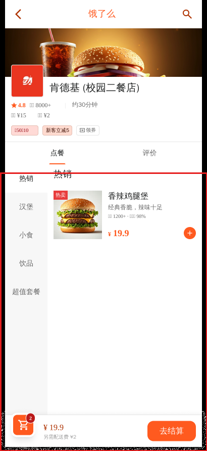 | 分类和商品来自店铺分类与商品接口：左侧分类栏（热销/汉堡/小食/饮品/超值套餐等，默认选中第一个有商品的分类）、右侧商品列表（商品名、描述、月售、好评率、价格）、底部购物车栏（商品数与合计金额来自购物车接口，去结算按钮固定）。金额保留两位小数。 | 点击分类切换右侧商品并高亮当前分类；点击商品加号按基础价加购（规格扩展选定后才弹出规格弹层）；点击去结算先校验登录、购物车非空、店铺营业和起送金额，再进入确认订单（起送金额不满足时提示差额并停留本页，不进入确认订单）；点击购物车栏展开购物车弹层；加购成功后购物车栏数量与金额立即刷新。 | 商品接口为空显示“暂无商品”空态；首次加载显示分类和商品占位；接口失败提供重试且不把空态误当失败；售罄商品灰化并禁用加购；店铺休息时结算按钮禁用并提示原因；去结算重复点击只产生一次跳转；从确认订单返回后重新读取购物车；字段缺失隐藏对应字段而不显示`undefined`。 |
| 商家评价页-商家信息区          | 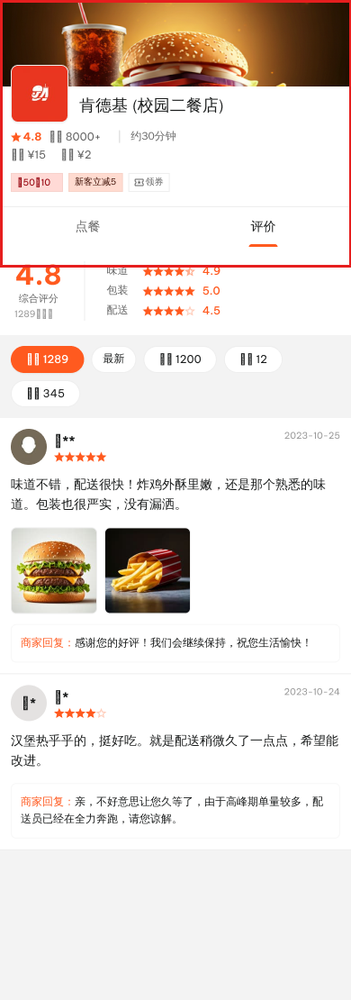 | 商家名、评分、月售、配送信息和促销标签来自商家详情接口；没有接口数据时不使用截图中的示例数字；点餐/评价是页面切换项，默认评价。                                                                                                                  | 点击点餐回到同一商家的点餐区；点击评价保持当前页面；切换后重新读取对应区域数据，不改变订单或购物车。                                                                                                                         | 首次进入显示商家信息占位；商家不存在、已关闭或接口失败时显示对应提示和返回/重试入口；字段缺失只隐藏该字段；评价扩展本期实现，显示真实评价列表与回复。                                                                                             |
| 商家评价页-评价列表            | 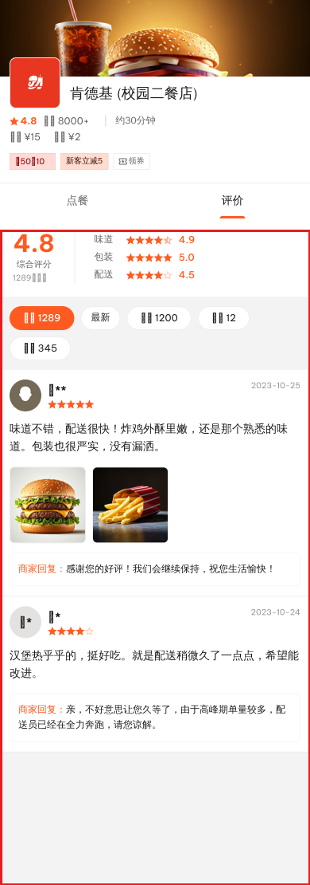 | 综合评分、评价数量和评价项由评价接口返回；筛选默认全部，取值为全部/有图/最新/好评/差评；列表按接口返回顺序展示。                                                                                                                                 | 点击筛选只更新页面筛选并重新请求；继续下拉时仅在还有下一页且上一次请求结束后加载；刷新后保留筛选值；不重复追加同一评价。                                                                                                     | 首次和加载更多显示占位；无评价显示空态；网络失败保留已显示结果并提供重试；评价字段缺失显示可用部分；图片失败显示占位；无权限或评价功能未开放时不显示编辑、回复等操作。                                                                                                |
| 商品规格弹层-规格弹层          | 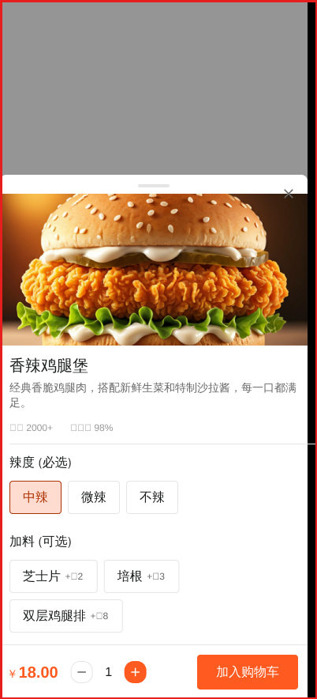 | 规格弹层属于本期实现的规格扩展：有规格的商品卡显示规格入口，点击加号打开本弹层；无规格商品按基础价直接加入购物车。商品详情来自当前商品接口；规格默认值由商品配置返回，没有默认值时必须先选择；数量默认 1；价格由后端商品单价和规格价差计算，页面只展示。 | 打开弹层时记录当前商品和库存快照；选择规格/加料/数量后只更新预览价；点击加入购物车先检查登录、营业状态、上下架和库存，再请求加购；成功关闭弹层并刷新购物车；点击遮罩或关闭按钮放弃本次输入。                                 | 商品已删除、下架、库存变化时禁止提交并提示刷新；必选规格未选、数量小于 1 或超过可买库存时提示；加购请求中按钮禁用；网络失败保留选择并允许重试；后端返回金额时以后端结果为准；重复点击只产生一次加购请求；返回本页后重新读取购物车。                                   |
| 订单列表页-顶部栏              | 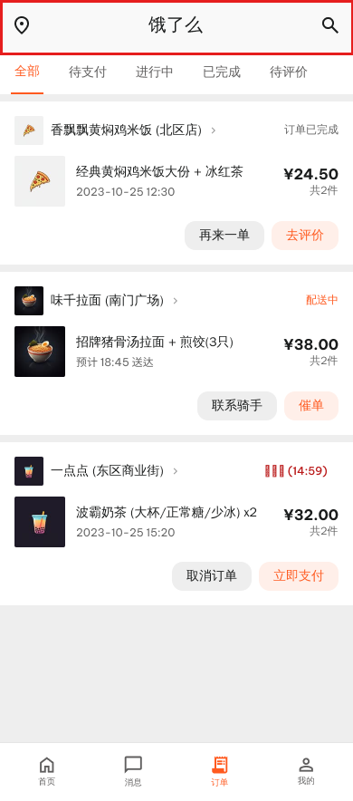 | 标题为固定文案；消息图标的未读数来自消息接口或默认为 0，消息本期实现，未读数来自消息接口。                                                                                                                                                                 | 点击消息图标先检查消息模块是否开放；开放时进入消息页，否则给出提示；进入订单页时读取当前筛选下的订单。                                                                                                                       | 未读数加载失败按 0 显示并记录提示；图标资源失败仍保留可访问名称；未登录点击进入受保护页面时转登录。                                                                                                                                                                   |
| 订单列表页-状态筛选与订单列表  | 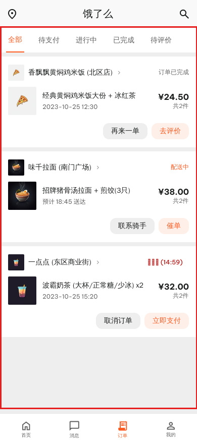 | 筛选默认全部；P0 仅提供“全部”筛选，待支付/待评价筛选在对应 P1 扩展实施后出现；订单卡片由订单列表接口返回，金额、状态、时间使用接口值。                                                                                                         | 切换筛选重置列表并请求；点击卡片进入详情；待支付点击去支付，待评价点击评价，已完成点击再来一单时只复制可购买商品到购物车，不直接创建订单；回到列表重新请求。                                                                 | 首次/切换筛选显示占位；空结果显示对应空态；接口失败保留筛选并重试；订单状态变化时操作按钮按最新状态更新；待支付倒计时结束后显示已失效并禁止支付；金额字段缺失显示暂无金额。                                                                                          ；已取消订单展示「已取消」与取消原因；**取消入口不在本页**（统一在支付页内，见 7.6） |
| 订单列表页-底部导航            | 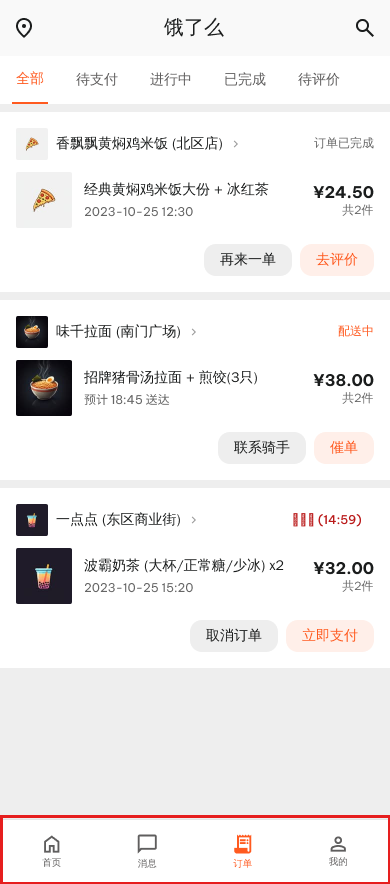 | 导航固定为首页/消息/订单/我的，订单项由路由高亮。                                                                                                                                                                                                | 点击切换页面；从详情返回列表时保留筛选值；重新进入订单页重新请求，不沿用过期列表。                                                                                                                                           | 登录失效时跳转登录并保留目标路由；未知路由回首页；导航自身不显示加载空态。                                                                                                                                                                                            |
| 订单详情页-顶部栏              | 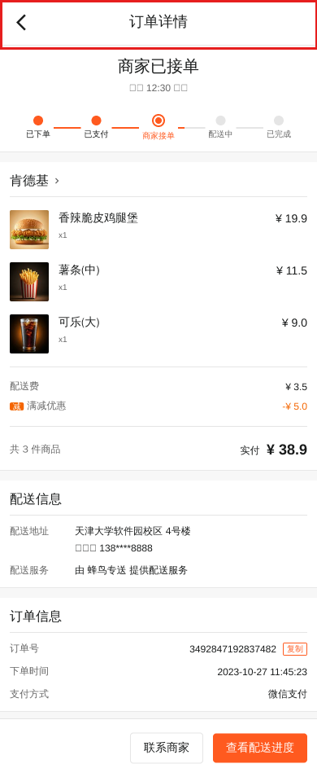 | 订单编号来自路由参数，标题为固定文案。                                                                                                                                                                                                           | 进入页面校验订单编号并请求详情；点击返回回订单列表；订单状态变化后刷新详情而不是只修改本地文字。                                                                                                                             | 编号缺失或订单不存在返回列表并提示；加载显示详情骨架；未登录/无权限按统一规则处理；网络失败显示重试，不能显示上一笔订单。                                                                                                                                             设计真源：`docs/design/exports/用户端/12-订单与支付/01-订单详情-含订单跟踪/`（顶部栏与既有稿一致，沿用本图） |
| 订单详情页-状态头与时间线（CHG-003 新增；**原订单跟踪页已并入本页**） | 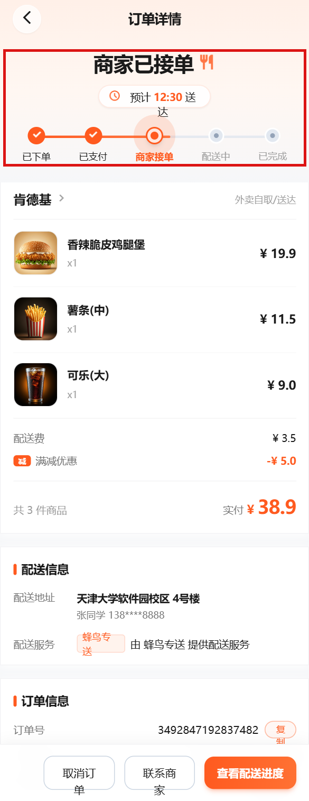 | 状态头大字为当前状态文案（如「商家已接单」）+ 预计送达时间；**五节点时间线**：已下单 / 已支付 / 商家接单 / 配送中 / 已完成，当前节点品牌橙实心 + 光环、未达节点灰；**文案与状态值映射见 7.6**；数据来自订单详情接口；设计真源：`docs/design/exports/用户端/12-订单与支付/01-订单详情-含订单跟踪/` | 商家端推进后用户端刷新即更新当前节点；已完成订单全部节点点亮；已取消订单显示「已取消」且时间线置灰 | 接口失败保留上次结果并提供刷新；状态缺失显示「状态获取失败」；**不出现骑手位置、配送地图与实时定位** |
| 订单详情页-订单详情内容（CHG-003 更新） | 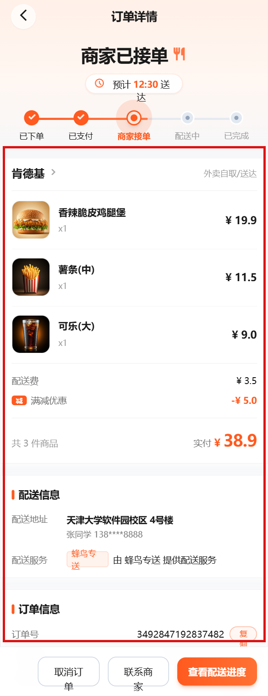 | 商家名与「外卖自取/送达」**纯展示标签**；商品明细按「商品 + 规格组合」展示；**金额明细固定四行：商品小计 / 打包费（¥2.00）/ 配送费（¥3.00）/ 实付金额**（PRD 7.4）；「配送信息」卡（配送地址 + 收货人 + 配送服务方占位）；「订单信息」卡（订单号 + 复制、下单时间、支付方式）；配送服务方为课程演示占位文案。设计真源：`docs/design/exports/用户端/12-订单与支付/01-订单详情-含订单跟踪/` | 点商家名进商家详情；点「复制」复制订单号；配送进度由本页时间线表达，**不再有独立配送页** | 首次加载显示占位；接口失败保留已展示结果并提供刷新；金额字段缺失显示「暂无金额」；**替换为课程口径：不出现「蜂鸟专送」「微信支付」等第三方字样**（配送服务方显示为课程占位文案、支付方式显示为模拟支付） |
| 订单详情页-底部操作区（CHG-003 更新） | 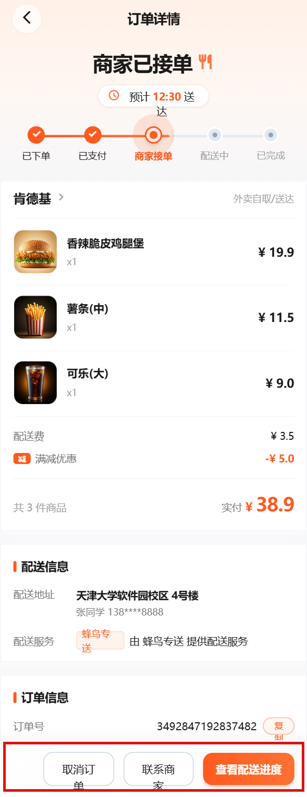 | 操作按钮由后端订单状态决定：待**支付**→去支付、待**评价**→去评价、已**完成**→再来一单、已支付可进入联系商家；**「取消订单」按钮仅在 `PENDING_PAYMENT`（待支付）与 `PENDING`（待接单）可用；商家接单（`COOKING`）及之后保留但置灰**，点击提示「商家已接单，无法取消」；**不提供「查看配送进度」按钮**（配送进度由本页时间线与配送信息卡表达） | 点击前再次校验订单状态；状态不允许时刷新详情；**取消入口不在本页**——用户端取消入口统一在支付页内容区（见 7.6） | 无可用操作时隐藏操作栏；状态变化时按钮按最新状态更新；置灰按钮点击给出原因提示；不出现退款、售后与资金文案 |
| 取消订单确认页-取消确认弹层（P2 本期；**设计稿已产出并入库，CHG-003**） | 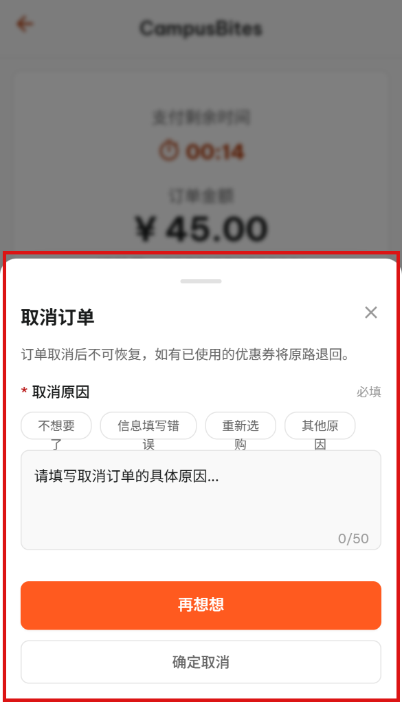 | **底部弹层**（遮罩 40% 黑 + 顶部拖拽条 + 8px 圆角）：标题「取消订单」+ 右上角关闭；说明「订单取消后不可恢复」（**设计稿原有的「如有已使用的优惠券将原路退回」按负责人 2026-09-11 拍板删除**）；「* 取消原因」+「必填」+ 四个快捷原因（不想要了 / 信息填写错误 / 重新选购 / 其他原因）+ 文本域（占位「请填写取消订单的具体原因...」，**字数 0/50，与契约 §3.5 的 1–50 字符一致**）；按钮「再想想」（品牌橙主按钮通栏）与「确定取消」（白底描边次按钮）；设计真源：`docs/design/exports/用户端/12-订单与支付/03-取消确认弹窗/` | 点快捷原因即回填文本域；原因为空时「确定取消」不可提交并提示必填；点「确定取消」调 `POST /api/v1/orders/{orderId}/cancel`；点「再想想」或点遮罩关闭弹层不取消 | 提交中按钮禁用并显示处理中；订单已进入制作或已取消时被拒并提示原因、同时刷新订单状态；重复提交只生效一次；**不出现退款、售后与资金处理文案** |
| 评价订单页-顶部栏              | 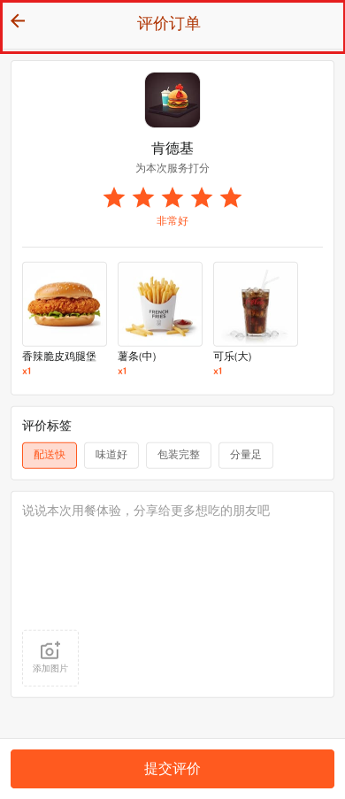 | 订单编号和商家名来自路由与订单详情；标题固定。                                                                                                                                                                                                   | 进入时先检查订单属于当前用户且已完成；点击返回订单列表；若订单条件不满足不进入评价表单。                                                                                                                                     | 加载时显示顶部占位；订单不存在、未完成或已评价时提示原因并返回；登录失效按统一规则处理。                                                                                                                                                                              |
| 评价订单页-评价内容区          | 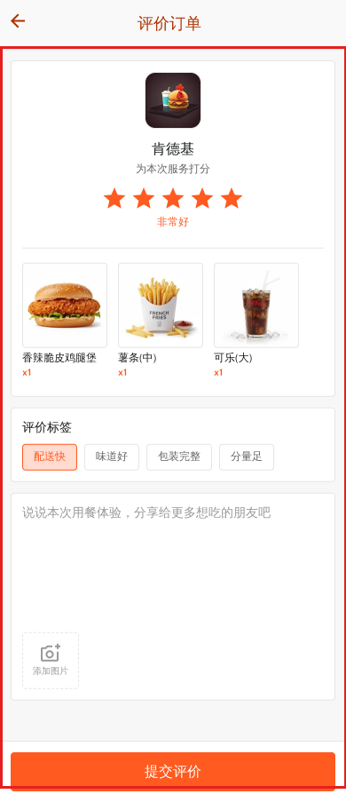 | 商家名和已购商品来自订单详情；星级为 1-5 的用户输入，默认未选；标签为多选；文字默认空；图片为可选文件。评价扩展本期实现，本区域为真实评价表单，提交后订单进入已完成。                                                                                                    | 选择星级、标签、文字和图片只修改当前表单；删除图片只删除本地选择；离开有未保存内容时确认；提交时把订单编号和表单一次发送。                                                                                                   | 未完成订单、已评价订单或非本人订单不能进入；文字超出长度、图片超过数量/大小、文件类型不支持时立即提示；图片上传失败保留文字和星级；加载失败提供返回或重试。                                                                                                           |
| 评价订单页-提交按钮            | 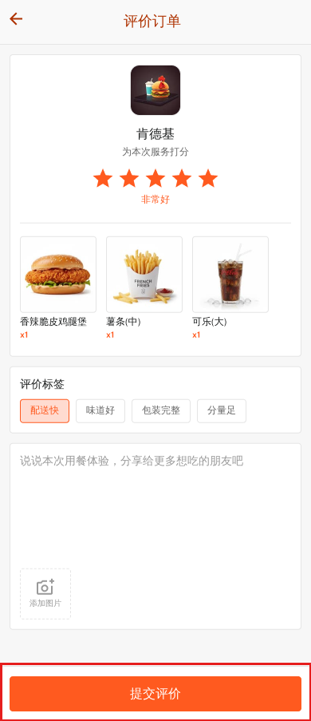 | 提交按钮根据星级是否选择决定可用状态，默认不可提交。                                                                                                                                                                                             | 点击后先做表单检查，再请求评价接口；请求中禁用按钮；成功回订单列表并刷新订单状态；失败保留表单并允许重试；重复请求由前后端共同拦截。                                                                                         | 未选星级、登录失效、订单状态变化、已存在评价、网络失败和服务端拒绝分别提示；不能显示“评价成功”后再发现保存失败。                                                                                                                                                    |
| 消息列表页-顶部栏              | 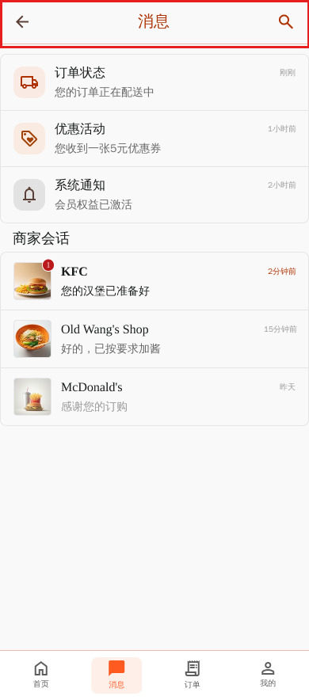 | 标题固定；未读总数来自消息接口，消息扩展本期实现，未读总数来自消息接口。                                                                                                                                                                                     | 进入页面请求通知和会话列表；返回其他页面后再次进入重新读取未读数；刷新期间不覆盖当前输入或已打开会话。                                                                                                                       | 首次加载显示列表占位；接口失败保留上次已读状态并提供重试；未登录跳转登录；无消息显示空态；角标超过 99 显示`99+`。                                                                                                                                                   |
| 消息列表页-消息列表            | 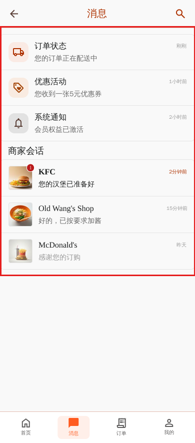 | 通知和会话来自消息接口，按时间倒序；会话关联商家和订单编号；未读数按当前用户保存。                                                                                                                                                               | 点击通知进入已有目标页面；点击会话携带`conversationId` 进入聊天；打开会话后仅将本会话标记已读，成功后刷新角标；消息扩展本期实现，点击进入消息列表。                                                                        | 通知和会话都为空时显示空态；加载失败可重试；单条字段缺失时隐藏对应摘要；会话关联订单不存在时仍可显示会话，但订单卡提示无法查看。                                                                                                                                      |
| 消息列表页-底部导航            | 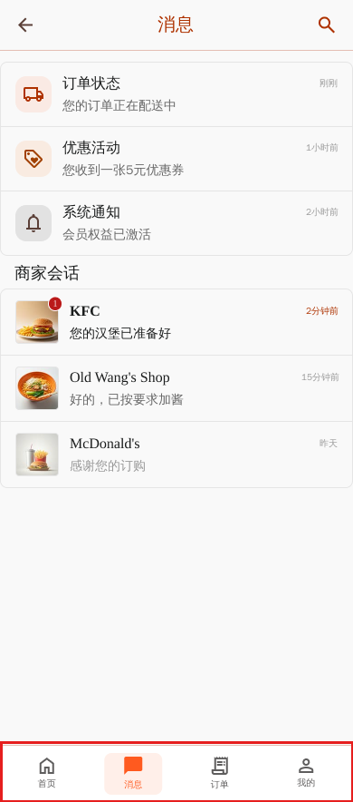 | 四个一级导航：首页/消息/订单/我的，当前项由路由决定。                                                                                                                                                                                            | 点击切换路由；离开前不清除未读；重新进入再请求列表；未登录访问时跳转登录并保留目标地址。                                                                                                                                     | 路由错误回首页；消息接口错误不影响其他导航；当前项始终高亮且不能出现两个高亮项。                                                                                                                                                                                      |
| 聊天详情页-聊天头部            |  | 会话标题、商家名和会话编号来自会话详情接口；更多操作为预留控件。                                                                                                                                                                                 | 进入时读取会话详情；返回消息列表；更多操作不在本期范围，只提示暂未开放；若会话已关闭，输入区改为只读。                                                                                                                             | 会话编号缺失或无权限返回消息列表；加载显示头部占位；会话不存在提供返回；登录失效按统一规则处理。                                                                                                                                                                      |
| 聊天详情页-订单状态卡          |  | 订单状态、订单编号、商家名来自订单接口；查看订单使用订单编号；联系骑手入口不纳入本期。                                                                                                                                                           | 点击查看订单进入订单详情；状态刷新后更新卡片；订单已完成仍可查看历史详情，不新增配送操作。                                                                                                                                   | 订单数据加载中显示占位；订单不存在或无权限显示无法查看；状态接口失败保留当前结果并提供刷新；未登录按统一规则处理。                                                                                                                                                    |
| 聊天详情页-消息时间线          | 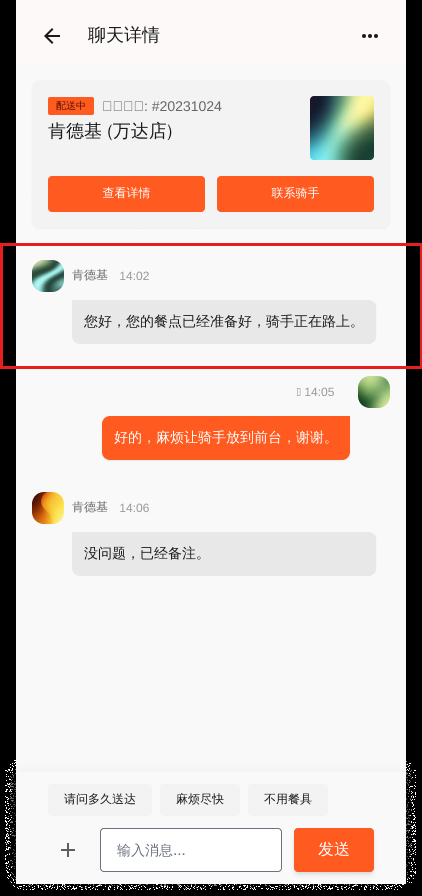 | 消息来自会话接口，包含发送方、内容、时间和发送状态，按服务端时间排序。                                                                                                                                                                           | 初次进入读取历史消息并滚动到底部；新消息按约定刷新方式追加；长按复制只影响本地；发送失败的消息可单条重发。                                                                                                                   | 历史消息为空显示空态；加载显示占位；接口失败提供重试；消息字段缺失显示可用部分；重复重发不能产生两条相同消息。                                                                                                                                                        |
| 聊天详情页-底部输入区          | 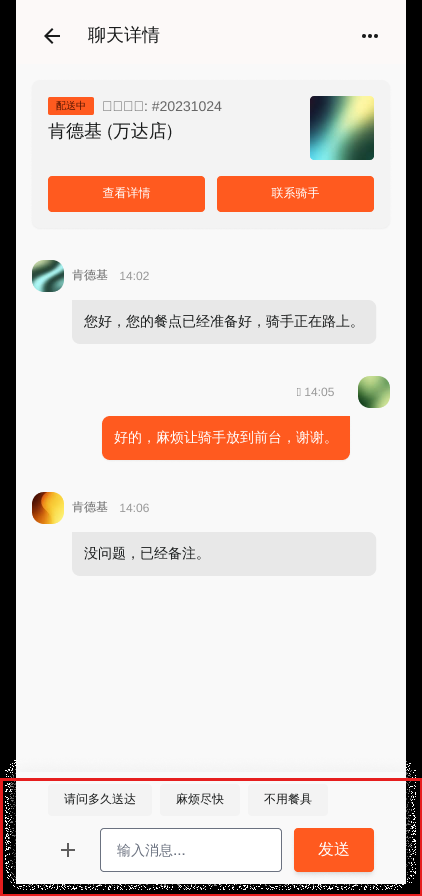 | 快捷回复为固定文案，输入框默认空，发送按钮按去除空格后的内容判断是否可用。                                                                                                                                                                       | 点击快捷标签写入输入框；点击发送先检查登录和会话权限，再写入消息；发送中禁用按钮，成功清空输入并置底，失败保留内容并显示重试。                                                                                               | 空消息、超长消息和已关闭会话禁止发送；键盘遮挡时输入区保持可见；网络失败不能把本地气泡直接当作已送达。                                                                                                                                                                |
| 常见问题页-顶部栏              | 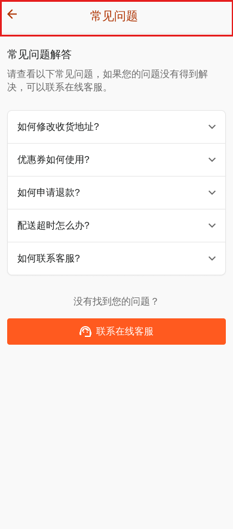 | 标题与返回按钮为固定页面元素；本页为 6.11 设置与 FAQ（P2）中的课程问答展示页，整页为静态帮助内容，不请求业务接口。 | 点击返回回上一页；顶部栏不触发业务请求，不产生会话或工单。 | 路由返回失败回我的页；标题文案不得与客服会话混淆（平台客服不在项目范围）；未登录可浏览本页。 |
| 常见问题页-常见问题解答区      | 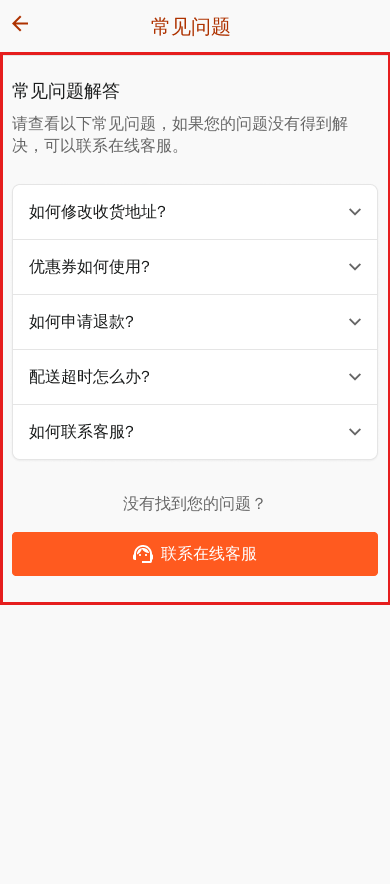 | 标题"常见问题解答"与说明文字为固定文案；FAQ 折叠列表（如何修改收货地址/优惠券如何使用/如何申请退款/配送超时怎么办/如何联系客服）为静态帮助内容，默认全部收起，不来自接口、不随用户或订单数据变化。 | 点击 FAQ 条目仅本地展开/收起答案，不发请求；底部"联系在线客服"按钮为不可交互占位——平台客服已明确移出项目范围（见 6.10 与本节尾注），点击提示"暂未开放"，不发起会话、不进入客服页。 | 折叠内容为前端固定文案，加载与展开不产生请求；优惠券、退款、配送超时等条目按静态帮助口径展示，不代表已实现能力；不得把"联系在线客服"按钮当作真实客服入口验收。 |
| 确认订单页-顶部栏              | 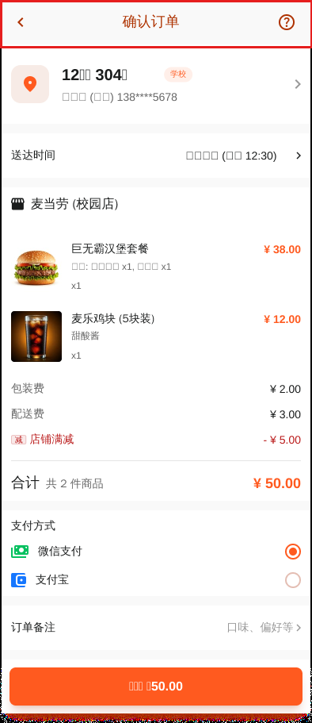 | 标题固定；返回目标为当前商家详情，页面参数携带商家编号。                                                                                                                                                                                         | 点击返回不创建订单；有修改未保存备注时提示是否放弃；重新进入页面重新读取购物车、地址和商家状态。                                                                                                                             | 参数缺失或商家不存在返回列表；页面加载显示骨架；登录失效跳登录并保留目标；返回后购物车内容不被误清空。                                                                                                                                                                |
| 确认订单页-订单内容区          | 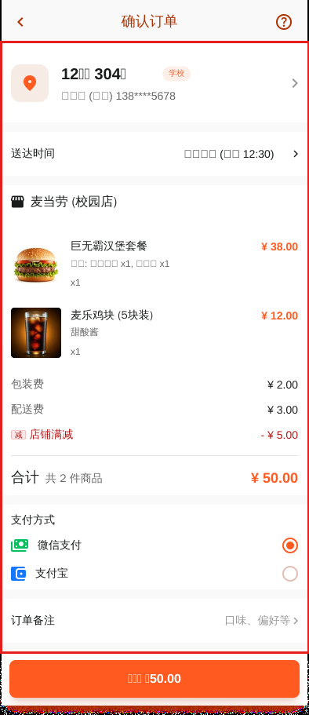 | 商家、购物车商品、数量、单价和库存来自接口；地址来自当前用户地址接口，默认选择默认地址；送达时间默认为“尽快送达”，实际时间为演示计算值；优惠入口只有选定优惠扩展后显示。                                                                       | 进入页面重新读取购物车、商家状态和地址；点击地址卡进入选择；点击送达时间修改临时选项；点击商品步进器修改购物车并重新请求金额；所有修改成功后更新结算栏。                                                                     | 购物车为空、商家关闭、商品下架、库存变化、最低起送金额不满足时禁止提交并说明原因；首次加载显示分区占位；任一区域失败提供重试；地址不存在时引导新增；不能用旧购物车金额提交。                                                                                          |
| 确认订单页-底部结算栏          |  | 合计金额来自后端试算或创建订单响应，默认显示加载占位；去支付按钮只在地址、商品和金额检查通过时可用。                                                                                                                                             | 点击去支付只发起一次创建订单请求；请求中按钮显示“提交中”；成功保存订单编号并进入订单结果/模拟支付页；失败停留当前页并保留表单；返回后重新读取购物车。                                                                      | 未登录转登录；金额不一致、库存不足、店铺关闭、重复提交和服务端错误分别提示；成功前不得清空购物车，成功后由后端或明确的前端流程清空；订单创建失败不得显示支付成功。                                                                                                    |
| 订单备注弹层-备注弹层          | 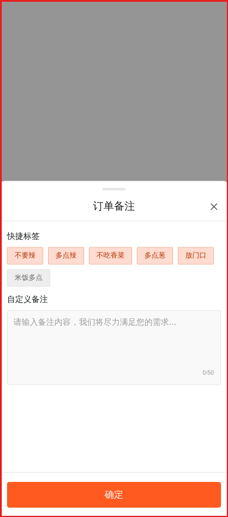 | 快捷标签为固定选项；自定义备注为用户临时输入，默认空，最多 50 字；确定前不请求接口。                                                                                                                                                             | 点击标签可多选并写入输入框；确定后把备注回填确认订单页；遮罩/关闭取消本次修改；订单提交时一次性提交最终备注。                                                                                                                | 超过 50 字立即提示或截断；只有空备注时确定也可关闭；弹层打开期间禁止底层重复操作；保存订单失败时备注仍保留。                                                                                                                                                          |
| 支付页-顶部栏（CHG-003 更新） | 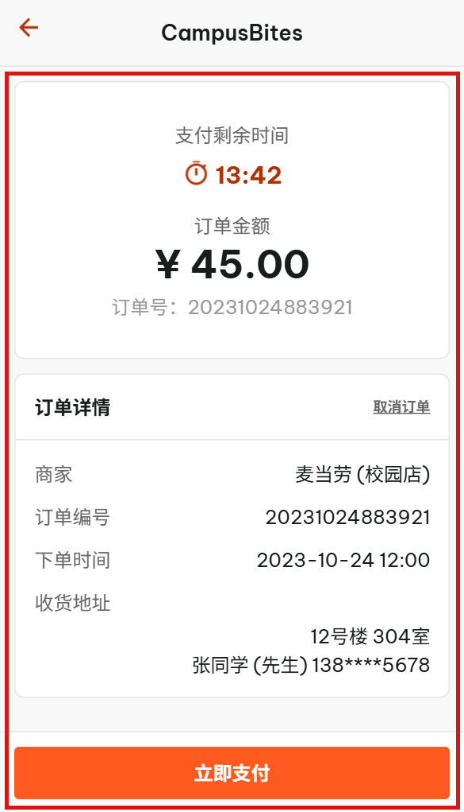 | 顶部为**返回箭头 + 应用标题**（**无关闭按钮**，原稿的关闭按钮已随支付页改版去掉）；标题固定；本页只在支付扩展启用后出现；设计真源：`docs/design/exports/用户端/12-订单与支付/02-支付页/`（原 `07-支付/01-收银台` 已被取代） | 点返回不改变支付状态，回到上一页；已支付订单再次进入时直接显示已支付结果，不能重复扣款 | 订单编号缺失返回订单列表；加载显示支付占位；订单不存在、会话失效与网络失败提供明确处理 |
卡内为**商品清单 + 金额明细（固定四行：商品小计 / 打包费 / 配送费 / 实付金额）+ 商家、订单编号、下单时间、收货地址**；**⚠️ 当前设计稿（Figma `26_170`）尚未包含商品清单与金额明细，负责人将重新导出补充版（`PROTO-CHG003-03`），届时重新入库、重做红框图与新截图并回填本行**；
| 支付成功页-成功横幅            | 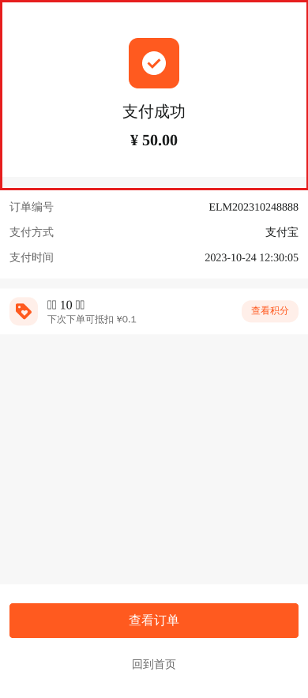 | 成功状态、支付金额和订单编号来自模拟支付接口/订单查询，不使用写死金额；本页仅在支付扩展选定后出现。                                                                                                                                              | 页面进入后只展示结果；订单状态以接口返回为准，不因为进入成功页再次发起支付；刷新页面应可重新查询同一结果。                                                                                                                   | 支付结果加载中显示占位；接口失败提供查看订单/重试查询；状态未知时显示待确认，不显示成功；金额缺失显示暂无金额。                                                                                                                                                       |
| 支付成功页-订单摘要卡          | 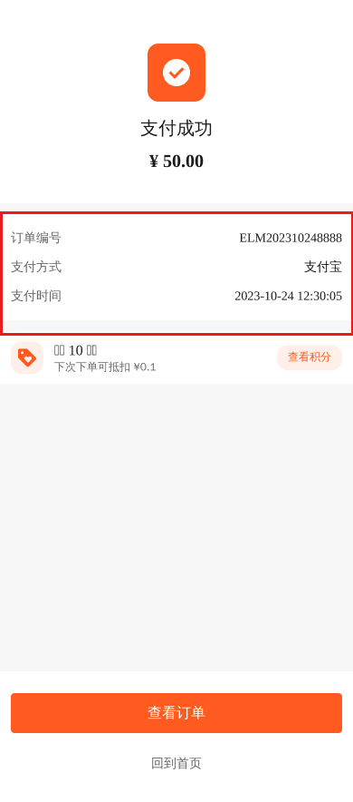 | 订单编号、模拟支付方式、支付时间来自订单详情；支付方式默认“模拟支付”，不展示真实第三方渠道。                                                                                                                                                   | 点击订单编号或查看订单进入订单详情；不允许在摘要卡上修改订单。                                                                                                                                                               | 订单详情查询失败保留成功结果但提示刷新；编号缺失不生成假编号；时间格式异常按暂无时间显示。                                                                                                                                                                            |
| 支付成功页-会员提示            | 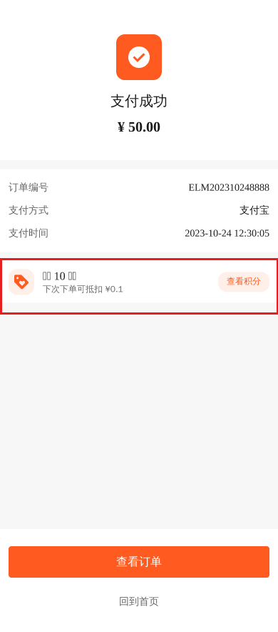 | 提示文案（会员红包已同步、下次下单可使用）为固定课程文案；红包与会员本期实现，按接口返回数据展示；无数据时不显示空提示。                                                                                                                                   | 提示区纯展示不触发请求；点击查看订单进入订单详情，重复点击只发生一次跳转。                                                                                                                                                   | 文案资源缺失时隐藏该区域；本页不请求会员或红包接口；本期不建设积分体系，不展示积分余额或兑换入口。                                                                                                                                                                    |
| 支付成功页-底部操作            | 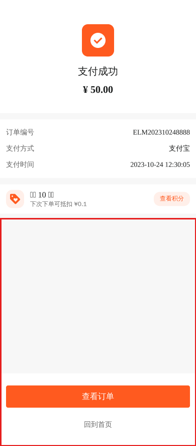 | 查看订单和回到首页是固定操作，订单编号来自当前支付订单。                                                                                                                                                                                         | 点击查看订单进入详情；点击回到首页；重复点击只发生一次路由跳转，不改变订单状态。                                                                                                                                             | 订单编号缺失时查看订单改为返回订单列表；路由失败回订单列表；本页不提供真实支付、退款或配送操作。                                                                                                                                                                      |
| 支付失败页-顶部栏              | 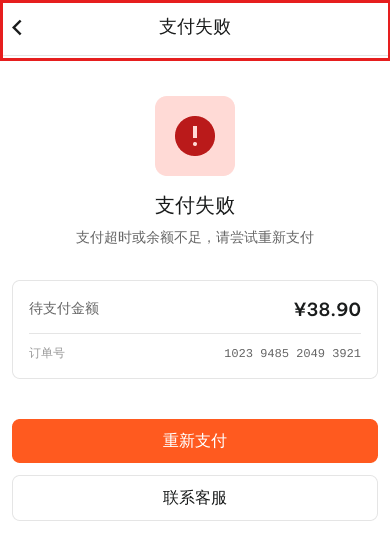 | 返回按钮和标题固定，当前订单编号来自路由参数。                                                                                                                                                                                                   | 点击返回订单详情或确认页；离开页面不删除待支付订单。                                                                                                                                                                         | 编号缺失返回订单列表；订单已支付时不再显示失败页；路由失败回订单列表。                                                                                                                                                                                                |
| 支付失败页-失败内容区          | 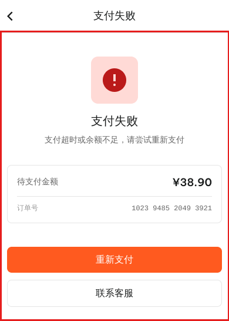 | 失败原因、待支付金额和订单号来自支付结果或订单查询；失败原因缺失时显示通用提示。                                                                                                                                                                 | 点击重新支付先查询订单当前支付状态，仍待支付才回支付页；状态已成功则进入成功结果；查询失败提供重试。                                                                                                                         | 支付按钮防重复点击；订单过期、已支付、订单不存在和网络失败分别提示；本期不提供联系客服入口。                                                                                                                                                                          |
| 我的页-个人中心内容            |  | 用户信息来自当前会话和个人信息接口；会员、收藏、红包和地址数量来自对应接口，未实现模块不显示假数量；版本号为前端固定值。                                                                                                                         | 进入页面请求用户信息和模块摘要；点击地址进入地址管理；会员/收藏/红包/FAQ 入口本期均可进入对应页面；退出登录清除会话。                                                                                       | 未登录显示去登录；用户信息失败提供重试；某个摘要失败不阻塞其他内容并显示暂无；账号字段缺失隐藏对应字段；退出成功后不能返回受保护页面。                                                                                                                                |
| 我的页-底部导航                |  | 四个一级导航：首页/消息/订单/我的，当前为我的。                                                                                                                                                                                                  | 点击切换路由；未登录点击受保护导航先登录并保留目标地址。                                                                                                                                                                     | 会话失效后统一回登录；路由错误回首页；底栏始终固定且不遮挡内容。                                                                                                                                                                                                      |
| 系统设置页-顶部栏              | 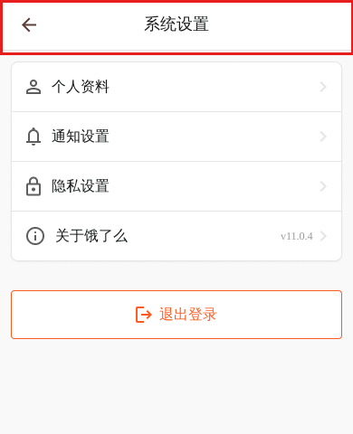 | 标题与返回按钮为固定页面元素；本页属 6.11 设置与 FAQ（P2）中的设置能力（个人资料展示与编辑、退出登录，见 7.10）。 | 点击返回回我的页；顶部栏不触发业务请求。 | 路由返回失败回我的页；未登录访问按统一规则跳登录并保留目标地址。 |
| 系统设置页-设置内容区          | 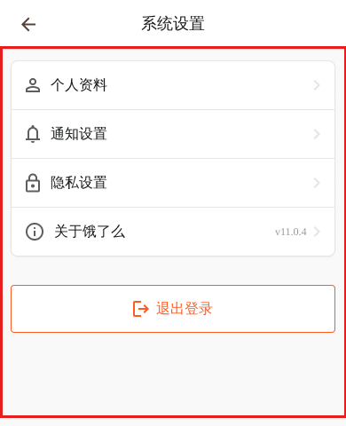 | 条目为固定菜单：个人资料/通知设置/隐私设置/关于饿了么/退出登录；个人资料内容来自当前会话与个人信息接口，关于饿了么的版本号为前端固定值，其余条目为静态展示、不绑定接口数据；通知设置、隐私设置不在本期范围（见 6.11），按占位处理。 | 点击个人资料进入资料展示与编辑（7.10 设置口径）；点击通知设置、隐私设置提示"暂未开放"，不扩大本期范围；点击关于饿了么只展示固定信息；点击退出登录先二次确认，再清除会话并回登录页。 | 未登录先跳登录；个人信息读取失败提供重试；退出失败保留会话并提示原因；退出成功后不能返回受保护页面；本页不新增个人资料编辑以外的写接口。 |
| 会员权益页-顶部栏              | 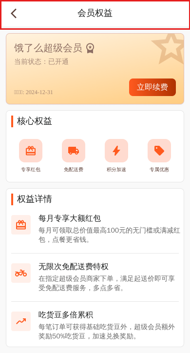 | 返回按钮和标题固定；会员状态来自用户信息接口。                                                                                                                                                                                                   | 点击返回我的页；会员扩展本期实现，进入会员权益说明页。                                                                                                                                                                             | 未登录跳转登录；会员信息加载失败显示暂无权益；该页不提供真实购买或续费。                                                                                                                                                                                              |
| 会员权益页-权益内容区          | 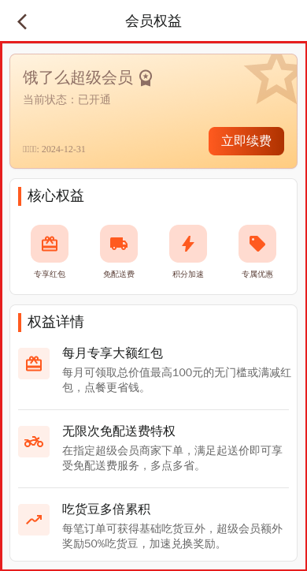 | 会员状态来自用户信息接口的会员标识，会员状态读取失败时显示“暂未开放”；权益项（专享红包、免配送费、会员价）为固定课程说明文案。                                                                                                                   | 点击权益项展开本地说明，不请求接口；续费按钮只给出“权益已生效”的演示反馈并明确提示为演示操作，不产生任何订单或状态变化。                                                                                                   | 会员状态读取失败显示暂无；未登录先跳登录；本页不调用支付或购买接口；本期不接会员购买、续费支付或积分加速接口。                                                                                                                                                        |
| 我的收藏页-顶部栏              | 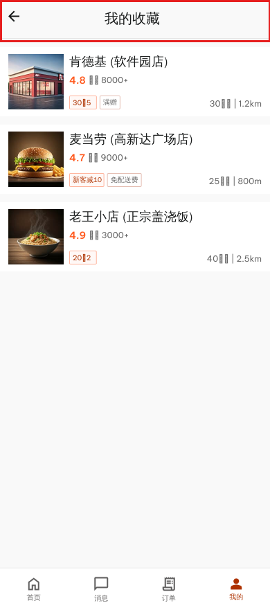 | 返回按钮和标题固定，用户身份来自会话。                                                                                                                                                                                                           | 点击返回我的页；收藏本期实现，进入收藏列表页。                                                                                                                                                                               | 会话失效跳登录；路由参数错误回我的页；不把顶部栏当作收藏数据。                                                                                                                                                                                                        |
| 我的收藏页-收藏商家列表        | 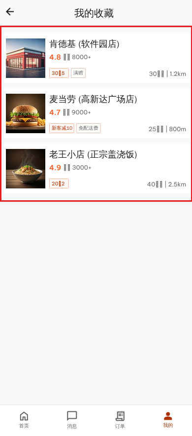 | 收藏商家卡片（商家名、评分、月售、促销标签、配送时长、距离）来自收藏接口；收藏本期实现，进入页面请求收藏接口并按返回数据展示。                                                                                                               | 点击商家卡携带`storeId` 进入商家详情；点击取消收藏先二次确认，再调用取消接口，成功后卡片从列表移除并刷新；请求中按钮禁用，重复点击只产生一次请求。                                                                         | 首次加载显示卡片占位；空收藏显示无数据提示和去逛逛入口；接口失败保留已显示结果并提供重试；收藏已被取消或商家已关闭时按最新结果刷新；未登录跳转登录。                                                                                                                  |
| 我的收藏页-底部导航            | 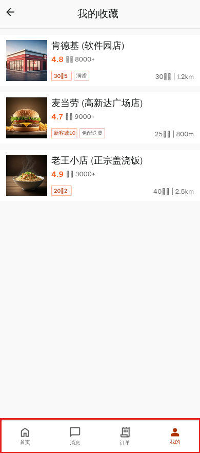 | 导航固定为首页/消息/订单/我的，当前项由路由决定。                                                                                                                                                                                                | 点击导航切换；离开收藏页不改变收藏；回到页面重新查询。                                                                                                                                                                       | 未登录统一转登录；页面路由无效时回首页；导航不产生业务请求。                                                                                                                                                                                                          |
| 红包页-红包列表                | 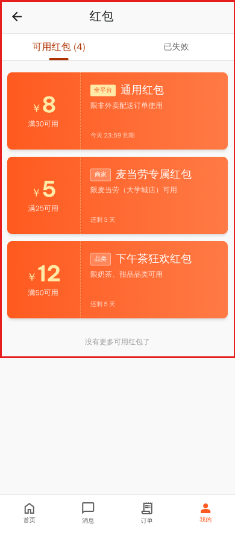 | 红包卡片（金额、使用门槛如满30可用、适用范围如全平台/商家专属/品类、到期时间）来自红包接口；红包本期实现，按红包接口返回数据展示。金额与门槛由后端返回，页面不自行计算。                                                                       | 点击红包卡展开使用规则说明；确认订单页只在红包扩展选定后可选可用红包；本页不直接使用红包，不修改红包状态。                                                                                                                   | 首次加载显示占位；无红包显示无数据提示；接口失败提供重试；过期红包灰化显示且不可选；字段缺失隐藏对应字段；未登录跳转登录。                                                                                                                                            |
| 红包页-底部导航                | 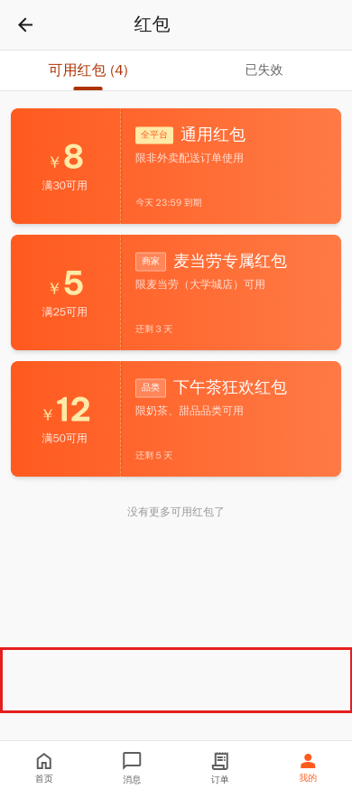 | 导航固定为首页/消息/订单/我的，当前项由路由决定；红包本期实现，进入页面请求红包列表。                                                                                                                                                                    | 点击导航切换路由；红包本期实现，点击红包入口进入红包列表。                                                                                                                                                                 | 未登录跳转登录；列表请求失败不影响其他导航；路由错误回首页。                                                                                                                                                                                                          |
| 首页-「天天爆红包」入口（CHG-001 变更） |  | 由占位装饰改为**红包页真实入口**；其余占位保持不可点（点击提示「暂未开放」）；**分类宫格不做按分类过滤**（平台级「点餐分类 10 类」本期不做） | 点「天天爆红包」跳红包页 | **加载**：首页商家列表加载中不阻塞活动区/宫格占位渲染；**错误**：入口跳转不依赖接口，进入红包页后由其自身空/错态兜底；**检查**：点击命中区不触发页面级横向滚动、未登录进入红包页走登录引导、其余占位点击仍提示「暂未开放」 |
| 红包页-「天天必爆」活动卡与加量红包通栏（CHG-001 新增） | 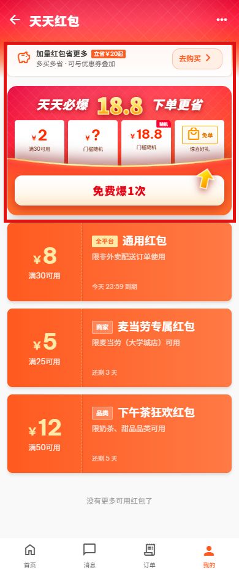<br>设计真源：`docs/design/exports/用户端/11-天天必爆/01-红包页/` | 顶部通栏「加量红包省更多／去购买」打开买红包浮窗；活动卡展示奖池预览与「免费爆1次」主按钮；**每天 1 次免费爆**，用完后爆一次消耗一张已购红包，都没有则提示去购买；**页面标题按设计稿为「天天红包」**；既有券列表与底部导航保持不动 | 点「去购买」开买红包浮窗；点「免费爆1次」进入爆红包过渡态 | **加载**：进入页面先展示占位骨架，券列表与爆次数返回后替换，不用固定演示数值冒充真实数据；**空态**：无券时显示「没有更多可用红包了」，免费次数用完且无可爆券时「免费爆1次」改为引导购买；**错误**：接口失败保留已展示结果并提供重试，真实模式不得回退 Mock；**检查**：免费次数每日 0 点重置、券列表只含真实券（品类券与「限非外卖配送」券为占位不可点用）、无横向溢出、底部导航可达 |
| 爆红包过渡态（CHG-001 新增） | 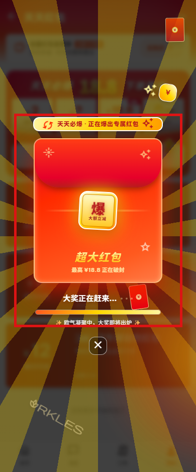<br>设计真源：`docs/design/exports/用户端/11-天天必爆/02-爆红包过渡态/` | **全屏覆盖**：金光放射背景 + 「天天必爆·正在爆出专属红包」横幅 + 红包卡与「爆」按钮 + 「最高 ¥18.8 正在破封」+ 欧气进度条 + 关闭按钮；不出现地图、积分、客服等无关元素 | 点「爆」→ 按 10 档权重随机命中 → 进入结果态 | **加载**：点「爆」后先播动效、等接口返回（≤3.5 秒），超时给轻量等待提示；**错误**：接口失败浮层保留并原地提示 + 重试，失败不消耗免费次数与红包（事务边界由后端保证）；**检查**：动效可跳过、音频不可用时静默降级、无免费次数且无可爆券时按钮为「去购买」、未登录 `401` 引导登录 |
| 爆出结果（CHG-001 新增） | 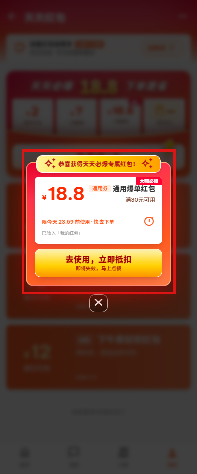<br>设计真源：`docs/design/exports/用户端/11-天天必爆/03-爆出结果/` | 结果卡：新档位金额（如 ¥18.8）+「通用券」标签 +「满30元可用」+「限今天23:59前使用」+「已放入『我的红包』」+ 主按钮「去使用，立即抵扣」；**爆出来的红包当天 23:59 到期** | 点「去使用」→ 红包页/去下单；关闭回红包页 | **加载**：无（结果由爆接口一次返回）；**错误**：结果渲染失败时回退红包页并提示「已开成功，请到红包列表查看」，避免用户误以为未开出；**检查**：爆出的券当天 23:59 到期（跨天灰化不可选）、金额与门槛一律按后端返回展示不自行计算、同一张券不可再爆、可在确认订单页选中 |
| 买红包浮窗（CHG-001 新增） | 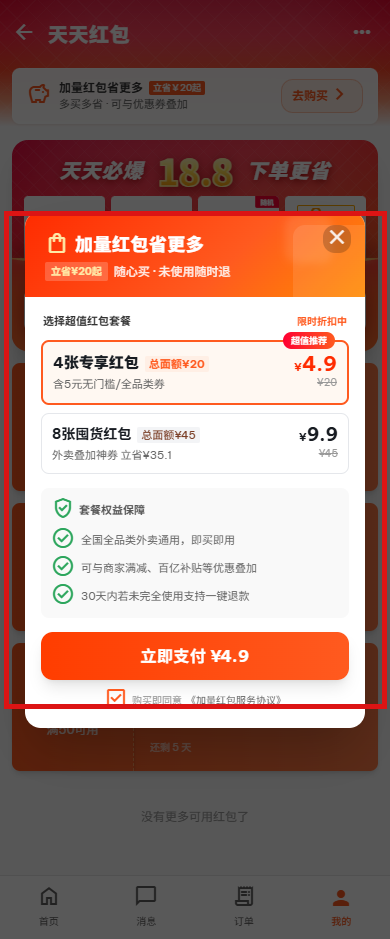<br>设计真源：`docs/design/exports/用户端/11-天天必爆/04-买红包浮窗/` | 两个套餐：**¥4.9 = 4 张**（3×满30减5 + 1×无门槛减5，面额 ¥20）、**¥9.9 = 8 张**（6×满30减5 + 1×满40减10 + 1×无门槛减5，面额 ¥45）；套餐权益为课程文案（**已删除退款条款**）；**前端模拟付费、不落支付记录**  **设计稿差异（以口径为准）**：浮窗截图与红框图中仍保留「30 天内若未完全使用支持一键退款」权益条目，**实现时删除该条**（不接真实退款），设计稿不复改。 | 选套餐 → 确认 → 生成对应张数红包（**有效期 7 天**）；购买次数不限 | **加载**：套餐为静态配置无需接口，确认购买时按钮进入「处理中」并禁用；**错误**：购买失败原地提示 + 重试，不重复生成券；**检查**：前端模拟付费不产生支付记录、生成张数与面额与套餐一致（4 张 / 8 张）、购买券有效期 7 天、不含退款条文（设计稿含该条，以实现口径为准） |
| 地址列表页-顶部栏              | 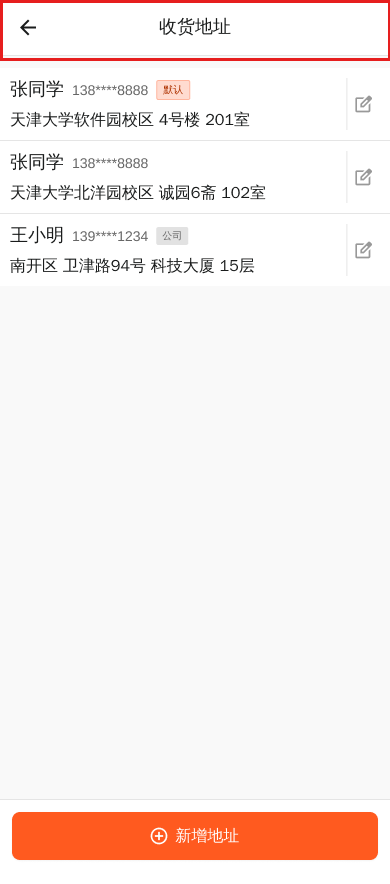 | 标题固定；地址来自当前用户地址接口；新增入口为路由操作。                                                                                                                                                                                         | 进入页面请求当前用户地址；点击新增进入空白地址表单；返回确认订单时把选择结果回填，不直接创建订单。                                                                                                                           | 首次加载显示占位；未登录转登录；接口失败提供重试；用户无地址显示空态和新增入口；不能读取其他用户地址。                                                                                                                                                                |
| 地址列表页-地址列表            | 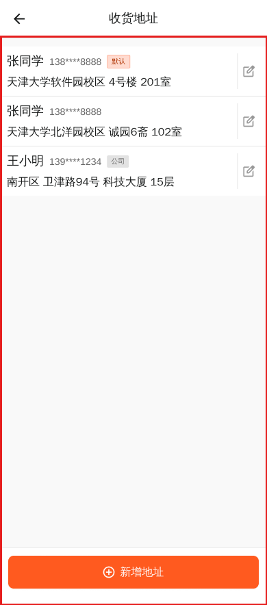 | 联系人、性别、电话、地区、详细地址、标签和默认标识来自地址接口；默认地址默认选中/置顶。                                                                                                                                                          | 点击地址卡在确认订单场景中选中并返回，在管理场景中进入编辑；删除需要二次确认并调用删除接口；设为默认调用更新接口，成功后其他地址取消默认。                                                                                   | 空列表显示新增入口；加载显示地址骨架；删除/设默认失败恢复原状态并提示；删除默认地址后由后端自动把剩余地址中最近更新的一条设为默认，无剩余地址时默认地址为空；字段缺失不允许作为下单地址。                                                                             |
| 新增地址页-顶部栏              | 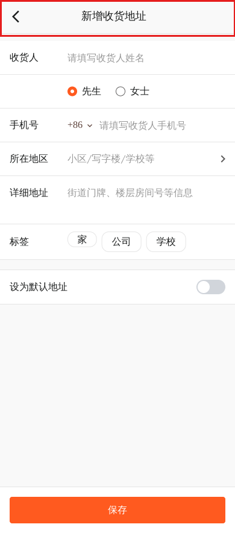 | 标题根据新增/编辑模式显示；编辑模式的地址编号来自路由。                                                                                                                                                                                          | 点击返回：无修改直接返回；有修改先确认放弃；编辑地址不存在时返回列表并提示。                                                                                                                                                 | 首次进入加载编辑数据；参数无效或无权限返回；网络失败提供重试；不能把编辑页的旧数据提交到另一个地址。                                                                                                                                                                  |
| 新增地址页-地址表单            | 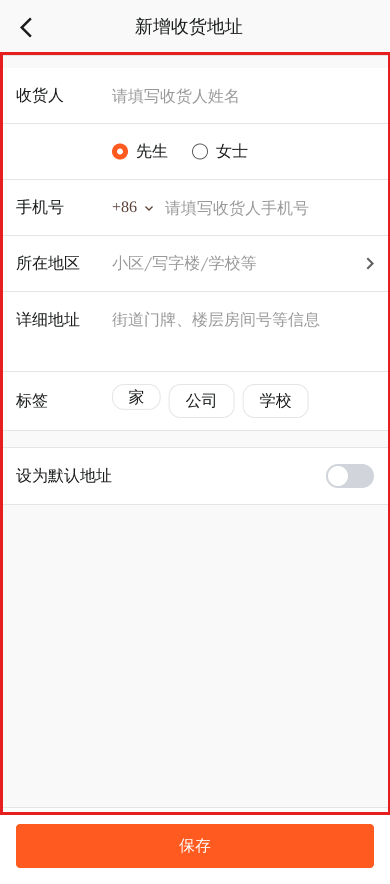 | 联系人、性别、手机号、地区、详细地址、标签和默认开关为用户输入；新增时默认空且默认开关按当前是否存在默认地址决定。                                                                                                                               | 输入只更新表单；保存按钮统一提交新增/修改接口；设默认由本次提交带出；成功返回地址列表并刷新确认订单选择。                                                                                                                    | 姓名、手机号、地区/详细地址必填；手机号按约定格式检查；长度超限、非法字符、重复提交、服务端校验失败分别提示；失败保留输入。                                                                                                                                           |
| 新增地址页-保存按钮            | 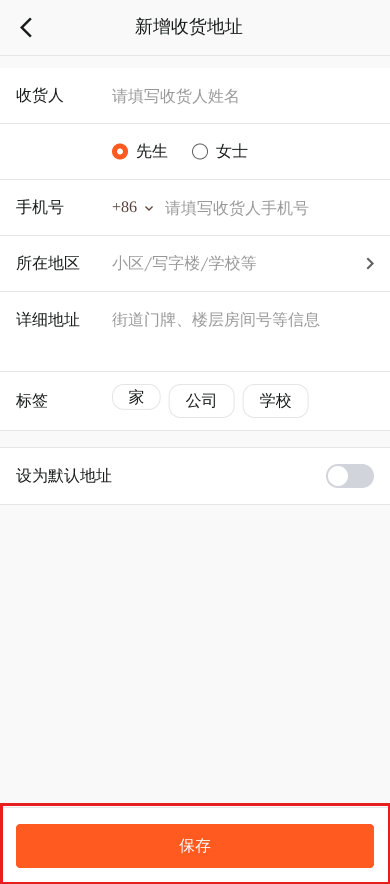 | 按钮默认可见，表单不合法时不可提交或点击后定位首个错误。                                                                                                                                                                                         | 点击后先前端校验，再只发一次请求；保存中禁用；成功使用后端返回地址更新列表；失败不返回、不清空输入。                                                                                                                         | 会话失效、地址重复、网络错误和服务端错误分别提示；返回列表前必须确认保存成功；保存成功后默认状态和排序立即刷新。                                                                                                                                                      |

> 设计稿中的“联系客服”页面已退出本期范围，不计入页面矩阵，也不作为课程展示内容。订单沟通统一使用用户与订单商家的聊天页面。

#### 7.16.2 商家端界面说明（桌面设计稿，红框逐区标注）

本节将 Stitch 桌面设计稿 MS-01~MS-20 逐区域用红色矩形框标注并截图，一行对应一个红框区域，格式与 7.16.1 一致；红框标注图与整屏原图位于 `docs/prd-assets/merchant-stitch/merchant-desktop-redbox/`、`docs/prd-assets/merchant-stitch/merchant-desktop-stitch/`。设计稿只承担布局与信息结构示意，**不承担 1:1 复刻义务**：商家端实现以 `docs/backend/后端接口契约.md` 与 `docs/design/设计系统-商家端.md` 为准；设计稿与契约的历史不一致已于 2026-09-01 全部评审并落地，后续如出现新的不一致，在对应行内标注"需评审"，结论落地前以契约为准（用户端的 exact 复刻要求不适用于本节）。侧边栏与顶栏等多屏重复区域仅在 MS-02 首屏详写，后续屏只注明差异；各屏 Logo 文字存在生成差异，实现统一为一套品牌区。

| 页面与区域                                 | 原型图 | 字段、数据来源与默认值                                                                                                                                                                                                                                                                                                                                                                                                                                                                                                                                                                                                                                        | 点击与状态变化                                                                                                                                                                                                                                                                                                                                    | 空态、加载、错误与检查                                                                                                                                                                                                   |
| ------------------------------------------ | ------ | ------------------------------------------------------------------------------------------------------------------------------------------------------------------------------------------------------------------------------------------------------------------------------------------------------------------------------------------------------------------------------------------------------------------------------------------------------------------------------------------------------------------------------------------------------------------------------------------------------------------------------------------------------------- | ------------------------------------------------------------------------------------------------------------------------------------------------------------------------------------------------------------------------------------------------------------------------------------------------------------------------------------------------- | ------------------------------------------------------------------------------------------------------------------------------------------------------------------------------------------------------------------------ |
| 商家登录注册-品牌标识区                    | 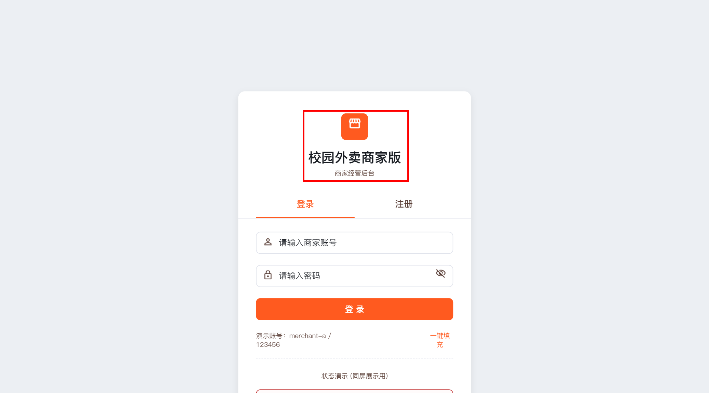 | 橙色圆角店铺图标、主标题"校园外卖商家版"与副标题"商家经营后台"为前端固定文案，不请求接口；页面无侧边栏，浅灰底居中白色卡片布局。                                                                                                                                                                                                                                                                                                                                                                                                                                                                                                                              | 纯展示区域不触发业务请求；未登录访问商家后台一律回到本页。                                                                                                                                                                                                                                                                                        | 图标或字体加载失败保留文字；文案不得与用户端登录页混用（商家登录固定 role=merchant）。                                                                                                                                   |
| 商家登录注册-登录注册选项卡                | 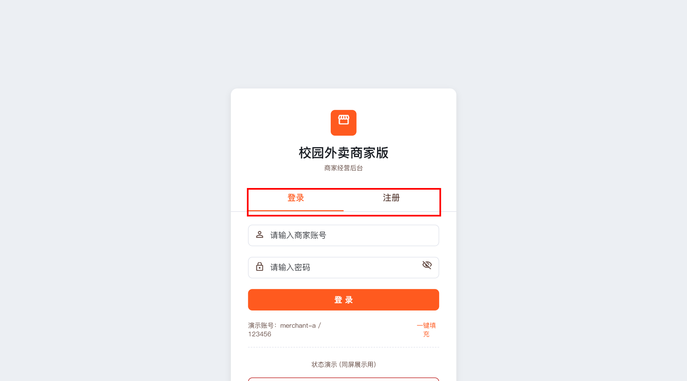 | "登录/注册"双选项卡等宽，默认选中登录（橙色文字+下划线）；当前模式为页面临时状态。注册字段（账号、密码、店铺名称、联系电话等最小集合）由接口契约确定，默认空。                                                                                                                                                                                                                                                                                                                                                                                                                                                                                         | 点击"注册"切换注册表单；注册提交调用商家注册接口（`POST /api/v1/merchants`），注册成功即自动创建店铺并进入后台，初始营业状态固定为 CLOSED；是否需重新登录以最终契约为准；切换选项卡清空不适用输入。                                                                                                                                             | 注册必填与格式检查逐项提示；店铺名为空、账号重复（409）、网络失败分别提示；注册成功但会话未建立时不得进入后台。                                                                                                          |
| 商家登录注册-登录表单区                    | 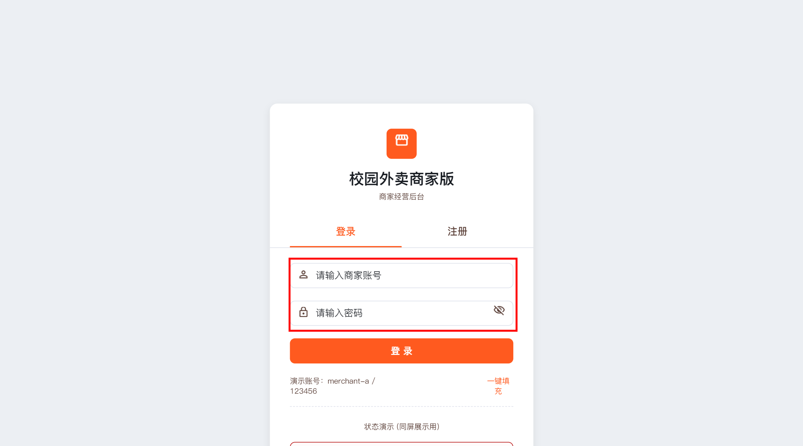 | 商家账号与密码为商家输入，占位文案"请输入商家账号""请输入密码"，密码框带明文切换图标；默认不预填真实密码。登录调用商家登录接口（`POST /api/v1/merchant/auth/login`，role=merchant），不允许用用户账号登录商家端。                                                                                                                                                                                                                                                                                                                                                                                                                                           | 点击登录先做必填检查，再只发送一次请求；请求中按钮禁用；成功建立商家 Session 并按目标地址进入后台；失败保留账号；明文切换只改本地显示。                                                                                                                                                                                                           | 空值、账号不存在、密码错误（401）、网络失败和会话未建立分别提示；重复点击不得产生多个会话；进入后台后需校验商家会话与店铺归属。                                                                                          |
| 商家登录注册-登录按钮                      | 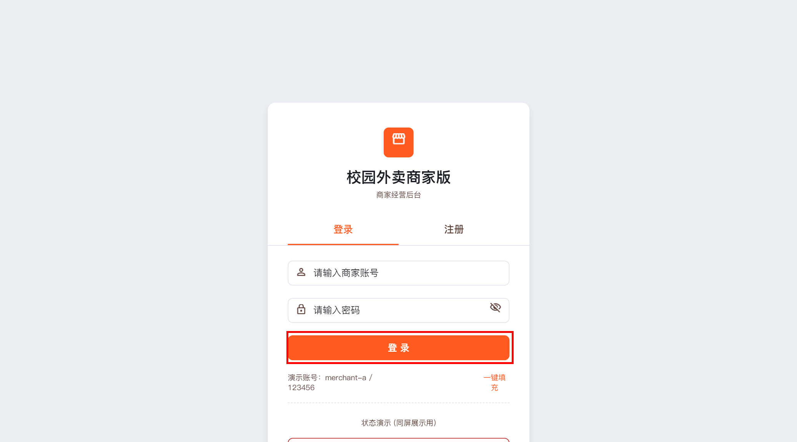 | 橙色通栏主按钮，文案"登 录"，为主题色`#ff5a1f` 的主操作样式。                                                                                                                                                                                                                                                                                                                                                                                                                                                                                                                                                                                               | 提交登录请求；请求中显示处理中并禁用按钮；成功跳转后台默认页（订单管理列表，见 MS-02）。                                                                                                                                                                                                                                                          | 不得用前端写死成功替代接口结果；服务端拒绝时按钮恢复并显示原因；网络失败可重试。                                                                                                                                         |
| 商家登录注册-演示账号提示                  |  | 左侧灰字"演示账号：merchant-a / 123456"与右侧橙色"一键填充"链接；演示账号与契约种子数据一致（商家账号 merchant-a，密码 123456），页面只展示账号，不展示真实密码明文输入。                                                                                                                                                                                                                                                                                                                                                                                                                                                                                     | 点击"一键填充"填入演示账号后仍走真实登录流程，建立真实会话，不绕过接口校验。                                                                                                                                                                                                                                                                      | 演示账号不存在或后端未种子化时提示"演示账号不可用"；请求中按钮禁用；演示数据只用于课程测试，不得作为注册能力证明。                                                                                                       |
| 商家登录注册-状态演示条                    | 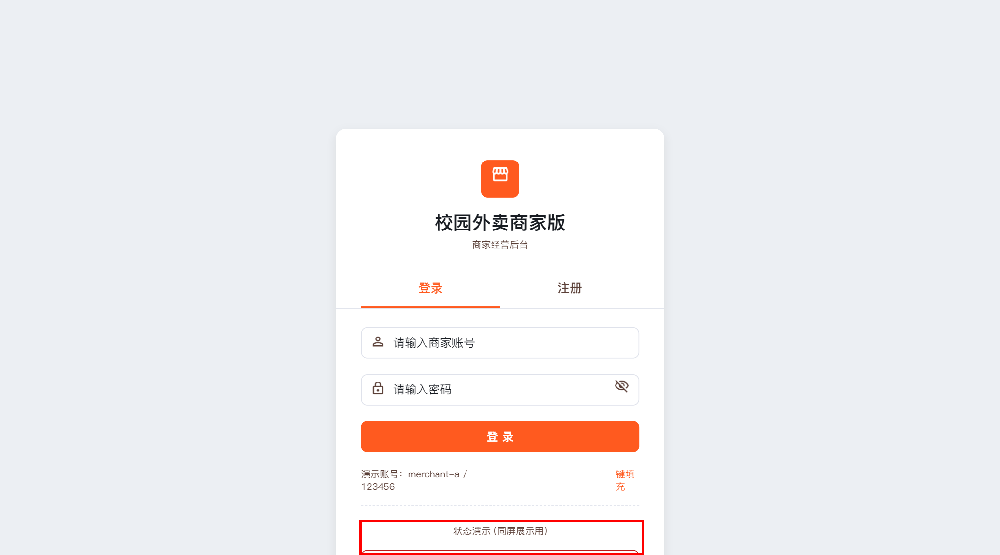 | 灰字"状态演示（同屏展示用）"与其下红色描边演示卡片（截图底边被裁切，仅露出上沿）为设计稿同屏展示加载与错误样式的演示元素，不是真实页面功能。                                                                                                                                                                                                                                                                                                                                                                                                                                                                                                                  | 演示元素不参与交互、不触发请求；实现时本条不落地为页面功能，仅作状态样式参考。                                                                                                                                                                                                                                                                    | 不适用（纯演示区域，无数据与请求）；真实加载与错误状态按登录表单行和统一规则处理。                                                                                                                                       |
| 订单管理列表-左侧导航栏                    | 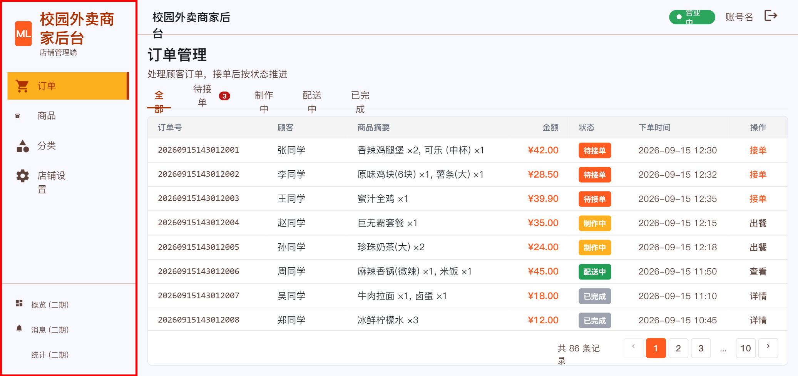 | 固定侧边栏：Logo 方块（"ML"）与标题"校园外卖商家后台"、副标"店铺管理端"为前端品牌固定内容；2026-09-09 决议后导航为**九项平铺**（不分组）：运营概览、订单、商品、分类、优惠配置、评价管理、消息、数据统计、店铺设置，高亮项由路由决定（本屏"订单"）；**评价管理与评价回复合并为一页**（列表 + 回复抽屉），不单独设菜单；设计稿中的置灰项一律改为可点击的一期导航。各屏设计稿 Logo 文字存在生成差异，实现统一为一套品牌区。                                                                                                                                                                                                                                                                                                                                                                 | 点击导航切换对应管理页面；当前项始终高亮且唯一。                                                                                                                                                                                                                                                              | 不适用（公共框架区域，无独立接口请求；加载与错误随所在页面处理）；路由不存在回默认页。                                                                                                                                   |
| 订单管理列表-顶部栏                        | 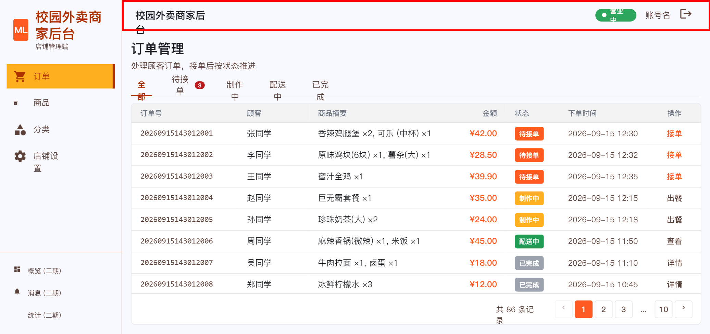 | 左侧栏目标题"校园外卖商家后台"为固定文案；右侧绿色"营业中"状态胶囊来自当前店铺接口`GET /api/v1/merchant/store` 的 status 字段（OPEN/CLOSED/TEMPORARILY_CLOSED 映射营业中/已关店/临时闭店），账号名来自商家会话（`GET /api/v1/merchant/me`），退出为固定入口。                                                                                                                                                                                                                                                                                                                                                                                             | 点击退出清除商家会话并回登录页；营业状态胶囊在状态修改成功后随店铺数据同步刷新；账号区纯展示。                                                                                                                                                                                                                                                    | 店铺状态读取失败显示占位并随页面数据重试；会话失效统一跳登录并保留目标地址。                                                                                                                                             |
| 订单管理列表-页面标题区                    | 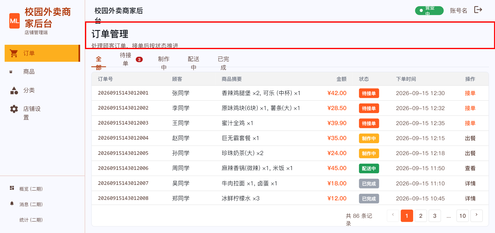 | 大标题"订单管理"与副标题"处理顾客订单，接单后按状态推进"为固定文案；订单状态推进属已选 P1 商家订单推进扩展（演示高光）。                                                                                                                                                                                                                                                                                                                                                                                                                                                                                                                                      | 纯展示区域不触发请求。                                                                                                                                                                                                                                                                                                                            | 不适用（固定文案区域）；文案不得暗示拒单、取消、退款、骑手等本期不做能力。                                                                                                                                               |
| 订单管理列表-订单状态选项卡                | 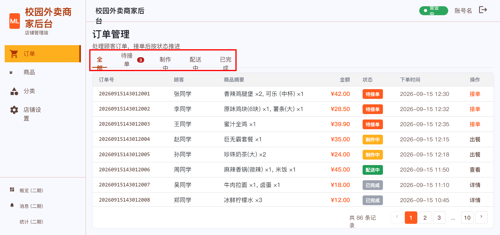 | 状态页签：全部/待接单/制作中/配送中/已完成/已取消，默认"全部"，与契约 PENDING/COOKING/DELIVERING/COMPLETED/CANCELLED 对应。切换时携带 status 参数调用`GET /api/v1/merchant/orders`。注：设计稿中待接单页签的红色数量角标经 2026-09-01 评审决议**不实现**（按状态计数接口不纳入本期契约），页签仅显示文字，不做数量徽标。                                                                                                                                                                                                                                                                                                                                               | 点击页签切换筛选并重新请求本店订单；请求完成前禁止旧结果覆盖新结果。                                                                                                                                                                                                                                                                              | 切换筛选期间显示加载态；请求失败保留当前页签并可重试；无权访问的订单不得出现在任何页签结果中。                                                                                                                           |
| 订单管理列表-订单数据表格                  | 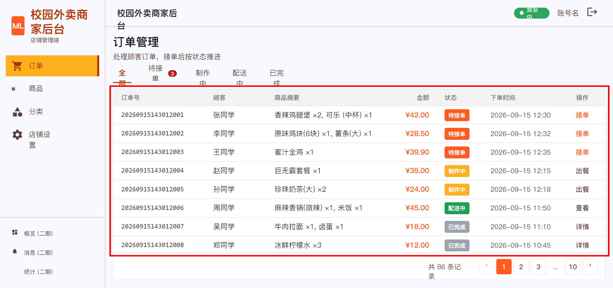 | 表头列：订单号、顾客、商品摘要、金额、状态、下单时间、操作，各列均为订单列表接口后端返回值；状态标签：待接单（橙红）/制作中（黄）/配送中（绿）/已完成（灰）；操作列随状态变化：待接单→"接单"、制作中→"出餐"、配送中→"查看"、已完成→"详情"；金额保留两位小数；图中 8 行订单（20260915143012001~12008）为课程演示数据。注：示例下单时间"2026-09-15 12:30"省略秒，实现按契约统一为`yyyy-MM-dd HH:mm:ss`。                                                                                                                                                                                                                                                  | 点击"接单/出餐"调用`PATCH /api/v1/merchant/orders/{orderId}/status`，按契约 PENDING→COOKING→DELIVERING→COMPLETED 合法顺序推进（已选 P1 扩展，演示高光）；"查看/详情"打开订单详情抽屉（见 MS-03）；操作成功刷新列表与角标；配送中与已完成行不再提供推进按钮，"完成"推进按钮位于订单详情内。                                                   | 首次加载与切换筛选显示表格骨架；空结果显示对应空态（见 MS-20）；订单被其他操作修改时后端返回 409，页面提示"数据已变化，请刷新后重试"；跳过状态和重复推进被拒绝；拒单、取消、退款和骑手本期不做，操作列不得出现相应入口。 |
| 订单管理列表-分页器                        | 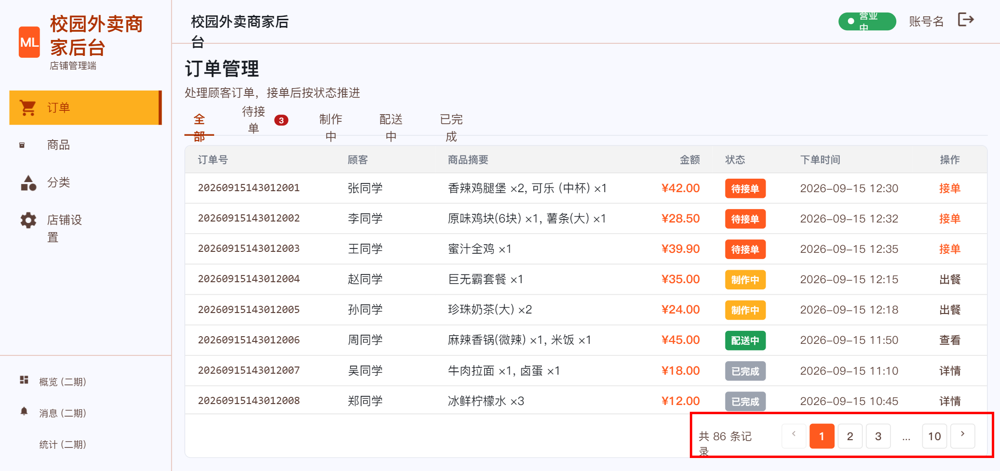 | 左侧"共 86 条记录"总条数来自订单列表接口返回，页码 1/2/3/…/10 为演示数据；分页参数按契约列表接口分页约定携带。                                                                                                                                                                                                                                                                                                                                                                                                                                                                                                                                               | 点击页码或前后翻页按当前 status 筛选重新请求对应页；切换筛选后回到第一页。                                                                                                                                                                                                                                                                        | 总条数为 0 时显示空态而不是空分页；请求失败保留当前页；页码与总数以后端返回为准，不得前端写死总数。                                                                                                                      |
| 订单详情抽屉-背景订单列表页                | 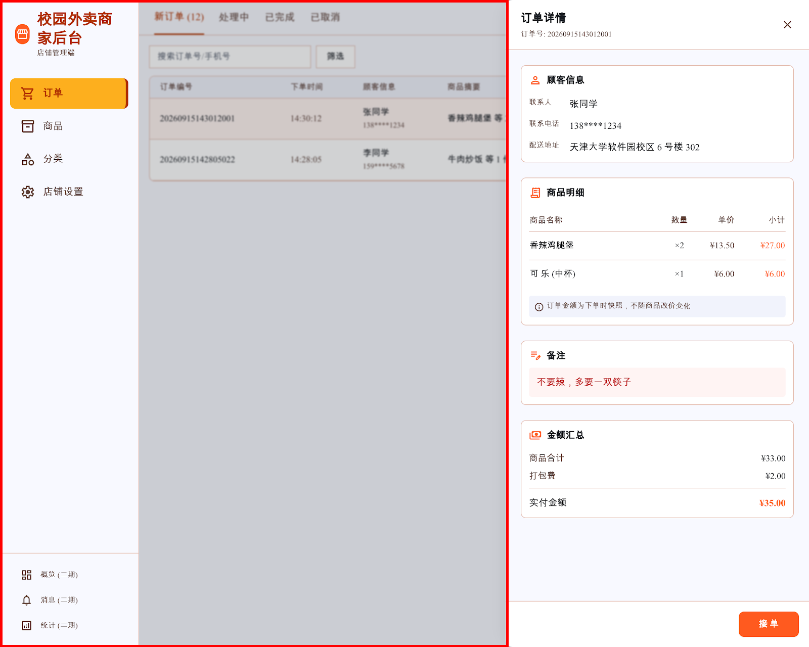 | 被遮罩压暗的订单列表为抽屉打开态背景：Tab"新订单（12）/处理中/已完成/已取消"、搜索框"搜索订单号/手机号"、筛选按钮与表格列"订单编号/下单时间/顾客信息/商品摘要"均为设计稿示意，顾客手机号脱敏展示。注：经 2026-09-01 评审决议，该背景仅为弹窗底图、不实现独立交互：Tab 与搜索框不实现，实际筛选口径以 MS-02 与契约为准；"已取消"状态本期实现（简化取消订单已纳入本期）；"手机号搜索"不做；背景列下单时间应按契约显示完整`yyyy-MM-dd HH:mm:ss`。                                                                                                                                                                                                                    | 打开抽屉时背景列表不可操作；关闭抽屉后恢复；背景实现以 MS-02 订单页为准。                                                                                                                                                                                                                                                                         | 见整行说明（背景区域的加载、空态、错误口径与 MS-02 各区域行一致）。                                                                                                                                                      |
| 订单详情抽屉-订单详情抽屉                  | 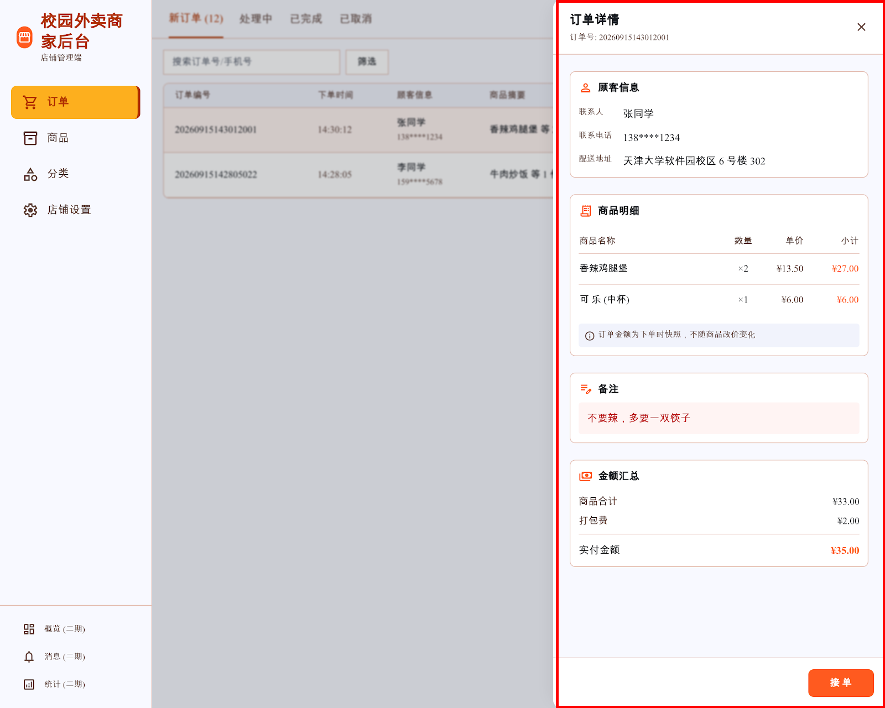 | 右侧整高白色抽屉：头部标题"订单详情"、副文"订单号: 20260915143012001"与右上角"×"关闭；主体纵向排布顾客信息/商品明细/备注/金额汇总四张卡片；订单数据来自`GET /api/v1/merchant/orders/{orderId}`；图中订单号为演示数据。                                                                                                                                                                                                                                                                                                                                                                                                                                     | 点击列表行或操作列"查看"打开抽屉；点击"×"或遮罩关闭并回到列表；打开时按订单编号请求详情。                                                                                                                                                                                                                                                        | 抽屉加载显示骨架；订单不存在或无权限时关闭抽屉并提示；网络失败可重试；订单状态已变化返回 409 提示刷新。                                                                                                                  |
| 订单详情抽屉-顾客信息卡                    | 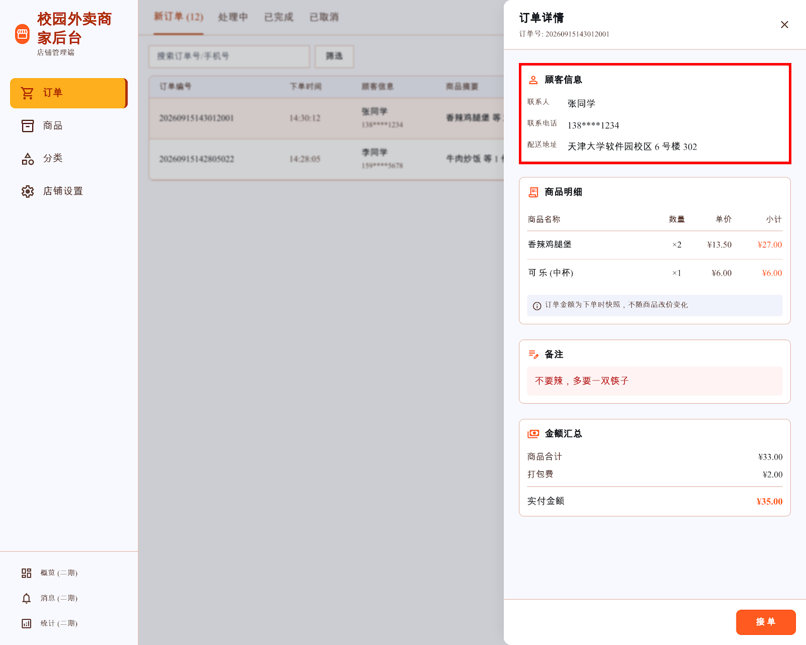 | 卡片标题"顾客信息"；字段行：联系人 张同学、联系电话 138****1234（脱敏展示）、配送地址 天津大学北洋园校区 6 号楼 302；均来自订单详情接口的收货人与地址快照（示例值为演示数据）；地址为下单时快照，不随用户后续改地址变化。                                                                                                                                                                                                                                                                                                                                                                                                                                     | 纯展示卡片，不提供修改入口；复制联系方式只影响本地。                                                                                                                                                                                                                                                                                              | 字段缺失显示"暂无"并记录检查问题，不显示`undefined` 或 `null`；无权访问的订单不渲染本卡。                                                                                                                            |
| 订单详情抽屉-商品明细卡                    | 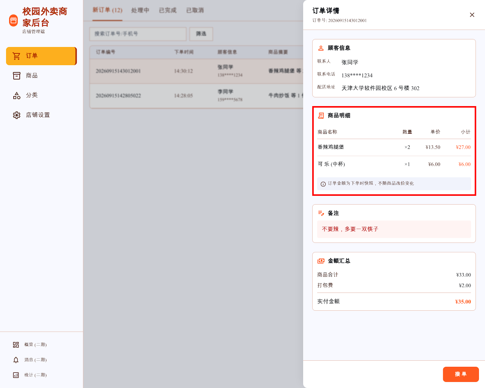 | 卡片标题"商品明细"；明细表列：商品名称、数量、单价、小计（示例：香辣鸡腿堡 ×2 ¥13.50 小计 ¥27.00、可乐（中杯）×1 ¥6.00 小计 ¥6.00，均为演示数据）；数据来自订单详情接口的商品明细快照；底部灰底提示"订单金额为下单时快照，不随商品改价变化。"。                                                                                                                                                                                                                                                                                                                                                                                                         | 纯展示；明细行不支持跳转商品或改价；小计与合计以后端返回为准，前端只展示不计算。                                                                                                                                                                                                                                                                  | 明细为空显示"暂无商品明细"并记录检查问题（正常订单不应为空）；金额字段缺失显示暂无金额；加载失败可重试。                                                                                                                 |
| 订单详情抽屉-备注卡                        | 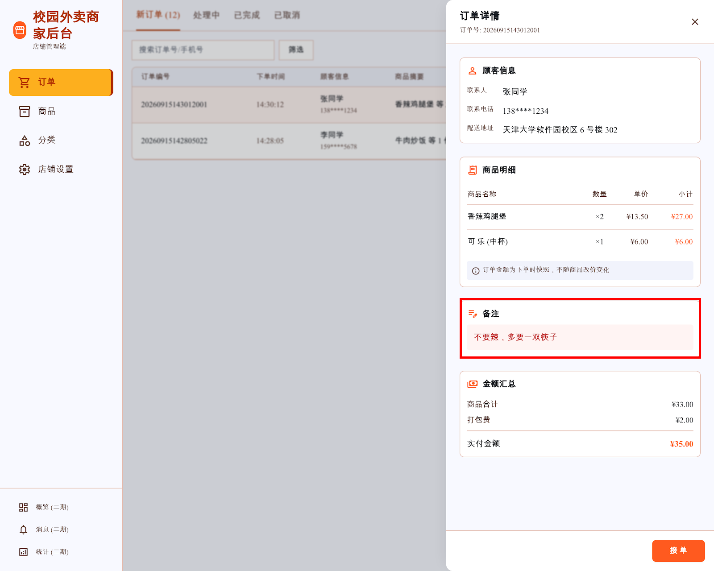 | 卡片标题"备注"与浅红底文本块展示订单备注（示例"不要辣，多要一双筷子"为演示数据），来自订单详情接口的备注快照。                                                                                                                                                                                                                                                                                                                                                                                                                                                                                                                                                | 纯展示，不支持商家修改备注。                                                                                                                                                                                                                                                                                                                      | 备注为空时显示"无备注"或整卡隐藏，不显示`undefined` 或 `null`。                                                                                                                                                      |
| 订单详情抽屉-金额汇总卡                    | 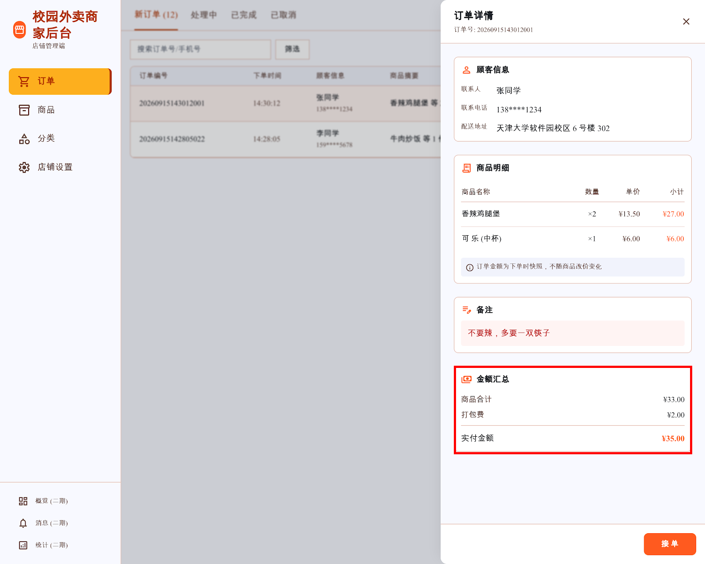 | 卡片标题"金额汇总"；汇总行：商品合计 ¥33.00、打包费 ¥2.00、实付金额 ¥35.00（橙色加粗）为演示数据，金额来自订单详情接口的金额字段（订单保存金额快照）。金额构成经 2026-09-01 评审决议**引入打包费**：每单打包费固定 ¥2.00（演示口径），由后端在创建订单时计入订单金额（实付金额 = 商品合计 + 打包费），并随订单金额快照保存；2026-09-09 决议后金额快照新增 `deliveryFee`，**商家端订单详情金额汇总与用户端一致按四行展示**（商品合计 / 打包费 / 配送费 / 实付金额），配送费为 0 时仍显示该行（¥0.00）；后端接口契约 §3.5/§5 与用户端确认订单页金额口径已同步。                                                                                                                                                                                               | 纯展示；金额以后端返回为准，前端不自行计算或叠加。                                                                                                                                                                                                                                                                                                | 金额字段缺失显示暂无金额；明细小计之和与合计对不上时记录检查问题。                                                                                                                                                       |
| 订单详情抽屉-抽屉底部操作区                | 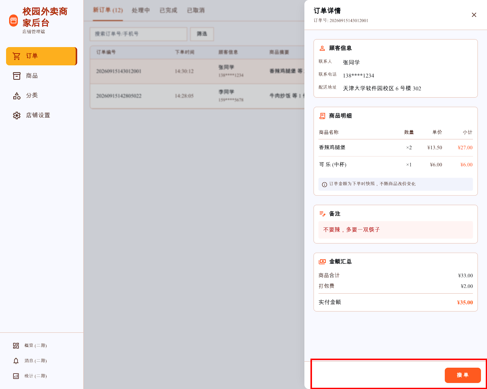 | 底部右侧橙色主按钮"接单"，按钮由订单当前状态决定：待接单→"接单"、制作中→"出餐"、配送中→"完成"、已完成→无按钮，属已选 P1 订单推进扩展（演示高光）；调用`PATCH /api/v1/merchant/orders/{orderId}/status`。                                                                                                                                                                                                                                                                                                                                                                                                                                                | 点击按钮按契约合法顺序推进状态；操作成功刷新抽屉与背景列表；推进支持重复请求幂等；状态不允许时按钮不出现。                                                                                                                                                                                                                                        | 请求中按钮禁用；状态已变化返回 409，提示"数据已变化，请刷新后重试"后刷新；跳过状态和重复推进被拒绝并提示原因。                                                                                                           |
| 商品列表-左侧导航栏                        | 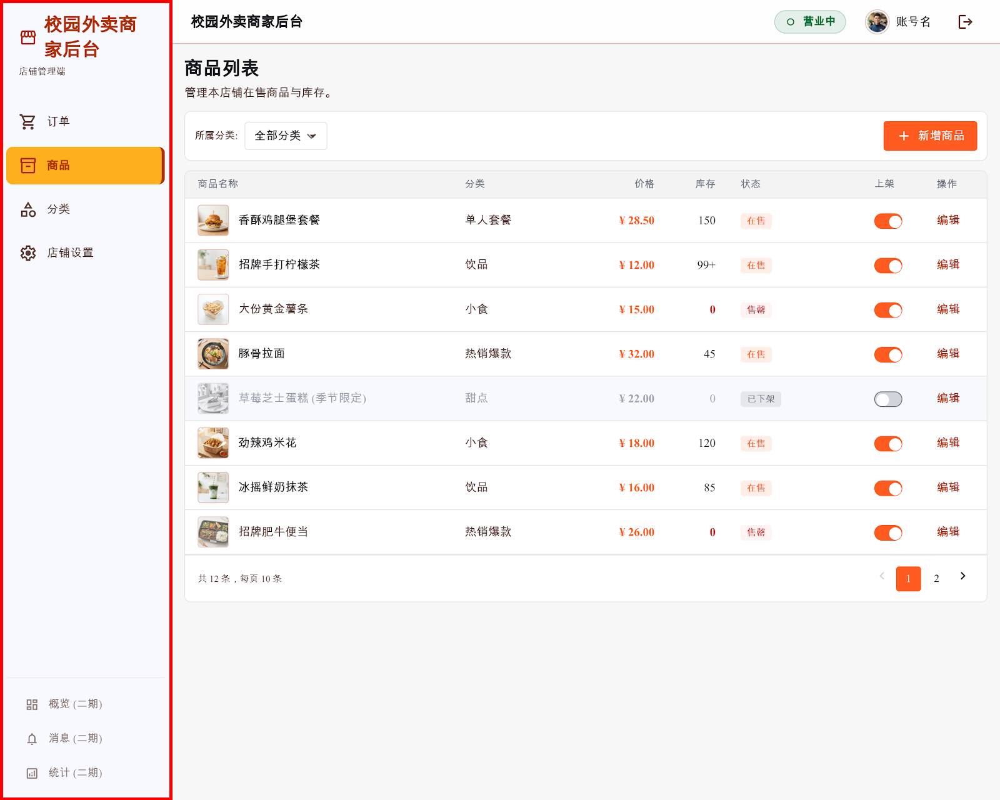 | 同 MS-02-01 公共侧边栏（七项一期导航，无置灰项），本屏"商品"高亮；品牌区实现统一口径同 MS-02-01。                                                                                                                                                                                                                                                                                                                                                                                                                                                                                                                                                        | 点击导航切换页面，行为同 MS-02-01。                                                                                                                                                                                                                                                                                                               | 不适用（公共框架区域，无独立接口请求；加载与错误随所在页面处理）。                                                                                                                                                       |
| 商品列表-顶部栏                            | 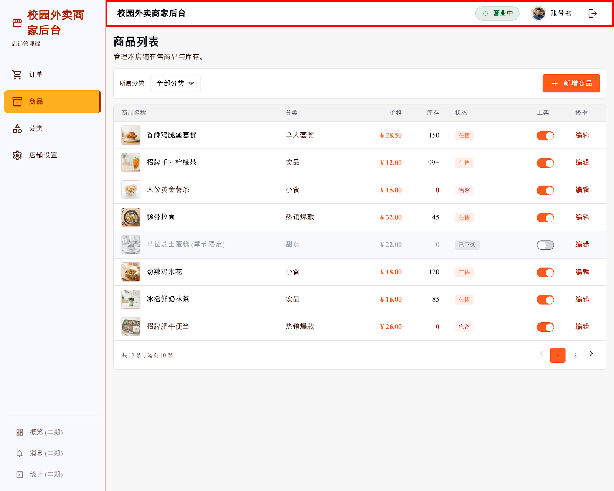 | 同 MS-02-02 公共顶栏（后台标题、营业中胶囊、账号名、退出入口）；营业状态随本页店铺数据刷新。                                                                                                                                                                                                                                                                                                                                                                                                                                                                                                                                                                  | 行为同 MS-02-02。                                                                                                                                                                                                                                                                                                                                 | 不适用（公共框架区域；状态读取失败随页面数据重试）。                                                                                                                                                                     |
| 商品列表-页面标题区                        | 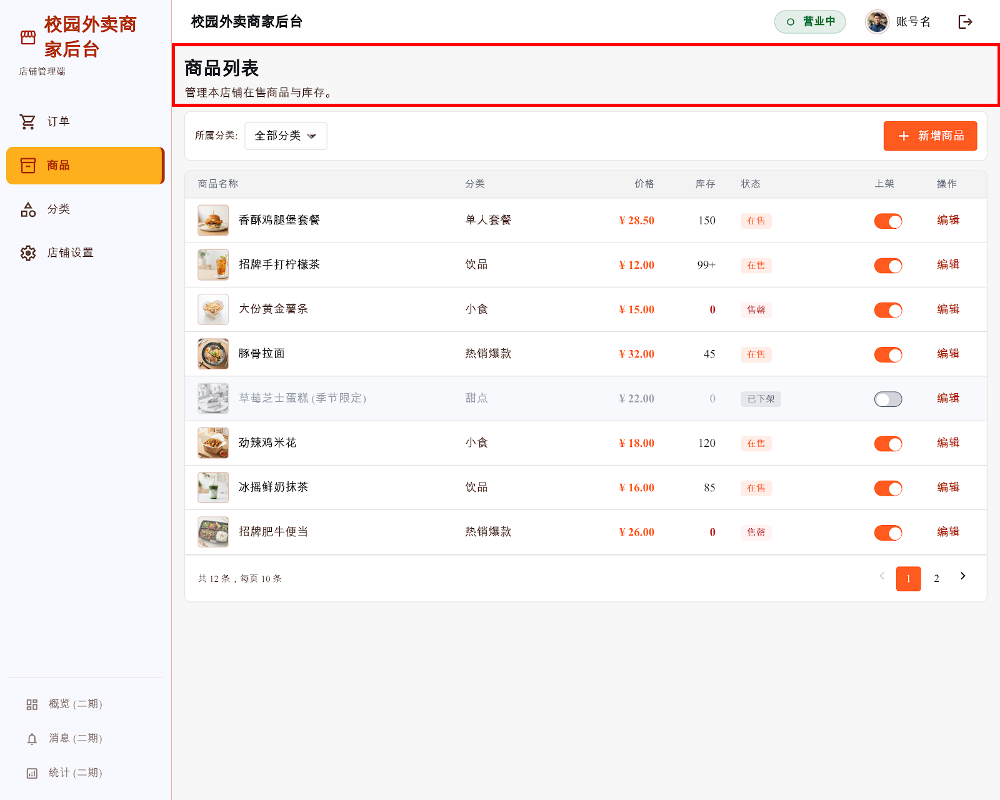 | 标题"商品列表"与副标题"管理本店铺在售商品与库存。"为固定文案。                                                                                                                                                                                                                                                                                                                                                                                                                                                                                                                                                                                                | 纯展示。                                                                                                                                                                                                                                                                                                                                          | 不适用（固定文案区域）。                                                                                                                                                                                                 |
| 商品列表-筛选工具栏                        | 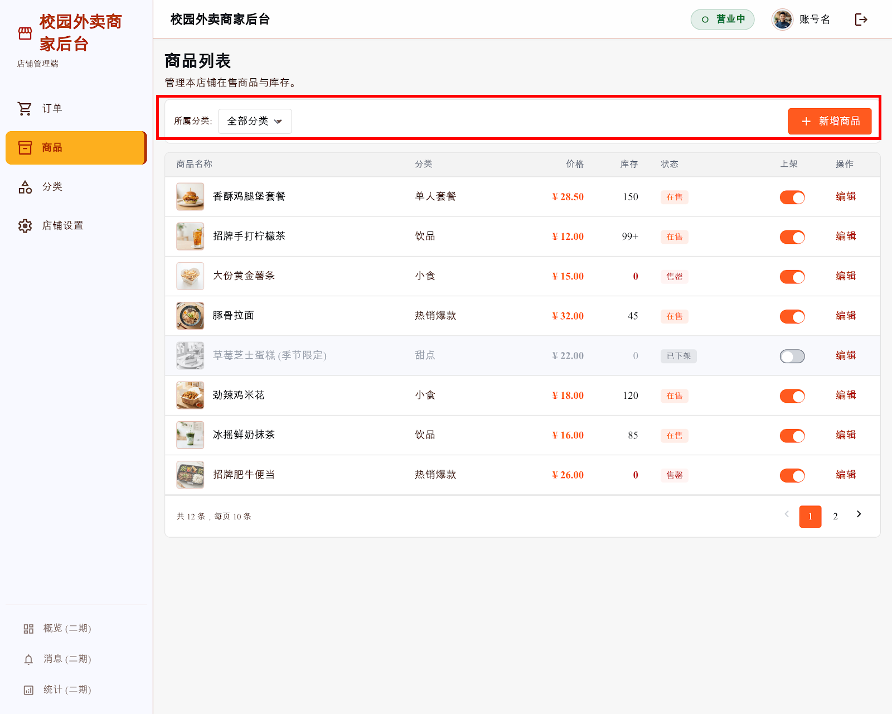 | 左侧"所属分类"标签与"全部分类"下拉，分类选项来自`GET /api/v1/merchant/categories`，默认"全部分类"；右侧橙色主按钮"+ 新增商品"；示例分类（单人套餐/饮品/小食/热销爆款/甜点）与 MS-11 分类管理一致，为演示数据。                                                                                                                                                                                                                                                                                                                                                                                                                                              | 点击分类筛选重新请求商品列表；点击"新增商品"进入空白商品编辑表单（见 MS-08）。                                                                                                                                                                                                                                                                    | 分类加载失败时下拉区显示重试；筛选请求完成前禁止连续切换导致旧结果覆盖新结果。                                                                                                                                           |
| 商品列表-商品数据表格                      | 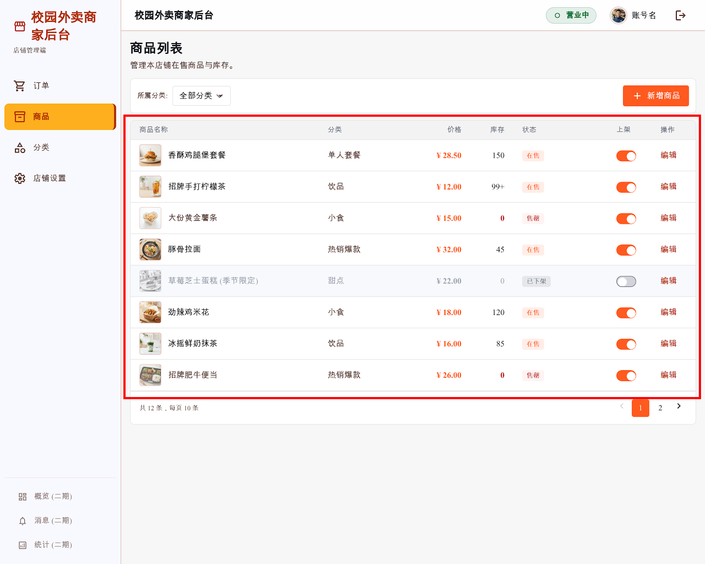 | 列：商品名称（缩略图+名称）、分类、价格（橙色）、库存、状态、上架（开关）、操作（编辑/删除），来自`GET /api/v1/merchant/products`；价格单位元保留两位小数，库存为非负整数；状态标签：在售（浅橙）/售罄（浅红，库存红色 0）/已下架（灰，整行灰化且开关为关）；图中 8 行商品与"共 12 条"为课程演示数据。注：库存"99+"为展示封顶写法，实现按后端原值展示；"销量"列在本稿未出现（该列本无契约字段依据），实现以契约为准；缩略图按图片上传接口返回的图片地址展示（图片上传本期实现）；操作列的"删除"为 2026-09-01 评审决议新增（红色，仅下架状态商品可删，见契约 DELETE 商品接口）。                                                                                                       | 点击行内"编辑"进入商品编辑表单（见 MS-08）；点击"删除"弹出二次确认，确认后调用`DELETE /api/v1/merchant/products/{productId}`，仅下架状态商品可删除，在售商品需先下架；"上架"开关直接调用 `PATCH /api/v1/merchant/products/{productId}/availability`；库存为 0 的商品用户端显示售罄并禁止加购。                                                | 首次加载显示表格骨架（见 MS-06）；空列表显示空态与"新增商品"入口（见 MS-05）；接口失败可重试；上下架请求中该行开关禁用；商品被删除或无权限时移除并提示。                                                                 |
| 商品列表-分页器                            | 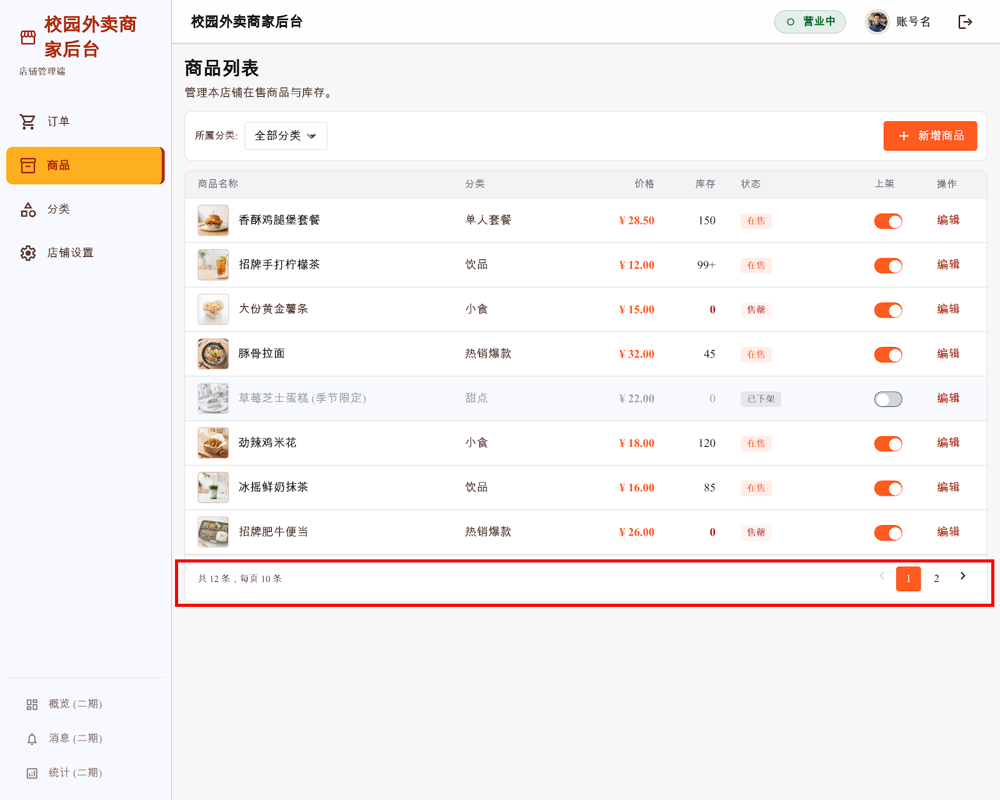 | "共 12 条，每页 10 条"：总条数来自商品列表接口，"每页 10 条"为固定页大小（图中数据为演示）。                                                                                                                                                                                                                                                                                                                                                                                                                                                                                                                                                                  | 翻页按当前分类筛选重新请求对应页；切换筛选后回到第一页。                                                                                                                                                                                                                                                                                          | 空结果不显示分页；请求失败保留当前页；页码与总数以后端返回为准。                                                                                                                                                         |
| 商品列表空状态-左侧导航栏                  | 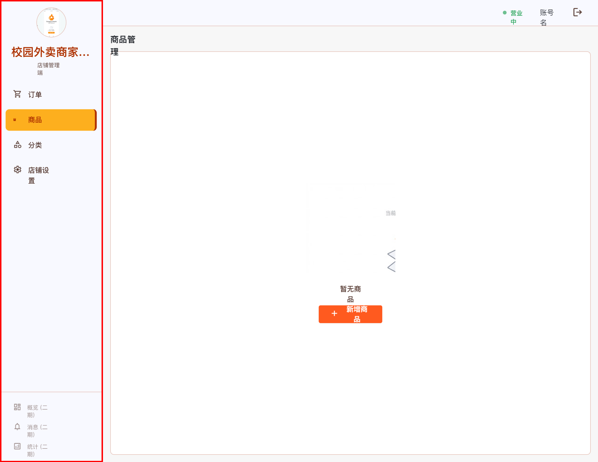 | 同 MS-02-01 公共侧边栏，本屏"商品"高亮。                                                                                                                                                                                                                                                                                                                                                                                                                                                                                                                                                                                                                      | 行为同 MS-02-01。                                                                                                                                                                                                                                                                                                                                 | 不适用（公共框架区域）。                                                                                                                                                                                                 |
| 商品列表空状态-顶部栏                      | 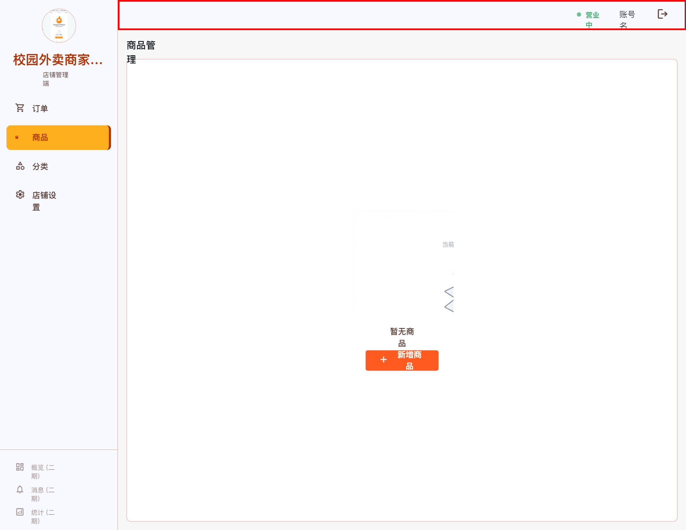 | 同 MS-02-02 公共顶栏（营业中胶囊、账号名、退出入口）。                                                                                                                                                                                                                                                                                                                                                                                                                                                                                                                                                                                                        | 行为同 MS-02-02。                                                                                                                                                                                                                                                                                                                                 | 不适用（公共框架区域）。                                                                                                                                                                                                 |
| 商品列表空状态-页面标题区                  | 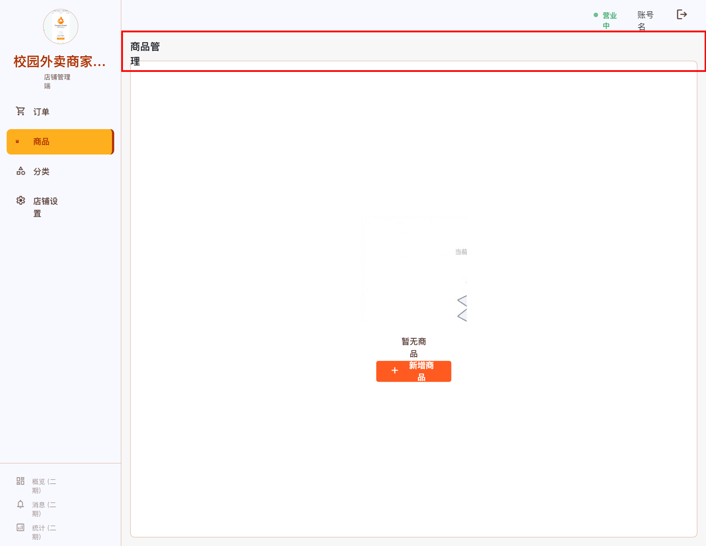 | 页面标题"商品管理"（窄容器换行为两行属设计稿排版差异），无副标题；标题文案实现时与 MS-04 的"商品列表"统一。                                                                                                                                                                                                                                                                                                                                                                                                                                                                                                                                                   | 纯展示。                                                                                                                                                                                                                                                                                                                                          | 不适用（固定文案区域）。                                                                                                                                                                                                 |
| 商品列表空状态-空态插画与提示              | 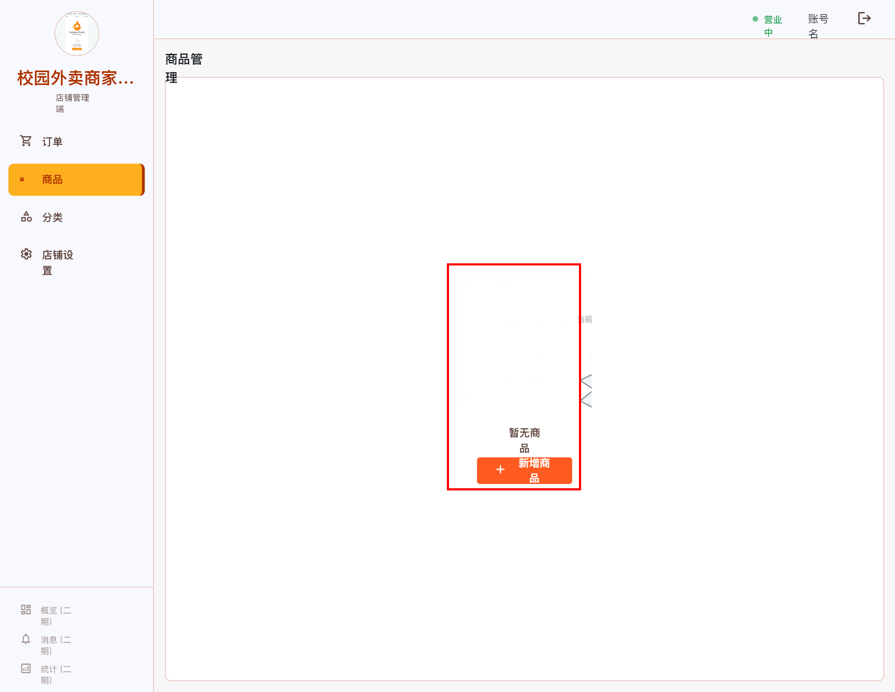 | 内容区居中空态：浅色店铺插画（图中含零散残缺字符与代码符号，为设计稿素材未完整加载，实现使用干净占位插画）、文案"暂无商品"与橙色主按钮"+ 新增商品"；空态来自商品接口返回空数组，不得用演示数据静默填充。                                                                                                                                                                                                                                                                                                                                                                                                                                                      | 点击"新增商品"进入空白商品表单（见 MS-08）。                                                                                                                                                                                                                                                                                                      | 空态不是接口错误；网络失败时显示重试入口而不是空态；字段缺失不显示`undefined` 或 `null`。                                                                                                                            |
| 商品列表加载骨架-左侧导航栏                | 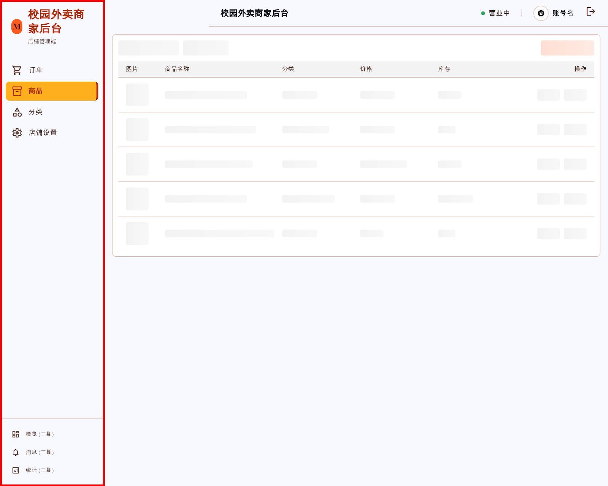 | 同 MS-02-01 公共侧边栏，本屏"商品"高亮；骨架屏中侧边栏与顶栏正常渲染。                                                                                                                                                                                                                                                                                                                                                                                                                                                                                                                                                                                        | 行为同 MS-02-01。                                                                                                                                                                                                                                                                                                                                 | 不适用（公共框架区域）。                                                                                                                                                                                                 |
| 商品列表加载骨架-顶部栏                    | 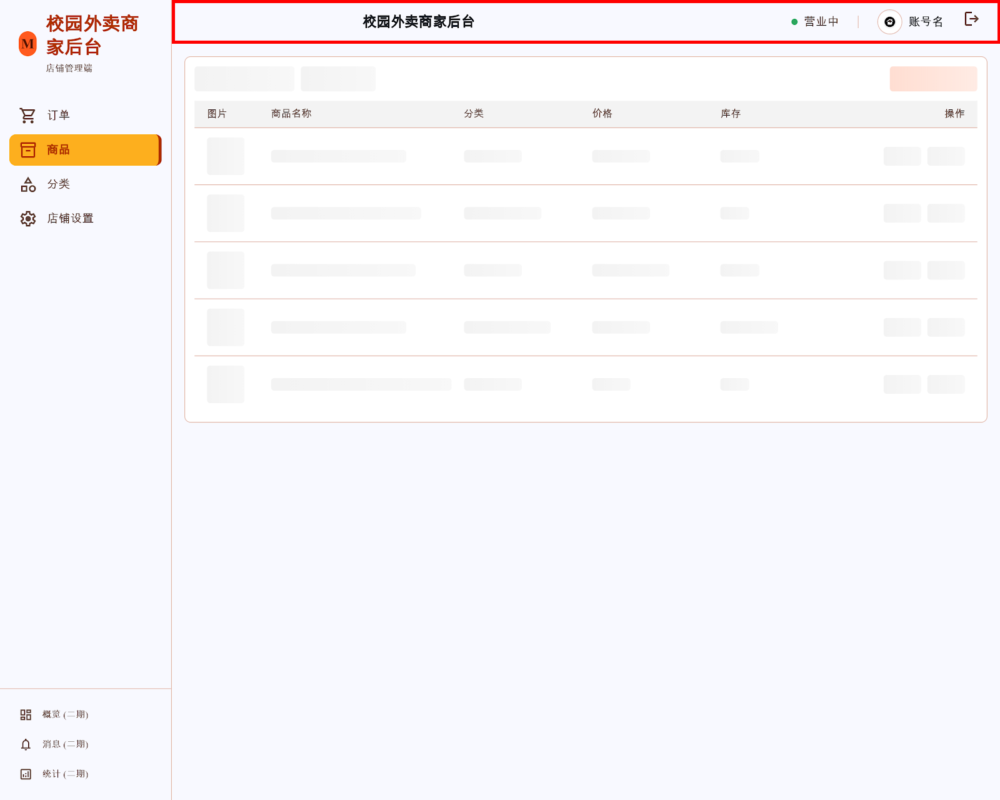 | 同 MS-02-02 公共顶栏。                                                                                                                                                                                                                                                                                                                                                                                                                                                                                                                                                                                                                                        | 行为同 MS-02-02。                                                                                                                                                                                                                                                                                                                                 | 不适用（公共框架区域）。                                                                                                                                                                                                 |
| 商品列表加载骨架-筛选工具栏骨架            | 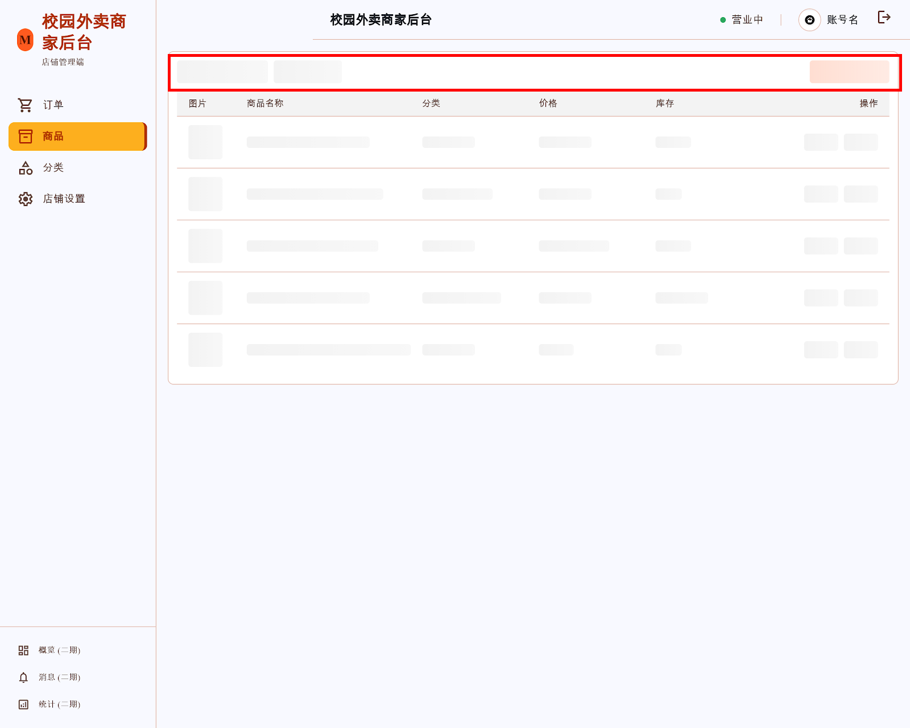 | 左侧两块灰色圆角占位条对应"所属分类"下拉等筛选控件，右侧浅橙色圆角占位块对应"+ 新增商品"主按钮；为首次加载态示意。                                                                                                                                                                                                                                                                                                                                                                                                                                                                                                                                            | 骨架仅在首次加载或切换筛选时出现，请求结束后替换为真实工具栏，不能永久停留在加载状态。                                                                                                                                                                                                                                                            | 与统一规则 2 一致：刷新已加载列表时保留已显示内容并在列表区域显示加载态；加载失败提供重试。                                                                                                                              |
| 商品列表加载骨架-表格列头                  | 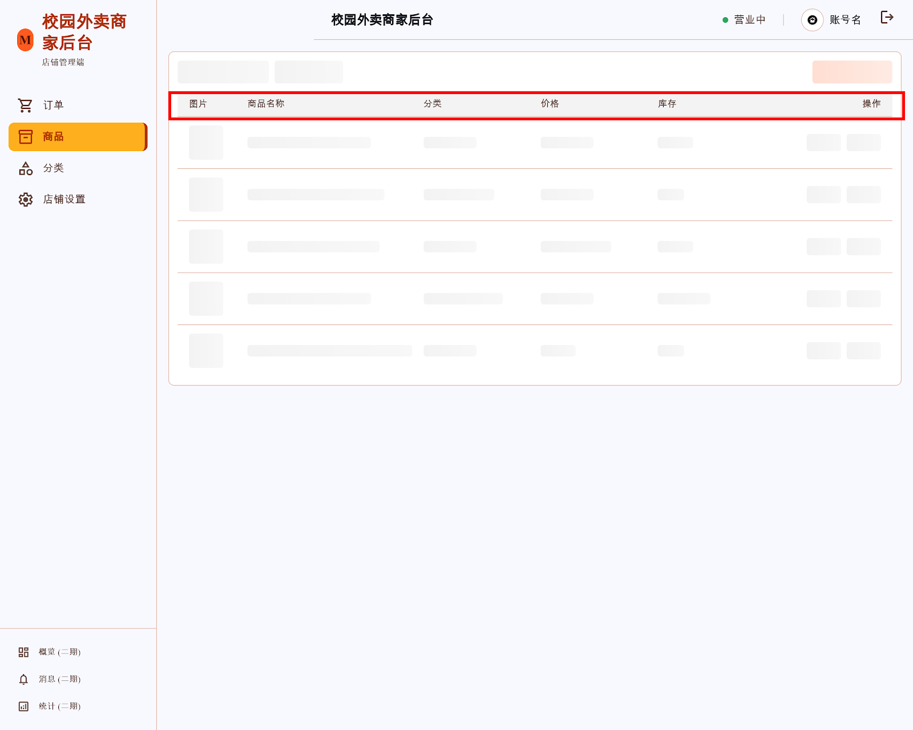 | 真实文字表头：图片、商品名称、分类、价格、库存、操作。注：骨架表头缺"状态/上架"两列，与 MS-04 实际列不完全一致，实现以 MS-04 列结构为准。                                                                                                                                                                                                                                                                                                                                                                                                                                                                                                                     | 表头在加载期间即渲染，行数据区显示骨架条。                                                                                                                                                                                                                                                                                                        | 表头列结构以 MS-04 为准，不得以骨架表头作为最终列数依据。                                                                                                                                                                |
| 商品列表加载骨架-表格行骨架区              | 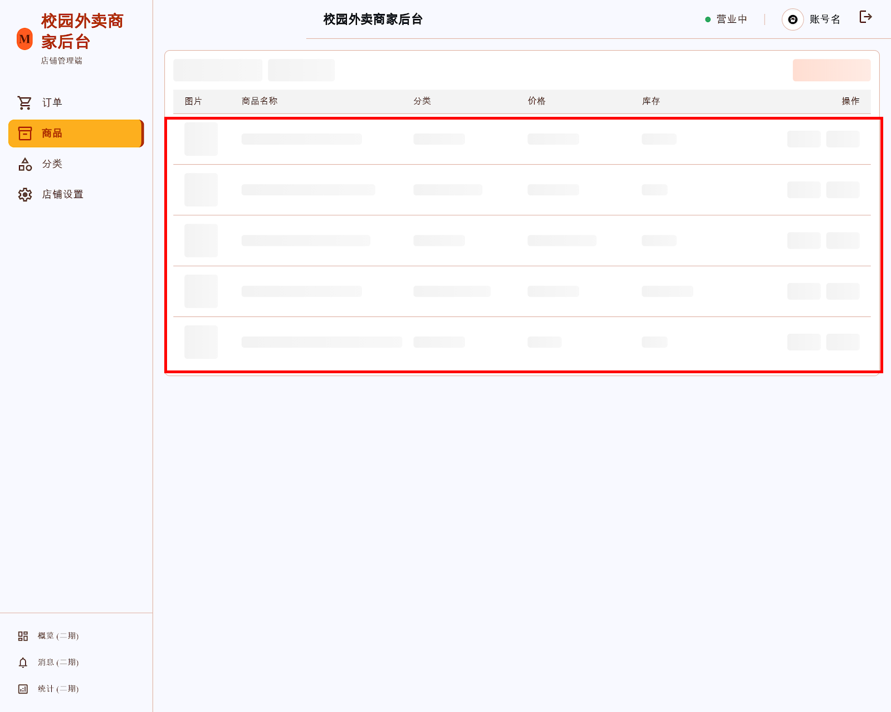 | 5 行灰色骨架占位：每行为图片小方块+商品名称长条+分类短条+价格条+库存短条+操作区两个小方块，行间浅色横线分隔；行数仅为示意。                                                                                                                                                                                                                                                                                                                                                                                                                                                                                                                                   | 请求结束后替换为真实数据行；加载失败显示重试入口。                                                                                                                                                                                                                                                                                                | 骨架不能永久停留；不得把骨架误当作空态。                                                                                                                                                                                 |
| 商品列表Toast提示-背景商品列表页           | 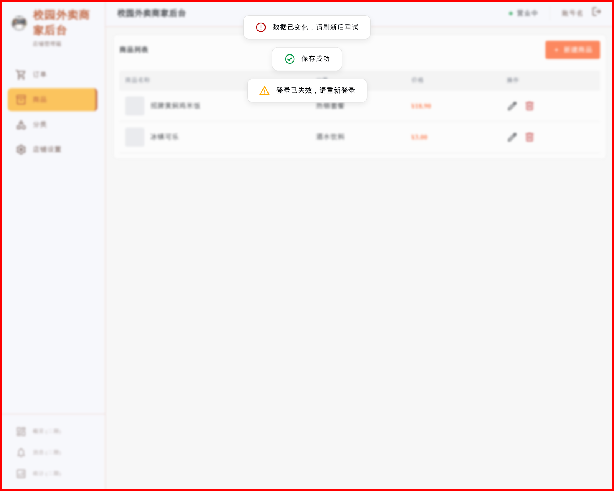 | 模糊置灰的商品列表为 Toast 演示背景：可见行"蒜香美味鸡柳堡/热销爆款/¥38.00""冰镇可乐/¥3.00"为演示数据，行尾为编辑铅笔与红色删除图标。经 2026-09-01 评审决议**纳入删除商品能力**：新增 `DELETE /api/v1/merchant/products/{productId}`（仅下架状态商品可删除，在售商品需先下架；删除需二次确认；历史订单因保存商品快照不受影响）；商品列表操作列相应增加"删除"（红色，见 MS-04 行）。                                                                                                                                                                                                                                                                 | 背景仅衬托 Toast，不承载独立交互。                                                                                                                                                                                                                                                                                                                | 见整行说明（背景区域的加载、空态、错误口径与 MS-04 各区域行一致）。                                                                                                                                                      |
| 商品列表Toast提示-数据变化提示条           | 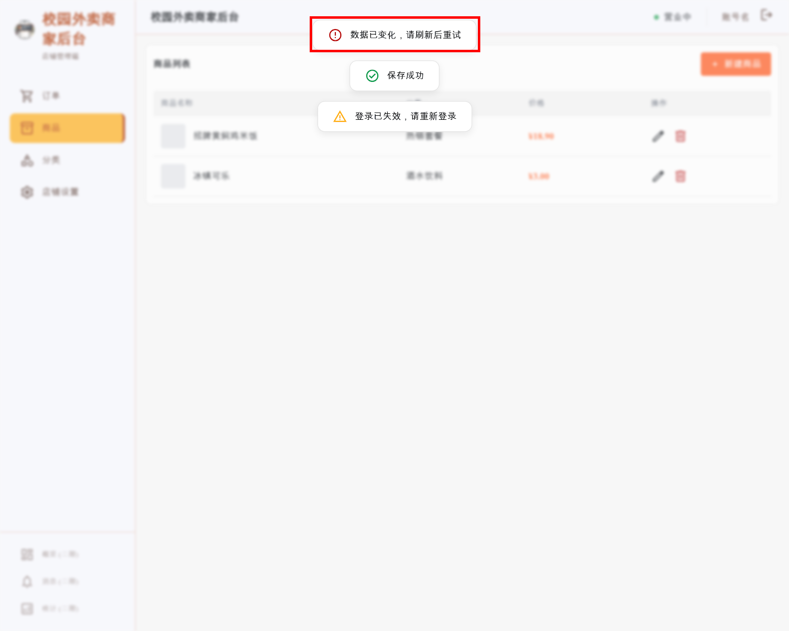 | 白色圆角 Toast：红色圆形感叹号图标+文字"数据已变化，请刷新后重试"，文案与契约第 7 节 409 提示逐字一致。                                                                                                                                                                                                                                                                                                                                                                                                                                                                                                                                                       | 对应 409 冲突场景：出现后重新读取相关数据；Toast 为轻提示，不阻断页面。                                                                                                                                                                                                                                                                           | 同一按钮重复点击只产生一次请求；提示消失后以刷新后的数据为准。                                                                                                                                                           |
| 商品列表Toast提示-保存成功提示条           | 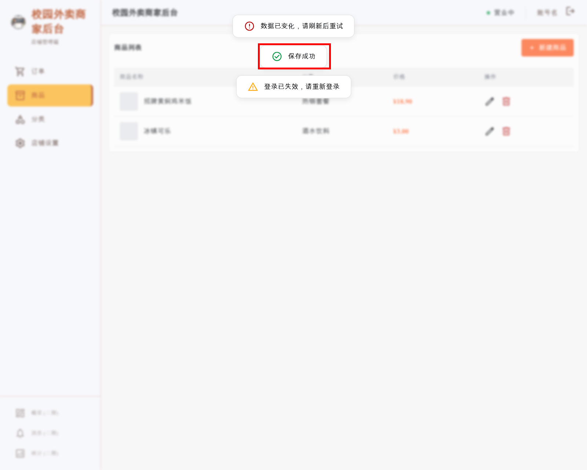 | 白色圆角 Toast：绿色圆形对勾图标+文字"保存成功"，对应商品保存或上下架成功结果。                                                                                                                                                                                                                                                                                                                                                                                                                                                                                                                                                                               | 出现后刷新当前列表与受影响数据；操作失败不得提前显示成功提示。                                                                                                                                                                                                                                                                                    | 不能只显示 Toast 而不刷新数据；请求结束前不得显示成功。                                                                                                                                                                  |
| 商品列表Toast提示-登录失效提示条           | 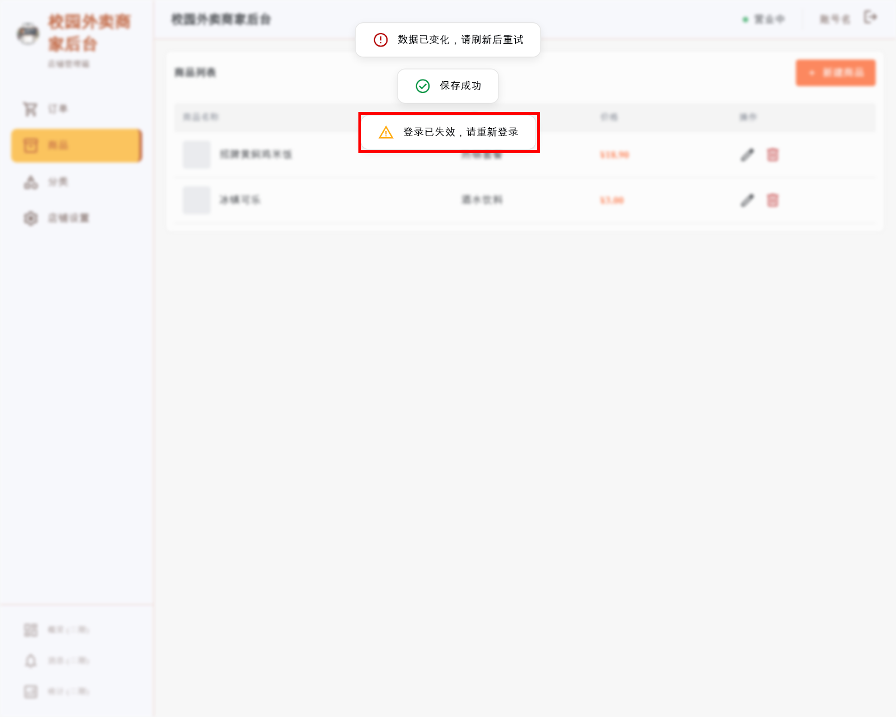 | 白色圆角 Toast：黄色三角形警告图标+文字"登录已失效，请重新登录"，对应 401 会话失效。                                                                                                                                                                                                                                                                                                                                                                                                                                                                                                                                                                          | 出现后清除会话、保留目标地址跳转登录页。                                                                                                                                                                                                                                                                                                          | 会话失效按统一规则处理；不得在会话失效后继续提交请求。                                                                                                                                                                   |
| 商品编辑-左侧导航栏                        | 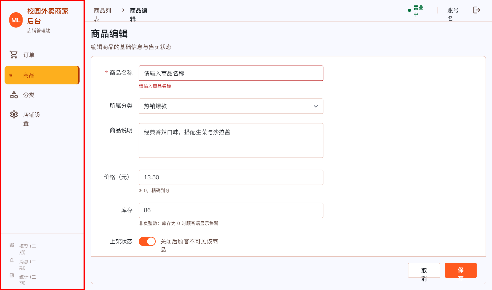 | 同 MS-02-01 公共侧边栏，本屏"商品"高亮。                                                                                                                                                                                                                                                                                                                                                                                                                                                                                                                                                                                                                      | 行为同 MS-02-01。                                                                                                                                                                                                                                                                                                                                 | 不适用（公共框架区域）。                                                                                                                                                                                                 |
| 商品编辑-面包屑顶部栏                      | 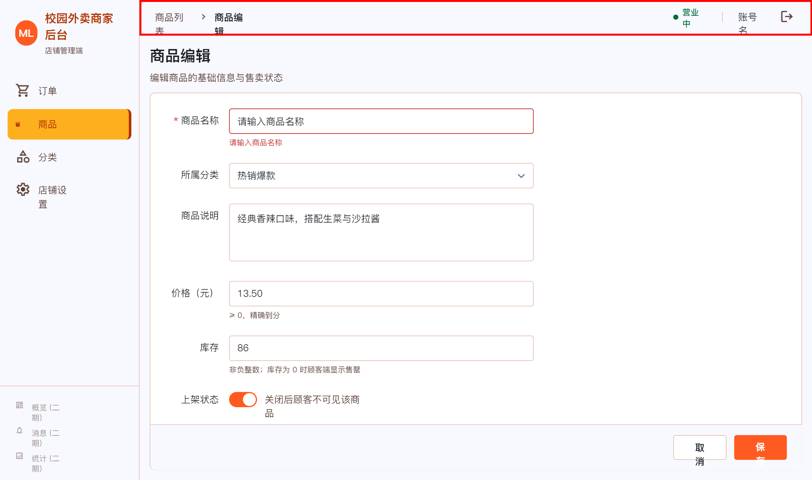 | 面包屑"商品列表 > 商品编辑"（当前级加粗）；右侧"营业中"胶囊、账号名、退出图标同 MS-02-02。                                                                                                                                                                                                                                                                                                                                                                                                                                                                                                                                                                    | 点击面包屑"商品列表"返回列表；离开前若有未保存修改先确认（见 MS-09、MS-19）。                                                                                                                                                                                                                                                                     | 不适用（导航元素）；返回路径失败留在本页并提示。                                                                                                                                                                         |
| 商品编辑-页面标题区                        | 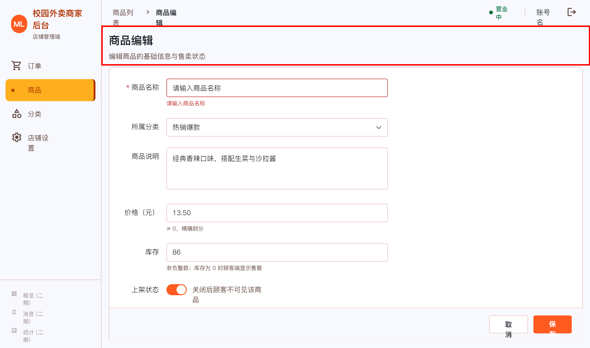 | 标题"商品编辑"与副标题"编辑商品的基础信息与售卖状态"为固定文案；本页由列表"编辑"或"新增商品"进入。                                                                                                                                                                                                                                                                                                                                                                                                                                                                                                                                                            | 纯展示。                                                                                                                                                                                                                                                                                                                                          | 不适用（固定文案区域）。                                                                                                                                                                                                 |
| 商品编辑-商品编辑表单                      | 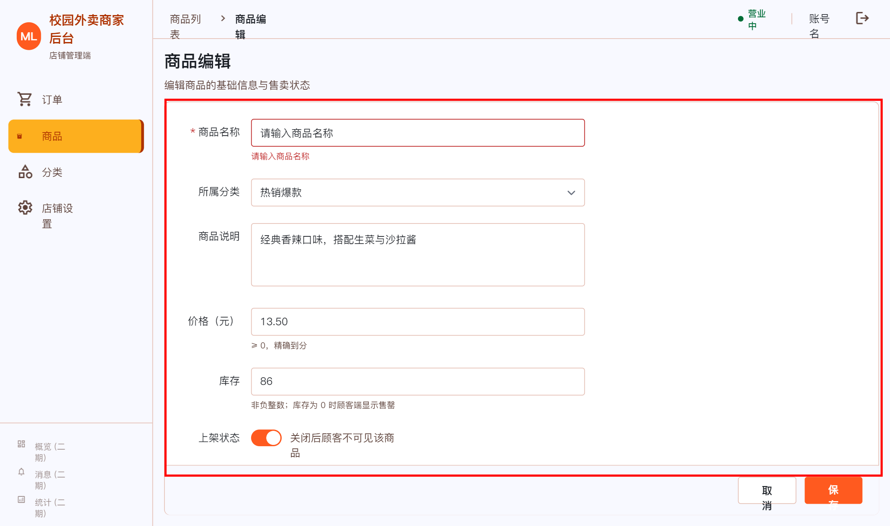 | 字段：*商品名称（必填；图中红框与红字"请输入商品名称"为校验失败示例态）、所属分类（下拉，选项来自当前商家分类接口，示例值"热销爆款"）、商品说明（多行文本域）、价格（元）（辅助说明"≥ 0，精确到分"）、库存（辅助说明"非负整数；库存为 0 时顾客端显示售罄"）、上架状态（开关）；新增模式默认空，编辑模式读取`GET /api/v1/merchant/products/{productId}` 最新值，保存调用新增或修改商品接口；示例值"13.50/86"为演示数据。注：开关说明文案"关闭后顾客不可见该商品"与契约"下架商品不得展示为可购买状态"存在措辞差异，实现按契约口径；表单含图片、会员价、标签与规格字段（2026-09-09 决议全部纳入本期）；实现可采用独立页或 Modal 弹窗，字段一致。 | 修改表单只改变本地草稿；切换上架状态只在保存成功后生效；保存先前端校验再提交，成功返回商品列表并刷新；取消放弃草稿，有未保存修改时先确认（见 MS-09）。                                                                                                                                                                                            | 名称、分类、价格必填，价格大于等于 0 且精确到分，库存为非负整数，逐项提示并定位字段；分类被删除或商品被他人修改时保存失败并要求刷新（409）；保存中按钮禁用。                                                             |
| 商品编辑-表单操作按钮组                    | 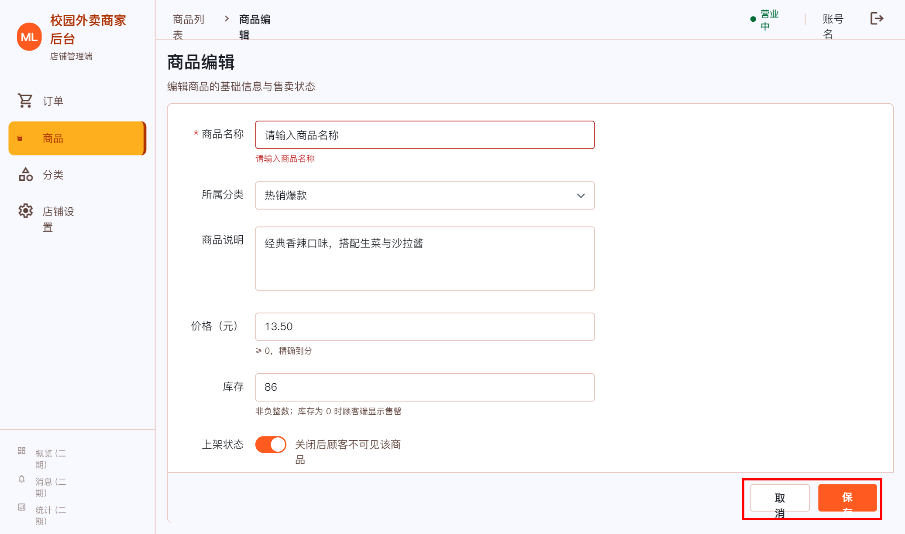 | 卡片右下角"取消"白底描边按钮+"保存"橙色主按钮（图中按钮过窄导致文字竖排换行，属设计稿排版瑕疵）。                                                                                                                                                                                                                                                                                                                                                                                                                                                                                                                                                             | 点击"保存"提交表单；点击"取消"放弃草稿，有未保存修改时先弹确认（见 MS-09）。                                                                                                                                                                                                                                                                      | 保存请求中按钮禁用防重复提交；保存成功后用户端重新读取才显示变化；失败保留表单输入。                                                                                                                                     |
| 商品编辑放弃编辑确认-背景商品编辑页        | 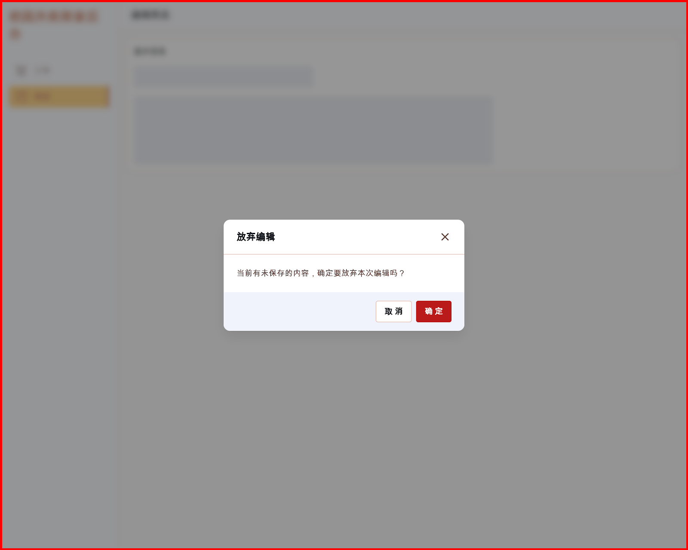 | 模糊置灰的商品编辑页为弹窗背景示意：侧边栏"商品"高亮、面包屑与标题、表单输入框与大面积多行文本域轮廓。                                                                                                                                                                                                                                                                                                                                                                                                                                                                                                                                                        | 弹窗期间背景不可操作。                                                                                                                                                                                                                                                                                                                            | 见整行说明（背景区域口径与 MS-08 各区域行一致）。                                                                                                                                                                        |
| 商品编辑放弃编辑确认-放弃编辑确认弹窗      | 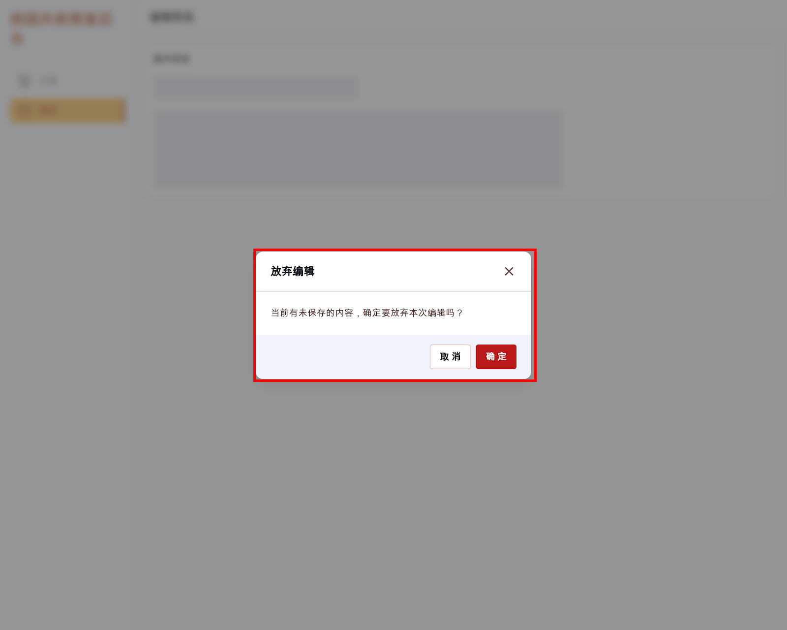 | 白色圆角居中弹窗：标题"放弃编辑"+右上角"×"关闭，标题下分隔线，正文"当前有未保存的内容，确定要放弃本次编辑吗？"。                                                                                                                                                                                                                                                                                                                                                                                                                                                                                                                                             | 点击"确定"放弃本地草稿并返回商品列表；点击"取消"或关闭按钮留在编辑页；表单无修改时直接返回不弹窗。                                                                                                                                                                                                                                                | 弹窗期间禁止底层页面操作；放弃编辑不发起任何接口请求；放弃后再次进入使用新的空表单。                                                                                                                                     |
| 商品编辑放弃编辑确认-弹窗按钮组            | 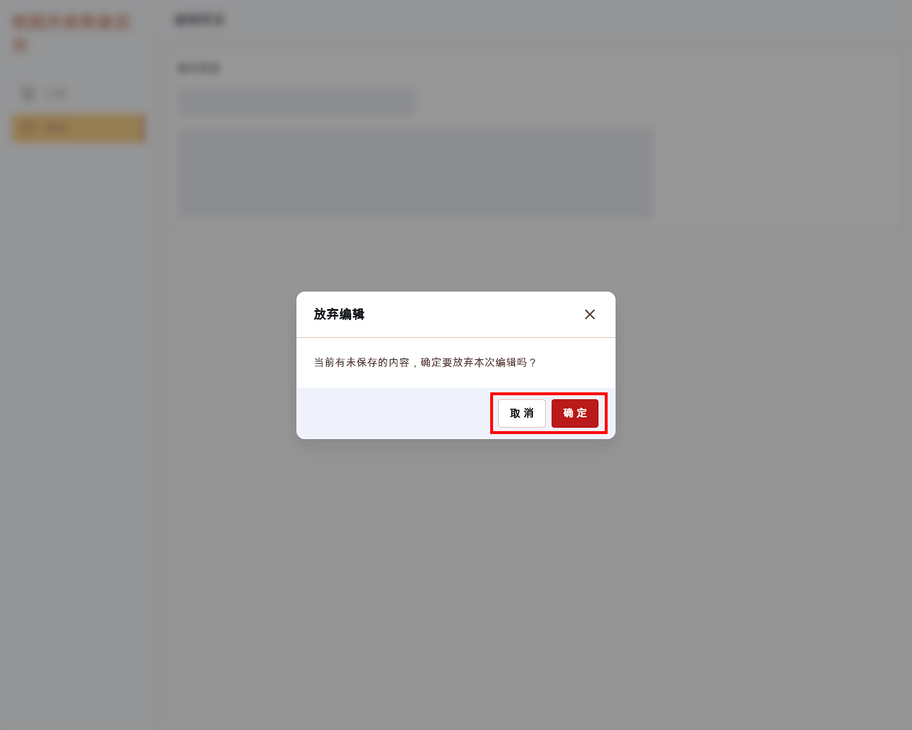 | "取 消"白底描边按钮+"确定"红色主按钮；危险确认使用语义红色而非主题橙。                                                                                                                                                                                                                                                                                                                                                                                                                                                                                                                                                                                        | 点击"确定"放弃草稿返回列表，点击"取消"保留编辑。                                                                                                                                                                                                                                                                                                  | 按钮无请求行为；不适用网络与加载状态。                                                                                                                                                                                   |
| 商品编辑加载骨架-左侧导航栏                | 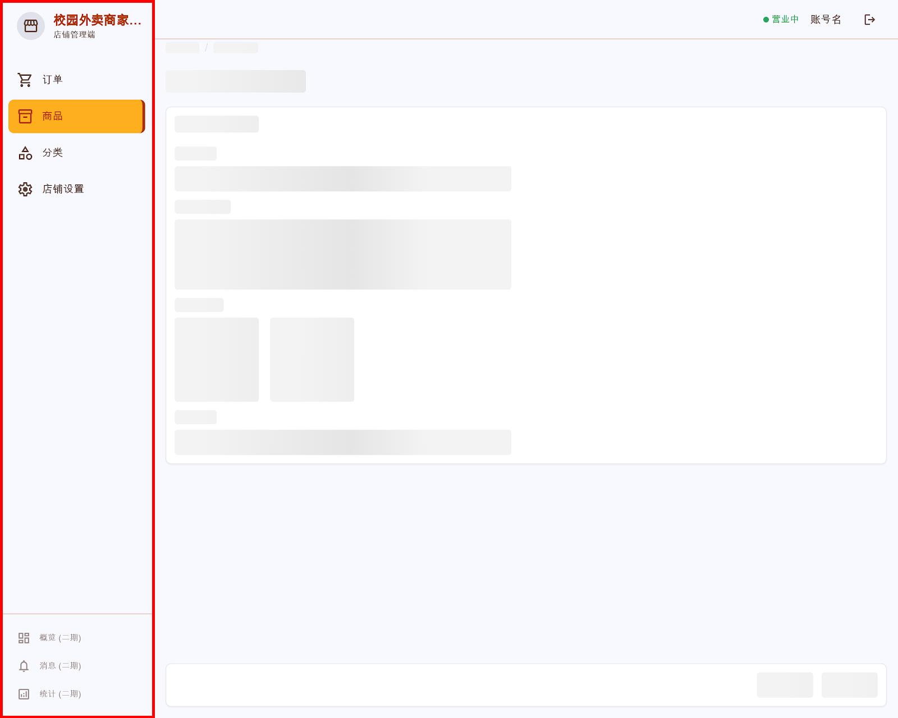 | 同 MS-02-01 公共侧边栏，本屏"商品"高亮。                                                                                                                                                                                                                                                                                                                                                                                                                                                                                                                                                                                                                      | 行为同 MS-02-01。                                                                                                                                                                                                                                                                                                                                 | 不适用（公共框架区域）。                                                                                                                                                                                                 |
| 商品编辑加载骨架-顶部栏                    | 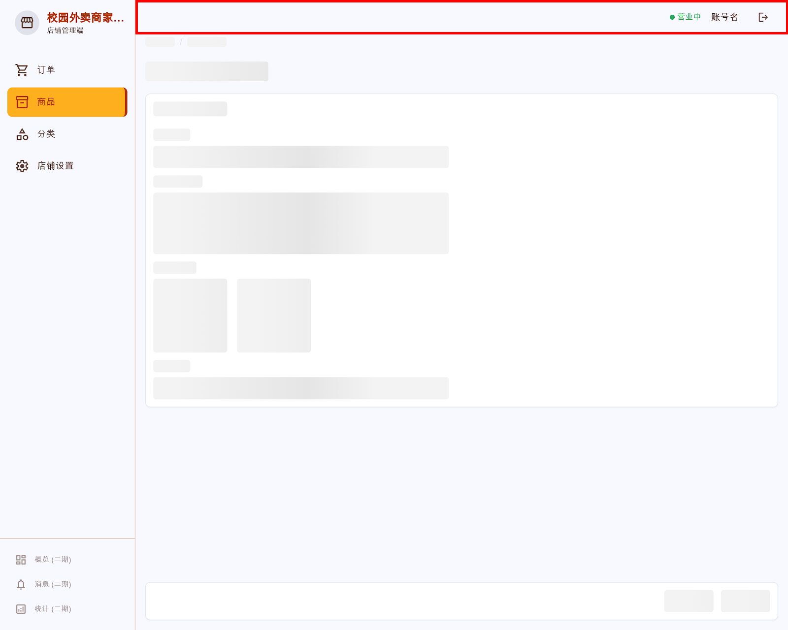 | 同 MS-02-02 公共顶栏。                                                                                                                                                                                                                                                                                                                                                                                                                                                                                                                                                                                                                                        | 行为同 MS-02-02。                                                                                                                                                                                                                                                                                                                                 | 不适用（公共框架区域）。                                                                                                                                                                                                 |
| 商品编辑加载骨架-面包屑与标题骨架          | 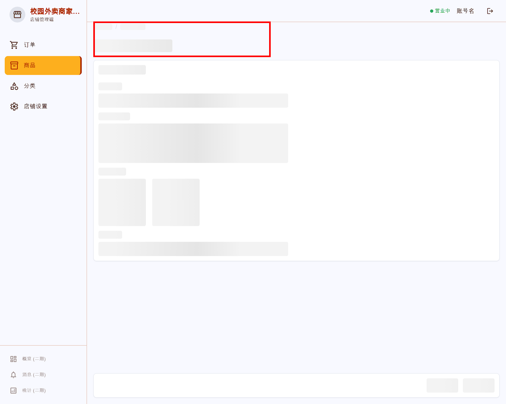 | 面包屑位置两块灰色小占位条中间夹"/"分隔符，下方一块大灰色圆角占位条对应页面标题；为编辑数据读取完成前的加载态示意。                                                                                                                                                                                                                                                                                                                                                                                                                                                                                                                                           | 加载结束后替换为真实面包屑与标题，不能永久停留。                                                                                                                                                                                                                                                                                                  | 加载失败提供重试或返回商品列表。                                                                                                                                                                                         |
| 商品编辑加载骨架-表单骨架区                | 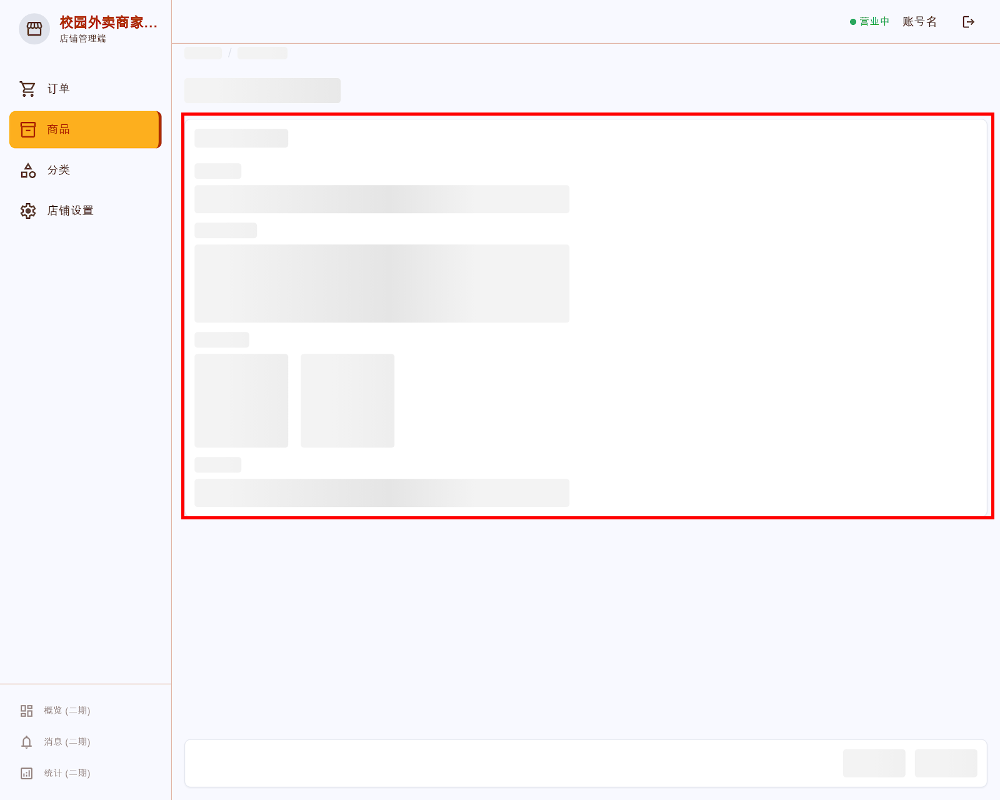 | 白色圆角卡片内的表单骨架：字段标签短条、输入框长条、大块多行文本域占位、两列并排方块（价格/库存字段位置）、底部通栏长条（上架状态行位置），均以深浅灰块占位。                                                                                                                                                                                                                                                                                                                                                                                                                                                                                                 | 编辑数据读取完成后替换为真实表单。                                                                                                                                                                                                                                                                                                                | 不得把骨架状态误当作空表单提交；加载失败提供重试。                                                                                                                                                                       |
| 商品编辑加载骨架-底部操作条骨架            | 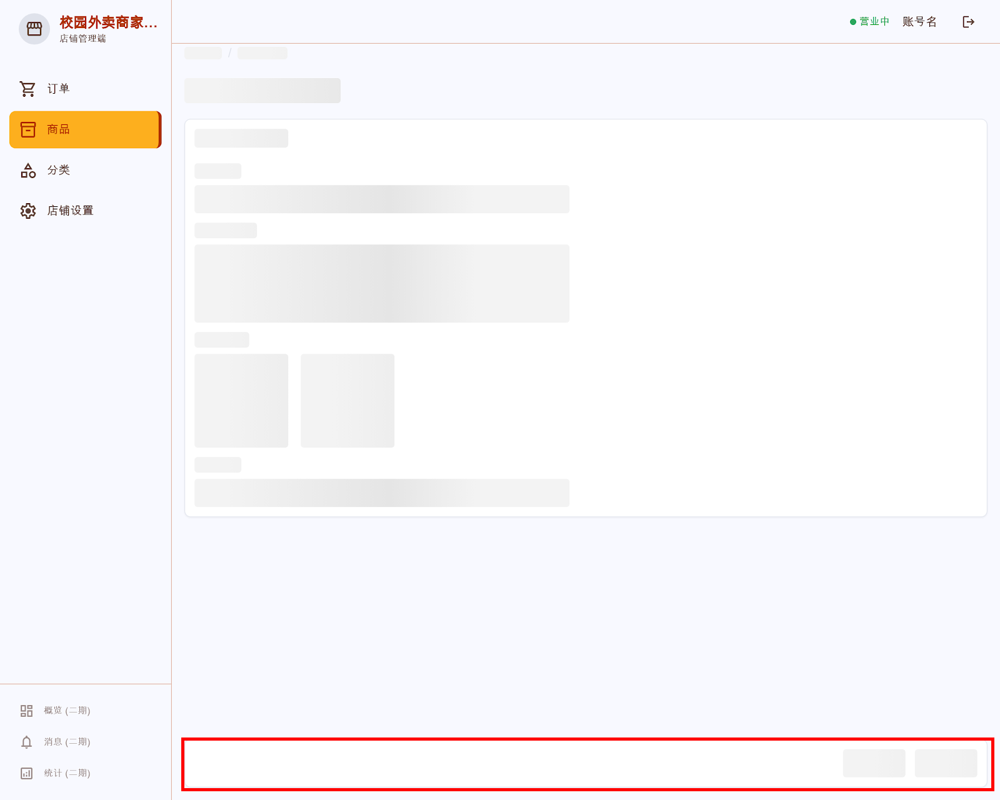 | 页面底部通栏操作条，右侧两个灰色圆角按钮占位块对应"取消/保存"按钮位置。                                                                                                                                                                                                                                                                                                                                                                                                                                                                                                                                                                                       | 加载完成后显示真实按钮；加载期间不可提交。                                                                                                                                                                                                                                                                                                        | 骨架不能永久停留；不适用独立接口请求。                                                                                                                                                                                   |
| 分类管理-左侧导航栏                        | 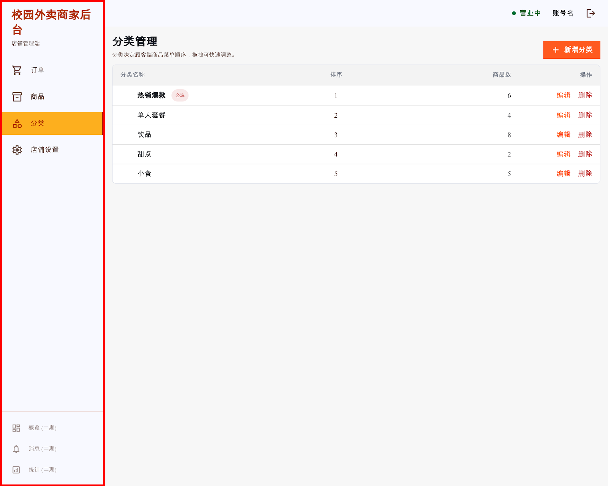 | 同 MS-02-01 公共侧边栏，本屏"分类"高亮。                                                                                                                                                                                                                                                                                                                                                                                                                                                                                                                                                                                                                      | 行为同 MS-02-01。                                                                                                                                                                                                                                                                                                                                 | 不适用（公共框架区域）。                                                                                                                                                                                                 |
| 分类管理-顶部栏                            | 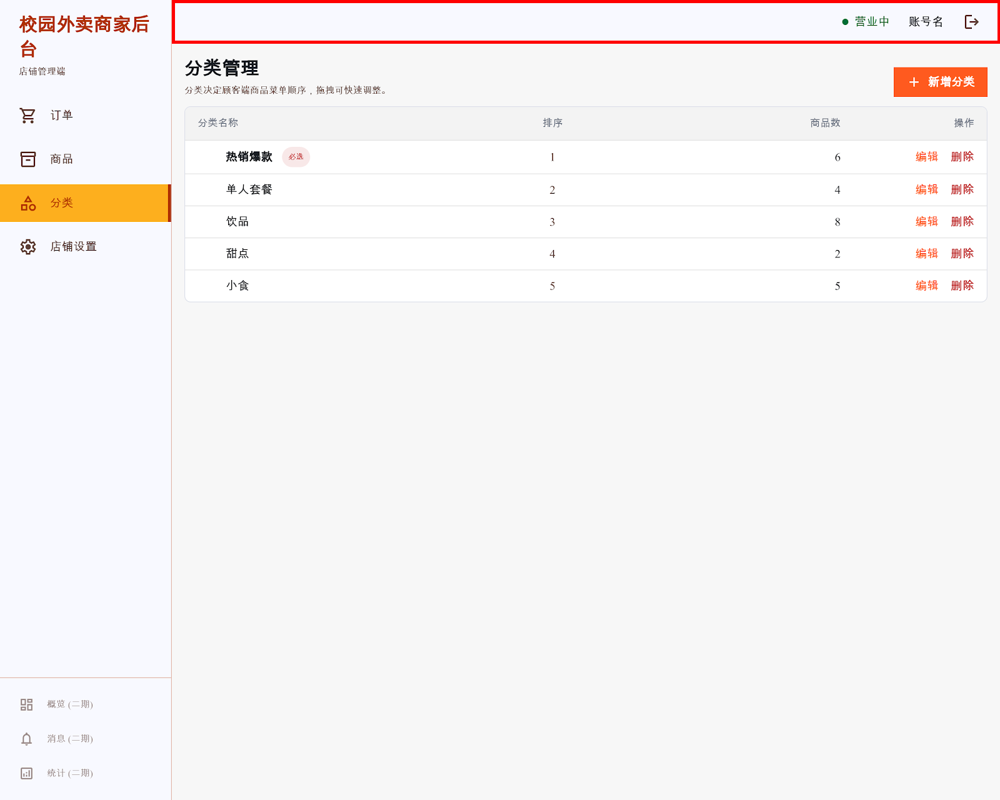 | 同 MS-02-02 公共顶栏。                                                                                                                                                                                                                                                                                                                                                                                                                                                                                                                                                                                                                                        | 行为同 MS-02-02。                                                                                                                                                                                                                                                                                                                                 | 不适用（公共框架区域）。                                                                                                                                                                                                 |
| 分类管理-页面标题区                        | 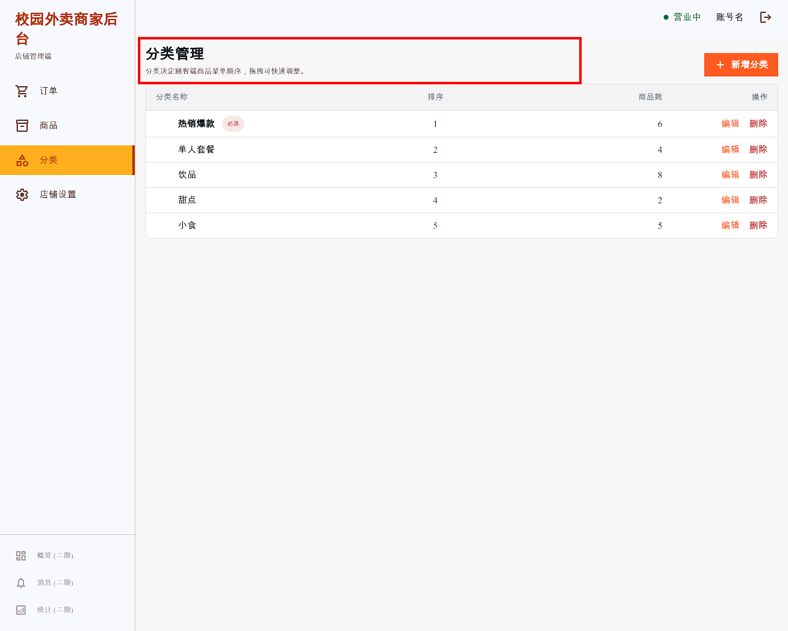 | 标题"分类管理"与副标题"分类决定顾客端商品菜单顺序，拖拽可快速调整。"。注：经 2026-09-01 评审决议**不实现拖拽排序**，排序通过编辑分类弹窗中的排序值调整；实现时副标题文案去掉"拖拽可快速调整"表述。                                                                                                                                                                                                                                                                                                                                                                                                                                                      | 纯展示；排序调整方式见 MS-13 编辑分类弹窗。                                                                                                                                                                                                                                                                                                       | 不适用（固定文案区域）。                                                                                                                                                                                                 |
| 分类管理-新增分类按钮                      | 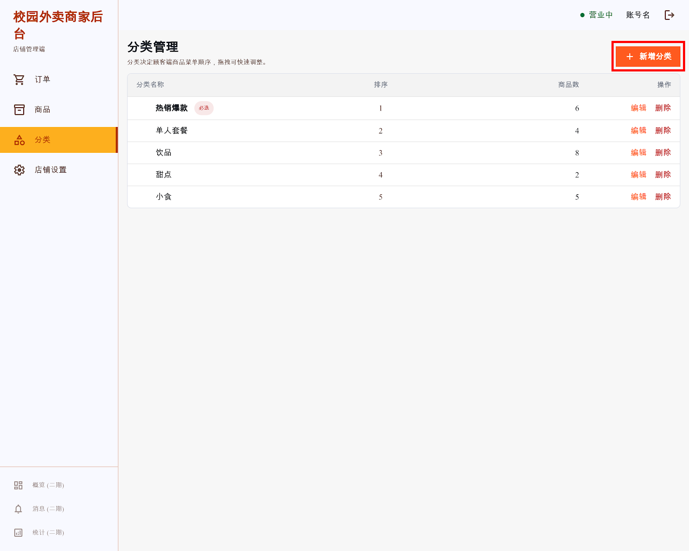 | 右上角橙色主按钮"+ 新增分类"。                                                                                                                                                                                                                                                                                                                                                                                                                                                                                                                                                                                                                                | 点击打开空表单弹窗（编辑态见 MS-13，新增态字段默认空）；保存成功后刷新分类表格与商品列表的分类筛选。                                                                                                                                                                                                                                              | 弹窗无独立加载请求；保存失败保留弹窗输入。                                                                                                                                                                               |
| 分类管理-分类数据表格                      | 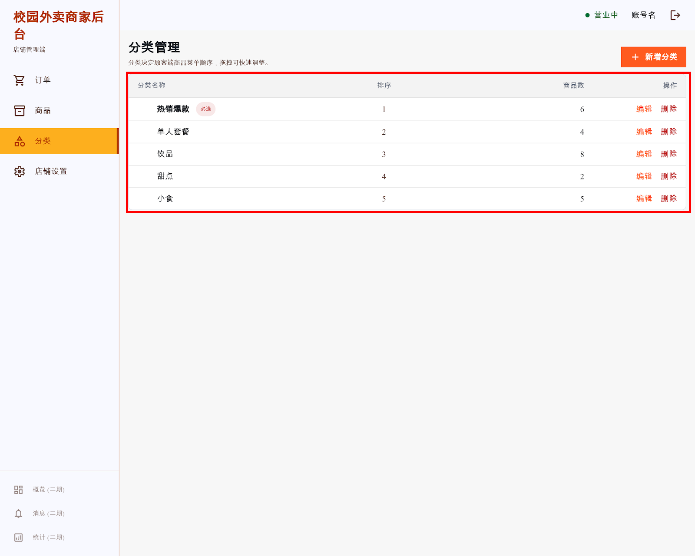 | 表头列：分类名称、排序、商品数、操作，来自`GET /api/v1/merchant/categories`，默认按排序值展示；示例行：热销爆款（名称右侧粉色"必选"标记）/1/6、单人套餐/2/4、饮品/3/8、甜点/4/2、小食/5/5，为演示数据；操作列为橙色"编辑"与红色"删除"文字按钮。注："必选"标记经 2026-09-01 评审决议**保留为视觉占位标签**：仅按设计稿展示、无业务逻辑与契约字段，不参与任何校验与排序；商品数来自分类接口返回，用于删除约束判断。                                                                                                                                                                                                                                     | 点击行内"编辑"打开弹窗回显当前分类（见 MS-13）；点击"删除"进入删除确认流程（见 MS-14~MS-16）；保存或删除成功后刷新分类表格与商品列表的分类筛选；同一店铺分类名称唯一，重名被后端拒绝；有商品的分类不能静默删除；批量绑定商品等便捷操作后续补充。                                                                                                  | 空分类列表显示空态（见 MS-12）；加载显示表格骨架；名称为空、重名、排序非法分别提示；分类被他人删除时刷新列表；无权限不显示编辑和删除入口。                                                                               |
| 分类管理空状态-左侧导航栏                  | 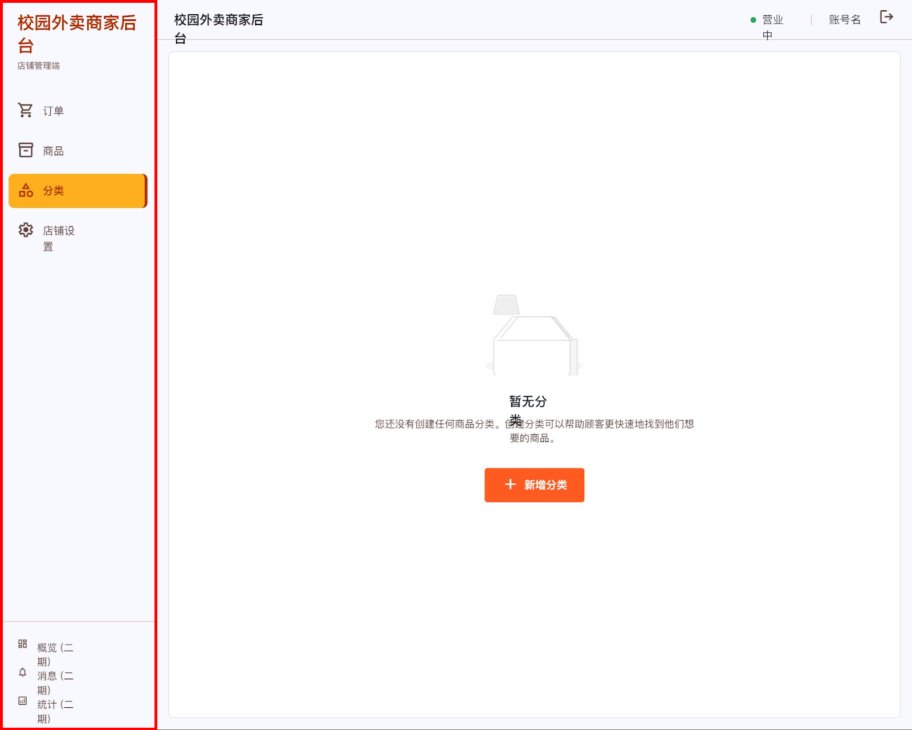 | 同 MS-02-01 公共侧边栏，本屏"分类"高亮。                                                                                                                                                                                                                                                                                                                                                                                                                                                                                                                                                                                                                      | 行为同 MS-02-01。                                                                                                                                                                                                                                                                                                                                 | 不适用（公共框架区域）。                                                                                                                                                                                                 |
| 分类管理空状态-顶部栏                      | 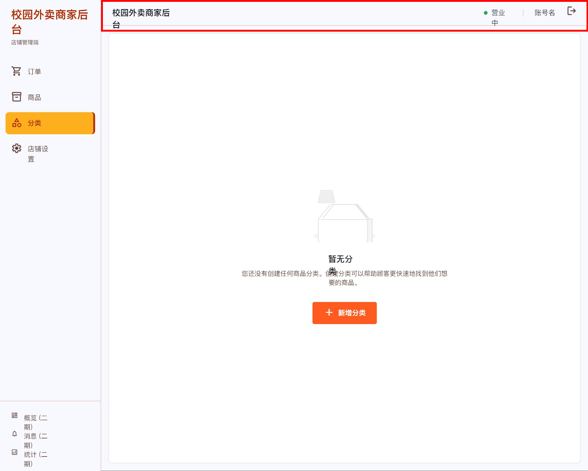 | 同 MS-02-02 公共顶栏。                                                                                                                                                                                                                                                                                                                                                                                                                                                                                                                                                                                                                                        | 行为同 MS-02-02。                                                                                                                                                                                                                                                                                                                                 | 不适用（公共框架区域）。                                                                                                                                                                                                 |
| 分类管理空状态-空态插画与提示              | 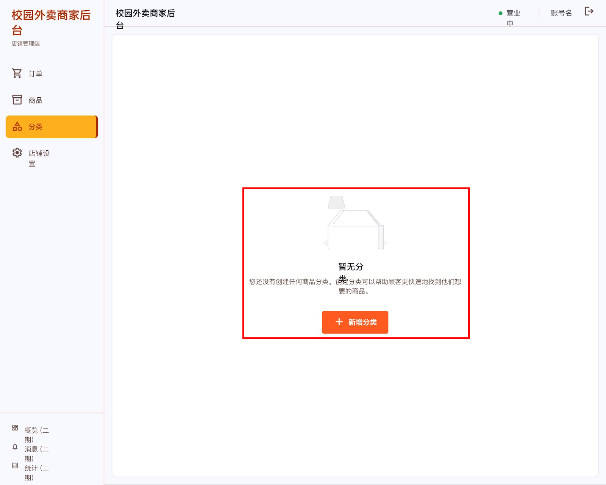 | 居中空态：浅灰店铺线稿插画、标题"暂无分类"、说明"您还没有创建任何商品分类。创建分类可以帮助顾客更快速地找到他们想要的商品。"与橙色主按钮"+ 新增分类"；空态来自分类接口返回空数组。                                                                                                                                                                                                                                                                                                                                                                                                                                                                            | 点击"新增分类"打开空表单弹窗。                                                                                                                                                                                                                                                                                                                    | 空态不当作接口错误；加载失败显示重试入口而不是空态；空态文案同时说明"没有什么数据"和下一步操作，与统一规则 3 一致。                                                                                                      |
| 编辑分类弹窗-背景分类管理页                | 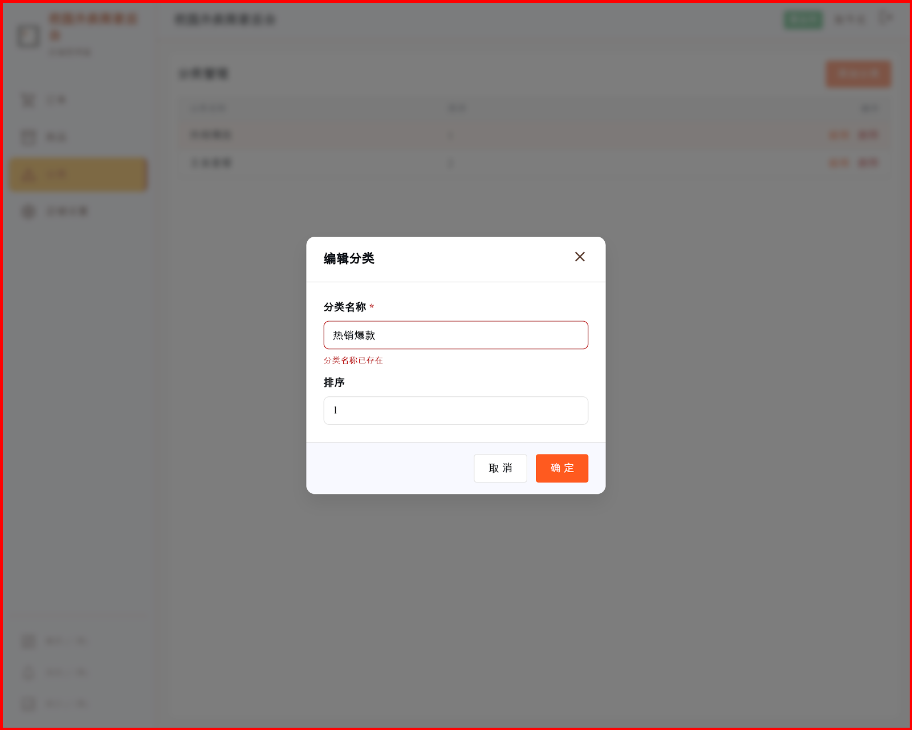 | 模糊置灰的分类管理页为弹窗背景：侧边栏"分类"高亮、"分类管理"标题、右上橙色新增按钮、分类表格且热销爆款行浅橙高亮。                                                                                                                                                                                                                                                                                                                                                                                                                                                                                                                                            | 弹窗期间背景不可操作。                                                                                                                                                                                                                                                                                                                            | 见整行说明（背景区域口径与 MS-11 各区域行一致）。                                                                                                                                                                        |
| 编辑分类弹窗-编辑分类弹窗                  | 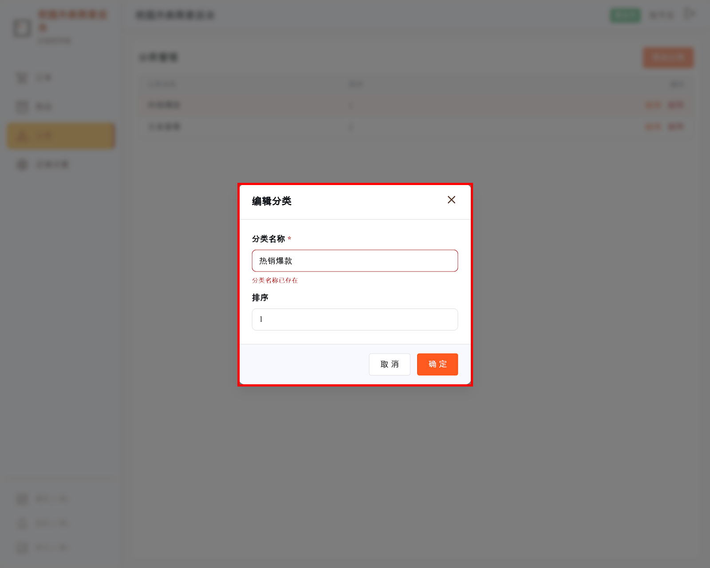 | 白色圆角弹窗：标题"编辑分类"+右上角"×"，标题下分隔线；字段：分类名称*（必填；图中红框、值"热销爆款"与红字"分类名称已存在"为重名校验失败示例）与排序（示例值 1）；分类名称在同一店铺唯一，重名返回 400/409。                                                                                                                                                                                                                                                                                                                                                                                                                                                  | 点击"确定"调用新增或修改分类接口（`POST /api/v1/merchant/categories`、`PATCH /api/v1/merchant/categories/{categoryId}`），成功后关闭弹窗并刷新表格；重名被拒绝时保留输入供修改；取消或"×"放弃本次输入。                                                                                                                                      | 名称必填、排序为整数的前端格式检查；服务端重名与参数错误分别提示；保存失败恢复原值并保留弹窗。                                                                                                                           |
| 编辑分类弹窗-弹窗按钮组                    | 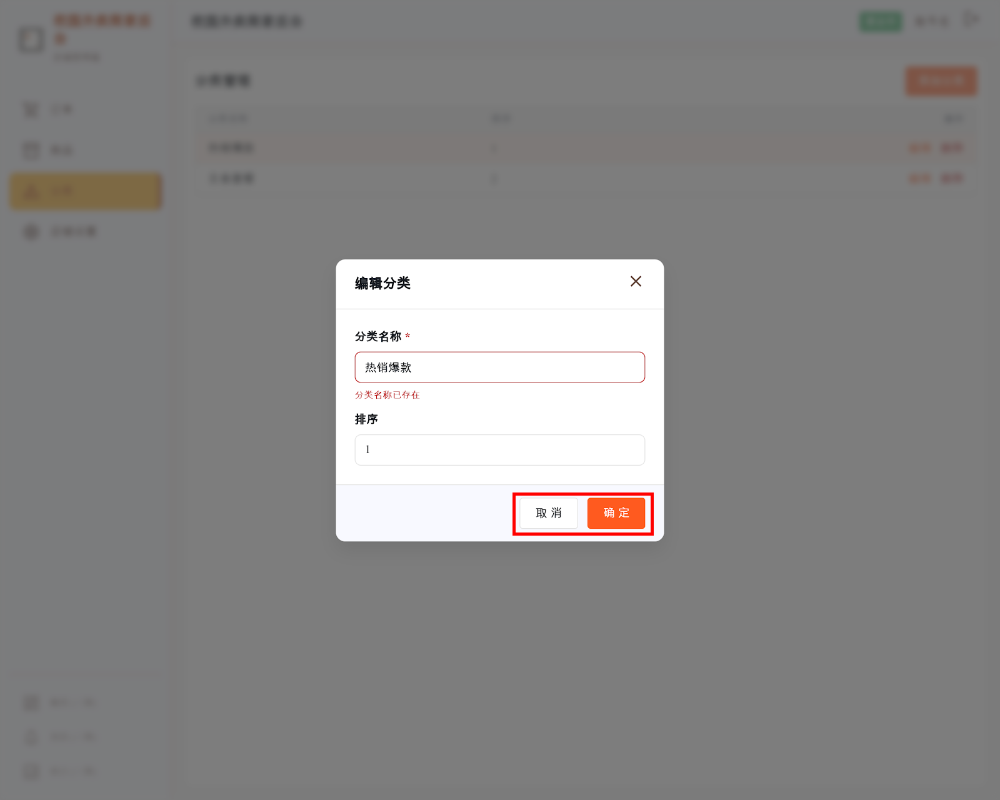 | "取 消"白底描边按钮+"确 定"橙色主按钮。                                                                                                                                                                                                                                                                                                                                                                                                                                                                                                                                                                                                                       | 确定提交、取消关闭；请求中按钮禁用防重复提交。                                                                                                                                                                                                                                                                                                    | 不适用独立空态（弹窗内校验提示见上一行）。                                                                                                                                                                               |
| 删除分类确认-商品转未分类-背景分类管理页   | 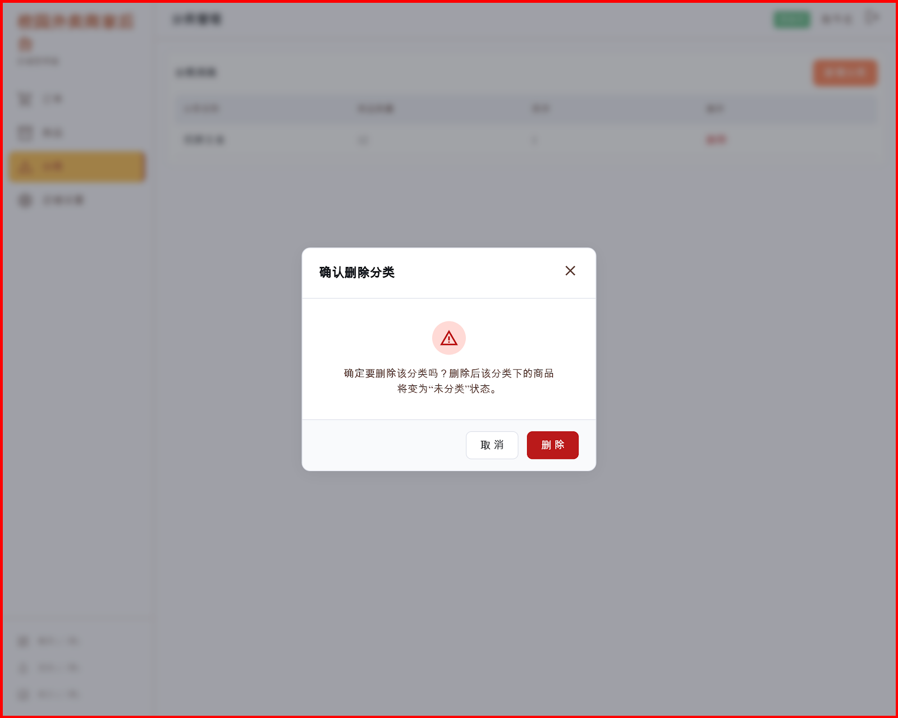 | 模糊置灰的分类管理页为弹窗背景，分类表格可见"未分类"等行（对应"商品转未分类"方案的演示背景）。                                                                                                                                                                                                                                                                                                                                                                                                                                                                                                                                                                | 弹窗期间背景不可操作。                                                                                                                                                                                                                                                                                                                            | 见整行说明（背景区域口径与 MS-11 各区域行一致）。                                                                                                                                                                        |
| 删除分类确认-商品转未分类-删除分类确认弹窗 | 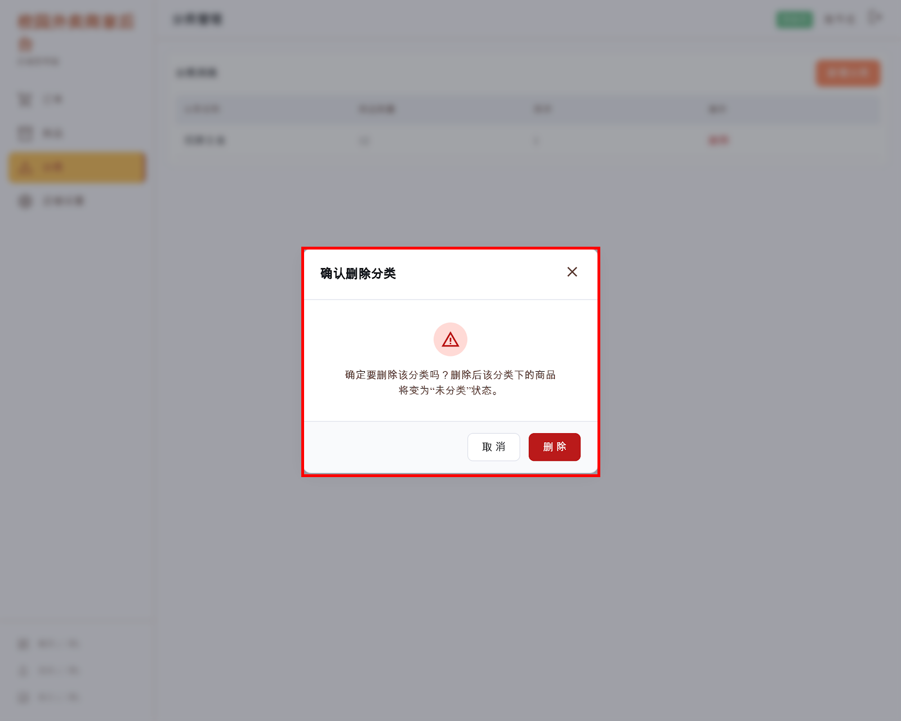 | 白色圆角弹窗：标题"确认删除分类"+右上角"×"，居中粉色圆底红色三角警告图标，正文"确定要删除该分类吗？删除后该分类下的商品将变为"未分类"状态。"。                                                                                                                                                                                                                                                                                                                                                                                                                                                                                                               | 点击"删除"调用`DELETE /api/v1/merchant/categories/{categoryId}`；确认前明确告知该分类下商品的去向；删除成功后刷新分类表格与商品列表。注：经 2026-09-01 评审决议采用 **MS-15 阻断式方案**，本屏"商品转未分类"方案废弃（仅作设计探索留档）：有商品的分类点击删除时按钮置禁用并提示先处理商品归属，后端对含商品分类的删除请求返回 409 兜底。 | 删除请求中按钮禁用；删除失败恢复列表并提示；分类被他人删除时刷新列表。                                                                                                                                                   |
| 删除分类确认-商品转未分类-弹窗按钮组       | 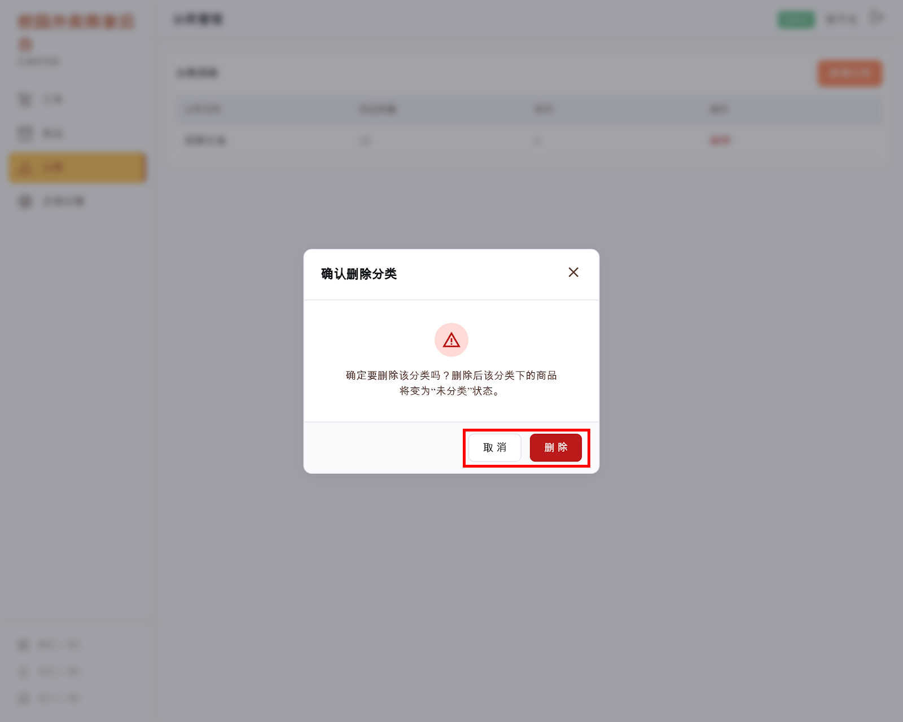 | "取 消"白底描边按钮+"删 除"红色主按钮（危险操作使用语义红）。                                                                                                                                                                                                                                                                                                                                                                                                                                                                                                                                                                                                 | 点击"删除"提交删除请求，点击"取消"关闭弹窗。                                                                                                                                                                                                                                                                                                      | 请求中按钮禁用；失败保留弹窗并提示。                                                                                                                                                                                     |
| 删除分类确认-需先处理商品-背景分类管理页   | 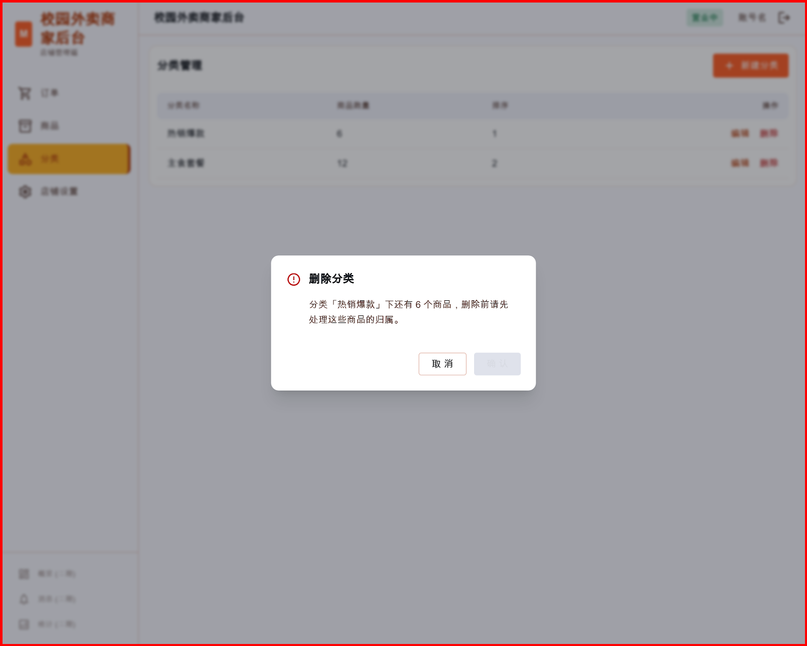 | 模糊置灰的分类管理页为弹窗背景：表格列分类名称/商品数量/排序/操作，可见行热销爆款（6 个商品、排序 1）等；背景列顺序与 MS-11 不完全一致，属设计稿生成差异，实现以 MS-11 为准。                                                                                                                                                                                                                                                                                                                                                                                                                                                                                 | 弹窗期间背景不可操作。                                                                                                                                                                                                                                                                                                                            | 见整行说明（背景区域口径与 MS-11 各区域行一致）。                                                                                                                                                                        |
| 删除分类确认-需先处理商品-删除分类提示弹窗 | 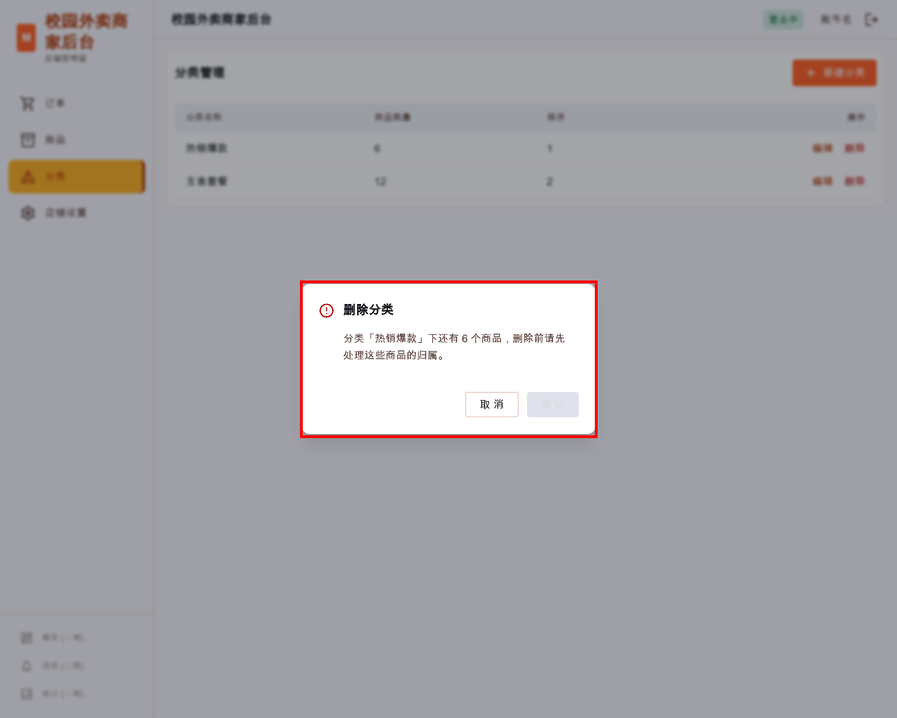 | 白色圆角弹窗（无关闭"×"）：头部红色圆形感叹号图标+标题"删除分类"同行，左对齐正文"分类「热销爆款」下还有 6 个商品，删除前请先处理这些商品的归属。"；商品数来自分类接口返回。                                                                                                                                                                                                                                                                                                                                                                                                                                                                                  | 有商品的分类不可直接删除，确认按钮置灰；商家需先将商品移到其他分类或做下架处理后再删除；该方案与契约"有商品的分类不能静默删除"一致。注：经 2026-09-01 评审决议**采用本阻断式方案**，MS-14 的"商品转未分类"方案废弃。                                                                                                                        | 商品数以后端返回为准；弹窗期间底层不可操作；商品归属处理完成后再进入删除流程。                                                                                                                                           |
| 删除分类确认-需先处理商品-弹窗按钮组       | 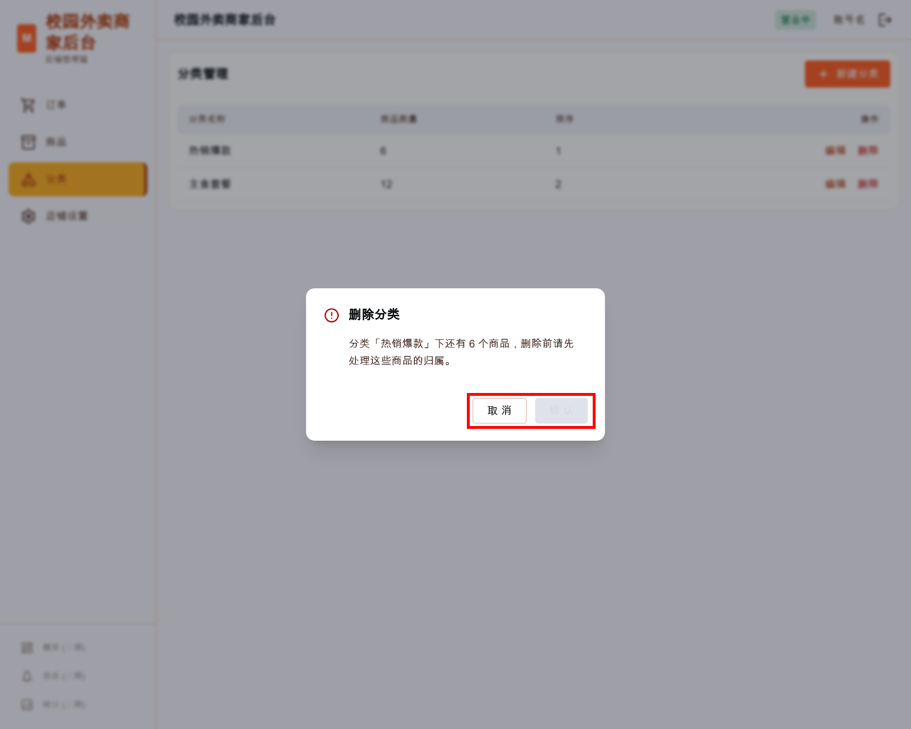 | "取 消"白底描边按钮+置灰禁用的确认按钮（图中禁用按钮文字模糊，语义为不可用的删除确认）。                                                                                                                                                                                                                                                                                                                                                                                                                                                                                                                                                                      | 禁用态按钮不可点击，仅"取消"可关闭弹窗。                                                                                                                                                                                                                                                                                                          | 不适用请求状态（无可用请求）；解除禁用条件见上一行。                                                                                                                                                                     |
| 删除分类确认-不可恢复-背景分类管理页       | 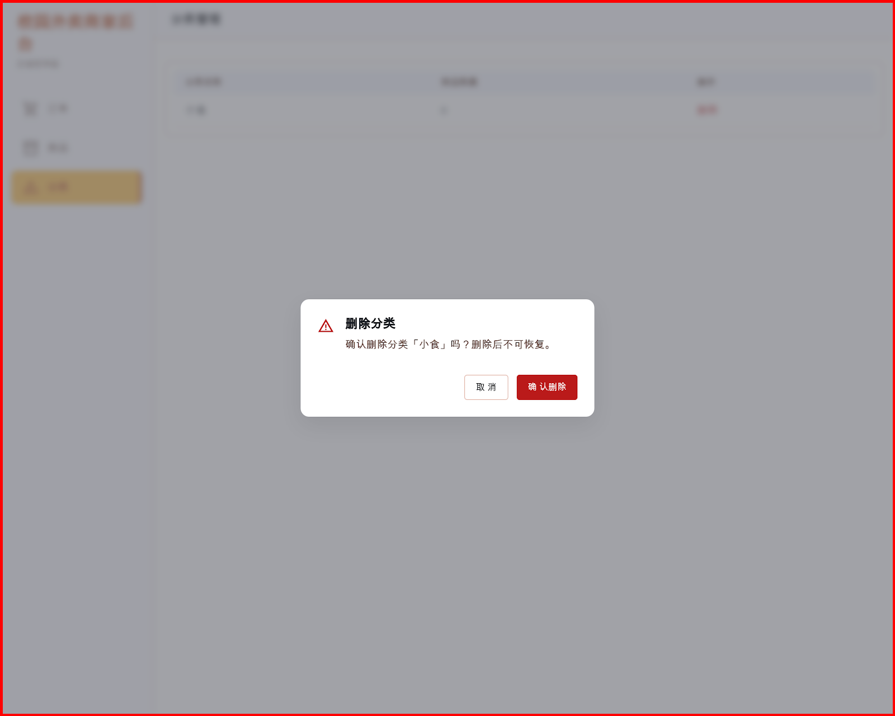 | 模糊置灰的分类管理页，仅见单行分类数据；纯弹窗背景，无完整列表上下文。                                                                                                                                                                                                                                                                                                                                                                                                                                                                                                                                                                                        | 弹窗期间背景不可操作。                                                                                                                                                                                                                                                                                                                            | 见整行说明（背景区域口径与 MS-11 各区域行一致）。                                                                                                                                                                        |
| 删除分类确认-不可恢复-删除分类确认弹窗     | 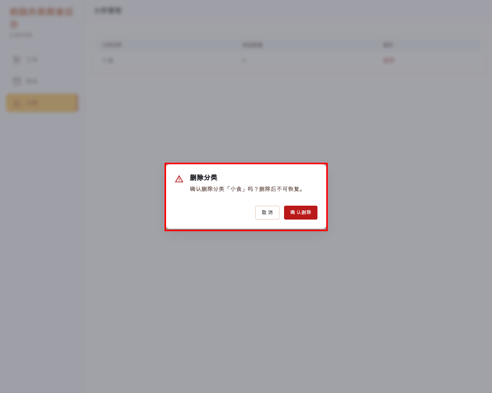 | 白色圆角紧凑弹窗（无关闭"×"）：头部红色三角警告图标+标题"删除分类"，正文"确认删除分类「小食」吗？删除后不可恢复。"（「小食」为演示分类名）。                                                                                                                                                                                                                                                                                                                                                                                                                                                                                                                 | 仅对允许删除的分类出现该确认；点击"确认删除"调用删除分类接口并刷新列表。注：是否允许删除、删除约束以契约为准（有商品的分类不能静默删除）；"删除后不可恢复"为课程简化口径。                                                                                                                                                                        | 删除请求中按钮禁用；失败保留弹窗并提示；分类已被他人删除时刷新列表并提示。                                                                                                                                               |
| 删除分类确认-不可恢复-弹窗按钮组           | 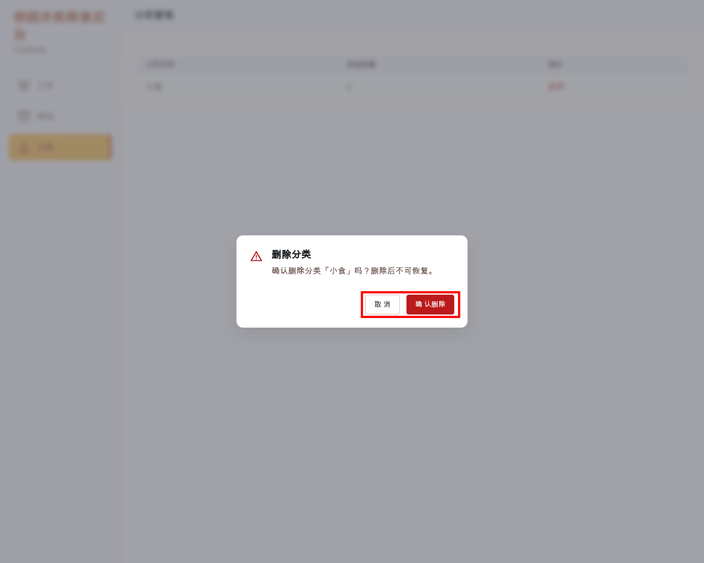 | "取 消"白底描边按钮+"确认删除"红色主按钮。                                                                                                                                                                                                                                                                                                                                                                                                                                                                                                                                                                                                                    | 点击"确认删除"提交删除请求，点击"取消"关闭弹窗。                                                                                                                                                                                                                                                                                                  | 请求中按钮禁用；失败保留弹窗并提示。                                                                                                                                                                                     |
| 店铺设置-左侧导航栏                        | 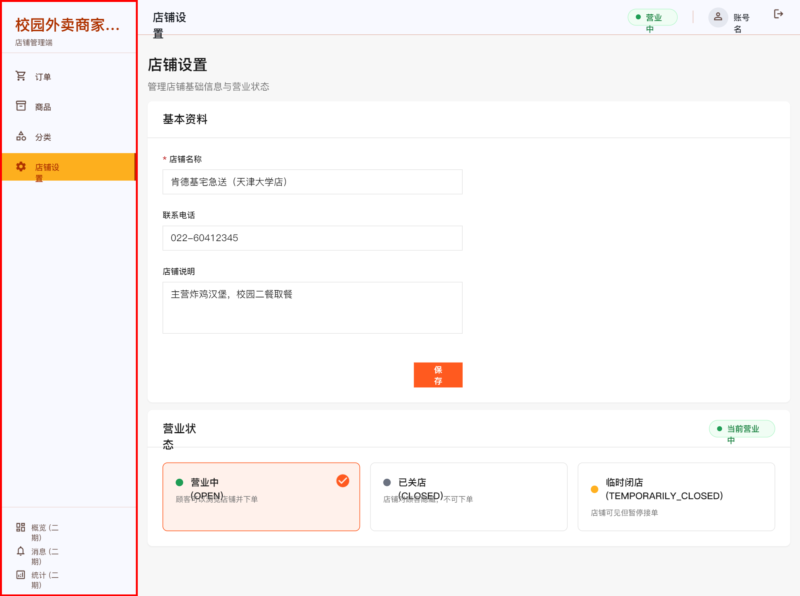 | 同 MS-02-01 公共侧边栏，本屏"店铺设置"高亮。                                                                                                                                                                                                                                                                                                                                                                                                                                                                                                                                                                                                                  | 行为同 MS-02-01。                                                                                                                                                                                                                                                                                                                                 | 不适用（公共框架区域）。                                                                                                                                                                                                 |
| 店铺设置-顶部栏                            | 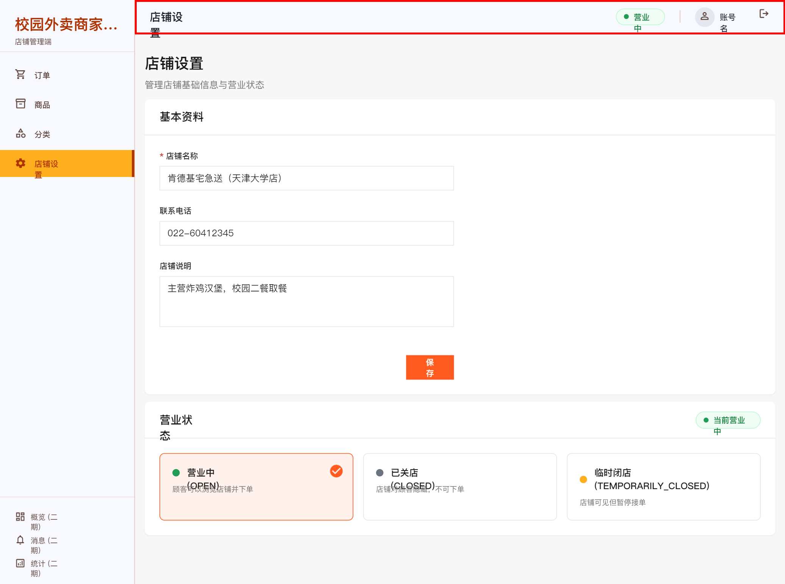 | 同 MS-02-02 公共顶栏（图中左侧标题显示"店铺设置"，实现统一为后台标题；右侧营业中胶囊、账号名、退出图标一致）。                                                                                                                                                                                                                                                                                                                                                                                                                                                                                                                                                | 行为同 MS-02-02。                                                                                                                                                                                                                                                                                                                                 | 不适用（公共框架区域）。                                                                                                                                                                                                 |
| 店铺设置-页面标题区                        | 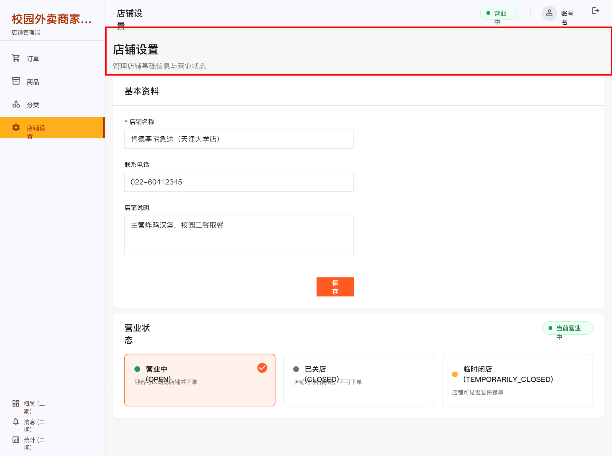 | 标题"店铺设置"与副标题"管理店铺基础信息与营业状态"为固定文案。                                                                                                                                                                                                                                                                                                                                                                                                                                                                                                                                                                                                | 纯展示。                                                                                                                                                                                                                                                                                                                                          | 不适用（固定文案区域）。                                                                                                                                                                                                 |
| 店铺设置-基本资料卡片                      | 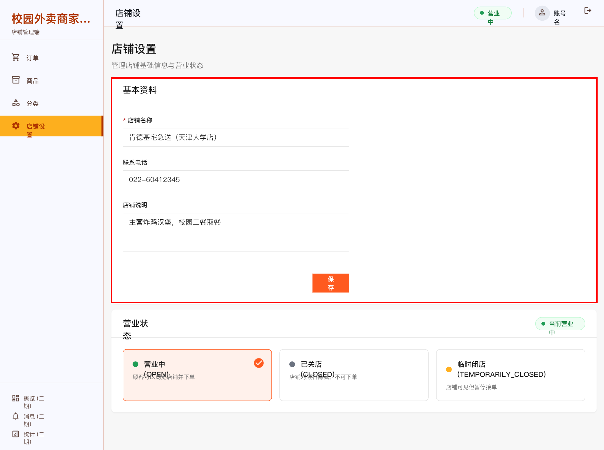 | 白色圆角卡片：节标题"基本资料"；字段：*店铺名称（必填）、联系电话、店铺说明（多行文本域），来自`GET /api/v1/merchant/store`（图中"肯德基宅急送（天津大学店）""022-60412345""主营炸鸡汉堡，校园二餐取餐"为设计稿示例值，实际来自当前店铺接口的种子数据）；卡片底部橙色"保存"主按钮，保存调用 `PATCH /api/v1/merchant/store` 修改店铺基础资料。注：营业时间、起送金额、配送费等字段只有在纳入接口契约后才显示，本稿未出现符合该口径。                                                                                                                                                                                                                          | 输入内容先保存在页面草稿；点击"保存"提交店铺资料更新；成功后顶栏营业状态标签与用户端读取结果同步刷新；新建店铺初始状态为 CLOSED。                                                                                                                                                                                                                 | 加载显示表单骨架；名称、联系方式格式不合法分别提示并定位字段；店铺被删除、无权限或状态已变化时拒绝并刷新；网络失败保留草稿；保存中按钮禁用，重复点击只保存一次。                                                         |
| 店铺设置-营业状态卡片                      | 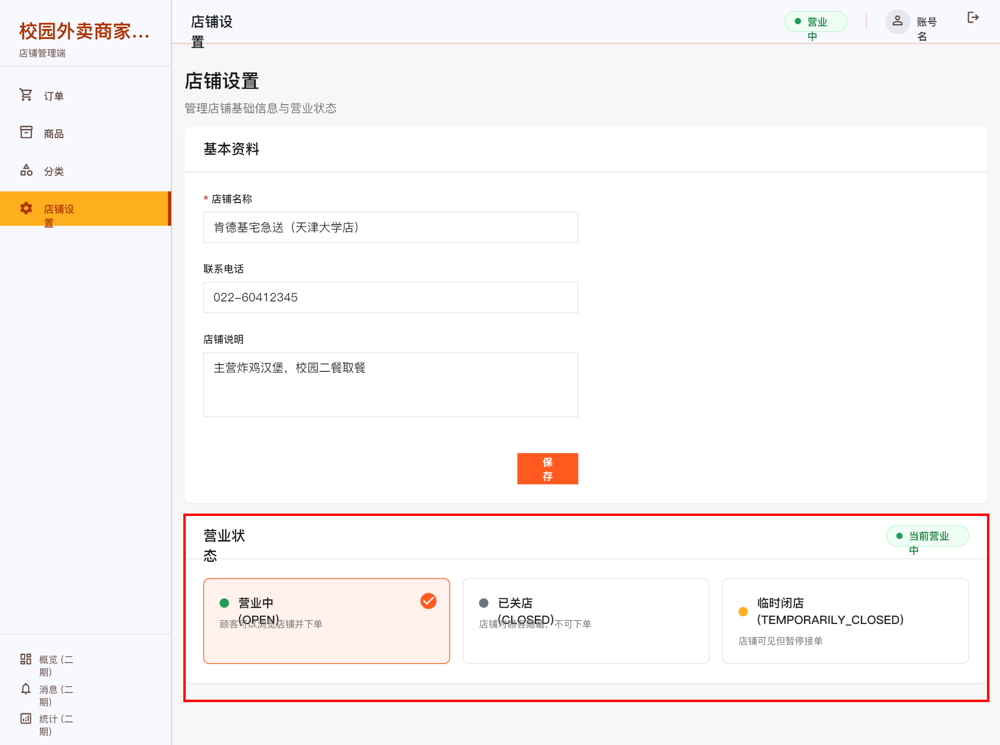 | 白色圆角卡片：节标题"营业状态"，右上角绿色胶囊"当前营业中"；三张状态选项卡并排：营业中（OPEN，绿点，说明"顾客可以浏览店铺并下单"）、已关店（CLOSED，深灰圆点，说明"店铺对顾客隐藏，不可下单"）、临时闭店（TEMPORARILY_CLOSED，黄点，说明"店铺可见但暂停接单"）；当前状态卡呈橙色描边+浅橙底+对勾；营业状态三态与契约一致，当前状态来自店铺接口 status 字段。                                                                                                                                                                                                                                                                                                  | 点选非当前状态卡触发切换确认弹窗（见 MS-18）；确认后调用`PATCH /api/v1/merchant/store/status`；状态修改成功后本页标签、状态卡与顶栏营业状态同步刷新，用户端重新查询店铺即可见最新结果。                                                                                                                                                         | 状态读取失败显示占位并重试；状态已变化或无权限时拒绝并刷新；营业状态只允许 OPEN/CLOSED/TEMPORARILY_CLOSED 三态。                                                                                                         |
| 切换营业状态确认-背景店铺设置页            | 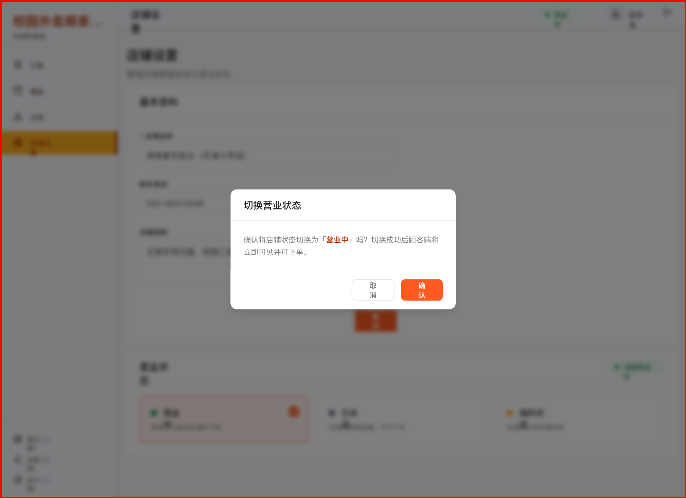 | 模糊置灰的店铺设置页为弹窗背景：基本资料表单与"保存"按钮、营业状态三张状态卡（营业中选中态浅橙底可见）、右上"当前营业中"胶囊。                                                                                                                                                                                                                                                                                                                                                                                                                                                                                                                                | 弹窗期间背景不可操作。                                                                                                                                                                                                                                                                                                                            | 见整行说明（背景区域口径与 MS-17 各区域行一致）。                                                                                                                                                                        |
| 切换营业状态确认-切换营业状态弹窗          | 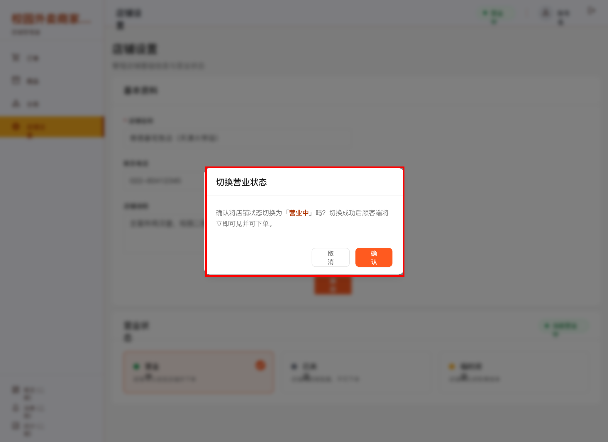 | 白色圆角弹窗：标题"切换营业状态"，标题下分隔线；正文"确认将店铺状态切换为「营业中」吗？切换成功后顾客端将立即可见并可下单。"，目标状态名以橙红色强调；目标状态文案随所选状态卡替换（已关店/临时闭店同结构）。                                                                                                                                                                                                                                                                                                                                                                                                                                                 | 点击"确认"调用营业状态修改接口；成功后刷新状态卡、页面标签与顶栏营业状态，用户端重新查询即可见最新结果（契约 4.1）。                                                                                                                                                                                                                              | 请求中按钮禁用防重复提交；失败不得提前显示成功；重复请求幂等。                                                                                                                                                           |
| 切换营业状态确认-弹窗按钮组                | 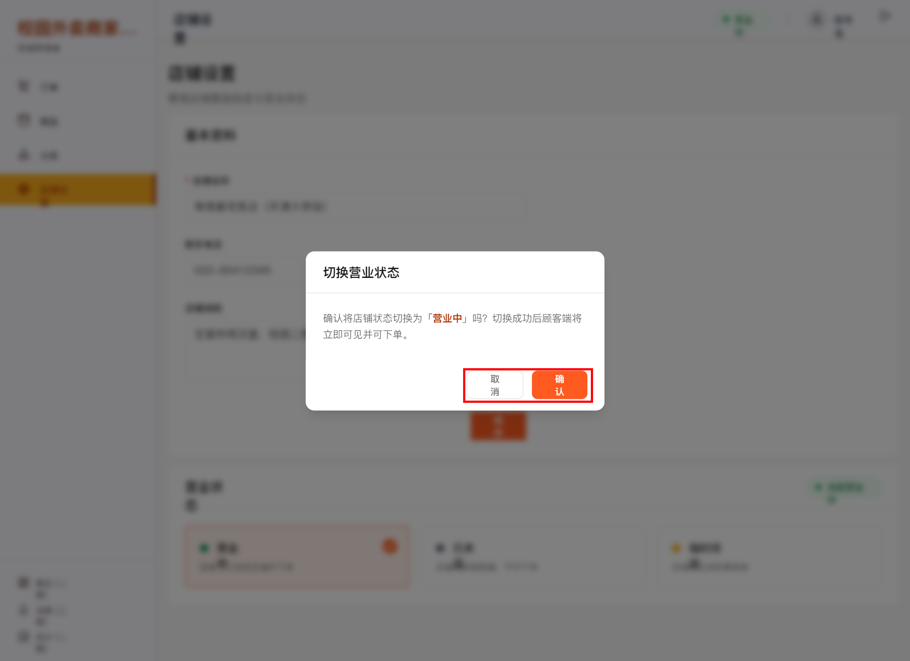 | "取 消"白底描边按钮+"确 认"橙色主按钮（图中文字竖排换行属设计稿排版瑕疵）。                                                                                                                                                                                                                                                                                                                                                                                                                                                                                                                                                                                   | 确认提交状态修改、取消关闭弹窗。                                                                                                                                                                                                                                                                                                                  | 请求中按钮禁用；失败保留弹窗并提示。                                                                                                                                                                                     |
| 放弃未保存修改确认弹窗-背景演示底图        | 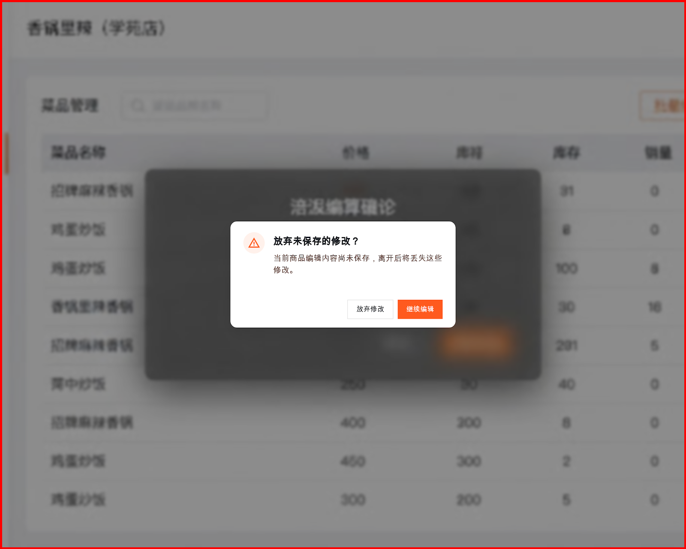 | 模糊置灰的菜品管理页演示底图仅作弹窗背景：门店标题（异店名）、"菜品管理"与搜索框、菜品表格列含"销量"（可见"招牌麻辣香锅""鸡蛋炒饭"等演示行），弹窗后方另叠一张深色圆角卡片。该背景与现版后台风格不一致，属设计稿演示底图。注：经 2026-09-01 评审确认维持原结论——背景衬底中的"销量"列与异店名仅为弹窗演示底图，不得据此为商品列表增加销量列。                                                                                                                                                                                                                                                                                                                | 背景不承载交互；弹窗期间不可操作。                                                                                                                                                                                                                                                                                                                | 见整行说明（本屏无真实页面语义，弹窗行为见下一行）。                                                                                                                                                                     |
| 放弃未保存修改确认弹窗-放弃未保存修改弹窗  | 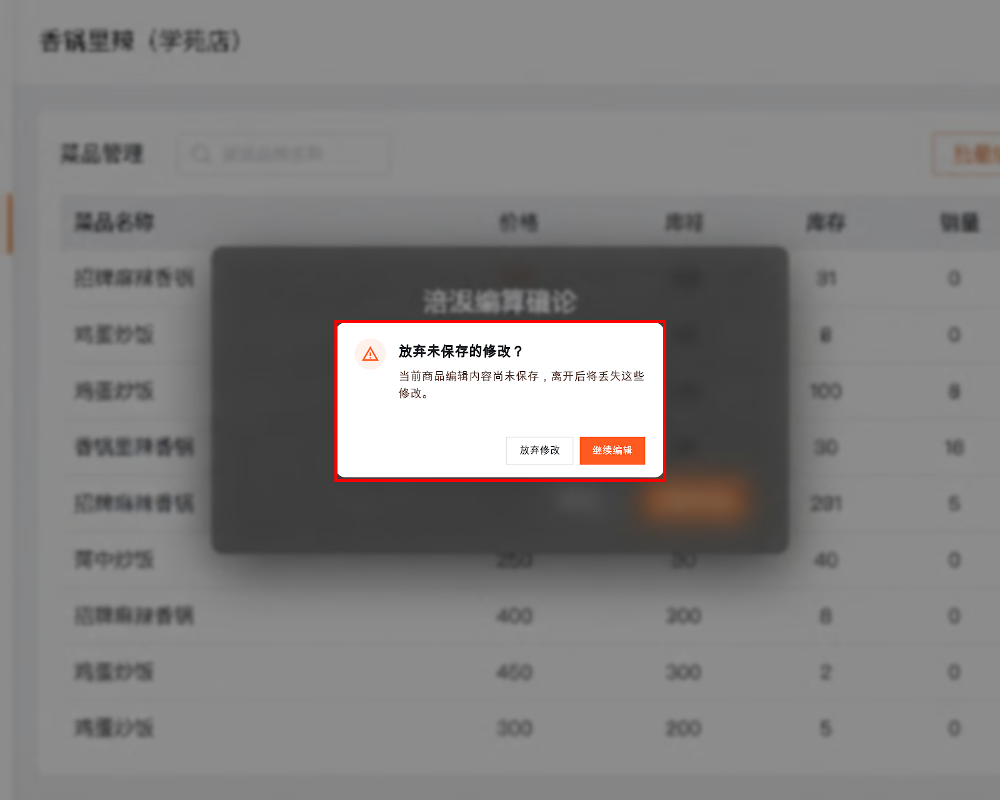 | 白色圆角弹窗（无关闭"×"）：头部橙色三角警告图标+标题"放弃未保存的修改？"，正文"当前商品编辑内容尚未保存，离开后将丢失这些修改。"。                                                                                                                                                                                                                                                                                                                                                                                                                                                                                                                           | 适用于商品编辑等存在未保存草稿的页面离开场景：点击"放弃修改"丢弃草稿并继续原跳转，点击"继续编辑"留在当前页面；组件语义与 MS-09 一致，可实现为全局复用的确认弹窗。                                                                                                                                                                                 | 弹窗期间禁止底层操作；放弃修改不发起接口请求；不适用数据加载状态。                                                                                                                                                       |
| 放弃未保存修改确认弹窗-弹窗按钮组          | 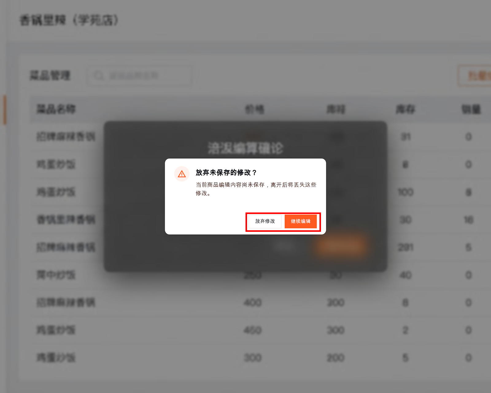 | "放弃修改"白底描边按钮+"继续编辑"橙色主按钮。                                                                                                                                                                                                                                                                                                                                                                                                                                                                                                                                                                                                                 | 行为同上一行：放弃丢弃草稿、继续编辑留在当前页。                                                                                                                                                                                                                                                                                                  | 无请求行为；不适用网络与加载状态。                                                                                                                                                                                       |
| 空状态组件聚合-暂无商品空态卡              | 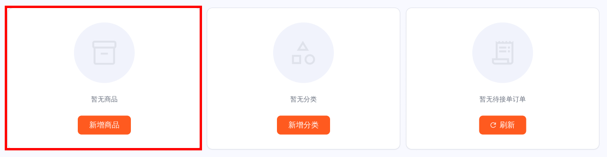 | 白色圆角卡片：浅蓝圆形底商品盒线稿图标、文案"暂无商品"、橙色主按钮"新增商品"；供开发与评审对照商品列表空态的文案与按钮，落在商品列表空结果场景（同 MS-05）。                                                                                                                                                                                                                                                                                                                                                                                                                                                                                                  | 点击"新增商品"进入空白商品表单。                                                                                                                                                                                                                                                                                                                  | 空态文案需说明"没有什么数据"和下一步操作，与统一规则 3 一致；空态不是接口错误。注：MS-20 的 Stitch 归档 PNG 原为纯色空白图（导出异常），已用同一设计稿 Figma 导出的整页预览替补归档，本行内容已逐字核对一致。            |
| 空状态组件聚合-暂无分类空态卡              | 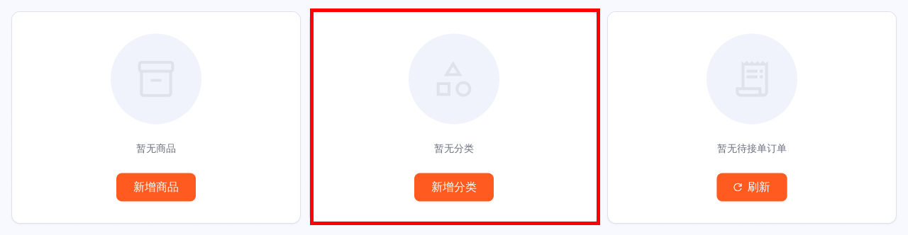 | 白色圆角卡片：浅蓝圆形底分类线稿图标、文案"暂无分类"、橙色主按钮"新增分类"；落在分类管理空结果场景（同 MS-12）。                                                                                                                                                                                                                                                                                                                                                                                                                                                                                                                                              | 点击"新增分类"打开空表单弹窗。                                                                                                                                                                                                                                                                                                                    | 空态口径与统一规则 3 一致；空态不是接口错误；归档图替补说明同上一行。                                                                                                                                                    |
| 空状态组件聚合-暂无待接单订单空态卡        | 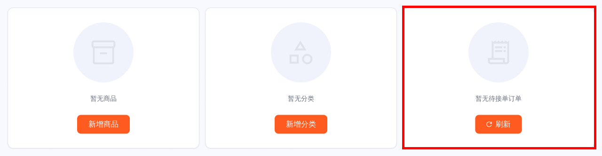 | 白色圆角卡片：浅蓝圆形底订单线稿图标、文案"暂无待接单订单"、橙色主按钮"⟳ 刷新"（带刷新图标）；落在订单列表"待接单"筛选空结果场景。                                                                                                                                                                                                                                                                                                                                                                                                                                                                                                                           | 点击"刷新"重新请求当前筛选下的订单列表。                                                                                                                                                                                                                                                                                                          | 空态与刷新不当作接口错误；请求失败显示重试提示而不是空态；归档图替补说明同上一行。                                                                                                                                       |

# 8. 埋点方案

## 结论

本项目是课程实践作品，不面向真实用户上线。因此不接入产品埋点 SDK，不采集真实用户行为，不建设事件上报接口，也不根据演示数据推导转化率、留存率或经营结论。本节只规定开发过程和功能验收时要留下哪些记录，方便检查需求、代码、测试、接口和数据库是否对应。

| 记录对象   | 记录时机                   | 记录内容                                                        | 通过标准                                                                                           | 证据形式                       |
| ---------- | -------------------------- | --------------------------------------------------------------- | -------------------------------------------------------------------------------------------------- | ------------------------------ |
| 需求       | 开发前和需求变更时         | 需求编号、优先级、负责人、验收条件和影响模块                    | PRD、SRS、测试用例和代码任务可以相互对应                                                           | PRD、SRS、Issue 或任务记录     |
| 测试       | 开发前、功能完成后和回归时 | 正常、异常、边界和权限场景                                      | 用例通过，失败有原因和处理结果                                                                     | 测试代码、测试结果和问题单     |
| TDD        | 每个核心功能开始和提交前   | 先写的测试、首次失败、实现、通过和回归结果                      | 测试先于实现，原有测试没有被无故删除                                                               | Git 提交、测试日志和测试类     |
| 接口联调   | 每个接口接入页面时         | 请求、响应、状态码、错误结果、数据库影响和页面表现              | 前端页面、接口返回和数据库结果一致                                                                 | 接口记录、截图或录屏           |
| 数据库     | 建库、重置和演示前         | 建表脚本、种子数据、执行结果和关键查询                          | 可重复初始化，固定演示数据可复现                                                                   | SQL、执行日志和查询截图        |
| 前端构建   | 联调和版本冻结前           | 提交、Node/npm 版本、命令和退出码                               | `npm run build` 退出码为 0                                                                       | 构建日志                       |
| 后端构建   | 后端里程碑和版本冻结前     | 提交、JDK/构建工具版本、命令和测试结果                          | 后端构建与核心自动测试通过                                                                         | 构建日志和测试报告             |
| 真实主链路 | P0 联调验收时              | 账号、接口模式、注册/登录、浏览、购物车、下单、订单查询结果     | 关闭 Mock 回退后可以重复完成主链路                                                                 | 页面录屏、接口响应和数据库记录 |
| 权限与错误 | 每个受保护模块验收时       | 当前身份、访问资源、预期状态和实际结果                          | 用户、商家不能访问不属于自己的资源；错误有明确提示                                                 | 自动测试或接口记录             |
| 扩展模块   | 每个选定 P1 模块完成时     | 业务规则、前后端提交、数据变化、测试和页面结果                  | 业务、接口、数据库和页面都有证据                                                                   | 模块验收记录                   |
| 页面检查   | 关键页面和版本冻结时       | 页面、视口、横向溢出、遮挡和关键状态                            | 用户端移动规定视口无横向溢出和主要控件遮挡；商家端桌面 ≥1280px 无横向溢出，侧边栏可达全部一期页面 | 截图和问题单                   |
| 课程材料   | 最终版本冻结时             | PRD、SRS、接口、架构、数据库、测试、部署、报告、PPT、视频、分工 | 所有材料来自同一冻结版本                                                                           | 交付目录清单                   |

记录边界：

- Mock 模式通过只能证明前端演示链路，不得记为真实后端联调通过。
- 经营统计本期实现，只统计数据库中的有效订单并注明查询范围；没有真实数据时显示 0 或空值，不得用固定演示数值冒充经营结果。
- 没有截图、日志、接口响应或可重复操作步骤的结论，报告中只能写“待验证”。
- 本节的记录字段用于课程验收，不要求在产品代码中新增用户行为采集 SDK、埋点表或统计后台。

# 9. 项目排期

排期以老师明确口径为准：**9 月 8 日（或顺延至 9 月 9 日）进行第一阶段中期验收**，验收对象是课程基础 P0 的完成度，验收后立即进入第二阶段需求变更。因此功能编码窗口为 9 月 4 日至 9 月 7 日（含 9/5–9/6 周末冲刺日），9 月 7 日晚为 P0 完成截止与验收演练；9 月 15 日功能冻结、9 月 15–16 日交叉验收、9 月 17–18 日最终验收；材料归档安排在第 3 周结束后的一周内（第 4 周），具体日期以老师通知为准。9 月 4 日为 SRS 提交节点，但 SRS、接口契约和架构设计应在 9 月 3 日完成可开发版本，三端工程初始化与开工不允许等到验收之后。

| 日期                           | 主要任务                                                                                                                                                                                                                                               | 负责人                                                                            | 当天产出                                         | 当天检查                                                                    |
| ------------------------------ | ------------------------------------------------------------------------------------------------------------------------------------------------------------------------------------------------------------------------------------------------------ | --------------------------------------------------------------------------------- | ------------------------------------------------ | --------------------------------------------------------------------------- |
| 9/1 周二                       | 建立或确认远程仓库，添加 4 名组员；确认五人职责、分支和沟通方式；冻结基础 P0 清单                                                                                                                                                                      | 产品负责人 + 全组                                                                 | 仓库协作者、分工表、P0 清单                      | 每人可以拉取代码并提交                                                      |
| 9/2 周三                       | 完成 PRD 终稿和 SRS 主体；把页面、业务规则、验收条件编号对应起来                                                                                                                                                                                       | 产品负责人 + 测试同学 + 两名后端                                                  | PRD、SRS v0.1                                    | 需求编号、角色、状态和优先级无冲突                                          |
| 9/3 周四                       | 完成 RESTful 接口契约最小稿、架构设计最小稿、数据库实体与 ER 图；前后端开工评审；**同步完成三端工程初始化**：backend/ Spring Boot 骨架、frontend/user-h5/ Vue 工程初始化、frontend/merchant-admin/ 桌面骨架（侧边栏、顶栏、路由守卫、AntD 主题） | 两名后端 + 产品负责人 + 前端协作 + 商家端负责人                                   | 接口契约、架构设计、ER 图、三个可运行骨架        | 接口路径、错误结构、Session 与分层方案确认；三个工程本地可启动              |
| 9/4 周五                       | 提交 SRS；提交第一批失败测试（`test:` 先于 `feat:`）；建立开发分支；**三方并行开工**：后端账号模块、用户端登录注册页复刻、商家端登录接入                                                                                                     | 全组                                                                              | SRS 提交版、失败测试、开发分支、三端首批功能提交 | Git 可见测试先行记录；当天即有功能代码提交，不等周末                        |
| 9/5 周六                       | 完成用户/商家注册登录、Session、角色权限；商品与分类管理接口及商家端商品/分类管理页；补正常与异常测试                                                                                                                                                  | 后端 A + 商家端负责人 + 前端协作                                                  | 账号与商品分类接口、商家端管理页面、测试         | 未登录、越权、重复注册、分类名重复等异常用例通过                            |
| 9/6 周日                       | 完成购物车增删改查与同店限制；店铺列表/详情/状态接口与用户端浏览页复刻；用户端接入真实接口适配层                                                                                                                                                       | 后端 B + 前端主力                                                                 | 购物车与店铺接口、用户端浏览链路、测试           | 数量边界、店铺关闭、商品售罄/下架可验证                                     |
| 9/7 周一                       | 完成地址维护、确认订单页、订单创建/列表/详情；商家桌面后台接入订单页面；**关闭 Mock 回退，P0 全链路真实接口联调**；执行商家端回退检查点；中期验收演练（演示脚本完整过一遍）                                                                      | 全组，测试同学牵头                                                                | P0 联调记录、种子数据与重置脚本、缺陷清单        | 注册/登录→浏览→加购→确认→下单→订单查询可重复完成；商家端核心页面可操作 |
| 9/8 周二                       | **第一阶段中期验收**（老师明确 9/8 或 9/9，按 9/8 就绪准备）：现场演示 P0 基础功能与 TDD/RESTful 证据；验收后接收第二阶段需求变更，完成变更单与影响分析                                                                                          | 全组，产品负责人主讲                                                              | 中期验收记录、变更单                             | 六类基础 P0 全部可演示、可解释；变更不冲击既有 P0 测试                      |
| 9/9 周三                       | **第二阶段范围决议落定（PRD v1.1）与文档同步**：除平台管理员外全部 P1/P2 纳入本期；同步契约、SRS、测试规划与里程碑；先补失败测试锁定新行为，再改业务代码                                                                                                                                                 | 对应开发者 + 测试同学                                                             | 新增测试、变更实现                               | 原有 P0 测试不因变更无故删除或失效                                          |
| 9/10 周四                      | 扩展接口设计与实现启动，**按 2026-09-09 决议的批次顺序推进**：① 优惠与统一计价 → ② 取消与配送 → ③ 评价与回复 → ④ 消息 → ⑤ 搜索 → ⑥ 收藏/会员/红包 → ⑦ 规格 → ⑧ 图片上传 → ⑨ 统计；每批按"接口 + 数据库 + 测试 + 页面"四类证据收口；变更开发与回归                                                                                                                                                                               | 模拟支付：后端 B + 前端主力；商家订单状态推进：后端 A（商家订单接口设计归后端 A） | 变更回归结果、扩展接口设计                       | 变更项有测试证据                                                            |
| 9/11 周五                      | 继续按批次顺序收口扩展模块最小闭环（接口、数据、页面、测试）；未收口模块如实标注"本期实现（待开发）"；变更开发收尾                                                                                                                                                                                                | 全组按模块分工                                                                    | 扩展验收包                                       | 未收口模块如实标注未完成，不混入演示主线                                      |
| 9/12–9/13 周末（缓冲/冲刺日） | 扩展模块页面与联调、缺陷修复、异常与权限完善、文档同步；按批次顺序补齐未收口模块（视进度投入）                                                                                                                                                                                                       | 全组                                                                              | 修复提交                                         | 无回归                                                                      |
| 9/14 周一                      | 变更与扩展总回归；商家端页面与数据完善；演示数据脚本定稿                                                                                                                                                                                               | 测试同学牵头                                                                      | 回归报告、演示数据                               | 全部测试绿                                                                  |
| 9/15 周二                      | **功能冻结**：停止研发，关闭非演示入口；整理交叉验收包并做匿名化处理（不写姓名与组号）                                                                                                                                                           | 全组                                                                              | 冻结版本、验收包                                 | 冻结后不再新增功能                                                          |
| 9/16 周三                      | 双盲交叉验收：随机分配验收他组项目，按对方 SRS 执行并形成验收文档                                                                                                                                                                                      | 全组                                                                              | 交叉验收文档                                     | 验收严格依据对方 SRS；文档不出现姓名与组号                                  |
| 9/17 周四                      | 交叉验收收尾；老师最终验收（9/17–9/18）；缺陷只修展示阻塞问题                                                                                                                                                                                         | 全组                                                                              | 验收记录、修复提交                               | 各成员能解释本人提交与负责模块                                              |
| 9/18 周五                      | 最终验收收尾；三端构建与部署验证（用户端手机访问、商家端桌面 ≥1280px 访问）                                                                                                                                                                           | 两名后端 + 前端协作                                                               | 构建与部署记录                                   | 用户端与商家端`npm run build`、后端构建和核心测试通过                     |
| 第 4 周内                      | **材料归档**：需求、测试、验收、AI 使用记录等全部材料归档（具体日期以老师通知为准）                                                                                                                                                              | 产品负责人                                                                        | 归档材料                                         | 材料与冻结版本一致                                                          |
| 9/21 周一之后                  | 整理报告、PPT、截图、录屏与答辩材料（第四周只改文档，不改代码）                                                                                                                                                                                        | 产品负责人 + 展示/测试同学 + 全组                                                 | 报告、PPT、演示脚本、素材清单                    | 材料中的页面、接口和版本号与冻结提交一致                                    |

关键依赖：9/3 的接口契约、架构设计评审与三端工程初始化完成后，9/4 起三方并行开发；9/7 的全链路联调依赖账号、商品分类、购物车、店铺、地址、订单接口在 9/5–9/7 内完成；**9/8 中期验收依赖 9/7 晚 P0 全链路可演示**；9/15 冻结后不再新增功能。时间不足时按"P0 主链路→TDD 和 RESTful 证据→异常与权限→已选定扩展中能形成完整证据的模块→展示材料"的顺序取舍；未收口模块必须如实标注未完成，不得写成已完成。

依赖与风险：

- **中期验收时点早于常规预估**：第一阶段严格冻结为课程基础 P0，任何 P1/P2 扩展不得在 9/8 前启动，避免挤占基础功能窗口；9/5–9/6 周末为核心冲刺日。
- **第二阶段范围扩张风险（2026-09-09 决议）**：除平台管理员外的全部 P1/P2 纳入本期，开发量约为原计划（仅 2 项 P1 扩展）的 2–3 倍；9/15 冻结前必须按模块分批交付，每批以"接口 + 数据库 + 测试 + 页面"四类证据收口，未收口模块在演示与报告中标注未完成。
- **契约缺口风险**：搜索分页、收藏、会员、红包、通知、优惠计价、取消订单、配送单、图片上传和统计聚合接口需在契约中新增章节后，才允许进入实现与测试。
- 商家端回退检查点：**9/7 晚（中期验收演练时）**，若商家桌面后台"登录 + 订单 + 商品"未跑通，演示缩减至核心三页（商家登录/注册、商品列表、订单列表/详情），店铺设置与分类管理降级为讲解展示，不阻塞用户端验收。
- 后端采用 Java 体系；具体 Web 框架、数据库和版本由后端团队确认，当前认证方案暂为 Session + Cookie。
- 产品结构图、系统架构图、ER 图、完整泳道图和基础异常状态原型尚未交付，详细任务见用户待补充清单。
- 原型图片可能包含旧视觉文字，答辩时以本文的范围说明和最终实现页面为准。
- 报告和 PPT 必须在演示版本冻结后制作，避免截图、字段和流程过期。
- 如果时间不足，优先保证六类基础 P0、TDD 证据、RESTful 契约、用户端、商家端和后端构建、用户端手机可访问验证和商家端桌面验证；P1/P2 已按 2026-09-09 决议全部纳入本期，时间不足时按模块优先级取舍，只展示已稳定且有完整证据的功能。

### 其他内容

#### 课程汇报主线

建议用以下顺序讲解本项目：

1. 项目以六类基础能力为第一阶段范围，先建立可运行、可测试、可解释的最小闭环。
2. 用户端前端使用 Vue 3、Vue Router、Pinia 和 Axios；商家端使用 React 18、Vite 和 Ant Design 5 桌面 Web 后台。
3. 后端和数据库负责身份、数据持久化、业务校验和接口响应；前端不承担最终业务规则。
4. 通过测试先行、RESTful 契约、分层架构和需求变更回归证明工程质量，再实施已选定的扩展（2026-09-09 决议：除平台管理员外全部 P1/P2 纳入本期）。
5. 通过前后端构建、接口响应、数据库变化、测试、交叉验收和课程材料证明完成程度，不虚构数据。

#### 小组分工说明

| 分组                   | 主要职责                                                                                                                                                    | 课程交付证据                                 |
| ---------------------- | ----------------------------------------------------------------------------------------------------------------------------------------------------------- | -------------------------------------------- |
| 产品与前端协作         | 产品需求、SRS 协调、原型、需求追踪、部分前端模块和验收标准                                                                                                  | PRD/SRS、原型、前端提交、验收记录            |
| 前端主力               | 用户端移动页面、公共组件、状态管理和接口适配                                                                                                                | 前端源码、构建结果、页面截图和联调记录       |
| 商家端负责人（桌面端） | 商家桌面 Web 后台：React 18 + Vite + Ant Design 5 页面、路由与会话；含 React 学习路径（组件与 Hooks、AntD 5 表格/表单/弹窗、路由守卫、ConfigProvider 主题） | 商家端源码、构建结果、桌面页面截图和联调记录 |
| 后端架构与 TDD         | Java 项目骨架、Controller/Service/DAO 分层、RESTful 契约、统一异常和测试先行流程                                                                            | 后端源码、接口契约、测试类、Git/TDD 记录     |
| 后端业务、数据库与部署 | 数据库、种子数据、基础业务接口、数据校验和运行环境                                                                                                          | SQL、后端业务源码、接口自测、部署记录        |
| 测试与联调             | 测试场景、集成测试、回归测试、需求变更影响分析、缺陷跟踪和交叉验收材料                                                                                      | 测试报告、联调记录、问题单和验收包           |

实际成员姓名和模块边界以小组协作文档最终确认；每位成员都应拥有本人账号产生的需求、测试、代码、联调或材料提交，并能解释对应产出。

#### 术语表

| 术语           | 课程项目中的含义                                                                                                                 |
| -------------- | -------------------------------------------------------------------------------------------------------------------------------- |
| P0 / P1 / P2   | 六类课程基础能力 / 本组扩展或需求变更 / 可选展示与高级能力                                                                       |
| Mock           | 前端本地演示数据，用于后端未接入时稳定展示                                                                                       |
| real 模式      | 前端只调用真实后端；正式联调时关闭 Mock fallback                                                                                 |
| Session        | 服务端保存的登录状态，用于识别用户或商家身份                                                                                     |
| 事务           | 一组数据库操作要么全部成功，要么全部回滚                                                                                         |
| cartLineId     | 购物车中一行商品的编号；基础 P0 按商品分行，规格扩展后用来区分同一商品的不同规格                                                 |
| merchantStatus | 已废弃，统一使用订单状态字段（见 7.6 与后端接口契约）；状态取值为 PENDING_PAYMENT、PENDING、COOKING、DELIVERING、COMPLETED、CANCELLED |
| CANCELLED      | 已取消；仅未支付（PENDING_PAYMENT）或已支付未接单（PENDING）可由用户取消，记录原因并在事务内回补库存，不接真实退款 |
| 配送单         | 简化配送管理的数据对象，状态为 PENDING_DELIVERY/DELIVERING/DELIVERED，由商家端推进，用户端只读展示，不建骑手端 |
| 会员价         | 商品对会员展示与计价的单价字段，随会员权益扩展进入商家端商品表单与后端计价 |
| specOptions    | 商品规格选项及对应价差                                                                                                           |
| itemsJson      | 创建订单时传递的商品明细数据                                                                                                     |

#### 明确不做项

- 平台客服、电话客服、智能客服和客服工单；“联系商家”只表示订单用户与商家的聊天。
- 骑手位置、配送地图和真实物流跟踪；简化配送管理已按 2026-09-09 决议本期实施，但只做配送单与状态，不建骑手端、不做地图定位。
- 退款、售后、拒单后的真实资金处理；简化取消订单已按 2026-09-09 决议本期实施，只记录取消状态与原因，不接真实退款。
- 积分体系、积分兑换、真实会员购买或续费。
- 第三方支付、真实扣款和支付安全系统；支付只做前端模拟反馈。
- 复杂 RBAC、多商户组织后台、生产环境监控和真实用户行为采集；用户/商家基础认证和资源归属属于 P0，不能省略。**平台管理员（含商家/商品审核与下架后台）已于 2026-09-09 决议砍掉，不在本期范围。**
- 微服务、消息队列、分布式缓存等超出课程最小闭环的基础设施。
- 把 Java 后端或商家端代码写进用户端前端工程目录（frontend/user-h5/）；后端在 backend/ 独立工程实现，商家桌面后台在 frontend/merchant-admin/ 独立工程实现。

#### 当前关联文档

- `docs/PRD.md`：唯一有效 PRD，负责产品范围、优先级、流程、页面和验收标准。
- `docs/design/设计系统-用户端.md`、`docs/design/设计系统-商家端.md`：当前视觉与交互规范（设计系统）。
- `docs/backend/后端接口契约.md`、`后端任务分配与联调清单.md`、`后端联调验收用例.md`：后端实现与联调。
- 课程展示执行脚本与课程报告素材清单：课程报告和答辩执行材料。
- `docs/project/运行说明.md`、`小组协作与提交流程.md`：项目运行和小组协作。
- `docs/project/用户待补充资料与原型清单.md`：课程最新安排、后端路线、成员分工、全流程图和新增页面原型的待补任务。
