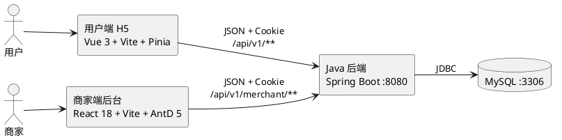

# SRS-工程版（系统需求规格·工程口径）

日期：2026-09-03（2026-09-06 平移，2026-09-09 同步第二阶段范围决议）
版本：v0.2（2026-09-09 同步第二阶段范围决议）
状态：**可提交评审，待后端实现与测试证据回填**

> **文档定位（2026-09-06）**：本文是原 `docs/SRS.md` v0.1 全文平移的工程版，服务开发、测试与需求-接口-测试映射，含接口、数据、事务等技术口径。面向评阅的纯需求版本见 `docs/SRS.md`（交付版）；需求真源始终是 `docs/PRD.md`。两版共用同一套 FR 编号；PRD 变更后按"PRD → 工程版 → 交付版"顺序同步。

## 0. 文档效力、写作纪律与分工

- **唯一需求源**：`docs/PRD.md`。本工程版将 PRD 的用户可见行为转化为可实现、可测试的系统需求，不新增产品范围。
- **接口口径**：`docs/backend/后端接口契约.md`。本工程版只做模块映射和系统级约束，不复制接口字段明细。
- **设计口径**：`docs/design/设计系统-用户端.md`、`docs/design/设计系统-商家端.md`；用户端实现真源为 `docs/design/exports/**`。
- **测试口径**：`docs/project/TDD实施规划.md`。每条 P0 需求至少覆盖正常、缺参/非法值、未登录、越权、资源不存在、状态冲突或重复提交中的适用场景。
- **真实性口径**：没有真实代码、接口响应、数据库记录或测试输出的内容，只能标记为“规划/待验证”，不能描述为已完成。

| 章节 | 责任人 | 初稿交付内容 |
| --- | --- | --- |
| 1 引言、2 需求追踪矩阵 | 组长（付赞平） | 范围、术语、PRD 与接口/测试映射 |
| 3 总体描述、4 功能需求、5 数据需求、6 接口需求、7 非功能需求 | 后端 B（林晨） | 系统行为、数据和约束 |
| 8 测试与验收 | 后端 B（林晨）主笔，测试联调同学（王馨琪）共创 | 测试策略、验收门槛和证据 |
| 全文汇总终审 | 组长（付赞平） | 与 PRD、接口契约、架构实现一致 |

## 1. 引言

### 1.1 编写目的

本文件定义轻量级外卖平台课程项目的系统需求、角色权限、接口边界、数据约束和验收方式，为用户端移动 H5、商家端桌面 Web 后台、Java 后端和数据库提供同一套实现口径。

### 1.2 产品范围

本阶段实现课程基础 P0 闭环：

1. 用户注册、登录、注销、个人信息。
2. 商家注册、登录、店铺开关与店铺基础信息。
3. 用户浏览店铺、分类和商品；商家维护分类和商品。
4. 用户地址增删改查与默认地址。
5. 用户购物车增删改查。
6. 基础订单创建、订单列表、订单详情和明细查询。

按 2026-09-09 第二阶段范围决议（PRD v1.1），**除平台管理员外的全部 P1 与 P2 已纳入本期**：模拟支付与库存一致性、商家订单推进与跨端同步、优惠与统一计价、评价与回复、消息、搜索排序与分页、收藏、会员、红包、规格、取消、配送、图片上传、经营统计与设置/FAQ；商家端原“二期不做”的 7 页与规格维护、联系顾客一并纳入。上述扩展当前均为“本期实现（待开发）”，未取得接口、数据库和测试证据前不得表述为已完成。

P0 订单创建后状态为单一的 `PROCESSING`；扩展订单状态（待支付/待接单/制作中/配送中/已完成/已取消）按 PRD 7.6 与契约实施，属于本期范围但不作为 P0 完成条件。按 PRD 7.6，支付扩展启用后支付成功必须进入 `PENDING`（待接单），`PROCESSING` 不再是支付后的状态；当前后端实现先置 `PROCESSING`、接单后才置 `PENDING`，属实现偏差，需按 PRD 修正。

### 1.3 不在本阶段范围

- 平台客服、电话客服、智能客服和工单系统。
- 第三方支付、真实扣款和支付安全系统（模拟支付本期实现，不接第三方支付）。
- 骑手定位、地图配送和实时物流跟踪（简化配送管理本期实现，只做配送单与状态，不建骑手端、不做地图定位）。
- 复杂 RBAC、多商户组织后台、生产监控和微服务。
- 退款、售后、真实取消订单资金处理（简化取消订单本期实现，只记录取消状态与原因，不接真实退款）。
- 平台管理员（含商家/商品审核与下架后台）：2026-09-09 决议砍掉，不制作页面、接口、数据和测试。

“联系商家”只表示订单用户与该订单商家之间的会话；消息、评价、优惠与经营统计按 2026-09-09 决议纳入本期，当前为“本期实现（待开发）”。

### 1.4 术语

| 术语 | 定义 |
| --- | --- |
| P0 | 课程基础六类能力，必须先形成真实接口和数据闭环 |
| P1 | 中期验收后实施的扩展能力；2026-09-09 决议后除平台管理员外全部 P1/P2 纳入本期 |
| P2 | 可选展示与高级能力；2026-09-09 决议后除平台管理员外全部纳入本期 |
| Mock | 前端本地演示数据，不等同于真实接口验收 |
| real | 前端只调用后端真实接口，关闭 Mock 回退 |
| Session | 服务端保存的登录状态，通过 Cookie 识别角色 |
| 快照 | 订单创建时保存的商品、地址和金额数据，避免历史订单随当前资料变化 |
| cartLineId | 购物车中一行商品的稳定编号 |
| 配送单 | 简化配送管理的数据对象，状态为 PENDING_DELIVERY/DELIVERING/DELIVERED，由商家端推进，用户端只读 |
| 本期实现（待开发） | 已纳入本期范围、但尚无接口、数据库与测试证据的功能；取得证据前不得表述为已完成 |

### 1.5 引用文档

- `docs/PRD.md`
- `docs/backend/后端接口契约.md`
- `docs/backend/后端任务分配与联调清单.md`
- `docs/backend/后端联调验收用例.md`
- `docs/project/分工与里程碑安排.md`
- `docs/project/TDD实施规划.md`
- `docs/design/设计系统-用户端.md`
- `docs/design/设计系统-商家端.md`

### 1.6 版本记录

| 版本 | 日期 | 修改人 | 说明 |
| --- | --- | --- | --- |
| v0.1 | 2026-09-03 | 组长/后端 B 协作 | 将 SRS 骨架补为可评审初稿，建立 P0 需求、接口和测试映射 |
| v0.2 | 2026-09-09 | 组长 | 同步第二阶段范围决议（PRD v1.1）：更新范围与术语、补扩展模块 FR 映射与证据项、§9 库存扣减口径结案并补“阶段 2 老师变更待发布” |

## 2. 需求追踪矩阵

测试编号沿用 `docs/project/TDD实施规划.md` 的矩阵编号；尚未创建的测试用例标记为“9/4 首批失败测试”，扩展模块的 TC 编号待 TDD 规划补录后回填，当前统一记为“待补（本期实现（待开发））”。

| 需求编号 | 需求名称 | PRD 来源 | 接口契约映射 | 测试映射 |
| --- | --- | --- | --- | --- |
| FR-ACC-01 | 用户注册 | PRD 7.1 | 契约 3.1 `POST /users` | TC-ACC-001~007 |
| FR-ACC-02 | 用户登录、注销和当前用户 | PRD 7.1 | 契约 3.1 `POST /auth/login`、`POST /auth/logout`、`GET /me`、`PATCH /me` | TC-ACC-008~012 |
| FR-MER-01 | 商家注册并创建店铺 | PRD 7.2 | 契约 4.1 `POST /merchants` | TC-MER-001~006 |
| FR-MER-02 | 商家登录和店铺信息维护 | PRD 7.2、7.13 | 契约 4.1 | TC-MER-007~012 |
| FR-STO-01 | 店铺列表、详情、分类和商品查询 | PRD 7.3 | 契约 3.2 `GET /stores/**`、`GET /products/{id}` | TC-STO-001~008 |
| FR-ADR-01 | 地址查询、新增、修改和删除 | PRD 7.5 | 契约 3.3 `GET/POST/PATCH/DELETE /me/addresses/**` | TC-ADR-001~009 |
| FR-CAT-01 | 商家分类增删改查 | PRD 7.12 | 契约 4.2 `/merchant/categories` | TC-CAT-001~008 |
| FR-PRD-01 | 商家商品增删改查 | PRD 7.12 | 契约 4.2 `/merchant/products` | TC-PRD-001~014 |
| FR-CART-01 | 购物车查询、加购、改数量和删除 | PRD 7.4 | 契约 3.4 `/cart`、`/cart/items` | TC-CRT-001~010 |
| FR-ORD-01 | 从购物车创建基础订单 | PRD 7.6 | 契约 3.5 `POST /orders` | TC-ORD-001~012 |
| FR-ORD-02 | 用户订单列表、详情和明细 | PRD 7.6 | 契约 3.5 `GET /orders/**` | TC-ORD-013~020 |
| FR-MORD-01 | 商家订单列表和详情查询 | PRD 7.16.2 | 契约 5.1 `GET /merchant/orders/**` | 9/4 首批失败测试 |
| FR-PAY-01 | 模拟支付结果更新与待支付倒计时 | PRD 7.5 | 契约 3.5 `POST /orders/{id}/payment` | TC-ORD-017~020（P1 扩展）；本期实现（待开发） |
| FR-OST-01 | 商家订单状态推进与跨端同步 | PRD 7.6、7.11 | 契约 5.2 | TC-ORD-017~020（P1 扩展）；本期实现（待开发） |
| FR-PRM-01 | 优惠与后端统一计价 | PRD 7.4 | 契约 6.3（计价接入待新增章节） | 待补（本期实现（待开发）） |
| FR-SKU-01 | 商品规格 | PRD 7.3、7.12 | 契约 4.2 `PUT /merchant/products/{productId}/specifications` | 待补（本期实现（待开发）） |
| FR-REV-01 | 评价与商家回复 | PRD 7.7、7.14 | 契约 6.2 | 待补（本期实现（待开发）） |
| FR-MSG-01 | 消息与联系商家 | PRD 7.8、6.10 | 契约 6.1 | 待补（本期实现（待开发）） |
| FR-SEA-02 | 关键词搜索与历史 | PRD 7.2 | 契约 3.2 | 待补（本期实现（待开发）） |
| FR-SEA-03 | 搜索排序与分页 | PRD 7.2、7.17 | 契约 3.2（分页与排序参数待回写） | 待补（本期实现（待开发）） |
| FR-FAV-01 | 商家收藏 | PRD 7.10 | 契约待新增章节 | 待补（本期实现（待开发）） |
| FR-MBR-01 | 会员权益 | PRD 7.10 | 契约待新增章节 | 待补（本期实现（待开发）） |
| FR-RED-01 | 红包 | PRD 7.10、7.4 | 契约待新增章节 | 待补（本期实现（待开发）） |
| FR-CXL-01 | 取消订单 | PRD 7.6 | 契约待新增章节 | 待补（本期实现（待开发）） |
| FR-DLV-01 | 配送单与配送状态 | PRD 7.6 | 契约待新增章节 | 待补（本期实现（待开发）） |
| FR-IMG-01 | 图片上传 | PRD 7.7、7.12 | 契约待新增章节 | 待补（本期实现（待开发）） |
| FR-STA-01 | 商家经营概览与数据统计 | PRD 6.12、7.14 | 契约 6.3 `GET /merchant/analytics` | 待补（本期实现（待开发）） |
| FR-SET-01 | 设置与 FAQ | PRD 7.10 | 契约 3.1 `GET /me`、`PATCH /me` | 待补（本期实现（待开发）） |
| FR-MPRM-01 | 商家端优惠配置 | PRD 6.16、7.13 | 契约 6.3 | 待补（本期实现（待开发）） |
| FR-MREV-01 | 商家端评价管理与回复 | PRD 6.17、7.14 | 契约 6.2 | 待补（本期实现（待开发）） |
| FR-MMSG-01 | 商家端消息 | PRD 6.17、7.8 | 契约 6.1 | 待补（本期实现（待开发）） |
| FR-MSKU-01 | 商家端规格维护 | PRD 6.14、7.12 | 契约 4.2 | 待补（本期实现（待开发）） |
| FR-MCAT-02 | 分类绑定商品 | PRD 6.14、7.12 | 契约 4.2（待补） | 待补（本期实现（待开发）） |
| FR-MORD-02 | 联系顾客 | PRD 7.11、6.13 | 契约 6.1 | 待补（本期实现（待开发）） |

> <!-- TODO(组长): 追踪矩阵下方的免责声明可删除（显而易见） -->

## 3. 总体描述

### 3.1 角色与权限

系统包含用户和商家两类业务角色，使用不同的 Session Cookie：

| 维度 | 用户 | 商家 |
| --- | --- | --- |
| 登录入口 | 用户端移动 H5 | 商家端桌面 Web 后台 |
| Cookie | `user_session` | `merchant_session` |
| 可访问范围 | 所有公开店铺/商品；本人地址、购物车、订单 | 当前 Session 绑定店铺的店铺、分类、商品、订单 |
| 禁止范围 | `/api/v1/merchant/**` 和他人私有资源 | 用户私有地址、购物车、订单及其他店铺资源 |
| 未登录 | 受保护接口返回 `401` | 受保护接口返回 `401` |
| 角色不匹配 | 返回 `403` | 返回 `403` |
| 资源归属不匹配 | 按安全规则返回 `404`，不泄露资源存在 | 同左 |

服务端不信任请求体中的 `userId`、`merchantId` 或 `storeId` 作为权限依据；必须从 Session 和数据库关系确认归属。

### 3.2 系统上下文



工程拓扑：

```text
frontend/user-h5/         用户端移动 H5
frontend/merchant-admin/  商家端桌面后台
backend/                  Java 后端与数据库脚本
docs/                     PRD、SRS、契约、设计和测试记录
```

### 3.3 运行环境

| 层 | 初稿选型 | 默认地址 |
| --- | --- | --- |
| 用户端 | Node 18+、Vue 3、Vite、Pinia、Vue Router、Axios | `127.0.0.1:5173` |
| 商家端 | Node 18+、React 18、Vite、Ant Design 5 | `127.0.0.1:5174` |
| 后端 | JDK 17+、Spring Boot、MyBatis 或 JPA 待后端最终确认 | `127.0.0.1:8080` |
| 数据库 | MySQL，版本待后端最终确认 | `127.0.0.1:3306` |

联调与验收阶段禁止前端 Mock 回退，所有请求必须经过后端真实接口。

### 3.4 全局业务约束

1. 接口统一以 `/api/v1` 开头，商家接口以 `/api/v1/merchant` 开头。
2. 成功响应为 `{ "code": 0, "message": "success", "data": {} }`。
3. 列表无数据返回 `data: []`，不是错误。
4. 时间格式统一为东八区 `yyyy-MM-dd HH:mm:ss`。
5. 金额单位为元，由后端计算并保留两位小数。
6. P0 订单实付金额 = 商品小计 + 固定打包费 `2.00` 元；扩展期按 PRD 7.4 固定顺序计算满减、新客立减、配送费优惠、会员折扣与红包，最终金额再计入配送费（默认 `3.00` 元，可由店铺配置，未配置按 0）与打包费 `2.00` 元且不小于 0；会员价与会员折扣不叠加；最终金额以后端计算结果为准，前端传入金额只用于提示或一致性检查。
7. 订单必须保存商品快照、地址快照、金额快照和创建时间。
8. 订单创建时订单头、订单明细、快照和购物车清空必须在同一事务内完成。
9. 数量和库存不得为负数；商品下架或库存不足时不得加入购物车或创建订单。
10. 密码不得出现在响应、日志和提交文件中。

## 4. 功能需求

### 4.1 账号与角色

**FR-ACC-01 用户注册**

- 输入：账号、密码、昵称；具体长度和格式以 PRD 7.1 与契约 3.1 为准。
- 处理：校验格式和账号唯一性，保存用户后返回用户摘要，不返回密码。
- 正常验收：合法账号注册成功；重复账号返回 `409`。
- 异常验收：缺少必填字段、账号格式错误、密码不合法返回 `400`；重复提交不产生第二个账号。

**FR-ACC-02 用户会话**

- 正常验收：用户登录成功写入 `user_session`；`GET /me` 返回当前用户；注销后 Session 失效。
- 异常验收：账号或密码错误返回 `401`；未登录访问受保护资源返回 `401`；商家角色访问用户接口按权限规则处理。

**FR-MER-01 商家注册和登录**

- 正常验收：商家注册同时创建绑定店铺，初始状态为 `CLOSED`；商家登录写入 `merchant_session`。
- 异常验收：账号重复返回 `409`；字段缺失/格式错误返回 `400`；用户 Session 不能访问商家接口；商家不能访问用户私有资源。

### 4.2 店铺、分类和商品

**FR-STO-01 用户浏览**

- 用户可以按关键词、分类和排序条件查询店铺，查看店铺详情、营业状态、分类和商品。
- 正常验收：返回契约要求的店铺和商品字段；无数据返回空数组；下架商品不显示为可购买状态。
- 异常验收：非法查询参数返回 `400`；不存在店铺返回 `404`；关闭店铺不能继续进入下单链路。

**FR-MER-02 店铺设置**

- 商家只能读取和修改自己绑定店铺的基础信息及营业状态。
- 正常验收：修改成功后，用户端重新查询可看到最新状态。
- 异常验收：未登录 `401`、角色不匹配 `403`、资源归属不符 `404`、字段非法 `400`；状态切换失败时不得提前展示成功。

**FR-CAT-01 分类管理**

- 商家可查询、新增、修改和删除当前店铺分类。
- 正常验收：同店铺分类名称唯一；分类修改后商品归属可正确查询。
- 异常验收：同名分类返回 `409`；删除仍有商品的分类返回 `409`；不存在或不属于当前店铺的分类返回 `404`。

**FR-PRD-01 商品管理**

- 商家可查询、新增、修改、删除商品，并维护价格、库存、上下架状态和分类。
- 正常验收：商品列表、详情和用户端店铺商品查询字段一致；删除只允许下架商品。
- 异常验收：价格/库存/名称/分类非法返回 `400`；售中商品删除返回 `409`；越权或不存在商品返回 `404`；库存为 0 时用户端显示售罄并禁止加购。

### 4.3 地址

**FR-ADR-01 地址管理**

- 用户可查询本人地址、新增地址、修改地址、删除地址和设置默认地址。
- 正常验收：地址字段完整；最多一个默认地址；删除默认地址后按契约将剩余地址中的最近一条设为默认，无地址时默认值为空。
- 异常验收：未登录 `401`；必填字段缺失/手机号或性别格式错误 `400`；访问他人地址 `404`；删除不存在地址 `404`；重复设置默认地址不产生多个默认地址。

### 4.4 购物车

**FR-CART-01 购物车管理**

- 购物车范围为“当前用户 + 当前店铺 + 商品”；同一商品重复加购合并数量。
- 正常验收：可查询、加购、修改数量和删除；修改后行价和总量一致；数量为 0 时删除该行或返回明确错误。
- 异常验收：未登录 `401`；商品不存在/下架/不属于店铺 `404` 或 `409`；数量缺失、非正数或超库存 `400`；不同用户不能读取或修改他人购物车。

### 4.5 基础订单

**FR-ORD-01 订单创建**

- 输入店铺、地址、备注和可选的预期金额；后端以当前购物车、商品、库存和店铺数据重新计算。
- 正常验收：保存订单头、商品快照、地址快照和金额快照；状态为 `PROCESSING`；事务成功后清空该用户该店铺购物车。
- 异常验收：未登录 `401`；购物车为空、地址不属于当前用户、店铺关闭、商品下架、库存不足、起送条件不满足时拒绝创建；预期金额不一致不得覆盖后端计算；事务失败时购物车和订单数据均保持原状。

**FR-ORD-02 用户订单查询**

- 用户可查询本人订单列表、订单详情和明细。
- 正常验收：新订单出现在列表；详情包含商品、地址、金额和状态快照。
- 异常验收：未登录 `401`；查询他人订单按安全规则返回 `404`；不存在订单 `404`；列表无数据返回空数组。

**FR-MORD-01 商家订单查询**

- 当前商家可查询绑定店铺的订单列表和订单详情。
- 正常验收：订单列表、详情、商品快照、地址展示范围和金额构成符合契约；订单来自当前绑定店铺。
- 异常验收：未登录 `401`；用户访问商家订单接口 `403`；其他店铺订单按安全规则不可见；订单不存在 `404`；非法筛选参数 `400`。
- 扩展范围（本期实现（待开发））：扩展订单状态（`PENDING_PAYMENT`/`PENDING`/`COOKING`/`DELIVERING`/`COMPLETED`/`CANCELLED`）与取消、配送规则按 PRD 7.6 与契约实施，不混入 P0 用例验收。

## 5. 数据需求

### 5.1 数据实体与关系

| 实体 | 主要职责 | 关键关系 |
| --- | --- | --- |
| `user` | 用户账号和个人信息 | 一个用户有多个地址、购物车行和订单 |
| `merchant` | 商家账号 | 一个商家绑定多个店铺 |
| `store` | 店铺信息和营业状态 | 一个店铺有多个分类、商品和订单 |
| `category` | 店铺商品分类 | 一个分类有多个商品 |
| `product` | 商品价格、库存和上下架 | 属于一个店铺和一个分类 |
| `address` | 用户收货地址 | 属于一个用户，可有一个默认地址 |
| `cart_item` | 购物车商品行 | 属于一个用户、一个店铺和一个商品 |
| `order` | 订单头、状态和金额快照 | 属于一个用户和一个店铺 |
| `order_item` | 订单商品快照 | 属于一个订单，不依赖商品当前值 |

关系约束：

- `merchant 1 : N store`
- `store 1 : N category`
- `store 1 : N product`
- `category 1 : N product`
- `user 1 : N address`
- `user 1 : N cart_item`
- `user 1 : N order`
- `order 1 : N order_item`

### 5.2 P0 数据字典

| 实体 | 必要字段 | 约束 |
| --- | --- | --- |
| 用户 | `userId`、`account`、`passwordHash`、`nickname`、`createdAt` | `account` 唯一；仅存密码摘要 |
| 商家 | `merchantId`、`account`、`passwordHash`、`createdAt` | `account` 唯一；注册时自动创建绑定店铺 |
| 店铺 | `storeId`、`merchantId`、`name`、`description`、`image`、`rating`、`monthlySales`、`deliveryMinutes`、`startPrice`、`deliveryFee`、`status` | `merchantId` 关联所属商家；`status` 为 `OPEN/CLOSED/TEMPORARILY_CLOSED` |
| 分类 | `categoryId`、`storeId`、`name`、`sortOrder` | 同店铺 `name` 唯一 |
| 商品 | `productId`、`storeId`、`categoryId`、`name`、`description`、`image`、`price`、`stock`、`onSale` | `price >= 0`、`stock >= 0` |
| 地址 | `addressId`、`userId`、`contactName`、`contactSex`、`contactPhone`、`region`、`detail`、`label`、`isDefault` | 只能被所属用户访问 |
| 购物车行 | `cartLineId`、`userId`、`storeId`、`productId`、`quantity` | 数量大于 0；P0 同商品合并 |
| 订单 | `orderId`、`userId`、`storeId`、`status`、`productSubtotal`、`packagingFee`、`totalAmount`、`addressSnapshot`、`createdAt` | `totalAmount = productSubtotal + packagingFee` |
| 订单明细 | `orderItemId`、`orderId`、`productId`、`productNameSnapshot`、`unitPriceSnapshot`、`quantity`、`lineAmount` | 保存创建订单时快照 |

对外业务编号必须稳定；数据库内部主键不直接暴露为接口口径。

扩展模块（优惠、红包、会员、规格、取消、配送、评价、消息、图片、统计）的数据实体与字段由契约新增章节和数据库脚本确定，当前为“本期实现（待开发）”，落地后回填本节。

### 5.3 存储与事务

- 业务数据使用关系型数据库持久化，具体 MySQL 版本和 ORM 由后端架构设计确认。
- 建表脚本和种子数据必须可重复执行或先清理后初始化。
- 订单创建是一个事务：校验购物车/商品/地址/店铺，写订单和明细快照，扣减或锁定相关库存（P0 以契约最终实现为准），成功后清空购物车。
- 事务失败、异常退出或并发冲突时不得留下半个订单；服务端返回 `409` 或 `500` 的统一 JSON 响应。

## 6. 接口需求

### 6.1 接口总则

- 所有请求使用 UTF-8 和 JSON；查询条件使用 URL 参数，新增/修改使用 JSON 请求体。
- 登录成功通过 `Set-Cookie` 建立 Session；前端请求必须携带 `credentials`。
- 成功使用 `HTTP 2xx + code=0`；业务失败使用契约规定的 HTTP 状态码和非零 `code`。
- 最小错误状态：`400` 参数错误、`401` 未登录、`403` 角色/权限错误、`404` 资源不存在或不可见、`409` 冲突、`500` 服务端异常。
- 服务端异常也必须返回 JSON，不能把 HTML 错误页作为接口响应。

### 6.2 P0 接口分组

| 模块 | 契约章节 | 主要接口 |
| --- | --- | --- |
| 用户账号 | 3.1 | `/users`、`/auth/login`、`/auth/logout`、`/me` |
| 店铺商品查询 | 3.2 | `/stores`、`/stores/{storeId}`、`/stores/{storeId}/categories`、`/stores/{storeId}/products`、`/products/{productId}` |
| 地址 | 3.3 | `/me/addresses/**` |
| 购物车 | 3.4 | `/cart`、`/cart/items` |
| 用户订单 | 3.5 | `/orders`、`/orders/{orderId}`、`/orders/{orderId}/items` |
| 商家账号与店铺 | 4.1 | `/merchants`、`/merchant/auth/login`、`/merchant/me`、`/merchant/store` |
| 商家分类与商品 | 4.2 | `/merchant/categories`、`/merchant/products` |
| 商家订单查询 | 5.1 | `/merchant/orders`、`/merchant/orders/{orderId}` |

完整方法、路径、请求字段、响应字段和错误码以接口契约为准；后端实现发生调整时，必须同步回写契约与本工程版的映射，不允许只改前端。

扩展模块（优惠与计价、评价与回复、消息、搜索分页、收藏、会员、红包、规格、取消、配送、图片上传、统计）的接口按契约新增章节实施，当前为“本期实现（待开发）”；契约缺口未补齐前不允许进入实现与测试，映射见第 2 章。

### 6.3 接口一致性要求

1. 同一字段在用户端和商家端含义一致，状态值不能按页面自行改名。
2. 订单详情金额固定展示“商品合计、打包费、实付金额”三项。
3. 订单状态 P0 只使用 `PROCESSING`；P1/P2 扩展状态（待支付/待接单/制作中/配送中/已完成/已取消）按 PRD 7.6 与契约实施，不得混入 P0 用例验收。
4. 所有资源查询和写操作必须执行 Session 身份与店铺/用户归属检查。
5. 重复支付、重复创建、重复状态推进等操作必须具备幂等或明确返回 `409` 的行为。

## 7. 非功能需求

| 编号 | 类别 | 要求 | 验证方式 |
| --- | --- | --- | --- |
| NFR-01 | 可维护性 | 三端独立工程，后端按 Controller/Service/DAO（或 Repository）分层 | 目录和代码检查 |
| NFR-02 | 可测试性 | 核心业务先有失败测试，再实现和回归；异常场景不能跳过 | Git 顺序、测试报告 |
| NFR-03 | 安全 | Session 识别角色，服务端校验资源归属，密码不入响应和日志 | 接口权限测试、日志检查 |
| NFR-04 | 一致性 | 订单金额由后端计算；订单写入和购物车变化受事务保护 | 接口测试、数据库记录 |
| NFR-05 | 幂等性 | 重复提交不能产生重复账号、重复订单或重复扣减 | 重复请求测试 |
| NFR-06 | 兼容性 | 用户端适配移动视口；商家端桌面优先，最低验证宽度 1280px | 浏览器和截图验证 |
| NFR-07 | 性能 | 课程规模下，普通列表查询和详情查询应在本地开发环境可交互返回；不设置生产级 SLA | 手工联调记录 |
| NFR-08 | 可部署性 | 用户端、商家端、后端和数据库可独立启动；局域网手机可访问用户端 | 构建、启动和手机访问记录 |
| NFR-09 | 可追溯性 | PRD、SRS、接口、测试、代码和每日记录之间可相互追踪 | 文档和 Git 检查 |
| NFR-10 | 可解释性 | 每位成员能说明本人负责模块的需求、接口、测试和数据表 | 交叉验收/答辩抽查 |

## 8. 测试与验收

### 8.1 测试分层

| 层级 | 责任 | 主要内容 |
| --- | --- | --- |
| 后端单元测试 | 各后端模块负责人 | Service 校验、金额计算、状态和权限边界 |
| 后端接口测试 | 后端 A 与测试联调 | HTTP 状态、统一响应、Session、异常码和数据归属 |
| 用户端测试 | 用户端负责人 | API 归一化、Store action、购物车和核心交互 |
| 商家端测试 | 商家端/测试联调负责人 | 表单校验、表格/抽屉/状态展示和权限入口 |
| 集成联调 | 测试联调同学 | 用户注册到下单、商家订单查询、真实接口回归 |
| 交叉验收 | 全组 | 按固定演示数据和验收脚本复核完整系统 |

### 8.2 首批失败测试范围（2026-09-04）

第一批测试应先覆盖下列异常，而不是只写成功用例：

- 用户账号格式错误、密码不合法、重复注册、错误登录。
- 未登录访问、用户访问商家接口、商家访问他人资源。
- 店铺不存在/关闭、商品下架/库存不足。
- 分类重名、删除有商品分类、售中商品删除。
- 地址不属于当前用户、无效地址字段、默认地址冲突。
- 购物车数量非正数、超库存、跨店铺商品。
- 空购物车下单、地址非法、预期金额篡改、重复提交订单。
- 商家订单查询越权、非法筛选和不存在订单。

### 8.3 P0 主链路验收

以下链路必须在真实接口模式下重复完成：

1. 用户使用固定账号登录。
2. 首页看到包含 `m002` 的真实店铺列表。
3. 进入 `m002` 查看店铺和商品。
4. 加购、修改数量、删除并重新查询购物车。
5. 选择本人地址进入确认订单。
6. 创建订单，验证订单状态为 `PROCESSING`、金额和快照。
7. 查询用户订单列表和详情。
8. 商家登录并查询当前店铺订单列表和详情。

P0 通过门槛：

- 前端 Mock 回退关闭，接口响应来自后端。
- 数据库存在可解释的用户、店铺、商品、地址、购物车和订单记录。
- 正常和主要异常测试有输出，不能只展示页面截图。
- 订单创建失败时无半成功数据；越权请求不能读到其他用户/店铺数据。
- 用户端可通过局域网访问；商家端在不低于 1280px 桌面宽度可操作。

### 8.4 证据清单

> <!-- TODO(全体): 本节为项目交付管理内容，建议移至 docs/project/分工与里程碑安排.md -->

| 证据 | 位置 | 当前状态 |
| --- | --- | --- |
| SRS 工程版 | `docs/SRS-工程版.md` | 本次同步（v0.2）；交付版见 `docs/SRS.md` |
| 接口契约 | `docs/backend/后端接口契约.md` | 已有草案，P0 部分已明确 |
| 架构与 ER 图 | `docs/backend/架构设计.md`、`docs/backend/diagrams/` | 架构文档待后端确认，图源已有 |
| 后端代码和测试 | `backend/` | 待初始化 |
| 前端代码和构建结果 | `frontend/user-h5/`、`frontend/merchant-admin/` | 待初始化 |
| 接口联调记录 | `docs/testing/` | 待建立 |
| 每日进度与 AI 使用点 | `docs/record/daily/` | 按日补充 |
| 扩展模块接口契约 | `docs/backend/后端接口契约.md` 第 6 章与待新增章节 | 待补（本期实现（待开发）） |
| 扩展模块测试用例 | `docs/project/TDD实施规划.md` 第 5 章扩展段 | 待补（本期实现（待开发）） |
| 扩展模块页面与联调记录 | `frontend/user-h5/`、`frontend/merchant-admin/`、`docs/testing/` | 待补（本期实现（待开发）） |

## 9. 待确认事项

> <!-- TODO(组长): 本节为项目管理内容，不属于 SRS 规范范畴，建议移至 docs/project/项目规则.md 或待办 issue -->

以下事项不阻塞本工程版初稿提交，但必须在代码进入对应模块前确认并回写：

1. 后端 Spring Boot、MyBatis/JPA、MySQL 的精确版本。
2. `docs/backend/架构设计.md` 的最终模块划分、ER 图落点和事务实现方式。
3. 订单创建时的库存处理（已按契约现状结案）：创建订单在同一事务内校验并扣减库存；支付超时未支付不自动回补库存；用户取消订单在同一事务内回补库存。两种回补口径不得混用（PRD 7.6、7.16）。
4. SRS 第 2 章测试编号与测试联调同学实际文件名的最终对应；扩展模块的 TC 编号待 TDD 规划补录后回填。
5. 服务器、数据库和局域网演示环境的具体部署参数。
6. 阶段 2 老师下发的需求变更内容尚未发布：本组 2026-09-09 范围决议只落“本组范围决策”，不替代老师变更；变更到达后按“先补失败测试锁定新行为，再改业务代码并回归”执行。

待确认事项不得被写成已实现；确认后应同步 SRS、接口契约、测试用例和运行说明。

## 10. 时间锚点

> <!-- TODO(组长): 本节与 docs/project/分工与里程碑安排.md 重复，建议删除 -->

- **2026-09-03**：完成 SRS 可评审初稿，后端接口 P0 范围按现有契约冻结。
- **2026-09-04**：提交 SRS；提交第一批失败测试，开始三端并行开发。
- **2026-09-05 至 2026-09-06**：注册登录/权限、分类、店铺浏览和购物车链路冲刺。
- **2026-09-07 晚**：P0 主链路真实接口联调和验收演练。
- **2026-09-08 或 2026-09-09**：第一阶段中期验收，之后进入需求变更。
- **2026-09-15**：功能冻结。

