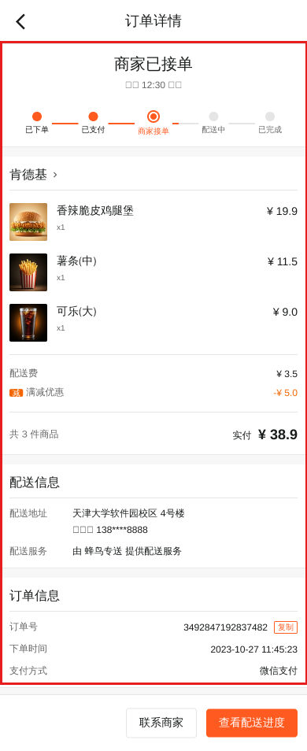
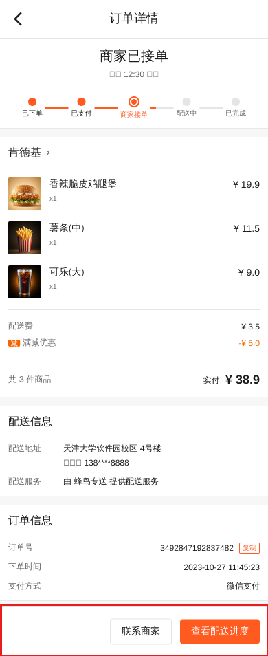
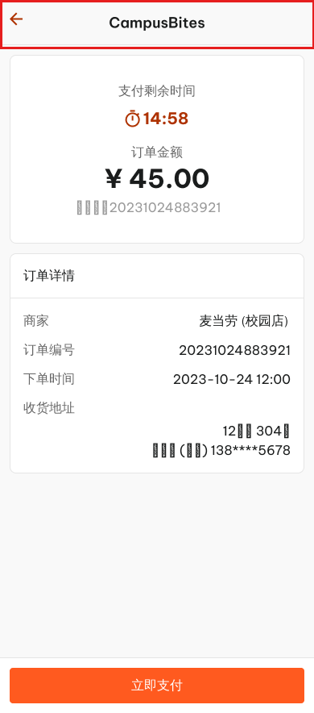
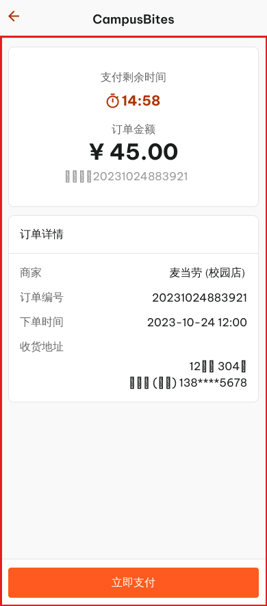

# SRS（软件需求规格说明）交付版

日期：2026-09-06  
版本：v1.1（2026-09-09 同步第二阶段范围决议）
状态：**面向评阅的交付版；需求真源为 `docs/PRD.md`**

## 0. 文档效力与阅读说明

- 本文回答"这套系统要为谁、做什么、做到什么程度算合格"，全文使用需求语言，不涉及编程语言、数据库和接口实现细节，没有技术背景的读者也能完整阅读。9 月 16 日双盲交叉验收时，验收组按本文执行即可。
- **需求真源**：`docs/PRD.md`。本文是 PRD 的需求规格视图，只做组织与表达，不新增产品范围；两份材料冲突时以 PRD 为准，先由小组共同修订再实施。
- **配套文档**：系统行为细化与"需求—接口—测试"映射见 `docs/SRS-工程版.md`；请求与响应字段细节见 `docs/backend/后端接口契约.md`；界面视觉规范见 `docs/design/` 设计系统；测试过程纪律见 `docs/project/TDD实施规划.md`。
- 本文与工程版共用同一套需求编号（FR-xx）和优先级口径（P0/P1/P2），编号含义见第 2 章注记。

## 1. 引言

### 1.1 编写目的

本项目是一套"用户在手机上点外卖、商家在电脑上接单管理"的外卖平台课程作品。本文把 PRD 确定的产品内容整理成一份人人能读的需求清单：系统包含哪些角色、每个角色能用它做什么、每件事做到什么程度算合格。它是全组开发、测试和验收的共同依据。

### 1.2 产品范围

系统包含两端：**用户端移动网页**（手机点外卖）与**商家端桌面后台**（商家在电脑上管理店铺和订单）。两端连着同一个系统，共用同一份数据。

本阶段必须完成的基础 P0 六类能力：

1. 用户注册、登录、注销，查看和修改个人信息。
2. 商家注册、登录，开店、关店和临时闭店。
3. 用户浏览店铺、商品分类和商品；商家维护分类和商品。
4. 用户收货地址的查看、新增、修改、删除和默认地址。
5. 用户购物车的查看、加入、改数量、删除。
6. 创建订单，以及订单列表、订单详情的查询。

按 2026-09-09 第二阶段范围决议（负责人拍板，已写入 PRD v1.1），**除平台管理员外的全部 P1 与 P2 已纳入本期开发**：模拟支付与库存一致性、商家订单推进与跨端同步、优惠与后端统一计价、评价与商家回复、用户与商家消息、搜索排序与分页、商家收藏、会员权益、红包、商品规格扩展、待支付倒计时、再来一单、评价订单、分类绑定商品，以及简化取消订单、简化配送管理、图片上传与设置/FAQ；**平台管理员已砍掉**。上述扩展在本文中仍单独标注优先级，不与 P0 混同；未取得真实接口、数据库记录和测试证据前，一律表述为"本期实现（待开发）"。

### 1.3 不在本阶段范围

- 平台客服、电话客服、智能客服和工单系统。
- 第三方支付、真实扣款和支付安全系统（模拟支付本期实现，只做模拟支付状态，不接第三方支付）。
- 骑手定位、地图配送和实时物流跟踪（**简化配送管理与配送单已于 2026-09-11 砍掉，CHG-002**；配送进度由订单状态表达）。
- 多商户组织后台、生产级监控和微服务架构。
- 退款、售后和真实取消订单的资金处理（简化取消订单本期实现，只记录取消状态与原因，不接真实退款）。
- 平台管理员（含商家/商品审核与下架后台）：2026-09-09 决议砍掉，不制作页面、接口、数据和测试，不作为交付内容。

"联系商家"只表示订单用户与该订单商家之间的会话，不提供任何形式的平台客服。

### 1.4 术语

| 术语 | 含义 |
| --- | --- |
| P0 / P1 / P2 | 优先级：P0 是课程基础能力，必须完成并形成真实数据闭环；P1 是本组扩展；P2 是可选展示与高级能力；2026-09-09 决议后除平台管理员外全部 P1/P2 均纳入本期 |
| 演示数据 | 为保证页面第一次打开就有内容而准备的固定数据（如 5 家演示商家），不等同于真实使用产生的数据 |
| 下单留档 | 订单创建时把商品价格、数量、收货地址和金额照原样保存一份，历史订单不随商家改价、改商品或用户改地址而变化 |
| 购物车行 | 购物车里同一家店的同一种商品占一行，重复加购只累加数量 |
| 售罄 | 商品库存为 0，页面灰化且不能加入购物车 |
| 起送价 | 商家设置的最低下单金额，不满足时不能结算 |
| 登录过期 | 长时间未操作后登录状态失效，需要重新登录；重新登录后回到原来正在做的操作 |
| ~~配送单~~ | 简化配送管理的数据对象，状态为待配送 / 配送中 / 已送达，由商家端推进，用户端只读展示，不建骑手端 | （**2026-09-11 已砍掉，CHG-002**：配送状态改由订单状态表达，不建配送单）
| 本期实现（待开发） | 已纳入本期范围、但尚无真实接口、数据库记录和测试证据的功能；取得证据前不得表述为已完成 |

### 1.5 引用文档

- `docs/PRD.md`（需求真源）
- `docs/SRS-工程版.md`（系统行为细化与工程映射）
- `docs/backend/后端接口契约.md`（接口字段细节）
- `docs/project/TDD实施规划.md`（测试纪律）
- `docs/design/设计系统-用户端.md`、`docs/design/设计系统-商家端.md`（视觉规范）

### 1.6 版本记录

| 版本 | 日期 | 修改人 | 说明 |
| --- | --- | --- | --- |
| v0.1 | 2026-09-03 | 组长/后端 B 协作 | 建立 P0 需求、接口和测试映射（现平移至 `docs/SRS-工程版.md`） |
| v1.0 | 2026-09-06 | 组长 | 按课程口径"只描述需求、不涉及技术实现、非专业人士可读"整体改写为交付版；收录产品结构图、泳道图与原型说明 |
| v1.1 | 2026-09-09 | 组长 | 同步第二阶段范围决议（PRD v1.1）：除平台管理员外全部 P1/P2 纳入本期；改写产品范围与不在范围、扩展流程、功能需求，补页面清单与验收项 |

## 2. 需求追踪矩阵

编号规则与工程版同源：FR-xx 为需求编号，每条需求在本文第 5 章有完整的正常与异常场景描述。接口与测试用例的逐条映射见工程版第 2 章；本文矩阵只保证"每条需求都能追溯到 PRD 出处和验收证据"。

| 需求编号 | 需求名称 | 优先级 | PRD 来源 | 主要验收证据 |
| --- | --- | --- | --- | --- |
| FR-ACC-01 | 用户注册 | P0 | 7.1 / 6.2 | 注册成功可登录；重复注册被拦截并有提示 |
| FR-ACC-02 | 用户登录与个人信息 | P0 | 7.1 / 7.15 | 登录、修改资料、登录过期后重新登录 |
| FR-SEA-01 | 首页与分类找店 | P0 | 7.2 / 6.3 | 首页结构、分类列表与排序切换 |
| FR-SEA-02 | 关键词搜索与历史 | P1（本期） | 7.2 / 6.3 | 商家与商品双结果汇总、历史清空 |
| FR-SEA-03 | 搜索排序与分页 | P1（本期） | 7.2 / 7.17 | 综合/销量/距离排序、每页 10 条分页 |
| FR-STO-01 | 店铺与商品浏览 | P0 | 7.3 / 6.4 | 店铺详情、分类切换、售罄与休息态 |
| FR-CART-01 | 购物车 | P0 | 7.3 / 6.5 | 加购、数量调整、按商家隔离 |
| FR-ADR-01 | 收货地址 | P0 | 7.9 / 6.9 | 增删改查、默认地址规则 |
| FR-ORD-01 | 创建订单 | P0 | 7.4 / 7.16 / 6.6 | 金额规则、异常拦截、完整成功或完整失败 |
| FR-ORD-02 | 订单查询与再来一单 | P0 | 7.6 / 6.7 | 列表与详情、下单留档展示；再来一单重建购物车（本期实现（待开发）） |
| FR-MER-01 | 商家注册与登录 | P0 | 7.1 / 6.2 | 注册即建店（初始关门）、双端身份互不相通 |
| FR-MER-02 | 店铺设置与营业状态 | P0 | 7.13 / 6.15 | 状态切换后用户端读到最新结果 |
| FR-CAT-01 | 分类管理 | P0 | 7.12 / 6.14 | 分类名唯一、有商品不能删 |
| FR-PRD-01 | 商品管理 | P0 | 7.12 / 6.14 | 上下架、售罄、下架后可删 |
| FR-MORD-01 | 商家订单查询 | P0 | 7.11 / 6.13 | 本店订单列表与详情 |
| FR-PAY-01 | 模拟支付与待支付倒计时 | P1（本期） | 7.5 / 6.7 | 支付成功/失败反馈页与状态更新 |
| FR-OST-01 | 商家订单状态推进 | P1（本期） | 7.6 / 7.11 | 顺序推进、重复点击不重复生效、跨端回显 |
| FR-PRM-01 | 优惠与统一计价 | P1（本期） | 7.4 / 6.16 | 固定计价顺序、演示数值口径与金额边界 |
| FR-SKU-01 | 商品规格 | P1（本期） | 7.3 / 7.12 | 规格选项与价差、规格行购物车 |
| FR-REV-01 | 评价与商家回复 | P1（本期） | 7.7 / 7.14 | 一单一评、回复回显 |
| FR-MSG-01 | 消息与联系商家 | P1（本期） | 7.8 / 6.10 | 双端未读、消息时间线、联系商家入口 |
| FR-FAV-01 | 商家收藏 | P1（本期） | 7.10 / 6.11 | 收藏/取消收藏、收藏页列表 |
| FR-MBR-01 | 会员权益 | P1（本期） | 7.10 / 6.11 | 会员标识、会员价与权益说明页 |
| FR-RED-01 | 红包 | P1（本期） | 7.10 / 6.11 | 红包列表、门槛与适用范围、一单一张 |
| FR-RED-02 | 开红包（CHG-001） | P1（本期） | 7.10 / 7.4 | 购买一组红包、待开区、开箱动效浮窗、8 档随机替换、开箱后重置 7 天 |
| FR-SET-01 | 设置与 FAQ | P2（本期） | 7.10 / 6.11 | 个人资料编辑、退出登录、课程问答页 |
| FR-CXL-01 | 取消订单 | P2（本期） | 7.6 | 仅未支付/未接单可取消、原因必填、事务内回补库存 |
| FR-DLV-01 | 配送信息与配送状态 | **已砍掉（CHG-002）** | 7.6 | 配送单三态、商家端推进、用户端只读 |
| FR-IMG-01 | 图片上传 | P2（本期） | 7.7 / 7.12 | 商品图片与评价图片上传、预览、失败重试 |
| FR-STA-01 | 商家经营概览与数据统计 | P1（本期） | 6.12 / 7.14 | 真实订单聚合、趋势与客单价 |
| FR-MPRM-01 | 商家端优惠配置 | P1（本期） | 6.16 / 7.13 | 满减/新客立减/配送费优惠/会员折扣配置 |
| FR-MREV-01 | 商家端评价管理与回复 | P1（本期） | 6.17 / 7.14 | 筛选、评分分布、回复与更新回复 |
| FR-MMSG-01 | 商家端消息 | P1（本期） | 6.17 / 7.8 | 聊天列表、聊天详情、回复与商家端未读 |
| FR-MSKU-01 | 商家端规格维护 | P1（本期） | 6.14 / 7.12 | 规格选项与价差配置 |
| FR-MCAT-02 | 分类绑定商品 | P1（本期） | 6.14 / 7.12 | 批量绑定商品到分类 |
| FR-MORD-02 | 联系顾客 | P1（本期） | 7.11 / 6.13 | 订单进入用户—商家会话 |
| FR-AST-01 | 用户资产（收藏、会员、红包与设置总条） | P1/P2（本期） | 7.10 / 6.11 | 子需求见 FR-FAV-01、FR-MBR-01、FR-RED-01、FR-RED-02、FR-SET-01 |

注：商家端优惠配置、评价管理、评价回复、消息、数据统计、规格维护、分类绑定商品和联系顾客按 2026-09-09 决议一并纳入本期，已在上表分配 FR-MPRM-01、FR-MREV-01、FR-MMSG-01、FR-MSKU-01、FR-MCAT-02、FR-MORD-02 编号；平台管理员为已砍项，不设需求编号，也不作为交付内容。上表标注“（本期）”的需求与页面均为“本期实现（待开发）”，取得真实接口、数据库记录和测试证据后回填“主要验收证据”。

## 3. 角色与总体描述

### 3.1 角色与权限

系统有两类业务角色，从不同入口进入，身份互相独立；平台管理员已于 2026-09-09 决议砍掉，系统不保留第三类业务角色：

| 维度 | 用户 | 商家 |
| --- | --- | --- |
| 使用入口 | 手机浏览器打开用户端网页 | 电脑浏览器打开商家桌面后台 |
| 能做什么 | 浏览所有店铺和商品；管理自己的收货地址、购物车和订单；对订单进行支付、评价、取消与联系商家（本期实现（待开发）） | 管理自己店铺的资料与营业状态；维护本店分类、商品与规格；查看本店订单并推进状态、处理配送与取消、回复评价、联系顾客（本期实现（待开发）） |
| 不能做什么 | 不能进入商家管理功能；不能看到其他用户的地址、购物车和订单 | 不能查看或修改其他店铺的任何数据；不能访问用户的个人数据 |
| 未登录时 | 可以浏览首页和店铺，但加购、下单、看订单等操作会先被引导登录 | 所有功能都需要先登录 |

补充规则：

- 系统不信任页面上传的身份信息，一律以登录身份和数据归属记录为准判断"这是谁的资源"。
- 用户身份和商家身份互不相通：商家账号进不了用户的个人数据，用户账号也进不了商家管理。
- 密码不会显示在任何页面和任何记录中。
- 平台管理员已按 2026-09-09 决议砍掉，平台客服不属于本项目范围；系统只识别用户与商家两类业务身份。

### 3.2 系统组成与运行环境

- 两类使用者都通过浏览器使用系统：用户在**手机浏览器**打开用户端；商家在**电脑浏览器**打开商家后台（按 1280px 及以上宽度设计，不做手机版）。
- 两端连接同一个系统：所有店铺、商品、购物车、订单数据保存在同一个数据库中。任何一端做了修改，另一端重新打开页面就能看到最新结果（如商家改了商品价格，用户端重新进入店铺即显示新价格）。
- 演示环境：手机与电脑在同一局域网内即可访问演示；数据库可以一键重置为演示数据——固定 5 家演示商家（老王小店、肯德基宅急送、麦当劳、老胖烧烤、元盛居火锅），主演示商家为"肯德基宅急送"。
- 演示数据只用于展示，不能替代商家自行注册、开店的真实能力验收。

### 3.3 全局业务规则

1. 金额单位为元，保留两位小数；所有金额由系统统一计算，页面显示的金额只作提示，与系统计算结果不一致时以系统为准。
2. 基础 P0 实付金额 = 商品小计 + 打包费（每单固定 2.00 元，演示口径）；纳入本期后按 §5.6 的固定顺序计算店铺满减、新客立减、配送费优惠、会员折扣与红包，最终金额以后端计算结果为准。
3. 订单保存下单当时的商品价格、收货地址和金额（下单留档）；之后商家改价、改商品或用户改地址，都不影响已创建的订单。
4. 数量和库存不能为负数；商品下架、库存不足或店铺未营业时，不能加入购物车或创建订单。
5. 购物车按商家分开存放，一个购物车只对应一家店；进入其他商家结算时会得到明确提示。
6. 用户只能查看和操作自己的地址、购物车和订单；商家只能管理自己店铺的数据；访问不属于自己的内容时，系统按"内容不存在"处理，不透露该内容是否存在。
7. 同一操作重复提交不会产生重复结果：不会重复注册账号、不会重复创建订单、不会重复支付。
8. 下单要么完整成功、要么完整失败：失败时不产生半笔订单，购物车保持原样。
9. 时间统一显示为"年-月-日 时:分:秒"（北京时间）。
10. 取消订单只在"待支付"和"待接单"两个状态允许，取消原因必填；取消在同一事务内回补库存，而支付超时未支付不自动回补库存（课程简化口径），两种规则不得混用。
11. 支付成功、接单、状态推进和取消都支持重复请求：重复提交返回当前结果，不重复扣减或回补库存，也不跨越下一个状态。

## 4. 业务流程与产品结构

### 4.1 产品结构图

全流程产品分为六层：用户端、商家端、前端公共能力、系统服务、数据保存与工程交付。

| 层级 | 模块 |
| --- | --- |
| 用户端 | 账号、浏览搜索、商家商品、购物车、地址、确认订单、模拟支付、订单、评价、消息、资产 |
| 商家端（桌面后台） | 商家账号、店铺设置、订单列表与详情、商品与分类、规格维护、运营概览、优惠配置、评价管理与回复、消息与聊天、数据统计（本期实现（待开发）） |
| 前端公共能力 | 页面导航与布局、页面状态与数据读取、移动端与桌面端视觉规范 |
| 系统服务 | 账号与角色、店铺与商品、购物车、地址、订单、库存、状态同步、扩展模块 |
| 数据保存 | 用户、商家、店铺、商品、购物车、地址、订单及所选扩展模块的数据 |
| 工程交付 | 环境配置、数据初始化、测试、联调记录、部署说明、报告与演示材料 |

当前图片只表达页面和模块的视觉参考，不能证明开发已经完成；新图交付前，上表是产品结构的正式文字标准：

### 4.2 下单主流程泳道图

现有泳道图描述用户、用户端、系统服务、商家端、商家五个角色之间的基础流转，是前端与系统服务的规划基线，暂未展开数据保存、库存校验和服务端认证细节：

下单过程中的数据校验与保存细节以 4.3 文字流程为正式标准；完整泳道图在扩展方案确定后补齐，新图交付前不得用本图证明数据库和事务能力已经完成。

### 4.3 基础 P0 下单主流程（文字标准）

1. 用户提交账号密码，系统检查后建立登录状态；用户可以查询和修改个人信息。
2. 用户端从系统读取店铺和商品，用户查看商品详情并加入购物车，购物车按用户和店铺隔离。
3. 用户查询、增加、减少或删除购物车商品，确认订单信息后提交创建订单。
4. 系统校验身份、商品、数量和订单信息，保存订单及明细并返回订单结果。
5. 用户在订单列表和订单详情中查询订单状态；失败时页面展示可修正的原因。

### 4.4 本期实现的扩展流程

按 2026-09-09 决议，除平台管理员外的全部 P1/P2 均在本期实施；以下流程均为"本期实现（待开发）"，以真实接口、数据库记录和测试证据为准。

**模拟支付与订单推进（含跨端同步）**：

1. 用户提交订单后进入支付页，系统给出待支付状态与 15 分钟倒计时；确认支付后支付状态更新，订单进入商家处理流程。
2. 商家用已注册或种子账号登录，系统建立商家登录状态；商家端查询属于本店的待处理订单。
3. 商家按"待接单 → 制作中 → 配送中 → 已完成"更新订单，系统确认订单属于这家店、状态按顺序变化，重复点击不会重复生效。
4. 每次合法更新都保存记录；用户端重新打开页面即可看到最新状态。配送中只是演示用状态，不建设骑手系统。

**取消与配送**：

1. 用户只能对待支付、待接单的订单发起取消，取消原因必填；确认取消后订单进入已取消状态，系统在同一事务内回补库存。
2. 制作及之后的订单不允许取消；取消不接真实退款，商家端订单列表与详情展示已取消状态与原因。
- ~~原流程~~：商家端在订单详情推进配送单状态（待配送 → 配送中 → 已送达）；用户端只读展示配送信息。（**2026-09-11 已砍掉，CHG-002**：配送状态改由订单状态表达，不建配送单）
- **现行口径**：配送进度由**订单状态**表达（`DELIVERING` → 配送中、`COMPLETED` → 已完成），商家端「出餐/完成」按钮推进订单状态；**不设配送单、不单独设配送页**。

**评价与回复、消息**：

1. 用户对属于自己且已完成的订单提交评价，一单一评，检查通过后保存，订单进入已完成。
2. 商家端读取本店评价并回复（可更新回复），用户端重新查询后可见回复内容与时间。
3. 用户从订单详情"联系商家"进入与该订单商家的会话，两端分别显示未读数；平台客服不提供。

**优惠计价与用户资产**：

1. 确认订单时由后端按固定顺序计算商品小计、店铺满减、新客立减、配送费优惠、会员折扣和红包，页面只展示结果。
2. 用户可收藏商家、查看会员权益与红包列表；红包一单只能用一张，需满足门槛与适用范围。

**图片上传与经营统计**：

1. 商家端商品表单可上传商品图片，用户端评价图片可选并走同一上传能力；上传失败可重试，图片缺失时展示占位图。
2. 商家端经营概览与数据统计按数据库中的有效订单聚合展示，不使用固定演示数值作为完成证据。

## 5. 功能需求

每条需求按"描述 + 正常场景 + 异常场景"组织；异常场景一律使用用户能看到的行为描述。优先级标注在编号后：P0 为课程基础能力，P1/P2 标注"（本期）"的为 2026-09-09 决议纳入本期、当前仍属"本期实现（待开发）"的扩展。

### 5.1 用户端——账号与角色

**FR-ACC-01 用户注册（P0）**

- 用户填写账号、密码、昵称、性别注册新账号，注册成功后返回登录页，可立即登录。
- 正常场景：信息填写完整、账号未被使用，注册成功。
- 异常场景：必填项缺失、账号或密码格式不正确、账号已被注册时，逐项提示原因并保留已填内容供修改；连续点击注册不会创建两个账号。

**FR-ACC-02 用户登录与个人信息（P0）**

- 用户用账号密码登录，登录后可查看和修改昵称、性别等个人信息，修改后立即显示最新资料。
- 正常场景：账号密码正确进入首页；演示账号可一键登录。
- 异常场景：账号或密码错误时提示重新输入；登录过期后需重新登录，登录成功回到原来正在做的操作；未登录时执行下单、看订单等操作会被引导先登录。

### 5.2 用户端——首页与搜索

**FR-SEA-01 首页与分类找店（P0）**

- 首页自上而下为：定位与搜索区、10 个点餐分类宫格、活动/权益区、推荐商家卡片（评分、月售、起送价、配送费、距离、促销标签）。
- 点击分类进入对应商家列表；列表可按销量、距离、评分排序，切换排序后列表刷新。
- 异常场景：分类下暂无商家或列表无数据时，展示"没有找到相关商家"提示与返回首页入口。

**FR-SEA-02 关键词搜索与历史（P1）**

- 输入关键词同时搜索商家与商品：结果分"商家"和"商品"两组展示（按店名、商品名匹配）。
- 保留搜索历史，可一键清空；展示热门搜索词。
- 异常场景：无搜索结果时展示提示与返回首页入口。

**FR-SEA-03 搜索排序与分页（P1（本期））**

- 搜索结果支持按"综合 / 销量 / 距离"排序，并支持按分类条件查询；切换排序或分类后结果重新查询。
- 搜索结果按每页 10 条分页展示，翻页或加载更多只追加不重复；页面不自行过滤真实数据。
- 异常场景：非法排序或分页参数被系统拒绝并提示；无结果时展示提示与返回首页入口；网络失败保留关键词并可重试。

### 5.3 用户端——店铺与商品浏览

**FR-STO-01 店铺与商品浏览（P0）**

- 店铺详情页顶部展示商家信息（名称、评分、月售、地址、公告、促销标签）与营业状态，下方为评价入口和点餐区；点餐区左侧为分类栏，右侧为对应商品列表，点击分类切换。
- 商品项展示名称、说明、价格、库存和上下架状态；会员价与促销标签为"本期实现（待开发）"。商品详情可展示规格选项（如"中杯/大杯"）和数量，规格价差与加料为"本期实现（待开发）"，具体字段由接口契约确定。
- 异常场景：店铺不存在时提示并返回；店铺休息或未营业时，加购与结算入口禁用并提示；商品下架或库存为 0 时显示售罄、灰化且不可加购。

**FR-SKU-01 商品规格（P1（本期））**

- 有规格的商品在点餐区显示规格入口，点击加号打开规格弹层；无规格商品按基础价直接加入购物车。
- 规格弹层可选规格选项与加料，数量默认 1；价格由系统按商品单价加规格价差计算，页面只展示。
- 购物车与订单按"商品 + 规格组合"区分，同一商品不同规格分行；订单明细保存规格留档。
- 异常场景：必选规格未选、数量小于 1 或超过可买库存时提示；商品已下架或库存变化时禁止提交并提示刷新；重复点击只产生一次加购请求。

### 5.4 用户端——购物车

**FR-CART-01 购物车（P0）**

- 商品加入购物车后，同一商品重复加购只累加数量；页面底部购物车栏常驻展示商品数、合计金额和结算按钮。
- 展开购物车可增减数量，数量减到 0 时移除该行。
- 购物车按商家隔离，进入其他商家结算时得到明确提示；基础 P0 按商品行合并数量，同一商品不同规格分行（FR-SKU-01，本期实现（待开发））。
- 异常场景：未登录不能加购（引导登录）；商品已下架、库存不足或店铺休息时不能加购或结算，并提示原因。

### 5.5 用户端——收货地址

**FR-ADR-01 收货地址（P0）**

- 地址包含：联系人、性别（男/女）、电话、地址、门牌号、默认标识。
- 列表中默认地址置顶并带标识，可将其余地址设为默认；支持新增、编辑和删除。
- 删除默认地址后，系统自动把剩余地址中最近一条设为默认；没有剩余地址时默认地址为空。
- 异常场景：联系人、地址缺失或电话不是 11 位时逐项提示修正；保存中显示"保存中"防止重复提交；用户只能查看和修改自己的地址。

### 5.6 用户端——确认订单与支付

**FR-ORD-01 创建订单（P0）**

- 确认订单页自上而下为：收货信息、商品清单（可调整数量）、备注、金额明细、提交按钮。
- 金额规则：基础 P0 实付金额 = 商品小计 + 打包费（每单固定 2.00 元），由系统统一计算，页面只做展示与输入检查；确认订单页金额明细展示商品小计、打包费与实付金额三行（优惠与配送费计价启用后按 PRD 7.4 与 2026-09-10 口径统一为四行：商品小计 / 打包费 / 配送费 / 实付金额）；页面显示与系统结果不一致时以系统为准。
- 下单成功后订单进入"进行中"状态并可立即查询；该商家购物车同时清空。
- 异常场景：收货信息缺失时提交按钮禁用并提示补充；商品已下架、库存不足、店铺已关闭或不满足起送价时提示修正，库存不足时提示具体商品及其可用数量；下单要么完整成功要么完整失败，不会出现只生成一半的订单；重复点击提交只创建一个订单。

**FR-PAY-01 模拟支付与待支付倒计时（P1（本期））**

- 创建订单成功后进入支付页，展示订单号、金额、模拟支付方式和 15 分钟待支付倒计时；倒计时归零后禁止支付。
- 点击"确认支付"模拟成功，进入支付成功页（展示订单号、预计送达、查看订单/返回首页）；模拟失败进入支付失败页（提供重试支付与返回订单列表）。
- 支付成功后订单支付状态更新，订单进入商家处理流程；不接第三方支付，不产生真实扣款。
- 异常场景：同一订单的支付状态不能重复生效；支付失败不扣库存，库存只在创建订单时处理一次；支付超时不自动回补库存，属于课程简化规则。

**FR-PRM-01 优惠与统一计价（P1（本期））**

- 纳入本期后，订单金额按固定顺序计算：商品小计（单价含规格价差；会员购买时配置了会员价的商品按会员价计价，未配置会员价的商品沿用基础价）→ 店铺满减取满足门槛的最大一档 → 新客立减只对本店首单生效 → 配送费优惠只作用于配送费 → 会员折扣作用于商品小计且**与会员价不叠加** → 红包一单只能用一张（需满足门槛和适用范围），最终加上配送费（默认 3.00 元，演示口径，可由店铺配置，未配置按 0）与打包费（2.00 元）并减去各项优惠，且不小于 0。
- 演示数值口径（写入种子数据与测试基线）：满 20 减 2、满 40 减 5、新客立减 3 元、免配送费门槛 30 元、会员 95 折；红包门槛与适用范围由种子数据定义，一单一红包。
- 最终金额不为负数；所有优惠金额由系统统一计算，页面只展示。
- 异常场景：不满足门槛、超出适用范围或已过期的红包不可选并提示原因；非法折扣或超额优惠被系统拒绝或限制到合法范围；金额与系统结果不一致时以系统为准。

### 5.7 用户端——订单

**FR-ORD-02 订单查询（P0）**

- 订单列表与订单详情展示订单状态、商品明细、金额构成（商品合计、打包费、配送费、实付金额，四行口径 2026-09-10 定稿）、收货信息、订单号和下单时间。
- 订单按下单当时的商品、地址和金额留档展示，商家事后改价或改商品不影响历史订单。
- 再来一单（P1（本期））：已完成订单可把仍可购买的商品重新加入购物车，不直接创建订单。
- 异常场景：没有订单时展示空态并引导去首页；再来一单时商品已下架或店铺已关闭，跳过该商品并提示原因；

**FR-OST-01 商家订单状态推进（P1（本期），见 5.10）**

- 订单状态统一为：待支付 → 待接单 → 制作中 → 配送中 → 已完成，取消后进入已取消；
- 用户端展示状态与商家端一致；用户端订单列表按全部/待支付/进行中/已完成/待评价/已取消筛选；

### 5.8 商家端——账号与店铺

**FR-MER-01 商家注册与登录（P0）**

- 商家填写账号、密码、店铺名称、联系电话等最小字段集合注册；注册成功后系统自动为其建立并绑定一家新店铺，初始营业状态为"已关门"；商家开店后用户端才能下单。
- 商家登录后进入桌面后台；固定演示商家"肯德基宅急送"可作为种子演示账号，但不能替代注册能力验收。
- 异常场景：账号已被注册、字段缺失或格式错误时逐项提示；商家与用户身份互不相通：商家进不了用户个人数据，用户也进不了商家管理。

**FR-MER-02 店铺设置与营业状态（P0）**

- 商家维护店铺名称、基础说明和必要联系方式；一键切换开店、关店、临时闭店。店铺 Logo、营业时间、起送价、配送费、配送范围等字段在接口契约确认后实现，本期表单不出现。
- 营业状态切换后，用户端重新读取即可看到最新状态；店铺关闭时用户端展示不可购买提示。
- 异常场景：名称或联系方式格式不合法时逐项提示并定位字段；商家只能管理自己绑定的店铺。

### 5.9 商家端——商品与分类

**FR-CAT-01 分类管理（P0）**

- 商家对本店分类进行查询、新增、修改和删除。
- 规则：同一店铺内分类名唯一；仍有商品归属的分类不能删除，删除入口禁用并提示先处理商品归属；批量绑定商品到分类为"本期实现（待开发）"（FR-MCAT-02）。
- 异常场景：重名分类提示；不存在或不属于本店的分类不可见、不可操作。

**FR-PRD-01 商品管理（P0）**

- 商品列表按分类筛选，展示商品名、价格、库存和上下架状态；行内可直接切换上下架。
- 商品表单字段：名称、说明、分类、价格、库存、上架状态；保存前检查必填、价格合法（不小于 0）与库存为非负整数。
- 下架状态的商品可以删除（需二次确认）；历史订单因已留档不受删除影响。
- 库存为 0 的商品自动进入售罄态，用户端灰化不可购。
- 异常场景：必填缺失、价格或库存不合法时提示修正；商家只能管理本店商品。会员价、标签、图片与规格字段随 2026-09-09 决议纳入本期，商品表单全部出现（图片见 FR-IMG-01，规格见 FR-MSKU-01），当前为"本期实现（待开发）"。

### 5.10 商家端——订单处理

**FR-MORD-01 商家订单查询（P0）**

- 订单列表展示顾客名、下单时间、商品摘要和金额，状态筛选（全部/待接单/制作中/配送中/已完成/已取消）随状态推进与取消本期实现；订单详情展示顾客信息、收货地址、商品明细、备注和金额，优惠明细随优惠计价本期实现。
- 只展示本店订单。
- 订单详情可"联系顾客"进入该订单的用户—商家会话（FR-MORD-02，本期实现（待开发））；取消订单按 §5.12 规则展示与推进（**配送单已砍，CHG-002**）。
- 异常场景：其他店铺的订单不可见；没有订单时展示空态。

**FR-OST-01 订单状态推进（P1（本期），演示高光）**

- 状态推进在订单页面内完成，不新增页面：待接单显示"接单"按钮，制作中显示"出餐"按钮，配送中显示"完成"按钮；已完成无更新按钮。
- 每次更新后按钮进入下一状态；用户端重新读取即可看到"制作中 / 配送中 / 已完成"（未评价时展示"待评价"）。
- 异常场景：跳过状态的更新被拒绝；重复提交不会把状态更新两次；配送中仅为演示状态，不建设骑手系统；拒单仅作课程演示提示，打印小票仅模拟反馈，不属于真实状态流程；取消状态按 §5.12 规则处理（**配送单已砍，CHG-002**）。

### 5.11 用户端——评价、消息与用户资产（本期实现）

**FR-REV-01 评价与商家回复（P1（本期））**

- 用户对属于自己且已完成的订单提交评价：星级（1–5）、标签多选（如"味道好""出餐快""包装严实"）、文字内容、图片（可选，走图片上传能力）。
- 同一订单只允许评价一次；提交后订单变为已完成。
- 商家端评价管理页读取本店评价并可回复，用户端在商家详情与评价处可见回复内容与时间。
- 异常场景：未完成订单不能评价；重复评价被拦截；无历史评价时展示空态；图片超出数量或大小、类型不支持时提示。

**FR-MSG-01 消息与联系商家（P1（本期））**

- 通知列表（订单、红包、会员三类）按时间倒序展示；聊天列表与聊天详情按订单维度组织，两端分别显示未读数。
- 订单详情"联系商家"直达对应订单聊天；发送消息后本端置底刷新。
- 仅表示订单用户与该订单商家之间的会话，不提供平台客服。
- 异常场景：空消息拒绝；无消息时展示空态；会话关联订单不存在时仍可查看会话，订单卡提示无法查看；未登录或越权访问按统一规则处理。

**FR-FAV-01 商家收藏（P1（本期））**

- 商家详情页一键收藏/取消收藏，图标状态随结果切换；收藏页列表展示收藏商家，可取消收藏。
- 异常场景：未登录时引导登录；重复点击只产生一次请求；收藏页无数据时展示空态与去逛逛入口；商家已关闭时按最新状态展示。

**FR-MBR-01 会员权益（P1（本期））**

- 会员标识由种子数据或后台标记，本期不做开通与续费；会员价在价格行高亮展示，会员折扣按 §5.6 规则参与计价。
- 会员权益说明页展示专享红包、免配送费、会员价等课程说明文案。
- 异常场景：会员状态读取失败时显示"暂未开放"或暂无权益；本页不提供真实购买、续费或支付接口。

**FR-RED-01 红包（P1（本期））**

- 红包列表展示金额、门槛、适用范围和有效期；状态为可用/已过期，过期红包灰化。
- 确认订单页可选可用红包，一单只能用一张，需满足门槛与适用范围。
- 异常场景：不满足门槛、超出适用范围或已过期的红包不可选并提示原因；红包列表为空时展示空态。

**FR-RED-02 开红包（P1（本期），CHG-001 2026-09-10 需求变更）**

- 红包页顶部提供「买红包」入口，套餐为 ¥2 = 5 张「满 30 减 5」；购买为**前端模拟付费，不产生支付记录与资金流水**，购买次数不限；购买后红包进入「待开红包」区。
- 点待开红包打开**覆盖式动效浮窗**：浮窗内先显示红包，用户点「开」后播放动画，命中档位后**替换**原券。
- 档位池 8 档（满30减5 / 满30减8 / 满25减8 / 满40减10 / 满25减15 / 满40减20 / 满50减25 / 无门槛减5），按权重**纯随机**命中；**门槛与减免同时可能变化**；开箱后有效期**重新计时 7 天**。
- **每张只能开一次，开出来的红包不可再开**；开箱结果可在确认订单页选用，**保持一单一红包**。
- 异常场景：未登录 `401`；开箱失败时浮窗保留并提示原因、可重试；重复开同一张被拒绝；越权访问他人红包 `404`。

**FR-SET-01 设置与 FAQ（P2（本期））**

- 设置页展示个人资料查看与编辑、退出登录；FAQ 为课程问答展示页，内容为前端固定文案。
- 异常场景：资料保存失败保留输入并提示；退出登录二次确认后清除会话，退出成功后不能返回受保护页面；通知设置、隐私设置不在本期范围，按占位提示"暂未开放"。

### 5.12 用户端——取消订单与配送查询（本期实现）

**FR-CXL-01 取消订单（P2（本期））**

- 仅"待支付"和"待接单"的订单允许用户取消；取消前二次确认，取消原因必填。
- 确认取消后订单进入"已取消"状态，保留订单与明细留档，系统在同一事务内回补库存；商家端订单列表与详情展示已取消状态与原因。
- 异常场景：进入制作及之后的订单不允许取消并提示原因；重复提交取消只生效一次、不重复回补库存；取消不接真实退款与资金处理。

**FR-DLV-01 配送信息与配送状态（P2（本期））**（**2026-09-11 已砍掉，CHG-002**：配送状态改由订单状态表达，不建配送单）

- ~~配送单状态为待配送 → 配送中 → 已送达，由商家端在订单详情推进。~~（**2026-09-11 已砍掉，CHG-002**：配送状态改由订单状态表达，不建配送单）
- ~~用户端订单跟踪页只读展示配送信息与状态，不提供推进操作。~~ （**2026-09-11 已砍掉，CHG-002**：配送状态改由订单状态表达，不建配送单）
- ~~异常场景：状态只能按顺序推进，跳级或重复推进被拒绝；其他店铺的配送单不可见。~~ （**2026-09-11 已砍掉，CHG-002**：配送状态改由订单状态表达，不建配送单） 不提供骑手位置、配送地图和实时物流跟踪。

### 5.13 商家端——优惠配置、评价管理与消息（本期实现）

**FR-MPRM-01 商家端优惠配置（P1（本期））**

- 商家配置满减阶梯、新客立减、配送费优惠门槛和会员折扣，并支持启停；保存后影响用户端确认订单计价（见 FR-PRM-01）。
- 异常场景：门槛、减额或折扣非法（如负数、折扣超出合法范围）时提示修正；保存失败不得提前显示成功。

**FR-MREV-01 商家端评价管理与回复（P1（本期））**

- 评价列表支持筛选（全部/未回复/已回复）与评分分布展示，用户名称脱敏展示（如"张**"）。
- 未回复评价可回复，已回复评价可更新回复；回复后用户端可见回复内容与时间。
- 异常场景：重复回复更新原记录而不新增；其他店铺评价不可见；无评价时展示空态。

**FR-MMSG-01 商家端消息（P1（本期））**

- 商家端聊天列表与聊天详情展示与本店订单相关的会话与消息时间线，商家端未读与用户端未读分别记录。
- 异常场景：空消息拒绝；不属于本店的会话不可见；重复发送不产生两条相同消息。

**FR-MSKU-01 商家端规格维护（P1（本期））**

- 商家在商品表单维护规格选项与价差（如"中杯/大杯"），与用户端规格扩展同批实现。
- 异常场景：规格名称重复、价差非法时提示修正；已被订单引用的规格变更不影响历史订单留档。

**FR-MCAT-02 分类绑定商品（P1（本期））**

- 商家可批量把商品绑定到分类；绑定后分类与商品列表按新归属展示。
- 异常场景：重名分类不可创建；有商品的分类仍不能删除（返回冲突并提示先处理商品归属）；绑定不存在或不属于本店的商品被拒绝。

**FR-MORD-02 联系顾客（P1（本期））**

- 商家端订单详情可"联系顾客"，进入该订单的用户—商家会话。
- 异常场景：订单不属于本店时不可进入；未登录或角色不匹配按统一规则处理。

### 5.14 图片上传与经营统计（本期实现）

**FR-IMG-01 图片上传（P2（本期））**

- 商家端商品表单出现图片字段，支持上传、预览、失败重试与删除替换；用户端评价图片可选，走同一上传能力。
- 图片加载失败时展示统一占位图并保留文字信息；演示图片必须注明为默认展示数据。
- 异常场景：文件类型不支持、超出数量或大小时提示；上传失败保留已填内容并允许重试；图片地址缺失时不影响其他字段保存。

**FR-STA-01 商家经营概览与数据统计（P1（本期））**

- 商家端运营概览与数据统计展示营业额、有效订单、预计收入、客单价、状态分布与时间趋势，全部按数据库中的有效订单聚合，不使用固定演示数值作为完成证据。
- 异常场景：查询范围无数据时展示 0 或空态，不显示假数据；查询失败提供重试；统计只读，不反写订单。

## 6. 页面与原型说明

### 6.1 页面清单

| 端 | 模块 | 页面 | 优先级 |
| --- | --- | --- | --- |
| 用户端 | 账号与角色 | 登录、注册 | P0 |
| 用户端 | 浏览与搜索 | 首页、商家列表、搜索、搜索结果 | P0/P1 |
| 用户端 | 交易链路 | 商家详情、确认订单、订单列表、订单详情 | P0 |
| 用户端 | 扩展服务 | 支付、支付成功、支付失败、评价、消息、地址、我的、收藏、会员权益、红包、设置、FAQ（消息按消息列表 + 聊天详情两页计，共 13 页） | P1/P2（本期） |
| 商家端 | 基础管理 | 商家登录/注册、店铺设置、商品列表、商品新增/编辑表单、分类管理、订单列表、订单详情（规格配置本期实现） | P0 |
| 商家端 | 扩展经营与消息 | 运营概览、优惠配置、评价管理、评价回复、消息列表、聊天详情、数据统计 | P1（本期） |

注：页面数量只代表前端覆盖，不代表全栈完成度；商家订单状态推进在订单页面内完成，不新增页面。用户端消息按消息列表 + 聊天详情两页计；商家端基础管理 7 页与扩展经营与消息 7 页同为交付范围，合计 14 页。按 2026-09-09 决议，除平台管理员外全部 P1/P2 页面与 P0 页面一并交付，取消确认页与配送信息页待制作；平台管理员不交付任何页面。

### 6.2 原型说明（引自 PRD 的同源副本）

> 本节整块引自 `docs/PRD.md`《原型说明》（2026-09-06 版，2026-09-09 按第二阶段范围决议同步），为与 PRD 同源的完整副本：PRD 更新本节内容时需同步本节，两处不一致时以 PRD 为准。逐区红框表是第 5 章功能需求的页面级落地口径。

当前原型覆盖用户端页面区域和商家端桌面设计稿，但不覆盖系统架构、数据库、认证、事务、库存以及候选加分模块的新状态。原型覆盖状态如下：

| 原型类别         | 当前状态                                                                                        | PRD 使用方式                                                                                     | 后续动作                                                         |
| ---------------- | ----------------------------------------------------------------------------------------------- | ------------------------------------------------------------------------------------------------ | ---------------------------------------------------------------- |
| 用户端页面原型   | 已有页面草图、红框图和页面区域说明                                                              | 只作为页面结构和交互参考；用户端仍遵守 exact 复刻，实现真源为`docs/design/exports/**` 代码导出 | 按新 PRD 重新实现，并补真实接口、登录失效、库存不足等状态        |
| 商家端桌面设计稿 | 商家端 Stitch 设计稿与红框逐区标注图位于`docs/prd-assets/merchant-stitch/`，逐区说明见 6.2.2 | 只示意布局与信息结构，不承担 1:1 复刻义务                                                        | 实现以 PRD 字段列、规则列和`docs/backend/后端接口契约.md` 为准 |
| 全流程产品结构图 | 当前图片只含页面与“接口预留”                                                                  | 不能证明完整系统结构                                                                             | 按六层结构重画并替换                                             |
| 系统架构图       | 缺失                                                                                            | 当前用文字架构说明                                                                               | 补前端、后端、数据库、测试和部署关系图                           |
| ER 图            | 缺失                                                                                            | 当前只有实体边界表                                                                               | 后端表结构确认后补正式 ER 图                                     |
| 全流程泳道图     | 缺失                                                                                            | 现有图仅作基线                                                                                   | 增加基础 P0 主线和扩展路径                                       |
| P0 异常状态      | 部分缺失                                                                                        | 暂用文字规则                                                                                     | 补登录失效、接口失败、库存不足、金额变化、事务失败状态           |
| P1/P2 新页面     | 2026-09-09 决议后全部选定，取消确认页、配送信息页与商家端 7 页待制作                             | 不计入 P0 页面数                                                                                 | 按本决议制作，不再标注“未选定”；平台管理员不制作                  |

需要补齐或确认的原型图、页面状态和源文件，统一见 `docs/project/用户待补充资料与原型清单.md`。在原型未交付前，PRD 文字规则优先；不得用截图中的客服、积分、退款、骑手追踪等内容扩大当前范围。

以下图片用于说明现有页面区域和交互。表格中的一行对应截图中的一个区域，红色矩形框圈出该区域。用户端截图与红框标注文件位于 `docs/prd-assets/user/prototype-redbox-v1/`；商家端红框标注图与整屏设计稿位于 `docs/prd-assets/merchant-stitch/`（`merchant-desktop-redbox/` 与 `merchant-desktop-stitch/`），逐区域说明见 6.2.2。

原型表是本次从零开发的页面行为清单。图片只帮助确认区域位置，不能自动增加功能。每一行都要同时回答“页面显示什么、数据从哪里来、用户怎么操作、操作后哪里变化、异常时显示什么”。

#### 原型说明统一规则

1. **数据来源和默认值**：后端返回的数据必须标出接口来源和字段含义；页面参数必须标出来源；用户填写的内容标为用户输入；只为保证页面第一次打开而使用的数据标为课程演示默认值。金额使用元并保留两位小数，时间统一使用 `yyyy-MM-dd HH:mm:ss`（东八区），数量使用非负整数，空文本不显示为 `undefined` 或 `null`。
2. **加载状态**：首次进入页面显示区域级骨架或加载提示；刷新某个列表时保留已显示内容并在列表区域显示加载状态；提交、删除、切换营业状态和推进订单时，操作按钮显示处理中并暂时禁止重复点击。请求结束后恢复按钮，不能永久停留在加载状态。
3. **空态**：列表没有数据时说明“没有什么数据”和下一步操作，例如“暂无订单，去首页看看”或“暂无商品，新增商品”；空态不是接口错误，也不能用演示数据静默替代真实空结果。
4. **错误状态**：网络失败、超时、服务端错误、未登录、无权限、参数错误、资源不存在和状态已变化要分别处理。能重试的区域提供重试；未登录跳转登录并保留原地址；无权限不显示修改入口；资源不存在返回上一级；提交失败保留用户输入。
5. **校验边界**：前端在提交前做必填、格式、长度和数值范围检查；后端再次检查身份、归属、状态、金额、库存和唯一性。前端按钮是否置灰不能代替后端校验；后端拒绝后页面必须显示可理解的原因。
6. **成功后的同步**：新增、修改、删除、加购、创建订单和状态推进成功后，当前区域立即回显后端返回结果，并刷新受影响的列表、计数、金额或状态；返回其他页面再进入时重新读取，不依赖旧页面缓存。操作失败不得提前修改为成功状态。
7. **并发和重复操作**：同一按钮的重复点击只产生一次请求；商品被下架、库存变化、订单状态被另一端修改时，页面提示“数据已变化，请刷新后重试”，然后重新读取相关数据。用户不能通过修改页面参数访问其他用户或其他商家的数据。
8. **图片和演示数据**：图片加载失败显示统一占位图并保留文字信息；演示数据必须注明为默认展示数据。真实接口模式下接口返回空数组就是空态，不能因为接口失败自动伪装成成功。

P0 页面至少要覆盖以下检查场景：首次加载、空列表、网络失败后重试、未登录、登录失效、无权限、字段缺失、重复提交、资源被删除、店铺关闭、商品下架、库存不足、金额变化、订单状态变化和返回后重新加载。P1/P2 页面沿用同一规则；2026-09-09 决议后全部 P1/P2 页面（平台管理员除外）都要求真实接口、数据与测试证据。

#### 6.2.1 用户端原型说明

| 页面与区域                     | 原型图 | 字段、数据来源与默认值                                                                                                                                                                                                                           | 点击与状态变化                                                                                                                                                                                                               | 空态、加载、错误与检查                                                                                                                                                                                                                                                |
| ------------------------------ | ------ | ------------------------------------------------------------------------------------------------------------------------------------------------------------------------------------------------------------------------------------------------ | ---------------------------------------------------------------------------------------------------------------------------------------------------------------------------------------------------------------------------- | --------------------------------------------------------------------------------------------------------------------------------------------------------------------------------------------------------------------------------------------------------------------- |
| 首页-定位与频道栏              |  | 左侧"常点/推荐"为频道区，"推荐"为默认生效频道，"常点"为不可交互占位；右侧定位文字来自当前用户默认地址，无地址时使用课程演示地址"天津大学北洋园校区"，地址字段不允许由前端随意拼接。                                                              | 点击定位文字进入地址列表，返回首页后重新读取默认地址；点击"常点"显示"暂未开放"，不切换数据。                                                                                                                                 | 未登录可以浏览；读取地址失败保留默认演示地址并标记为演示数据；地址为空进入地址管理时要求登录。                                                                                                                                                                        |
| 首页-搜索框                    |  | 搜索框为用户输入，占位文案为固定文案；搜索按钮为固定控件。关键词搜索属 P1（6.3），本期实现，搜索框进入搜索结果页。                                                                                                                                      | 点击搜索框进入搜索页（关键词搜索、搜索历史与热门词本期实现）。                                                                                                                                     | 空关键词不发起请求；进入搜索页保留原页面状态；不得把演示搜索结果当作接口结果。                                                                                                                                                                                        |
| 首页-分类宫格                  |  | 分类项由课程 10 类点餐分类数据渲染（课程固定分类数据或分类接口返回）；设计稿中的超范围栏目（超市便利、水果鲜花、买菜、买药、跑腿等）为不可交互占位，不进入课程范围。                                                                             | 点击分类携带分类编号进入分类商家列表（6.3）；占位栏目点击提示"暂未开放"。                                                                                                                                                    | 分类数据为空显示占位并记录检查问题；请求失败提供重试；不得用演示数据冒充接口结果。                                                                                                                                                                                    |
| 首页-活动区                    |  | 运营卡片（饿小宝·囤好券、天天特价、在线拼单）与筛选标签（换换口味、天天爆红包、减配送费、无门槛红包）均为演示占位内容，不接入真实优惠、计价或补贴。                                                                                             | 占位内容点击一律提示"暂未开放"，不产生跳转、订单或金额变化。                                                                                                                                                                 | 活动区无数据时整区隐藏；不得把占位内容当作真实优惠能力展示。                                                                                                                                                                                                          |
| 首页-商家卡-商家信息与优惠标签 |  | 商家名、评分、月售、配送时长、距离来自店铺列表接口；优惠标签只有接口明确返回时展示；"优享大牌""人气推荐"等为占位标签，不绑定真实数据。金额统一显示两位小数。                                                                                     | 点击商家卡携带`storeId` 进入商家详情；商家关闭或下架时卡片显示最新状态。                                                                                                                                                   | 首次加载显示卡片占位；空数组显示"暂无商家"和回首页入口；字段缺失隐藏对应字段而不显示`undefined`；图片失败显示占位图。                                                                                                                                               |
| 首页-商家卡-商品预览与人气信息 |  | 商品预览（名称、价格）来自商家商品接口，按下单快照口径展示；"预估价""近30日逛过人数"为占位文案，不参与任何计价，价格不由前端计算。                                                                                                               | 点击预览商品进入对应商家详情（可选实现，定位到该商品）；预览不直接加购、不直接创建订单。                                                                                                                                     | 商品图为空显示占位图；价格字段缺失显示"暂无"；不得把预览价格当作后端试算结果。                                                                                                                                                                                        |
| 首页-底部导航                  |  | 导航固定为首页/消息/订单/我的，当前项由路由决定；消息未读角标为语义红，未读数来自消息接口（消息扩展本期实现）。                                                                                                                                              | 点击导航切换路由并保留登录状态；点击订单、消息或我的时先检查权限，未登录跳转登录并记录目标地址；切换回来重新读取页面数据。                                                                                                   | 导航加载不单独请求接口；路由不存在回到首页；登录失效时清除当前会话并回登录页；当前项必须始终有高亮。                                                                                                                                                                  |
| 搜索结果页-搜索头部            |  | 关键词来自搜索页输入或页面参数，进入结果页后保留；定位来自当前默认地址，默认同首页。                                                                                                                                                             | 修改关键词后点击搜索或按回车发起新请求；返回保留上一次页面；请求完成后更新商家结果和商品结果，不以前端旧列表冒充新结果。                                                                                                     | 空关键词不请求并提示输入关键词；请求中保留输入且禁止重复提交；超时/网络失败保留关键词并提供重试；返回结果字段缺失时只隐藏缺失字段。                                                                                                                                   |
| 搜索结果页-排序筛选栏          |  | 排序值默认为综合，可选综合/销量/距离；筛选条件为页面临时状态，最终参数由接口契约定义。                                                                                                                                                           | 点击排序项更新当前选项并重新请求；筛选按钮打开弹层，确认后带条件请求，取消不改变条件；请求完成前禁止连续切换导致的旧结果覆盖新结果。                                                                                         | 无结果时筛选栏保留；排序请求失败恢复上一次成功结果并提示重试；不支持的筛选值被前端拦截且后端再次校验。                                                                                                                                                                |
| 搜索结果页-商家结果列表        |  | 商家名、评分、月售、配送时长、距离、起送价和配送费来自店铺查询接口；促销标签只有接口明确返回时展示。金额统一显示两位小数。                                                                                                                       | 点击商家卡携带`storeId` 进入详情；列表支持重新加载，返回列表时按当前关键词和排序重新读取；商家关闭或下架时卡片显示最新状态。                                                                                               | 首次加载显示卡片占位；空数组显示无结果和回首页入口；接口失败显示重试；商家字段不完整时保留可识别信息并记录检查问题；图片失败使用占位图。                                                                                                                              |
| 登录页-品牌区                  |  | 产品名称和欢迎语为前端固定文案，图标来自前端资源；不向后端请求，也不把品牌区当作登录成功状态。                                                                                                                                                   | 纯展示区域不触发业务请求；应用启动后由路由决定停留在登录页还是目标页。                                                                                                                                                       | 资源加载失败保留文字并显示默认图标；文案不得与用户端/商家端模式冲突。                                                                                                                                                                                                 |
| 登录页-登录表单                |  | 账号和密码为用户输入；默认不预填真实密码，可提供课程演示账号按钮；提交调用用户或商家登录接口，模式由入口决定。                                                                                                                                   | 点击登录先做必填检查，再只发送一次请求；请求中按钮禁用；成功保存会话并按目标地址跳转，失败保留账号并清空或保留密码按安全约定处理；不能用前端写死成功替代接口结果。                                                           | 账号或密码为空提示具体字段；格式不合格不请求；账号不存在/密码错误显示服务端错误；网络失败可重试；登录成功但会话未建立时不得进入受保护页面；重复点击只产生一次请求。                                                                                                   |
| 登录页-演示账号区              |  | 演示账号和密码来自演示配置或种子数据，页面只显示账号，不显示真实密码；用户端和商家端账号分开。                                                                                                                                                   | 点击演示账号填充账号并按演示流程提交登录；成功后建立真实会话，失败按普通登录处理；切换模式时清空不适用账号。                                                                                                                 | 演示账号不存在或后端未种子化时提示“演示账号不可用”；请求中按钮禁用；演示数据只用于测试，不得作为注册能力证明。                                                                                                                                                      |
| 登录页-底部链接                |  | 注册和商家入口为固定路由；当前模式由页面状态决定。                                                                                                                                                                                               | 点击注册进入用户注册页；点击商家入口进入商家登录/注册页；跳转前不丢失已填写内容，返回时按产品决定保留或清空。                                                                                                                | 路由加载失败回登录页；未实现的入口显示明确提示，不跳入空白页；已登录用户访问登录页时按目标地址处理。                                                                                                                                                                  |
| 注册页-顶部栏                  |  | 标题和返回按钮是固定页面元素，返回目标为登录页。                                                                                                                                                                                                 | 点击返回：表单无内容时直接返回；表单有内容时先确认是否放弃，确认后返回，取消则保留输入。                                                                                                                                     | 路由返回失败回登录页；不能把返回误当成提交；返回后再次进入注册页使用新的空表单。                                                                                                                                                                                      |
| 注册页-注册表单                |  | 手机号/账号、昵称、密码、确认密码和协议均为用户输入；默认昵称为空，协议默认未勾选；字段规则由接口契约统一。                                                                                                                               | 点击注册先做前端检查，再请求注册接口；请求中防重复提交；成功清空密码并返回登录页；账号已存在时保留账号和昵称供修改；不能因前端校验通过就直接视为注册成功。                                                                   | 必填、账号格式、密码 6-20 位、两次密码一致、协议勾选逐项提示；服务端重复账号、参数错误、网络失败分别提示；失败保留已填内容；成功后重新登录验证会话。                                                                                                                  |
| 搜索页-搜索栏                  |  | 输入框为用户临时输入；默认空值；历史词来自本地受控存储，热门词来自课程固定数据或接口。                                                                                                                                                           | 输入关键词后点击搜索或回车进入结果页，并把去除首尾空格后的关键词作为参数；清空后回到初始搜索页，不发起空查询。                                                                                                               | 空关键词、超长关键词和不支持字符在前端提示；请求中显示加载；搜索失败保留关键词并可重试；不得把搜索失败误显示为空结果。                                                                                                                                                |
| 搜索页-搜索历史与热门          |  | 最近搜索来自当前设备本地存储，默认为空；热门词为课程演示数据或公开查询结果，必须区分来源。                                                                                                                                                       | 点击词直接带入搜索并进入结果页；删除单条只删除该条，清空全部需要确认；历史最多保留约定条数，新增后按最近使用排序。                                                                                                           | 没有历史时隐藏历史区；本地数据损坏时清空并按空态显示；热门词请求失败保留缓存，缓存也没有时隐藏热门区；不把旧用户的历史带入其他账号。                                                                                                                                  |
| 搜索页-底部活动条              |  | 仅展示固定课程文案或明确返回的活动摘要，不承担优惠计算。                                                                                                                                                                                         | 点击只在有对应页面和接口时跳转；否则显示说明，不产生订单或优惠状态变化。                                                                                                                                                     | 没有活动数据时隐藏；数据加载失败不影响搜索；不得展示过期或来源不明的优惠金额。                                                                                                                                                                                        |
| 商家详情页-顶部栏              |  | 商家编号来自页面参数；商家名来自商家详情接口；返回、分享/更多为页面控件。                                                                                                                                                                        | 页面进入先校验`storeId` 再请求详情；点击返回回上一页；分享/更多未入选时只显示“暂未开放”，不生成分享记录；详情请求成功后标题更新。                                                                                        | 缺少或无效编号直接返回商家列表；首次请求显示顶部占位；网络失败提供重试；商家不存在显示“商家不存在”并返回列表；字段缺失不显示空白占位词。                                                                                                                            |
| 商家详情页-商家信息横幅        |  | 商家名、评分、月售、配送时长、起送价、配送费、营业状态和促销标签来自详情接口；点餐/评价为页面临时选项，默认点餐；优惠本期实现，按优惠接口返回结果展示可领取金额。                                                                                                  | 点击点餐显示商品区；点击评价进入该商家评价页；点击“领券”在优惠接口有结果时打开规则，无可用优惠时提示暂无可用优惠；详情刷新后以接口最新营业状态为准。                                                                     | 加载时显示头部占位；商家关闭时显示关闭原因并禁用加购、结算；商家不存在/下架显示错误并返回列表；字段缺失只隐藏对应字段，不能用旧演示值补齐。                                                                                                                           |
| 商家详情页-点餐内容区          |  | 分类和商品来自店铺分类与商品接口：左侧分类栏（热销/汉堡/小食/饮品/超值套餐等，默认选中第一个有商品的分类）、右侧商品列表（商品名、描述、月售、好评率、价格）、底部购物车栏（商品数与合计金额来自购物车接口，去结算按钮固定）。金额保留两位小数。 | 点击分类切换右侧商品并高亮当前分类；点击商品加号按基础价加购（规格扩展选定后才弹出规格弹层）；点击去结算先校验登录、购物车非空、店铺营业和起送金额，再进入确认订单（起送金额不满足时提示差额并停留本页，不进入确认订单）；点击购物车栏展开购物车弹层；加购成功后购物车栏数量与金额立即刷新。 | 商品接口为空显示“暂无商品”空态；首次加载显示分类和商品占位；接口失败提供重试且不把空态误当失败；售罄商品灰化并禁用加购；店铺休息时结算按钮禁用并提示原因；去结算重复点击只产生一次跳转；从确认订单返回后重新读取购物车；字段缺失隐藏对应字段而不显示`undefined`。 |
| 商家评价页-商家信息区          |  | 商家名、评分、月售、配送信息和促销标签来自商家详情接口；没有接口数据时不使用截图中的示例数字；点餐/评价是页面切换项，默认评价。                                                                                                                  | 点击点餐回到同一商家的点餐区；点击评价保持当前页面；切换后重新读取对应区域数据，不改变订单或购物车。                                                                                                                         | 首次进入显示商家信息占位；商家不存在、已关闭或接口失败时显示对应提示和返回/重试入口；字段缺失只隐藏该字段；评价扩展本期实现，显示真实评价列表与回复。                                                                                             |
| 商家评价页-评价列表            |  | 综合评分、评价数量和评价项由评价接口返回；筛选默认全部，取值为全部/有图/最新/好评/差评；列表按接口返回顺序展示。                                                                                                                                 | 点击筛选只更新页面筛选并重新请求；继续下拉时仅在还有下一页且上一次请求结束后加载；刷新后保留筛选值；不重复追加同一评价。                                                                                                     | 首次和加载更多显示占位；无评价显示空态；网络失败保留已显示结果并提供重试；评价字段缺失显示可用部分；图片失败显示占位；无权限或评价功能未开放时不显示编辑、回复等操作。                                                                                                |
| 商品规格弹层-规格弹层          |  | 规格弹层属于本期实现的规格扩展：有规格的商品卡显示规格入口，点击加号打开本弹层；无规格商品按基础价直接加入购物车。商品详情来自当前商品接口；规格默认值由商品配置返回，没有默认值时必须先选择；数量默认 1；价格由后端商品单价和规格价差计算，页面只展示。 | 打开弹层时记录当前商品和库存快照；选择规格/加料/数量后只更新预览价；点击加入购物车先检查登录、营业状态、上下架和库存，再请求加购；成功关闭弹层并刷新购物车；点击遮罩或关闭按钮放弃本次输入。                                 | 商品已删除、下架、库存变化时禁止提交并提示刷新；必选规格未选、数量小于 1 或超过可买库存时提示；加购请求中按钮禁用；网络失败保留选择并允许重试；后端返回金额时以后端结果为准；重复点击只产生一次加购请求；返回本页后重新读取购物车。                                   |
| 订单列表页-顶部栏              |  | 标题为固定文案；消息图标的未读数来自消息接口或默认为 0，消息本期实现，未读数来自消息接口。                                                                                                                                                                 | 点击消息图标先检查消息模块是否开放；开放时进入消息页，否则给出提示；进入订单页时读取当前筛选下的订单。                                                                                                                       | 未读数加载失败按 0 显示并记录提示；图标资源失败仍保留可访问名称；未登录点击进入受保护页面时转登录。                                                                                                                                                                   |
| 订单列表页-状态筛选与订单列表  |  | 筛选默认全部；P0 仅提供“全部”筛选，待支付/待评价筛选在对应 P1 扩展实施后出现；订单卡片由订单列表接口返回，金额、状态、时间使用接口值。                                                                                                         | 切换筛选重置列表并请求；点击卡片进入详情；待支付点击去支付，待评价点击评价，已完成点击再来一单时只复制可购买商品到购物车，不直接创建订单；回到列表重新请求。                                                                 | 首次/切换筛选显示占位；空结果显示对应空态；接口失败保留筛选并重试；订单状态变化时操作按钮按最新状态更新；待支付倒计时结束后显示已失效并禁止支付；金额字段缺失显示暂无金额。                                                                                           |
| 订单列表页-底部导航            |  | 导航固定为首页/消息/订单/我的，订单项由路由高亮。                                                                                                                                                                                                | 点击切换页面；从详情返回列表时保留筛选值；重新进入订单页重新请求，不沿用过期列表。                                                                                                                                           | 登录失效时跳转登录并保留目标路由；未知路由回首页；导航自身不显示加载空态。                                                                                                                                                                                            |
| 订单详情页-顶部栏              |  | 订单编号来自路由参数，标题为固定文案。                                                                                                                                                                                                           | 进入页面校验订单编号并请求详情；点击返回回订单列表；订单状态变化后刷新详情而不是只修改本地文字。                                                                                                                             | 编号缺失或订单不存在返回列表并提示；加载显示详情骨架；未登录/无权限按统一规则处理；网络失败显示重试，不能显示上一笔订单。                                                                                                                                             |
| 订单详情页-订单详情内容        |  | 订单状态、订单编号、下单时间、收货信息、商品明细和金额明细全部来自订单详情接口；商品显示下单快照，不跟随当前商品改价。                                                                                                                           | 进入时请求详情；若入选订单推进扩展，按刷新或返回重新读取状态，不要求长连接；商品明细只滚动查看；金额只展示后端结果。                                                                                                         | 首次加载显示骨架；订单不存在、无权限或被删除时提示并返回；网络失败可重试；字段缺失显示“暂无”并记录问题；状态同步失败提示刷新，不把本地状态改成成功。                                                                                                                |
| 订单详情页-底部操作区          |  | 操作按钮由后端订单状态决定：待支付去支付，待评价去评价，已完成再来一单；已支付订单可进入联系商家（仅在消息扩展选定时显示）。                                                                                                                     | 点击前再次读取或校验订单状态；支付、评价、再来一单分别进入对应流程；再来一单只加入仍可购买的商品；状态不允许操作时刷新详情。                                                                                                 | 无可用操作时隐藏操作栏；支付超时、商品下架、订单已评价或状态已变化时显示原因；本期不提供骑手位置、配送地图、退款和真实取消。                                                                                                                                          |
| 订单跟踪页-跟踪内容区          | 红框图待补（导出见 docs/design/exports/用户端/06-订单/03-订单跟踪/） | 本页为已选 P1 扩展"商家接单与订单状态推进"（演示高光）的载体页面；展示订单状态时间线（待接单→制作中→配送中→已完成），状态与推进时间来自订单状态查询接口（订单详情），状态取值与展示映射按 7.6 订单状态规则；配送中仅为演示状态，不建设骑手系统。 | 进入时携带订单编号请求订单状态；扩展未实施或基础 P0 阶段订单固定为进行中（PROCESSING），不展示推进时间线，只显示当前状态；返回或刷新后重新读取状态，不要求长连接；状态变化后刷新时间线，而不是只改本地文字。 | 首次加载显示时间线占位；订单不存在或无权限返回订单列表并提示；接口失败提供重试；状态或时间字段缺失显示"暂无"并记录问题；本页不提供骑手位置、配送地图和真实物流跟踪。 |
| 评价订单页-顶部栏              |  | 订单编号和商家名来自路由与订单详情；标题固定。                                                                                                                                                                                                   | 进入时先检查订单属于当前用户且已完成；点击返回订单列表；若订单条件不满足不进入评价表单。                                                                                                                                     | 加载时显示顶部占位；订单不存在、未完成或已评价时提示原因并返回；登录失效按统一规则处理。                                                                                                                                                                              |
| 评价订单页-评价内容区          |  | 商家名和已购商品来自订单详情；星级为 1-5 的用户输入，默认未选；标签为多选；文字默认空；图片为可选文件。评价扩展本期实现，本区域为真实评价表单，提交后订单进入已完成。                                                                                                    | 选择星级、标签、文字和图片只修改当前表单；删除图片只删除本地选择；离开有未保存内容时确认；提交时把订单编号和表单一次发送。                                                                                                   | 未完成订单、已评价订单或非本人订单不能进入；文字超出长度、图片超过数量/大小、文件类型不支持时立即提示；图片上传失败保留文字和星级；加载失败提供返回或重试。                                                                                                           |
| 评价订单页-提交按钮            |  | 提交按钮根据星级是否选择决定可用状态，默认不可提交。                                                                                                                                                                                             | 点击后先做表单检查，再请求评价接口；请求中禁用按钮；成功回订单列表并刷新订单状态；失败保留表单并允许重试；重复请求由前后端共同拦截。                                                                                         | 未选星级、登录失效、订单状态变化、已存在评价、网络失败和服务端拒绝分别提示；不能显示“评价成功”后再发现保存失败。                                                                                                                                                    |
| 消息列表页-顶部栏              |  | 标题固定；未读总数来自消息接口，消息扩展本期实现，未读总数来自消息接口。                                                                                                                                                                                     | 进入页面请求通知和会话列表；返回其他页面后再次进入重新读取未读数；刷新期间不覆盖当前输入或已打开会话。                                                                                                                       | 首次加载显示列表占位；接口失败保留上次已读状态并提供重试；未登录跳转登录；无消息显示空态；角标超过 99 显示`99+`。                                                                                                                                                   |
| 消息列表页-消息列表            |  | 通知和会话来自消息接口，按时间倒序；会话关联商家和订单编号；未读数按当前用户保存。                                                                                                                                                               | 点击通知进入已有目标页面；点击会话携带`conversationId` 进入聊天；打开会话后仅将本会话标记已读，成功后刷新角标；消息扩展本期实现，点击进入消息列表。                                                                        | 通知和会话都为空时显示空态；加载失败可重试；单条字段缺失时隐藏对应摘要；会话关联订单不存在时仍可显示会话，但订单卡提示无法查看。                                                                                                                                      |
| 消息列表页-底部导航            |  | 四个一级导航：首页/消息/订单/我的，当前项由路由决定。                                                                                                                                                                                            | 点击切换路由；离开前不清除未读；重新进入再请求列表；未登录访问时跳转登录并保留目标地址。                                                                                                                                     | 路由错误回首页；消息接口错误不影响其他导航；当前项始终高亮且不能出现两个高亮项。                                                                                                                                                                                      |
| 聊天详情页-聊天头部            |  | 会话标题、商家名和会话编号来自会话详情接口；更多操作为预留控件。                                                                                                                                                                                 | 进入时读取会话详情；返回消息列表；更多操作不在本期范围，只提示暂未开放；若会话已关闭，输入区改为只读。                                                                                                                             | 会话编号缺失或无权限返回消息列表；加载显示头部占位；会话不存在提供返回；登录失效按统一规则处理。                                                                                                                                                                      |
| 聊天详情页-订单状态卡          |  | 订单状态、订单编号、商家名来自订单接口；查看订单使用订单编号；联系骑手入口不纳入本期。                                                                                                                                                           | 点击查看订单进入订单详情；状态刷新后更新卡片；订单已完成仍可查看历史详情，不新增配送操作。                                                                                                                                   | 订单数据加载中显示占位；订单不存在或无权限显示无法查看；状态接口失败保留当前结果并提供刷新；未登录按统一规则处理。                                                                                                                                                    |
| 聊天详情页-消息时间线          |  | 消息来自会话接口，包含发送方、内容、时间和发送状态，按服务端时间排序。                                                                                                                                                                           | 初次进入读取历史消息并滚动到底部；新消息按约定刷新方式追加；长按复制只影响本地；发送失败的消息可单条重发。                                                                                                                   | 历史消息为空显示空态；加载显示占位；接口失败提供重试；消息字段缺失显示可用部分；重复重发不能产生两条相同消息。                                                                                                                                                        |
| 聊天详情页-底部输入区          |  | 快捷回复为固定文案，输入框默认空，发送按钮按去除空格后的内容判断是否可用。                                                                                                                                                                       | 点击快捷标签写入输入框；点击发送先检查登录和会话权限，再写入消息；发送中禁用按钮，成功清空输入并置底，失败保留内容并显示重试。                                                                                               | 空消息、超长消息和已关闭会话禁止发送；键盘遮挡时输入区保持可见；网络失败不能把本地气泡直接当作已送达。                                                                                                                                                                |
| 常见问题页-顶部栏              |  | 标题与返回按钮为固定页面元素；本页为 6.11 设置与 FAQ（P2）中的课程问答展示页，整页为静态帮助内容，不请求业务接口。 | 点击返回回上一页；顶部栏不触发业务请求，不产生会话或工单。 | 路由返回失败回我的页；标题文案不得与客服会话混淆（平台客服不在项目范围）；未登录可浏览本页。 |
| 常见问题页-常见问题解答区      |  | 标题"常见问题解答"与说明文字为固定文案；FAQ 折叠列表（如何修改收货地址/优惠券如何使用/如何申请退款/配送超时怎么办/如何联系客服）为静态帮助内容，默认全部收起，不来自接口、不随用户或订单数据变化。 | 点击 FAQ 条目仅本地展开/收起答案，不发请求；底部"联系在线客服"按钮为不可交互占位——平台客服已明确移出项目范围（见 6.10 与本节尾注），点击提示"暂未开放"，不发起会话、不进入客服页。 | 折叠内容为前端固定文案，加载与展开不产生请求；优惠券、退款、配送超时等条目按静态帮助口径展示，不代表已实现能力；不得把"联系在线客服"按钮当作真实客服入口验收。 |
| 确认订单页-顶部栏              |  | 标题固定；返回目标为当前商家详情，页面参数携带商家编号。                                                                                                                                                                                         | 点击返回不创建订单；有修改未保存备注时提示是否放弃；重新进入页面重新读取购物车、地址和商家状态。                                                                                                                             | 参数缺失或商家不存在返回列表；页面加载显示骨架；登录失效跳登录并保留目标；返回后购物车内容不被误清空。                                                                                                                                                                |
| 确认订单页-订单内容区          |  | 商家、购物车商品、数量、单价和库存来自接口；地址来自当前用户地址接口，默认选择默认地址；送达时间默认为“尽快送达”，实际时间为演示计算值；优惠入口只有选定优惠扩展后显示。                                                                       | 进入页面重新读取购物车、商家状态和地址；点击地址卡进入选择；点击送达时间修改临时选项；点击商品步进器修改购物车并重新请求金额；所有修改成功后更新结算栏。                                                                     | 购物车为空、商家关闭、商品下架、库存变化、最低起送金额不满足时禁止提交并说明原因；首次加载显示分区占位；任一区域失败提供重试；地址不存在时引导新增；不能用旧购物车金额提交。                                                                                          |
| 确认订单页-底部结算栏          |  | 合计金额来自后端试算或创建订单响应，默认显示加载占位；去支付按钮只在地址、商品和金额检查通过时可用。                                                                                                                                             | 点击去支付只发起一次创建订单请求；请求中按钮显示“提交中”；成功保存订单编号并进入订单结果/模拟支付页；失败停留当前页并保留表单；返回后重新读取购物车。                                                                      | 未登录转登录；金额不一致、库存不足、店铺关闭、重复提交和服务端错误分别提示；成功前不得清空购物车，成功后由后端或明确的前端流程清空；订单创建失败不得显示支付成功。                                                                                                    |
| 订单备注弹层-备注弹层          |  | 快捷标签为固定选项；自定义备注为用户临时输入，默认空，最多 50 字；确定前不请求接口。                                                                                                                                                             | 点击标签可多选并写入输入框；确定后把备注回填确认订单页；遮罩/关闭取消本次修改；订单提交时一次性提交最终备注。                                                                                                                | 超过 50 字立即提示或截断；只有空备注时确定也可关闭；弹层打开期间禁止底层重复操作；保存订单失败时备注仍保留。                                                                                                                                                          |
| 支付页-顶部栏                  |  | 订单编号来自创建订单结果；标题和关闭按钮固定；本页只在支付扩展选定后启用。                                                                                                                                                                       | 点击关闭不改变支付状态，返回订单详情或确认页；已支付订单再次进入时直接显示已支付结果，不能重复扣款。                                                                                                                         | 订单编号缺失返回订单列表；加载显示支付占位；订单不存在、会话失效和网络失败提供明确处理；未选支付扩展时不展示该页。                                                                                                                                                    |
| 支付页-支付内容区              |  | 倒计时、订单金额、订单号和订单摘要来自订单详情；支付方式为固定模拟选项，默认第一项；倒计时起点来自订单创建时间，不由前端任意延长。                                                                                                               | 倒计时归零后请求或读取订单状态并禁止支付；点击支付方式只改临时选择；确认支付调用模拟支付接口，成功更新支付状态并进入成功页，失败进入失败态；按钮在请求期间禁用。                                                             | 订单已支付、已过期、状态不允许支付、接口失败和重复请求分别处理；金额以订单后端金额为准；支付状态未知时显示“请查询订单状态”，不能盲目重试产生重复结果。                                                                                                              |
| 支付成功页-成功横幅            |  | 成功状态、支付金额和订单编号来自模拟支付接口/订单查询，不使用写死金额；本页仅在支付扩展选定后出现。                                                                                                                                              | 页面进入后只展示结果；订单状态以接口返回为准，不因为进入成功页再次发起支付；刷新页面应可重新查询同一结果。                                                                                                                   | 支付结果加载中显示占位；接口失败提供查看订单/重试查询；状态未知时显示待确认，不显示成功；金额缺失显示暂无金额。                                                                                                                                                       |
| 支付成功页-订单摘要卡          |  | 订单编号、模拟支付方式、支付时间来自订单详情；支付方式默认“模拟支付”，不展示真实第三方渠道。                                                                                                                                                   | 点击订单编号或查看订单进入订单详情；不允许在摘要卡上修改订单。                                                                                                                                                               | 订单详情查询失败保留成功结果但提示刷新；编号缺失不生成假编号；时间格式异常按暂无时间显示。                                                                                                                                                                            |
| 支付成功页-会员提示            |  | 提示文案（会员红包已同步、下次下单可使用）为固定课程文案；红包与会员本期实现，按接口返回数据展示；无数据时不显示空提示。                                                                                                                                   | 提示区纯展示不触发请求；点击查看订单进入订单详情，重复点击只发生一次跳转。                                                                                                                                                   | 文案资源缺失时隐藏该区域；本页不请求会员或红包接口；本期不建设积分体系，不展示积分余额或兑换入口。                                                                                                                                                                    |
| 支付成功页-底部操作            |  | 查看订单和回到首页是固定操作，订单编号来自当前支付订单。                                                                                                                                                                                         | 点击查看订单进入详情；点击回到首页；重复点击只发生一次路由跳转，不改变订单状态。                                                                                                                                             | 订单编号缺失时查看订单改为返回订单列表；路由失败回订单列表；本页不提供真实支付、退款或配送操作。                                                                                                                                                                      |
| 支付失败页-顶部栏              |  | 返回按钮和标题固定，当前订单编号来自路由参数。                                                                                                                                                                                                   | 点击返回订单详情或确认页；离开页面不删除待支付订单。                                                                                                                                                                         | 编号缺失返回订单列表；订单已支付时不再显示失败页；路由失败回订单列表。                                                                                                                                                                                                |
| 支付失败页-失败内容区          |  | 失败原因、待支付金额和订单号来自支付结果或订单查询；失败原因缺失时显示通用提示。                                                                                                                                                                 | 点击重新支付先查询订单当前支付状态，仍待支付才回支付页；状态已成功则进入成功结果；查询失败提供重试。                                                                                                                         | 支付按钮防重复点击；订单过期、已支付、订单不存在和网络失败分别提示；本期不提供联系客服入口。                                                                                                                                                                          |
| 我的页-个人中心内容            |  | 用户信息来自当前会话和个人信息接口；会员、收藏、红包和地址数量来自对应接口，未实现模块不显示假数量；版本号为前端固定值。                                                                                                                         | 进入页面请求用户信息和模块摘要；点击地址进入地址管理；会员/收藏/红包/FAQ 入口本期均可进入对应页面；退出登录清除会话。                                                                                       | 未登录显示去登录；用户信息失败提供重试；某个摘要失败不阻塞其他内容并显示暂无；账号字段缺失隐藏对应字段；退出成功后不能返回受保护页面。                                                                                                                                |
| 我的页-底部导航                |  | 四个一级导航：首页/消息/订单/我的，当前为我的。                                                                                                                                                                                                  | 点击切换路由；未登录点击受保护导航先登录并保留目标地址。                                                                                                                                                                     | 会话失效后统一回登录；路由错误回首页；底栏始终固定且不遮挡内容。                                                                                                                                                                                                      |
| 系统设置页-顶部栏              |  | 标题与返回按钮为固定页面元素；本页属 6.11 设置与 FAQ（P2）中的设置能力（个人资料展示与编辑、退出登录，见 7.10）。 | 点击返回回我的页；顶部栏不触发业务请求。 | 路由返回失败回我的页；未登录访问按统一规则跳登录并保留目标地址。 |
| 系统设置页-设置内容区          |  | 条目为固定菜单：个人资料/通知设置/隐私设置/关于饿了么/退出登录；个人资料内容来自当前会话与个人信息接口，关于饿了么的版本号为前端固定值，其余条目为静态展示、不绑定接口数据；通知设置、隐私设置不在本期范围（见 6.11），按占位处理。 | 点击个人资料进入资料展示与编辑（7.10 设置口径）；点击通知设置、隐私设置提示"暂未开放"，不扩大本期范围；点击关于饿了么只展示固定信息；点击退出登录先二次确认，再清除会话并回登录页。 | 未登录先跳登录；个人信息读取失败提供重试；退出失败保留会话并提示原因；退出成功后不能返回受保护页面；本页不新增个人资料编辑以外的写接口。 |
| 会员权益页-顶部栏              |  | 返回按钮和标题固定；会员状态来自用户信息接口。                                                                                                                                                                                                   | 点击返回我的页；会员扩展本期实现，进入会员权益说明页。                                                                                                                                                                             | 未登录跳转登录；会员信息加载失败显示暂无权益；该页不提供真实购买或续费。                                                                                                                                                                                              |
| 会员权益页-权益内容区          |  | 会员状态来自用户信息接口的会员标识，会员状态读取失败时显示“暂未开放”；权益项（专享红包、免配送费、会员价）为固定课程说明文案。                                                                                                                   | 点击权益项展开本地说明，不请求接口；续费按钮只给出“权益已生效”的演示反馈并明确提示为演示操作，不产生任何订单或状态变化。                                                                                                   | 会员状态读取失败显示暂无；未登录先跳登录；本页不调用支付或购买接口；本期不接会员购买、续费支付或积分加速接口。                                                                                                                                                        |
| 我的收藏页-顶部栏              |  | 返回按钮和标题固定，用户身份来自会话。                                                                                                                                                                                                           | 点击返回我的页；收藏本期实现，进入收藏列表页。                                                                                                                                                                               | 会话失效跳登录；路由参数错误回我的页；不把顶部栏当作收藏数据。                                                                                                                                                                                                        |
| 我的收藏页-收藏商家列表        |  | 收藏商家卡片（商家名、评分、月售、促销标签、配送时长、距离）来自收藏接口；收藏本期实现，进入页面请求收藏接口并按返回数据展示。                                                                                                               | 点击商家卡携带`storeId` 进入商家详情；点击取消收藏先二次确认，再调用取消接口，成功后卡片从列表移除并刷新；请求中按钮禁用，重复点击只产生一次请求。                                                                         | 首次加载显示卡片占位；空收藏显示无数据提示和去逛逛入口；接口失败保留已显示结果并提供重试；收藏已被取消或商家已关闭时按最新结果刷新；未登录跳转登录。                                                                                                                  |
| 我的收藏页-底部导航            |  | 导航固定为首页/消息/订单/我的，当前项由路由决定。                                                                                                                                                                                                | 点击导航切换；离开收藏页不改变收藏；回到页面重新查询。                                                                                                                                                                       | 未登录统一转登录；页面路由无效时回首页；导航不产生业务请求。                                                                                                                                                                                                          |
| 红包页-红包列表                |  | 红包卡片（金额、使用门槛如满30可用、适用范围如全平台/商家专属/品类、到期时间）来自红包接口；红包本期实现，按红包接口返回数据展示。金额与门槛由后端返回，页面不自行计算。                                                                       | 点击红包卡展开使用规则说明；确认订单页只在红包扩展选定后可选可用红包；本页不直接使用红包，不修改红包状态。                                                                                                                   | 首次加载显示占位；无红包显示无数据提示；接口失败提供重试；过期红包灰化显示且不可选；字段缺失隐藏对应字段；未登录跳转登录。                                                                                                                                            |
| 红包页-底部导航                |  | 导航固定为首页/消息/订单/我的，当前项由路由决定；红包本期实现，进入页面请求红包列表。                                                                                                                                                                    | 点击导航切换路由；红包本期实现，点击红包入口进入红包列表。                                                                                                                                                                 | 未登录跳转登录；列表请求失败不影响其他导航；路由错误回首页。                                                                                                                                                                                                          |
| 地址列表页-顶部栏              |  | 标题固定；地址来自当前用户地址接口；新增入口为路由操作。                                                                                                                                                                                         | 进入页面请求当前用户地址；点击新增进入空白地址表单；返回确认订单时把选择结果回填，不直接创建订单。                                                                                                                           | 首次加载显示占位；未登录转登录；接口失败提供重试；用户无地址显示空态和新增入口；不能读取其他用户地址。                                                                                                                                                                |
| 地址列表页-地址列表            |  | 联系人、性别、电话、地区、详细地址、标签和默认标识来自地址接口；默认地址默认选中/置顶。                                                                                                                                                          | 点击地址卡在确认订单场景中选中并返回，在管理场景中进入编辑；删除需要二次确认并调用删除接口；设为默认调用更新接口，成功后其他地址取消默认。                                                                                   | 空列表显示新增入口；加载显示地址骨架；删除/设默认失败恢复原状态并提示；删除默认地址后由后端自动把剩余地址中最近更新的一条设为默认，无剩余地址时默认地址为空；字段缺失不允许作为下单地址。                                                                             |
| 新增地址页-顶部栏              |  | 标题根据新增/编辑模式显示；编辑模式的地址编号来自路由。                                                                                                                                                                                          | 点击返回：无修改直接返回；有修改先确认放弃；编辑地址不存在时返回列表并提示。                                                                                                                                                 | 首次进入加载编辑数据；参数无效或无权限返回；网络失败提供重试；不能把编辑页的旧数据提交到另一个地址。                                                                                                                                                                  |
| 新增地址页-地址表单            |  | 联系人、性别、手机号、地区、详细地址、标签和默认开关为用户输入；新增时默认空且默认开关按当前是否存在默认地址决定。                                                                                                                               | 输入只更新表单；保存按钮统一提交新增/修改接口；设默认由本次提交带出；成功返回地址列表并刷新确认订单选择。                                                                                                                    | 姓名、手机号、地区/详细地址必填；手机号按约定格式检查；长度超限、非法字符、重复提交、服务端校验失败分别提示；失败保留输入。                                                                                                                                           |
| 新增地址页-保存按钮            |  | 按钮默认可见，表单不合法时不可提交或点击后定位首个错误。                                                                                                                                                                                         | 点击后先前端校验，再只发一次请求；保存中禁用；成功使用后端返回地址更新列表；失败不返回、不清空输入。                                                                                                                         | 会话失效、地址重复、网络错误和服务端错误分别提示；返回列表前必须确认保存成功；保存成功后默认状态和排序立即刷新。                                                                                                                                                      |

> 设计稿中的“联系客服”页面已退出本期范围，不计入页面矩阵，也不作为课程展示内容。订单沟通统一使用用户与订单商家的聊天页面。

#### 6.2.2 商家端界面说明（桌面设计稿，红框逐区标注）

本节将 Stitch 桌面设计稿 MS-01~MS-20 逐区域用红色矩形框标注并截图，一行对应一个红框区域，格式与 6.2.1 一致；红框标注图与整屏原图位于 `docs/prd-assets/merchant-stitch/merchant-desktop-redbox/`、`docs/prd-assets/merchant-stitch/merchant-desktop-stitch/`。设计稿只承担布局与信息结构示意，**不承担 1:1 复刻义务**：商家端实现以 `docs/backend/后端接口契约.md` 与 `docs/design/设计系统-商家端.md` 为准；设计稿与契约的历史不一致已于 2026-09-01 全部评审并落地，后续如出现新的不一致，在对应行内标注"需评审"，结论落地前以契约为准（用户端的 exact 复刻要求不适用于本节）。侧边栏与顶栏等多屏重复区域仅在 MS-02 首屏详写，后续屏只注明差异；各屏 Logo 文字存在生成差异，实现统一为一套品牌区。

| 页面与区域                                 | 原型图 | 字段、数据来源与默认值                                                                                                                                                                                                                                                                                                                                                                                                                                                                                                                                                                                                                                        | 点击与状态变化                                                                                                                                                                                                                                                                                                                                    | 空态、加载、错误与检查                                                                                                                                                                                                   |
| ------------------------------------------ | ------ | ------------------------------------------------------------------------------------------------------------------------------------------------------------------------------------------------------------------------------------------------------------------------------------------------------------------------------------------------------------------------------------------------------------------------------------------------------------------------------------------------------------------------------------------------------------------------------------------------------------------------------------------------------------- | ------------------------------------------------------------------------------------------------------------------------------------------------------------------------------------------------------------------------------------------------------------------------------------------------------------------------------------------------- | ------------------------------------------------------------------------------------------------------------------------------------------------------------------------------------------------------------------------ |
| 商家登录注册-品牌标识区                    |  | 橙色圆角店铺图标、主标题"校园外卖商家版"与副标题"商家经营后台"为前端固定文案，不请求接口；页面无侧边栏，浅灰底居中白色卡片布局。                                                                                                                                                                                                                                                                                                                                                                                                                                                                                                                              | 纯展示区域不触发业务请求；未登录访问商家后台一律回到本页。                                                                                                                                                                                                                                                                                        | 图标或字体加载失败保留文字；文案不得与用户端登录页混用（商家登录固定 role=merchant）。                                                                                                                                   |
| 商家登录注册-登录注册选项卡                |  | "登录/注册"双选项卡等宽，默认选中登录（橙色文字+下划线）；当前模式为页面临时状态。注册字段（账号、密码、店铺名称、联系电话等最小集合）由接口契约确定，默认空。                                                                                                                                                                                                                                                                                                                                                                                                                                                                                         | 点击"注册"切换注册表单；注册提交调用商家注册接口（`POST /api/v1/merchants`），注册成功即自动创建店铺并进入后台，初始营业状态固定为 CLOSED；是否需重新登录以最终契约为准；切换选项卡清空不适用输入。                                                                                                                                             | 注册必填与格式检查逐项提示；店铺名为空、账号重复（409）、网络失败分别提示；注册成功但会话未建立时不得进入后台。                                                                                                          |
| 商家登录注册-登录表单区                    |  | 商家账号与密码为商家输入，占位文案"请输入商家账号""请输入密码"，密码框带明文切换图标；默认不预填真实密码。登录调用商家登录接口（`POST /api/v1/merchant/auth/login`，role=merchant），不允许用用户账号登录商家端。                                                                                                                                                                                                                                                                                                                                                                                                                                           | 点击登录先做必填检查，再只发送一次请求；请求中按钮禁用；成功建立商家 Session 并按目标地址进入后台；失败保留账号；明文切换只改本地显示。                                                                                                                                                                                                           | 空值、账号不存在、密码错误（401）、网络失败和会话未建立分别提示；重复点击不得产生多个会话；进入后台后需校验商家会话与店铺归属。                                                                                          |
| 商家登录注册-登录按钮                      |  | 橙色通栏主按钮，文案"登 录"，为主题色`#ff5a1f` 的主操作样式。                                                                                                                                                                                                                                                                                                                                                                                                                                                                                                                                                                                               | 提交登录请求；请求中显示处理中并禁用按钮；成功跳转后台默认页（订单管理列表，见 MS-02）。                                                                                                                                                                                                                                                          | 不得用前端写死成功替代接口结果；服务端拒绝时按钮恢复并显示原因；网络失败可重试。                                                                                                                                         |
| 商家登录注册-演示账号提示                  |  | 左侧灰字"演示账号：merchant-a / 123456"与右侧橙色"一键填充"链接；演示账号与契约种子数据一致（商家账号 merchant-a，密码 123456），页面只展示账号，不展示真实密码明文输入。                                                                                                                                                                                                                                                                                                                                                                                                                                                                                     | 点击"一键填充"填入演示账号后仍走真实登录流程，建立真实会话，不绕过接口校验。                                                                                                                                                                                                                                                                      | 演示账号不存在或后端未种子化时提示"演示账号不可用"；请求中按钮禁用；演示数据只用于课程测试，不得作为注册能力证明。                                                                                                       |
| 商家登录注册-状态演示条                    |  | 灰字"状态演示（同屏展示用）"与其下红色描边演示卡片（截图底边被裁切，仅露出上沿）为设计稿同屏展示加载与错误样式的演示元素，不是真实页面功能。                                                                                                                                                                                                                                                                                                                                                                                                                                                                                                                  | 演示元素不参与交互、不触发请求；实现时本条不落地为页面功能，仅作状态样式参考。                                                                                                                                                                                                                                                                    | 不适用（纯演示区域，无数据与请求）；真实加载与错误状态按登录表单行和统一规则处理。                                                                                                                                       |
| 订单管理列表-左侧导航栏                    |  | 固定侧边栏：Logo 方块（"ML"）与标题"校园外卖商家后台"、副标"店铺管理端"为前端品牌固定内容；一期导航四项：订单、商品、分类、店铺设置，高亮项由路由决定（本屏"订单"）；底部"概览/消息/统计"为导航项，2026-09-09 决议后与订单、商品、分类、店铺设置同为可点击的一期导航。各屏设计稿 Logo 文字存在生成差异，实现统一为一套品牌区。                                                                                                                                                                                                                                                                                                                                                                 | 点击导航切换对应管理页面；当前项始终高亮且唯一。                                                                                                                                                                                                                                                              | 不适用（公共框架区域，无独立接口请求；加载与错误随所在页面处理）；路由不存在回默认页。                                                                                                                                   |
| 订单管理列表-顶部栏                        |  | 左侧栏目标题"校园外卖商家后台"为固定文案；右侧绿色"营业中"状态胶囊来自当前店铺接口`GET /api/v1/merchant/store` 的 status 字段（OPEN/CLOSED/TEMPORARILY_CLOSED 映射营业中/已关店/临时闭店），账号名来自商家会话（`GET /api/v1/merchant/me`），退出为固定入口。                                                                                                                                                                                                                                                                                                                                                                                             | 点击退出清除商家会话并回登录页；营业状态胶囊在状态修改成功后随店铺数据同步刷新；账号区纯展示。                                                                                                                                                                                                                                                    | 店铺状态读取失败显示占位并随页面数据重试；会话失效统一跳登录并保留目标地址。                                                                                                                                             |
| 订单管理列表-页面标题区                    |  | 大标题"订单管理"与副标题"处理顾客订单，接单后按状态推进"为固定文案；订单状态推进属已选 P1 商家订单推进扩展（演示高光）。                                                                                                                                                                                                                                                                                                                                                                                                                                                                                                                                      | 纯展示区域不触发请求。                                                                                                                                                                                                                                                                                                                            | 不适用（固定文案区域）；文案不得暗示拒单、取消、退款、骑手等本期不做能力。                                                                                                                                               |
| 订单管理列表-订单状态选项卡                |  | 状态页签：全部/待接单/制作中/配送中/已完成/已取消，默认"全部"，与契约 PENDING/COOKING/DELIVERING/COMPLETED/CANCELLED 对应。切换时携带 status 参数调用`GET /api/v1/merchant/orders`。注：设计稿中待接单页签的红色数量角标经 2026-09-01 评审决议**不实现**（按状态计数接口不纳入本期契约），页签仅显示文字，不做数量徽标。                                                                                                                                                                                                                                                                                                                                               | 点击页签切换筛选并重新请求本店订单；请求完成前禁止旧结果覆盖新结果。                                                                                                                                                                                                                                                                              | 切换筛选期间显示加载态；请求失败保留当前页签并可重试；无权访问的订单不得出现在任何页签结果中。                                                                                                                           |
| 订单管理列表-订单数据表格                  |  | 表头列：订单号、顾客、商品摘要、金额、状态、下单时间、操作，各列均为订单列表接口后端返回值；状态标签：待接单（橙红）/制作中（黄）/配送中（绿）/已完成（灰）；操作列随状态变化：待接单→"接单"、制作中→"出餐"、配送中→"查看"、已完成→"详情"；金额保留两位小数；图中 8 行订单（20260915143012001~12008）为课程演示数据。注：示例下单时间"2026-09-15 12:30"省略秒，实现按契约统一为`yyyy-MM-dd HH:mm:ss`。                                                                                                                                                                                                                                                  | 点击"接单/出餐"调用`PATCH /api/v1/merchant/orders/{orderId}/status`，按契约 PENDING→COOKING→DELIVERING→COMPLETED 合法顺序推进（已选 P1 扩展，演示高光）；"查看/详情"打开订单详情抽屉（见 MS-03）；操作成功刷新列表与角标；配送中与已完成行不再提供推进按钮，"完成"推进按钮位于订单详情内。                                                   | 首次加载与切换筛选显示表格骨架；空结果显示对应空态（见 MS-20）；订单被其他操作修改时后端返回 409，页面提示"数据已变化，请刷新后重试"；跳过状态和重复推进被拒绝；拒单、取消、退款和骑手本期不做，操作列不得出现相应入口。 |
| 订单管理列表-分页器                        |  | 左侧"共 86 条记录"总条数来自订单列表接口返回，页码 1/2/3/…/10 为演示数据；分页参数按契约列表接口分页约定携带。                                                                                                                                                                                                                                                                                                                                                                                                                                                                                                                                               | 点击页码或前后翻页按当前 status 筛选重新请求对应页；切换筛选后回到第一页。                                                                                                                                                                                                                                                                        | 总条数为 0 时显示空态而不是空分页；请求失败保留当前页；页码与总数以后端返回为准，不得前端写死总数。                                                                                                                      |
| 订单详情抽屉-背景订单列表页                |  | 被遮罩压暗的订单列表为抽屉打开态背景：Tab"新订单（12）/处理中/已完成/已取消"、搜索框"搜索订单号/手机号"、筛选按钮与表格列"订单编号/下单时间/顾客信息/商品摘要"均为设计稿示意，顾客手机号脱敏展示。注：经 2026-09-01 评审决议，该背景仅为弹窗底图、不实现独立交互：Tab 与搜索框不实现，实际筛选口径以 MS-02 与契约为准；"已取消"状态本期实现（简化取消订单已纳入本期）；"手机号搜索"不做；背景列下单时间应按契约显示完整`yyyy-MM-dd HH:mm:ss`。                                                                                                                                                                                                                    | 打开抽屉时背景列表不可操作；关闭抽屉后恢复；背景实现以 MS-02 订单页为准。                                                                                                                                                                                                                                                                         | 见整行说明（背景区域的加载、空态、错误口径与 MS-02 各区域行一致）。                                                                                                                                                      |
| 订单详情抽屉-订单详情抽屉                  |  | 右侧整高白色抽屉：头部标题"订单详情"、副文"订单号: 20260915143012001"与右上角"×"关闭；主体纵向排布顾客信息/商品明细/备注/金额汇总四张卡片；订单数据来自`GET /api/v1/merchant/orders/{orderId}`；图中订单号为演示数据。                                                                                                                                                                                                                                                                                                                                                                                                                                     | 点击列表行或操作列"查看"打开抽屉；点击"×"或遮罩关闭并回到列表；打开时按订单编号请求详情。                                                                                                                                                                                                                                                        | 抽屉加载显示骨架；订单不存在或无权限时关闭抽屉并提示；网络失败可重试；订单状态已变化返回 409 提示刷新。                                                                                                                  |
| 订单详情抽屉-顾客信息卡                    |  | 卡片标题"顾客信息"；字段行：联系人 张同学、联系电话 138****1234（脱敏展示）、配送地址 天津大学北洋园校区 6 号楼 302；均来自订单详情接口的收货人与地址快照（示例值为演示数据）；地址为下单时快照，不随用户后续改地址变化。                                                                                                                                                                                                                                                                                                                                                                                                                                     | 纯展示卡片，不提供修改入口；复制联系方式只影响本地。                                                                                                                                                                                                                                                                                              | 字段缺失显示"暂无"并记录检查问题，不显示`undefined` 或 `null`；无权访问的订单不渲染本卡。                                                                                                                            |
| 订单详情抽屉-商品明细卡                    |  | 卡片标题"商品明细"；明细表列：商品名称、数量、单价、小计（示例：香辣鸡腿堡 ×2 ¥13.50 小计 ¥27.00、可乐（中杯）×1 ¥6.00 小计 ¥6.00，均为演示数据）；数据来自订单详情接口的商品明细快照；底部灰底提示"订单金额为下单时快照，不随商品改价变化。"。                                                                                                                                                                                                                                                                                                                                                                                                         | 纯展示；明细行不支持跳转商品或改价；小计与合计以后端返回为准，前端只展示不计算。                                                                                                                                                                                                                                                                  | 明细为空显示"暂无商品明细"并记录检查问题（正常订单不应为空）；金额字段缺失显示暂无金额；加载失败可重试。                                                                                                                 |
| 订单详情抽屉-备注卡                        |  | 卡片标题"备注"与浅红底文本块展示订单备注（示例"不要辣，多要一双筷子"为演示数据），来自订单详情接口的备注快照。                                                                                                                                                                                                                                                                                                                                                                                                                                                                                                                                                | 纯展示，不支持商家修改备注。                                                                                                                                                                                                                                                                                                                      | 备注为空时显示"无备注"或整卡隐藏，不显示`undefined` 或 `null`。                                                                                                                                                      |
| 订单详情抽屉-金额汇总卡                    |  | 卡片标题"金额汇总"；汇总行（2026-09-10 起四行口径）：商品合计 ¥33.00、打包费 ¥2.00、实付金额 ¥35.00（橙色加粗）为演示数据，金额来自订单详情接口的金额字段（订单保存金额快照）。金额构成经 2026-09-01 评审决议**引入打包费**：每单打包费固定 ¥2.00（演示口径），由后端在创建订单时计入订单金额（实付金额 = 商品合计 + 打包费），并随订单金额快照保存；商家端订单详情金额汇总按"商品合计 / 打包费 / 配送费 / 实付金额"**四行**展示（2026-09-10 负责人拍板与用户端统一），后端接口契约 §3.5/§5 已同步。                                                                                                                                                                                               | 纯展示；金额以后端返回为准，前端不自行计算或叠加。                                                                                                                                                                                                                                                                                                | 金额字段缺失显示暂无金额；明细小计之和与合计对不上时记录检查问题。                                                                                                                                                       |
| 订单详情抽屉-抽屉底部操作区                |  | 底部右侧橙色主按钮"接单"，按钮由订单当前状态决定：待接单→"接单"、制作中→"出餐"、配送中→"完成"、已完成→无按钮，属已选 P1 订单推进扩展（演示高光）；调用`PATCH /api/v1/merchant/orders/{orderId}/status`。                                                                                                                                                                                                                                                                                                                                                                                                                                                | 点击按钮按契约合法顺序推进状态；操作成功刷新抽屉与背景列表；推进支持重复请求幂等；状态不允许时按钮不出现。                                                                                                                                                                                                                                        | 请求中按钮禁用；状态已变化返回 409，提示"数据已变化，请刷新后重试"后刷新；跳过状态和重复推进被拒绝并提示原因。                                                                                                           |
| 商品列表-左侧导航栏                        |  | 同 MS-02-01 公共侧边栏（七项一期导航，无置灰项），本屏"商品"高亮；品牌区实现统一口径同 MS-02-01。                                                                                                                                                                                                                                                                                                                                                                                                                                                                                                                                                        | 点击导航切换页面，行为同 MS-02-01。                                                                                                                                                                                                                                                                                                               | 不适用（公共框架区域，无独立接口请求；加载与错误随所在页面处理）。                                                                                                                                                       |
| 商品列表-顶部栏                            |  | 同 MS-02-02 公共顶栏（后台标题、营业中胶囊、账号名、退出入口）；营业状态随本页店铺数据刷新。                                                                                                                                                                                                                                                                                                                                                                                                                                                                                                                                                                  | 行为同 MS-02-02。                                                                                                                                                                                                                                                                                                                                 | 不适用（公共框架区域；状态读取失败随页面数据重试）。                                                                                                                                                                     |
| 商品列表-页面标题区                        |  | 标题"商品列表"与副标题"管理本店铺在售商品与库存。"为固定文案。                                                                                                                                                                                                                                                                                                                                                                                                                                                                                                                                                                                                | 纯展示。                                                                                                                                                                                                                                                                                                                                          | 不适用（固定文案区域）。                                                                                                                                                                                                 |
| 商品列表-筛选工具栏                        |  | 左侧"所属分类"标签与"全部分类"下拉，分类选项来自`GET /api/v1/merchant/categories`，默认"全部分类"；右侧橙色主按钮"+ 新增商品"；示例分类（单人套餐/饮品/小食/热销爆款/甜点）与 MS-11 分类管理一致，为演示数据。                                                                                                                                                                                                                                                                                                                                                                                                                                              | 点击分类筛选重新请求商品列表；点击"新增商品"进入空白商品编辑表单（见 MS-08）。                                                                                                                                                                                                                                                                    | 分类加载失败时下拉区显示重试；筛选请求完成前禁止连续切换导致旧结果覆盖新结果。                                                                                                                                           |
| 商品列表-商品数据表格                      |  | 列：商品名称（缩略图+名称）、分类、价格（橙色）、库存、状态、上架（开关）、操作（编辑/删除），来自`GET /api/v1/merchant/products`；价格单位元保留两位小数，库存为非负整数；状态标签：在售（浅橙）/售罄（浅红，库存红色 0）/已下架（灰，整行灰化且开关为关）；图中 8 行商品与"共 12 条"为课程演示数据。注：库存"99+"为展示封顶写法，实现按后端原值展示；"销量"列在本稿未出现（该列本无契约字段依据），实现以契约为准；缩略图按图片上传接口返回的图片地址展示（图片上传本期实现）；操作列的"删除"为 2026-09-01 评审决议新增（红色，仅下架状态商品可删，见契约 DELETE 商品接口）。                                                                                                       | 点击行内"编辑"进入商品编辑表单（见 MS-08）；点击"删除"弹出二次确认，确认后调用`DELETE /api/v1/merchant/products/{productId}`，仅下架状态商品可删除，在售商品需先下架；"上架"开关直接调用 `PATCH /api/v1/merchant/products/{productId}/availability`；库存为 0 的商品用户端显示售罄并禁止加购。                                                | 首次加载显示表格骨架（见 MS-06）；空列表显示空态与"新增商品"入口（见 MS-05）；接口失败可重试；上下架请求中该行开关禁用；商品被删除或无权限时移除并提示。                                                                 |
| 商品列表-分页器                            |  | "共 12 条，每页 10 条"：总条数来自商品列表接口，"每页 10 条"为固定页大小（图中数据为演示）。                                                                                                                                                                                                                                                                                                                                                                                                                                                                                                                                                                  | 翻页按当前分类筛选重新请求对应页；切换筛选后回到第一页。                                                                                                                                                                                                                                                                                          | 空结果不显示分页；请求失败保留当前页；页码与总数以后端返回为准。                                                                                                                                                         |
| 商品列表空状态-左侧导航栏                  |  | 同 MS-02-01 公共侧边栏，本屏"商品"高亮。                                                                                                                                                                                                                                                                                                                                                                                                                                                                                                                                                                                                                      | 行为同 MS-02-01。                                                                                                                                                                                                                                                                                                                                 | 不适用（公共框架区域）。                                                                                                                                                                                                 |
| 商品列表空状态-顶部栏                      |  | 同 MS-02-02 公共顶栏（营业中胶囊、账号名、退出入口）。                                                                                                                                                                                                                                                                                                                                                                                                                                                                                                                                                                                                        | 行为同 MS-02-02。                                                                                                                                                                                                                                                                                                                                 | 不适用（公共框架区域）。                                                                                                                                                                                                 |
| 商品列表空状态-页面标题区                  |  | 页面标题"商品管理"（窄容器换行为两行属设计稿排版差异），无副标题；标题文案实现时与 MS-04 的"商品列表"统一。                                                                                                                                                                                                                                                                                                                                                                                                                                                                                                                                                   | 纯展示。                                                                                                                                                                                                                                                                                                                                          | 不适用（固定文案区域）。                                                                                                                                                                                                 |
| 商品列表空状态-空态插画与提示              |  | 内容区居中空态：浅色店铺插画（图中含零散残缺字符与代码符号，为设计稿素材未完整加载，实现使用干净占位插画）、文案"暂无商品"与橙色主按钮"+ 新增商品"；空态来自商品接口返回空数组，不得用演示数据静默填充。                                                                                                                                                                                                                                                                                                                                                                                                                                                      | 点击"新增商品"进入空白商品表单（见 MS-08）。                                                                                                                                                                                                                                                                                                      | 空态不是接口错误；网络失败时显示重试入口而不是空态；字段缺失不显示`undefined` 或 `null`。                                                                                                                            |
| 商品列表加载骨架-左侧导航栏                |  | 同 MS-02-01 公共侧边栏，本屏"商品"高亮；骨架屏中侧边栏与顶栏正常渲染。                                                                                                                                                                                                                                                                                                                                                                                                                                                                                                                                                                                        | 行为同 MS-02-01。                                                                                                                                                                                                                                                                                                                                 | 不适用（公共框架区域）。                                                                                                                                                                                                 |
| 商品列表加载骨架-顶部栏                    |  | 同 MS-02-02 公共顶栏。                                                                                                                                                                                                                                                                                                                                                                                                                                                                                                                                                                                                                                        | 行为同 MS-02-02。                                                                                                                                                                                                                                                                                                                                 | 不适用（公共框架区域）。                                                                                                                                                                                                 |
| 商品列表加载骨架-筛选工具栏骨架            |  | 左侧两块灰色圆角占位条对应"所属分类"下拉等筛选控件，右侧浅橙色圆角占位块对应"+ 新增商品"主按钮；为首次加载态示意。                                                                                                                                                                                                                                                                                                                                                                                                                                                                                                                                            | 骨架仅在首次加载或切换筛选时出现，请求结束后替换为真实工具栏，不能永久停留在加载状态。                                                                                                                                                                                                                                                            | 与统一规则 2 一致：刷新已加载列表时保留已显示内容并在列表区域显示加载态；加载失败提供重试。                                                                                                                              |
| 商品列表加载骨架-表格列头                  |  | 真实文字表头：图片、商品名称、分类、价格、库存、操作。注：骨架表头缺"状态/上架"两列，与 MS-04 实际列不完全一致，实现以 MS-04 列结构为准。                                                                                                                                                                                                                                                                                                                                                                                                                                                                                                                     | 表头在加载期间即渲染，行数据区显示骨架条。                                                                                                                                                                                                                                                                                                        | 表头列结构以 MS-04 为准，不得以骨架表头作为最终列数依据。                                                                                                                                                                |
| 商品列表加载骨架-表格行骨架区              |  | 5 行灰色骨架占位：每行为图片小方块+商品名称长条+分类短条+价格条+库存短条+操作区两个小方块，行间浅色横线分隔；行数仅为示意。                                                                                                                                                                                                                                                                                                                                                                                                                                                                                                                                   | 请求结束后替换为真实数据行；加载失败显示重试入口。                                                                                                                                                                                                                                                                                                | 骨架不能永久停留；不得把骨架误当作空态。                                                                                                                                                                                 |
| 商品列表Toast提示-背景商品列表页           |  | 模糊置灰的商品列表为 Toast 演示背景：可见行"蒜香美味鸡柳堡/热销爆款/¥38.00""冰镇可乐/¥3.00"为演示数据，行尾为编辑铅笔与红色删除图标。经 2026-09-01 评审决议**纳入删除商品能力**：新增 `DELETE /api/v1/merchant/products/{productId}`（仅下架状态商品可删除，在售商品需先下架；删除需二次确认；历史订单因保存商品快照不受影响）；商品列表操作列相应增加"删除"（红色，见 MS-04 行）。                                                                                                                                                                                                                                                                 | 背景仅衬托 Toast，不承载独立交互。                                                                                                                                                                                                                                                                                                                | 见整行说明（背景区域的加载、空态、错误口径与 MS-04 各区域行一致）。                                                                                                                                                      |
| 商品列表Toast提示-数据变化提示条           |  | 白色圆角 Toast：红色圆形感叹号图标+文字"数据已变化，请刷新后重试"，文案与契约第 7 节 409 提示逐字一致。                                                                                                                                                                                                                                                                                                                                                                                                                                                                                                                                                       | 对应 409 冲突场景：出现后重新读取相关数据；Toast 为轻提示，不阻断页面。                                                                                                                                                                                                                                                                           | 同一按钮重复点击只产生一次请求；提示消失后以刷新后的数据为准。                                                                                                                                                           |
| 商品列表Toast提示-保存成功提示条           |  | 白色圆角 Toast：绿色圆形对勾图标+文字"保存成功"，对应商品保存或上下架成功结果。                                                                                                                                                                                                                                                                                                                                                                                                                                                                                                                                                                               | 出现后刷新当前列表与受影响数据；操作失败不得提前显示成功提示。                                                                                                                                                                                                                                                                                    | 不能只显示 Toast 而不刷新数据；请求结束前不得显示成功。                                                                                                                                                                  |
| 商品列表Toast提示-登录失效提示条           |  | 白色圆角 Toast：黄色三角形警告图标+文字"登录已失效，请重新登录"，对应 401 会话失效。                                                                                                                                                                                                                                                                                                                                                                                                                                                                                                                                                                          | 出现后清除会话、保留目标地址跳转登录页。                                                                                                                                                                                                                                                                                                          | 会话失效按统一规则处理；不得在会话失效后继续提交请求。                                                                                                                                                                   |
| 商品编辑-左侧导航栏                        |  | 同 MS-02-01 公共侧边栏，本屏"商品"高亮。                                                                                                                                                                                                                                                                                                                                                                                                                                                                                                                                                                                                                      | 行为同 MS-02-01。                                                                                                                                                                                                                                                                                                                                 | 不适用（公共框架区域）。                                                                                                                                                                                                 |
| 商品编辑-面包屑顶部栏                      |  | 面包屑"商品列表 > 商品编辑"（当前级加粗）；右侧"营业中"胶囊、账号名、退出图标同 MS-02-02。                                                                                                                                                                                                                                                                                                                                                                                                                                                                                                                                                                    | 点击面包屑"商品列表"返回列表；离开前若有未保存修改先确认（见 MS-09、MS-19）。                                                                                                                                                                                                                                                                     | 不适用（导航元素）；返回路径失败留在本页并提示。                                                                                                                                                                         |
| 商品编辑-页面标题区                        |  | 标题"商品编辑"与副标题"编辑商品的基础信息与售卖状态"为固定文案；本页由列表"编辑"或"新增商品"进入。                                                                                                                                                                                                                                                                                                                                                                                                                                                                                                                                                            | 纯展示。                                                                                                                                                                                                                                                                                                                                          | 不适用（固定文案区域）。                                                                                                                                                                                                 |
| 商品编辑-商品编辑表单                      |  | 字段：*商品名称（必填；图中红框与红字"请输入商品名称"为校验失败示例态）、所属分类（下拉，选项来自当前商家分类接口，示例值"热销爆款"）、商品说明（多行文本域）、价格（元）（辅助说明"≥ 0，精确到分"）、库存（辅助说明"非负整数；库存为 0 时顾客端显示售罄"）、上架状态（开关）；新增模式默认空，编辑模式读取`GET /api/v1/merchant/products/{productId}` 最新值，保存调用新增或修改商品接口；示例值"13.50/86"为演示数据。注：开关说明文案"关闭后顾客不可见该商品"与契约"下架商品不得展示为可购买状态"存在措辞差异，实现按契约口径；表单含图片、会员价、标签与规格字段（2026-09-09 决议全部纳入本期）；实现可采用独立页或 Modal 弹窗，字段一致。 | 修改表单只改变本地草稿；切换上架状态只在保存成功后生效；保存先前端校验再提交，成功返回商品列表并刷新；取消放弃草稿，有未保存修改时先确认（见 MS-09）。                                                                                                                                                                                            | 名称、分类、价格必填，价格大于等于 0 且精确到分，库存为非负整数，逐项提示并定位字段；分类被删除或商品被他人修改时保存失败并要求刷新（409）；保存中按钮禁用。                                                             |
| 商品编辑-表单操作按钮组                    |  | 卡片右下角"取消"白底描边按钮+"保存"橙色主按钮（图中按钮过窄导致文字竖排换行，属设计稿排版瑕疵）。                                                                                                                                                                                                                                                                                                                                                                                                                                                                                                                                                             | 点击"保存"提交表单；点击"取消"放弃草稿，有未保存修改时先弹确认（见 MS-09）。                                                                                                                                                                                                                                                                      | 保存请求中按钮禁用防重复提交；保存成功后用户端重新读取才显示变化；失败保留表单输入。                                                                                                                                     |
| 商品编辑放弃编辑确认-背景商品编辑页        |  | 模糊置灰的商品编辑页为弹窗背景示意：侧边栏"商品"高亮、面包屑与标题、表单输入框与大面积多行文本域轮廓。                                                                                                                                                                                                                                                                                                                                                                                                                                                                                                                                                        | 弹窗期间背景不可操作。                                                                                                                                                                                                                                                                                                                            | 见整行说明（背景区域口径与 MS-08 各区域行一致）。                                                                                                                                                                        |
| 商品编辑放弃编辑确认-放弃编辑确认弹窗      |  | 白色圆角居中弹窗：标题"放弃编辑"+右上角"×"关闭，标题下分隔线，正文"当前有未保存的内容，确定要放弃本次编辑吗？"。                                                                                                                                                                                                                                                                                                                                                                                                                                                                                                                                             | 点击"确定"放弃本地草稿并返回商品列表；点击"取消"或关闭按钮留在编辑页；表单无修改时直接返回不弹窗。                                                                                                                                                                                                                                                | 弹窗期间禁止底层页面操作；放弃编辑不发起任何接口请求；放弃后再次进入使用新的空表单。                                                                                                                                     |
| 商品编辑放弃编辑确认-弹窗按钮组            |  | "取 消"白底描边按钮+"确定"红色主按钮；危险确认使用语义红色而非主题橙。                                                                                                                                                                                                                                                                                                                                                                                                                                                                                                                                                                                        | 点击"确定"放弃草稿返回列表，点击"取消"保留编辑。                                                                                                                                                                                                                                                                                                  | 按钮无请求行为；不适用网络与加载状态。                                                                                                                                                                                   |
| 商品编辑加载骨架-左侧导航栏                |  | 同 MS-02-01 公共侧边栏，本屏"商品"高亮。                                                                                                                                                                                                                                                                                                                                                                                                                                                                                                                                                                                                                      | 行为同 MS-02-01。                                                                                                                                                                                                                                                                                                                                 | 不适用（公共框架区域）。                                                                                                                                                                                                 |
| 商品编辑加载骨架-顶部栏                    |  | 同 MS-02-02 公共顶栏。                                                                                                                                                                                                                                                                                                                                                                                                                                                                                                                                                                                                                                        | 行为同 MS-02-02。                                                                                                                                                                                                                                                                                                                                 | 不适用（公共框架区域）。                                                                                                                                                                                                 |
| 商品编辑加载骨架-面包屑与标题骨架          |  | 面包屑位置两块灰色小占位条中间夹"/"分隔符，下方一块大灰色圆角占位条对应页面标题；为编辑数据读取完成前的加载态示意。                                                                                                                                                                                                                                                                                                                                                                                                                                                                                                                                           | 加载结束后替换为真实面包屑与标题，不能永久停留。                                                                                                                                                                                                                                                                                                  | 加载失败提供重试或返回商品列表。                                                                                                                                                                                         |
| 商品编辑加载骨架-表单骨架区                |  | 白色圆角卡片内的表单骨架：字段标签短条、输入框长条、大块多行文本域占位、两列并排方块（价格/库存字段位置）、底部通栏长条（上架状态行位置），均以深浅灰块占位。                                                                                                                                                                                                                                                                                                                                                                                                                                                                                                 | 编辑数据读取完成后替换为真实表单。                                                                                                                                                                                                                                                                                                                | 不得把骨架状态误当作空表单提交；加载失败提供重试。                                                                                                                                                                       |
| 商品编辑加载骨架-底部操作条骨架            |  | 页面底部通栏操作条，右侧两个灰色圆角按钮占位块对应"取消/保存"按钮位置。                                                                                                                                                                                                                                                                                                                                                                                                                                                                                                                                                                                       | 加载完成后显示真实按钮；加载期间不可提交。                                                                                                                                                                                                                                                                                                        | 骨架不能永久停留；不适用独立接口请求。                                                                                                                                                                                   |
| 分类管理-左侧导航栏                        |  | 同 MS-02-01 公共侧边栏，本屏"分类"高亮。                                                                                                                                                                                                                                                                                                                                                                                                                                                                                                                                                                                                                      | 行为同 MS-02-01。                                                                                                                                                                                                                                                                                                                                 | 不适用（公共框架区域）。                                                                                                                                                                                                 |
| 分类管理-顶部栏                            |  | 同 MS-02-02 公共顶栏。                                                                                                                                                                                                                                                                                                                                                                                                                                                                                                                                                                                                                                        | 行为同 MS-02-02。                                                                                                                                                                                                                                                                                                                                 | 不适用（公共框架区域）。                                                                                                                                                                                                 |
| 分类管理-页面标题区                        |  | 标题"分类管理"与副标题"分类决定顾客端商品菜单顺序，拖拽可快速调整。"。注：经 2026-09-01 评审决议**不实现拖拽排序**，排序通过编辑分类弹窗中的排序值调整；实现时副标题文案去掉"拖拽可快速调整"表述。                                                                                                                                                                                                                                                                                                                                                                                                                                                      | 纯展示；排序调整方式见 MS-13 编辑分类弹窗。                                                                                                                                                                                                                                                                                                       | 不适用（固定文案区域）。                                                                                                                                                                                                 |
| 分类管理-新增分类按钮                      |  | 右上角橙色主按钮"+ 新增分类"。                                                                                                                                                                                                                                                                                                                                                                                                                                                                                                                                                                                                                                | 点击打开空表单弹窗（编辑态见 MS-13，新增态字段默认空）；保存成功后刷新分类表格与商品列表的分类筛选。                                                                                                                                                                                                                                              | 弹窗无独立加载请求；保存失败保留弹窗输入。                                                                                                                                                                               |
| 分类管理-分类数据表格                      |  | 表头列：分类名称、排序、商品数、操作，来自`GET /api/v1/merchant/categories`，默认按排序值展示；示例行：热销爆款（名称右侧粉色"必选"标记）/1/6、单人套餐/2/4、饮品/3/8、甜点/4/2、小食/5/5，为演示数据；操作列为橙色"编辑"与红色"删除"文字按钮。注："必选"标记经 2026-09-01 评审决议**保留为视觉占位标签**：仅按设计稿展示、无业务逻辑与契约字段，不参与任何校验与排序；商品数来自分类接口返回，用于删除约束判断。                                                                                                                                                                                                                                     | 点击行内"编辑"打开弹窗回显当前分类（见 MS-13）；点击"删除"进入删除确认流程（见 MS-14~MS-16）；保存或删除成功后刷新分类表格与商品列表的分类筛选；同一店铺分类名称唯一，重名被后端拒绝；有商品的分类不能静默删除；批量绑定商品等便捷操作后续补充。                                                                                                  | 空分类列表显示空态（见 MS-12）；加载显示表格骨架；名称为空、重名、排序非法分别提示；分类被他人删除时刷新列表；无权限不显示编辑和删除入口。                                                                               |
| 分类管理空状态-左侧导航栏                  |  | 同 MS-02-01 公共侧边栏，本屏"分类"高亮。                                                                                                                                                                                                                                                                                                                                                                                                                                                                                                                                                                                                                      | 行为同 MS-02-01。                                                                                                                                                                                                                                                                                                                                 | 不适用（公共框架区域）。                                                                                                                                                                                                 |
| 分类管理空状态-顶部栏                      |  | 同 MS-02-02 公共顶栏。                                                                                                                                                                                                                                                                                                                                                                                                                                                                                                                                                                                                                                        | 行为同 MS-02-02。                                                                                                                                                                                                                                                                                                                                 | 不适用（公共框架区域）。                                                                                                                                                                                                 |
| 分类管理空状态-空态插画与提示              |  | 居中空态：浅灰店铺线稿插画、标题"暂无分类"、说明"您还没有创建任何商品分类。创建分类可以帮助顾客更快速地找到他们想要的商品。"与橙色主按钮"+ 新增分类"；空态来自分类接口返回空数组。                                                                                                                                                                                                                                                                                                                                                                                                                                                                            | 点击"新增分类"打开空表单弹窗。                                                                                                                                                                                                                                                                                                                    | 空态不当作接口错误；加载失败显示重试入口而不是空态；空态文案同时说明"没有什么数据"和下一步操作，与统一规则 3 一致。                                                                                                      |
| 编辑分类弹窗-背景分类管理页                |  | 模糊置灰的分类管理页为弹窗背景：侧边栏"分类"高亮、"分类管理"标题、右上橙色新增按钮、分类表格且热销爆款行浅橙高亮。                                                                                                                                                                                                                                                                                                                                                                                                                                                                                                                                            | 弹窗期间背景不可操作。                                                                                                                                                                                                                                                                                                                            | 见整行说明（背景区域口径与 MS-11 各区域行一致）。                                                                                                                                                                        |
| 编辑分类弹窗-编辑分类弹窗                  |  | 白色圆角弹窗：标题"编辑分类"+右上角"×"，标题下分隔线；字段：分类名称*（必填；图中红框、值"热销爆款"与红字"分类名称已存在"为重名校验失败示例）与排序（示例值 1）；分类名称在同一店铺唯一，重名返回 400/409。                                                                                                                                                                                                                                                                                                                                                                                                                                                  | 点击"确定"调用新增或修改分类接口（`POST /api/v1/merchant/categories`、`PATCH /api/v1/merchant/categories/{categoryId}`），成功后关闭弹窗并刷新表格；重名被拒绝时保留输入供修改；取消或"×"放弃本次输入。                                                                                                                                      | 名称必填、排序为整数的前端格式检查；服务端重名与参数错误分别提示；保存失败恢复原值并保留弹窗。                                                                                                                           |
| 编辑分类弹窗-弹窗按钮组                    |  | "取 消"白底描边按钮+"确 定"橙色主按钮。                                                                                                                                                                                                                                                                                                                                                                                                                                                                                                                                                                                                                       | 确定提交、取消关闭；请求中按钮禁用防重复提交。                                                                                                                                                                                                                                                                                                    | 不适用独立空态（弹窗内校验提示见上一行）。                                                                                                                                                                               |
| 删除分类确认-商品转未分类-背景分类管理页   |  | 模糊置灰的分类管理页为弹窗背景，分类表格可见"未分类"等行（对应"商品转未分类"方案的演示背景）。                                                                                                                                                                                                                                                                                                                                                                                                                                                                                                                                                                | 弹窗期间背景不可操作。                                                                                                                                                                                                                                                                                                                            | 见整行说明（背景区域口径与 MS-11 各区域行一致）。                                                                                                                                                                        |
| 删除分类确认-商品转未分类-删除分类确认弹窗 |  | 白色圆角弹窗：标题"确认删除分类"+右上角"×"，居中粉色圆底红色三角警告图标，正文"确定要删除该分类吗？删除后该分类下的商品将变为"未分类"状态。"。                                                                                                                                                                                                                                                                                                                                                                                                                                                                                                               | 点击"删除"调用`DELETE /api/v1/merchant/categories/{categoryId}`；确认前明确告知该分类下商品的去向；删除成功后刷新分类表格与商品列表。注：经 2026-09-01 评审决议采用 **MS-15 阻断式方案**，本屏"商品转未分类"方案废弃（仅作设计探索留档）：有商品的分类点击删除时按钮置禁用并提示先处理商品归属，后端对含商品分类的删除请求返回 409 兜底。 | 删除请求中按钮禁用；删除失败恢复列表并提示；分类被他人删除时刷新列表。                                                                                                                                                   |
| 删除分类确认-商品转未分类-弹窗按钮组       |  | "取 消"白底描边按钮+"删 除"红色主按钮（危险操作使用语义红）。                                                                                                                                                                                                                                                                                                                                                                                                                                                                                                                                                                                                 | 点击"删除"提交删除请求，点击"取消"关闭弹窗。                                                                                                                                                                                                                                                                                                      | 请求中按钮禁用；失败保留弹窗并提示。                                                                                                                                                                                     |
| 删除分类确认-需先处理商品-背景分类管理页   |  | 模糊置灰的分类管理页为弹窗背景：表格列分类名称/商品数量/排序/操作，可见行热销爆款（6 个商品、排序 1）等；背景列顺序与 MS-11 不完全一致，属设计稿生成差异，实现以 MS-11 为准。                                                                                                                                                                                                                                                                                                                                                                                                                                                                                 | 弹窗期间背景不可操作。                                                                                                                                                                                                                                                                                                                            | 见整行说明（背景区域口径与 MS-11 各区域行一致）。                                                                                                                                                                        |
| 删除分类确认-需先处理商品-删除分类提示弹窗 |  | 白色圆角弹窗（无关闭"×"）：头部红色圆形感叹号图标+标题"删除分类"同行，左对齐正文"分类「热销爆款」下还有 6 个商品，删除前请先处理这些商品的归属。"；商品数来自分类接口返回。                                                                                                                                                                                                                                                                                                                                                                                                                                                                                  | 有商品的分类不可直接删除，确认按钮置灰；商家需先将商品移到其他分类或做下架处理后再删除；该方案与契约"有商品的分类不能静默删除"一致。注：经 2026-09-01 评审决议**采用本阻断式方案**，MS-14 的"商品转未分类"方案废弃。                                                                                                                        | 商品数以后端返回为准；弹窗期间底层不可操作；商品归属处理完成后再进入删除流程。                                                                                                                                           |
| 删除分类确认-需先处理商品-弹窗按钮组       |  | "取 消"白底描边按钮+置灰禁用的确认按钮（图中禁用按钮文字模糊，语义为不可用的删除确认）。                                                                                                                                                                                                                                                                                                                                                                                                                                                                                                                                                                      | 禁用态按钮不可点击，仅"取消"可关闭弹窗。                                                                                                                                                                                                                                                                                                          | 不适用请求状态（无可用请求）；解除禁用条件见上一行。                                                                                                                                                                     |
| 删除分类确认-不可恢复-背景分类管理页       |  | 模糊置灰的分类管理页，仅见单行分类数据；纯弹窗背景，无完整列表上下文。                                                                                                                                                                                                                                                                                                                                                                                                                                                                                                                                                                                        | 弹窗期间背景不可操作。                                                                                                                                                                                                                                                                                                                            | 见整行说明（背景区域口径与 MS-11 各区域行一致）。                                                                                                                                                                        |
| 删除分类确认-不可恢复-删除分类确认弹窗     |  | 白色圆角紧凑弹窗（无关闭"×"）：头部红色三角警告图标+标题"删除分类"，正文"确认删除分类「小食」吗？删除后不可恢复。"（「小食」为演示分类名）。                                                                                                                                                                                                                                                                                                                                                                                                                                                                                                                 | 仅对允许删除的分类出现该确认；点击"确认删除"调用删除分类接口并刷新列表。注：是否允许删除、删除约束以契约为准（有商品的分类不能静默删除）；"删除后不可恢复"为课程简化口径。                                                                                                                                                                        | 删除请求中按钮禁用；失败保留弹窗并提示；分类已被他人删除时刷新列表并提示。                                                                                                                                               |
| 删除分类确认-不可恢复-弹窗按钮组           |  | "取 消"白底描边按钮+"确认删除"红色主按钮。                                                                                                                                                                                                                                                                                                                                                                                                                                                                                                                                                                                                                    | 点击"确认删除"提交删除请求，点击"取消"关闭弹窗。                                                                                                                                                                                                                                                                                                  | 请求中按钮禁用；失败保留弹窗并提示。                                                                                                                                                                                     |
| 店铺设置-左侧导航栏                        |  | 同 MS-02-01 公共侧边栏，本屏"店铺设置"高亮。                                                                                                                                                                                                                                                                                                                                                                                                                                                                                                                                                                                                                  | 行为同 MS-02-01。                                                                                                                                                                                                                                                                                                                                 | 不适用（公共框架区域）。                                                                                                                                                                                                 |
| 店铺设置-顶部栏                            |  | 同 MS-02-02 公共顶栏（图中左侧标题显示"店铺设置"，实现统一为后台标题；右侧营业中胶囊、账号名、退出图标一致）。                                                                                                                                                                                                                                                                                                                                                                                                                                                                                                                                                | 行为同 MS-02-02。                                                                                                                                                                                                                                                                                                                                 | 不适用（公共框架区域）。                                                                                                                                                                                                 |
| 店铺设置-页面标题区                        |  | 标题"店铺设置"与副标题"管理店铺基础信息与营业状态"为固定文案。                                                                                                                                                                                                                                                                                                                                                                                                                                                                                                                                                                                                | 纯展示。                                                                                                                                                                                                                                                                                                                                          | 不适用（固定文案区域）。                                                                                                                                                                                                 |
| 店铺设置-基本资料卡片                      |  | 白色圆角卡片：节标题"基本资料"；字段：*店铺名称（必填）、联系电话、店铺说明（多行文本域），来自`GET /api/v1/merchant/store`（图中"肯德基宅急送（天津大学店）""022-60412345""主营炸鸡汉堡，校园二餐取餐"为设计稿示例值，实际来自当前店铺接口的种子数据）；卡片底部橙色"保存"主按钮，保存调用 `PATCH /api/v1/merchant/store` 修改店铺基础资料。注：营业时间、起送金额、配送费等字段只有在纳入接口契约后才显示，本稿未出现符合该口径。                                                                                                                                                                                                                          | 输入内容先保存在页面草稿；点击"保存"提交店铺资料更新；成功后顶栏营业状态标签与用户端读取结果同步刷新；新建店铺初始状态为 CLOSED。                                                                                                                                                                                                                 | 加载显示表单骨架；名称、联系方式格式不合法分别提示并定位字段；店铺被删除、无权限或状态已变化时拒绝并刷新；网络失败保留草稿；保存中按钮禁用，重复点击只保存一次。                                                         |
| 店铺设置-营业状态卡片                      |  | 白色圆角卡片：节标题"营业状态"，右上角绿色胶囊"当前营业中"；三张状态选项卡并排：营业中（OPEN，绿点，说明"顾客可以浏览店铺并下单"）、已关店（CLOSED，深灰圆点，说明"店铺对顾客隐藏，不可下单"）、临时闭店（TEMPORARILY_CLOSED，黄点，说明"店铺可见但暂停接单"）；当前状态卡呈橙色描边+浅橙底+对勾；营业状态三态与契约一致，当前状态来自店铺接口 status 字段。                                                                                                                                                                                                                                                                                                  | 点选非当前状态卡触发切换确认弹窗（见 MS-18）；确认后调用`PATCH /api/v1/merchant/store/status`；状态修改成功后本页标签、状态卡与顶栏营业状态同步刷新，用户端重新查询店铺即可见最新结果。                                                                                                                                                         | 状态读取失败显示占位并重试；状态已变化或无权限时拒绝并刷新；营业状态只允许 OPEN/CLOSED/TEMPORARILY_CLOSED 三态。                                                                                                         |
| 切换营业状态确认-背景店铺设置页            |  | 模糊置灰的店铺设置页为弹窗背景：基本资料表单与"保存"按钮、营业状态三张状态卡（营业中选中态浅橙底可见）、右上"当前营业中"胶囊。                                                                                                                                                                                                                                                                                                                                                                                                                                                                                                                                | 弹窗期间背景不可操作。                                                                                                                                                                                                                                                                                                                            | 见整行说明（背景区域口径与 MS-17 各区域行一致）。                                                                                                                                                                        |
| 切换营业状态确认-切换营业状态弹窗          |  | 白色圆角弹窗：标题"切换营业状态"，标题下分隔线；正文"确认将店铺状态切换为「营业中」吗？切换成功后顾客端将立即可见并可下单。"，目标状态名以橙红色强调；目标状态文案随所选状态卡替换（已关店/临时闭店同结构）。                                                                                                                                                                                                                                                                                                                                                                                                                                                 | 点击"确认"调用营业状态修改接口；成功后刷新状态卡、页面标签与顶栏营业状态，用户端重新查询即可见最新结果（契约 4.1）。                                                                                                                                                                                                                              | 请求中按钮禁用防重复提交；失败不得提前显示成功；重复请求幂等。                                                                                                                                                           |
| 切换营业状态确认-弹窗按钮组                |  | "取 消"白底描边按钮+"确 认"橙色主按钮（图中文字竖排换行属设计稿排版瑕疵）。                                                                                                                                                                                                                                                                                                                                                                                                                                                                                                                                                                                   | 确认提交状态修改、取消关闭弹窗。                                                                                                                                                                                                                                                                                                                  | 请求中按钮禁用；失败保留弹窗并提示。                                                                                                                                                                                     |
| 放弃未保存修改确认弹窗-背景演示底图        |  | 模糊置灰的菜品管理页演示底图仅作弹窗背景：门店标题（异店名）、"菜品管理"与搜索框、菜品表格列含"销量"（可见"招牌麻辣香锅""鸡蛋炒饭"等演示行），弹窗后方另叠一张深色圆角卡片。该背景与现版后台风格不一致，属设计稿演示底图。注：经 2026-09-01 评审确认维持原结论——背景衬底中的"销量"列与异店名仅为弹窗演示底图，不得据此为商品列表增加销量列。                                                                                                                                                                                                                                                                                                                | 背景不承载交互；弹窗期间不可操作。                                                                                                                                                                                                                                                                                                                | 见整行说明（本屏无真实页面语义，弹窗行为见下一行）。                                                                                                                                                                     |
| 放弃未保存修改确认弹窗-放弃未保存修改弹窗  |  | 白色圆角弹窗（无关闭"×"）：头部橙色三角警告图标+标题"放弃未保存的修改？"，正文"当前商品编辑内容尚未保存，离开后将丢失这些修改。"。                                                                                                                                                                                                                                                                                                                                                                                                                                                                                                                           | 适用于商品编辑等存在未保存草稿的页面离开场景：点击"放弃修改"丢弃草稿并继续原跳转，点击"继续编辑"留在当前页面；组件语义与 MS-09 一致，可实现为全局复用的确认弹窗。                                                                                                                                                                                 | 弹窗期间禁止底层操作；放弃修改不发起接口请求；不适用数据加载状态。                                                                                                                                                       |
| 放弃未保存修改确认弹窗-弹窗按钮组          |  | "放弃修改"白底描边按钮+"继续编辑"橙色主按钮。                                                                                                                                                                                                                                                                                                                                                                                                                                                                                                                                                                                                                 | 行为同上一行：放弃丢弃草稿、继续编辑留在当前页。                                                                                                                                                                                                                                                                                                  | 无请求行为；不适用网络与加载状态。                                                                                                                                                                                       |
| 空状态组件聚合-暂无商品空态卡              |  | 白色圆角卡片：浅蓝圆形底商品盒线稿图标、文案"暂无商品"、橙色主按钮"新增商品"；供开发与评审对照商品列表空态的文案与按钮，落在商品列表空结果场景（同 MS-05）。                                                                                                                                                                                                                                                                                                                                                                                                                                                                                                  | 点击"新增商品"进入空白商品表单。                                                                                                                                                                                                                                                                                                                  | 空态文案需说明"没有什么数据"和下一步操作，与统一规则 3 一致；空态不是接口错误。注：MS-20 的 Stitch 归档 PNG 原为纯色空白图（导出异常），已用同一设计稿 Figma 导出的整页预览替补归档，本行内容已逐字核对一致。            |
| 空状态组件聚合-暂无分类空态卡              |  | 白色圆角卡片：浅蓝圆形底分类线稿图标、文案"暂无分类"、橙色主按钮"新增分类"；落在分类管理空结果场景（同 MS-12）。                                                                                                                                                                                                                                                                                                                                                                                                                                                                                                                                              | 点击"新增分类"打开空表单弹窗。                                                                                                                                                                                                                                                                                                                    | 空态口径与统一规则 3 一致；空态不是接口错误；归档图替补说明同上一行。                                                                                                                                                    |
| 空状态组件聚合-暂无待接单订单空态卡        |  | 白色圆角卡片：浅蓝圆形底订单线稿图标、文案"暂无待接单订单"、橙色主按钮"⟳ 刷新"（带刷新图标）；落在订单列表"待接单"筛选空结果场景。                                                                                                                                                                                                                                                                                                                                                                                                                                                                                                                           | 点击"刷新"重新请求当前筛选下的订单列表。                                                                                                                                                                                                                                                                                                          | 空态与刷新不当作接口错误；请求失败显示重试提示而不是空态；归档图替补说明同上一行。                                                                                                                                       |

## 7. 非功能需求

以下为用户可感知的非功能要求（编号沿用工程版第 7 章，可维护性、可测试性、可追溯性等工程性条目见工程版）：

| 编号 | 类别 | 要求 | 验证方式 |
| --- | --- | --- | --- |
| NFR-04 | 金额一致性 | 订单金额由系统统一计算并留档，页面显示只作提示 | 对比页面金额与系统记录 |
| NFR-05 | 防重复 | 重复提交不会产生重复账号、重复订单或重复支付 | 重复操作验证 |
| NFR-06 | 兼容性 | 用户端适配手机屏幕（最小 320px，设计宽度约 390px）；商家端按桌面设计，最低 1280px 宽度可操作，不做移动端 | 浏览器与截图验证 |
| NFR-07 | 性能 | 课程规模下，列表和详情页面及时可交互，不出现长时间空白 | 演示环境实际操作 |
| NFR-08 | 可演示性 | 手机通过局域网可访问用户端；两端可独立启动；演示数据可一键重置 | 启动与演示记录 |
| NFR-03 | 隐私与安全 | 密码不显示、不记录；每人只能看到自己的数据，越权访问按"内容不存在"处理 | 权限场景验证 |

## 8. 验收口径

### 8.1 P0 主链路验收

以下链路必须在真实系统数据（非演示假数据）下重复完成：

1. 用户使用固定账号登录。
2. 首页商家列表中能看到主演示商家"肯德基宅急送（m002）"。
3. 进入该店查看店铺信息和商品。
4. 加购、修改数量、删除并重新查看购物车。
5. 选择本人收货地址进入确认订单页。
6. 提交订单，核对订单状态为"进行中"、金额构成（商品合计、打包费、配送费、实付金额，四行口径 2026-09-10 定稿）和下单留档信息。
7. 在订单列表和订单详情中查询该订单。
8. 商家登录桌面后台，查询本店订单列表和订单详情。

### 8.2 通过门槛

- 演示全程使用真实系统数据，不用预置假数据冒充运行结果。
- 系统保存的记录中能找到与页面一致的用户、店铺、商品、地址、购物车和订单数据。
- 正常场景和主要异常场景（登录错误、库存不足、店铺关闭、越权访问等）都有操作记录，不能只提供页面截图。
- 下单失败时不留下"半笔订单"；越权请求看不到其他用户或其他店铺的数据。
- 手机通过局域网可访问用户端；商家端在宽度不低于 1280px 的桌面浏览器上可完整操作。

### 8.3 本期扩展模块验收（本期实现（待开发））

以下模块已按 2026-09-09 决议纳入本期，当前仍为"本期实现（待开发）"，验收时必须提供真实接口、数据库记录和测试证据；未收口的模块在演示与报告中标注未完成，证据栏统一记为"待补"。

- 模拟支付与库存一致性：支付成功/失败反馈、重复支付不重复生效、支付超时不回补库存、库存只在创建订单事务内扣减一次。
- 商家订单推进与跨端同步：待接单→制作中→配送中→已完成按顺序推进，跳级与重复点击被拒绝，用户端重新读取可见最新状态。
- 优惠与统一计价：满 20 减 2、满 40 减 5、新客立减 3 元、免配送费门槛 30 元、会员 95 折、红包一单一张，页面金额与系统结果一致。
- 评价与商家回复：一单一评、提交后订单变为已完成、商家回复在用户端可见。
- 消息：两端未读分别记录、消息时间线、订单详情"联系商家"进入会话，平台客服不提供。
- 搜索排序与分页：按商家名、商品名和分类条件查询，综合/销量/距离排序，每页 10 条。
- 收藏、会员、红包：收藏可取消、会员标识与会员价展示、红包门槛与适用范围校验。
- 商品规格与分类绑定商品：规格选项与价差、规格行购物车、批量绑定商品到分类。
- 取消订单：仅待支付/待接单可取消、取消原因必填、事务内回补库存（**配送单已砍，CHG-002**：配送进度由订单状态表达）。
- 图片上传：商品图片与评价图片上传、预览、失败重试，图片缺失时展示占位图。
- 商家端运营概览与数据统计：按数据库中的有效订单聚合，不使用固定演示数值作为完成证据。
- 设置与 FAQ：个人资料编辑、退出登录、课程问答页。

以上口径对应 PRD 目标 G1（六类基础能力交付率）与 G2（基础闭环可运行率）的验收基准；§8.3 对应 PRD 目标 G4（需求变更适配率）与本组 2026-09-09 第二阶段范围决议。
